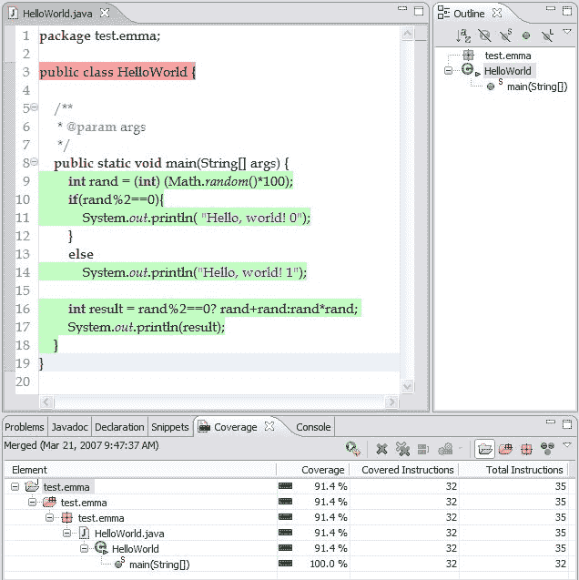

软件测试第二次大作业是单元测试，最后要进行一个覆盖测试，用到插件eclemma。由于被测程序带有一个GUI界面，设计器要生成一大堆代码，主要用于创建和设置控件。其中有些代码是绑定回调的，由于我的单元测试中直接调用了回调方法，没有经过闭包（xxxListener），导致闭包里的代码都是红的。

我的想法是专注于计算部分的正确性就可以，界面是设计器生成的我也没必要管它。我的用例把计算部分每个分支都覆盖了，但是由于上述原因，实际的覆盖率只有93%多一点，而作业要求是95%。

于是我开始想办法能不能屏蔽掉initComponent和构造器，结果发现没这个功能。

为了验证我的想法，即是不是一些其他代码干扰造成的，我找了个例子，果不其然。

上图的程序只有一个类HelloWorld，也是启动类。类里面只有一个方法main。然而由于这个类不是抽象的，所以编译器会自动生成个构造器。

可以看出，main的覆盖率是100%，但是就是由于有这么一个构造器，下降到了91%。而这个启动类是没必要实例化的，插件又不提供屏蔽功能，导致数据受到严重干扰。

什么垃圾插件，完全不考虑实际的需求。设计的人也是脑子有坑。