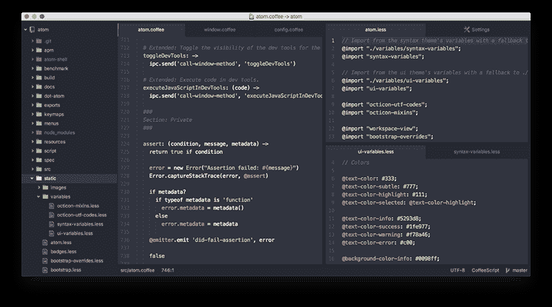

# 自动补全

如果你仍旧希望节约一些打字时间，Atom自带简单的自动补全功能。

通过使用`ctrl-space`，自动补全工具可以让你看到并插入可选的完整单词。

通常，自动补全工具会浏览当前打开的整个文档，寻找匹配你开始打出来的单词。

如果你想要更多选项，在设置面板的Autocomplete包中，你可以设置为在所有你打开的缓冲区中寻找字符串，而不仅仅是当前文件。

自动补全功能在atom/autocomplete包中实现。

# 折叠

如果你仅仅希望看到你所处理的代码文件的结构概览，折叠会是个非常有用的工具。折叠可以隐藏像函数和循环这样的代码块，来简化你屏幕上显示的东西。

当你把鼠标移到数字栏上，你就可以点击显示的箭头来折叠代码段。你也可以使用快捷键`alt-cmd-[`和`alt-cmd-]`来折叠和展开代码段。

使用`alt-cmd-shift-{`来折叠所有代码段，使用`alt-cmd-shift-}`来展开所有代码段。你也可以使用`cmd-k cmd-N`来指定折叠的缩进级别，其中N是缩进深度。

最后，你可以折叠你代码或文本的任意一部分，通过按下`ctrl-alt-cmd-F`，或者在命令面板中选择“Fold Selection”。

# 面板

你可以通过使用`cmd-k arrow`快捷键来横向或者纵向分割编辑器的面板，其中“arrow”是要分割的方向。面板被分割后，你可以使用`cmd-k cmd-arrow`快捷键在它们之间移动焦点，其中“arrow”是焦点要移动的方向。

每个面板都有它自己的“条目”或文件，它们由标签页来表示。你可以通过拖动文件，并把它放到想要放进去的面板中，来在面板之间移动文件。

要关闭一个面板，按下`cmd-w`来关闭它的所有编辑器，然后再按下`cmd-w`几次来关闭面板。你可以在设置视图中，将面板设置为没有东西的时候自动关闭。

# 语法

一个缓冲区中的“语法”，是Atom所认为的，文件内容的语言类型。语法类型可以是Java或者Markdown。当我们在“Snippets”中创建代码段的时候，我们已经看到过它了。

如果你加载了一个文件，Atom会做一些工作来试图识别出文件的类型。大部分情况，Atom通过查看文件的扩展名（`.md`通常为一个Markdown文件，等等）来完成。然而有时扩展名难以判断，它会检查内容来进行识别。

如果你加载了一个文件，并且Atom不能判断文件的语法，它会默认为纯文本（Plain Text），这是最简单的类型。如果它把文件默认为纯文本，或者弄错了文件类型，再或者由于一些原因你想修改文件的活动语法，你可以按下`ctrl-shift-L`下拉语法选择工具。

一旦你手动修改了一个文件的语法，Atom会记住它，直到你将语法设置回“自动检查”，或者手动选择一个不同的语法。

语法选择工具的功能在atom/grammar-selector包中实现。