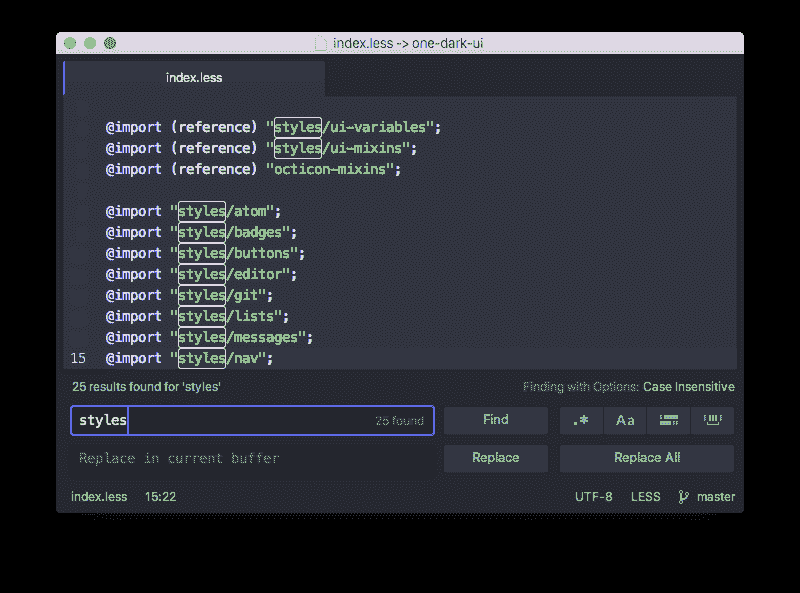
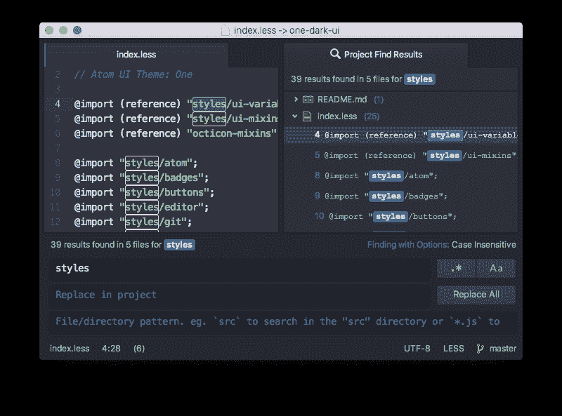

# 查找和替换

在Atom中，对你文件或者项目中的文本进行查找或者替换，非常快速而且容易。

`cmd-F`

在缓冲区中查找

`cmd-shift-f`

在整个项目中查找

如果你执行了这些命令，你屏幕的底部会出现一个“Find and Replace”面板。

你可以按下`cmd-F`，输入需要搜索的字符串，并且多次按下回车（或者`cmd-G`，或者“Find Next”按钮）来在当前文件中搜索，循环查找当前文件中的匹配内容。“Find and Replace”也提供了一些按钮，可以设置大小写敏感，正则表达式匹配和区域搜索。

如果你在“Replace in current buffer”文本框中输入字符串，你可以将匹配到的结果替换成一个不同的字符串。例如，如果你想要把每个“Scott”字符串的实例替换成字符串“Dragon”，你可以把这些值填到两个文本框中，之后点击“Replace All”按钮来进行替换。

如果你按下`cmd-shift-F`来弹出面板，你也可以在整个项目中进行查找和替换。

这是一个非常棒的方法，可以找出项目中一个函数在哪里被调用，一个锚文本在哪里被连接，或者一个指定的错误拼写的位置。你可以点击匹配到的行数，来跳到它在文件中的位置。

你可以在“File/Directory pattern”文本框中输入Unix通配符，把搜索范围限制在你项目中文件的子集。当你打开了多个项目的文件夹，它还可以用于在其中一个文件夹中查找。例如，你打开了`/path1/folder1`和`/path2/folder2`，你可以输入一个以`folder1`开头的通配符，只在第一个文件夹中查找。

当焦点在“Find and Replac”面板上的时候，按下`escape`从你的工作环境中隐藏这个面板。

查找和替换功能在atom/find-and-replace包中实现，并且使用了atom/scandal包执行实际的查找。