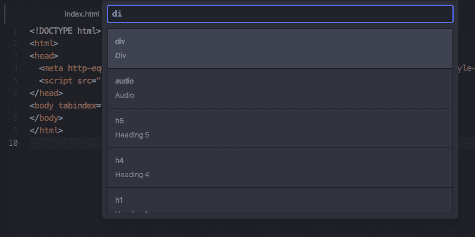
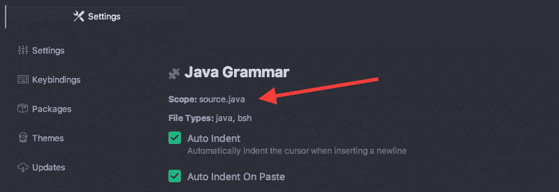

# 代码段

代码段是一个非常有效的工具，可以从一个快捷方式中快速生成常用的代码语法。

这就是说，你可以输入一些类似于`habtm`的东西，然后按下回车键，他就会扩展为`has_and_belongs_to_many`。

许多包自带他们自己的，具有特定模式的代码段。比如，提供了html语法高亮和语法的`language-html`包提供了许多代码段，来创建一些你想使用的不同HTML标签。如果你在Atom中创建一个新的HTML文件，你可以输入`html`然后按下`tab`，它会扩展为：

```
<html>
  <head>
    <title></title>
  </head>
  <body>

  </body>
</html>
```

同时它会把光标放在`title`标签的中间，以便你立即开始填充这个标签。许多代码段具有多个焦点位置，你可以按下`tab`在他们之间切换 —— 比如，在这个HTML代码段之中，你填充完标题标签之后，可以按下`tab`键，然后光标就会移动到body标签之间。

要查看当前打开文件拥有的所有代码段，你可以按下`alt-shift-S`。



你也可以在选择输入框中输入内容，来使用模糊搜索过滤这个列表。选择其中一个之后会执行光标所在的代码段（或者多个光标所在的代码段）。

## 创建你自己的代码段

所以说这样太爽了。但是，如果语言包中没有包含一些东西，或者你的代码中要编写一些自定义的东西，那会怎么样呢？很幸运的是，你可以非常便利地添加自己的代码段。

在你`~/.atom`目录下的`snippets.cson`文件，存放了你的所有自定义的代码段，他们会在Atom运行时加载。但是，你也可以通过`Atom > Open Your Snippets`菜单，轻易打开这个文件。

## 代码段的格式

现在让我们看一看如何编写代码段，基本的代码段格式像这个样子：

```
'.source.js':
  'console.log':
    'prefix': 'log'
    'body': 'console.log(${1:"crash"});$2'
```

最外面的键是选择器，即在哪里会加载代码段。决定它应该是什么的最简单的方法，是访问你想要添加代码段的语言的语言包，并找到“Scope”字符串。

例如，你想要添加在Java文件中工作的代码段，我们应该先在我们的设置视图中寻找`language-java`包，然后我们看到了Scope是“source.java”，代码段最顶层的键就应该是它前面加上一个点（就像CSS选择器那样）。



下一层的键是代码段的名字，用于在代码段菜单中，以一个更具可读性的方式来描述代码段。通常来说，这里最好使用对人来说具有可读性的字符串。

在每个代码段的名字下面是`prefix`，用于触发代码段，以及`body`，当代码段被触发后用于插入。

每个后面带有数字的`$`是tab的停止位置。在代码段被触发之后，通过按下`tab`键来遍历它们。

上面的例子向Javascript文件添加了`log`代码段，它会被扩展为：

```
console.log("crash");
```

其中的”crash”字符串会在开始时被选中，再次按下`tab`键之后，光标会移动到分号之后。

并不像CSS选择器，代码段的键每层只能重复一次。如果某一层有重复的键，只有最后的那个会被读到，详见[配置CSON](https://atom.io/docs/v1.0.3/ch00/_cson)。

## 多行代码段主体

对于长一些的模板，你可以使用`"""`来使用多行语法。

```
'.source.js':
  'if, else if, else':
    'prefix': 'ieie'
    'body': """
      if (${1:true}) {
        $2
      } else if (${3:false}) {
        $4
      } else {
        $5
      }
    """
```

像你可能期待的那样，这是一个创建代码段的代码段。如果你打开一个代码段文件，输入`snip`之后按下`tab`，会将以下内容插入到文件中：

```
'.source.js':
  'Snippet Name':
    'prefix': 'hello'
    'body': 'Hello World!'
```

砰的一下，就把那个东西填充了，然后得到了一个代码段。只要你保存了文件，Atom就会重新加载它，你也就能立即使用它了。

代码段功能在atom/snippets包中实现。

更多例子请见[language-html](https://github.com/atom/language-html/blob/master/snippets/language-html.cson)中的代码段，和[language-javascript](https://github.com/atom/language-javascript/blob/master/snippets/language-javascript.cson)包。