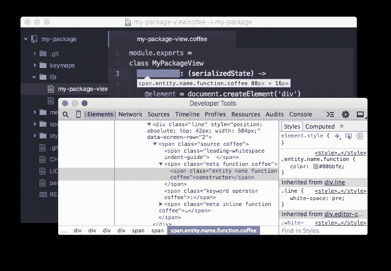
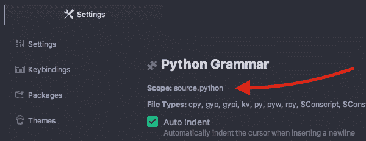

# 基本的自定义

在我们感受到Atom中所有东西的便利之后，让我们看看如何改进它。可能有一些快捷键你经常使用但是感觉很别扭，或者一些颜色不是十分适合你。Atom具有惊人的灵活性，所以让我们对它做一些力所能及的简单调整。

## 使用CSON来配置

所有Atom的配置文件（除了你的样式表和初始脚本）全部用CSON编写，全称是CoffeeScript Object Notation。就像JSON（JavaScript Object Notation）的名字一样，CSON是一个储存结构化数据的文本格式，表现为由键值对组成的简单对象的形式。

```
key:
  key: value
  key: value
  key: [value, value]
```

对象是CSON的基石，由缩进（像上面的文件那样）或者花括号（`{}`）描述。一个键的值可以是字符串、数字、对象、布尔值、`null`或者上述数据类型的一个数组。

不像CSS的选择器，CSON的键在每个对象中只能重复一次。如果存在重复的键，最后一次出现的那个会覆盖其他所有同名的键。在Atom配置文件中也是如此。

避免这种情况：

```
# DON'T DO THIS
'.source.js':
  'console.log':
    'prefix': 'log'
    'body': 'console.log(${1:"crash"});$2'

# Only this snippet will be loaded
'.source.js':
  'console.error':
    'prefix': 'error'
    'body': 'console.error(${1:"crash"});$2'
```

而是要写成这样：

```
# DO THIS: Both of these will be loaded
'.source.js':
  'console.log':
    'prefix': 'log'
    'body': 'console.log(${1:"crash"});$2'
  'console.error':
    'prefix': 'error'
    'body': 'console.error(${1:"crash"});$2'
```

## 样式调整

如果你只是对个人样式做一些应急的修改，而不打算发布整个主题，你可以在你的`~/.atom`目录的`styles.less`文件中添加样式。

你可以在编辑器中从`Atom > Open Your Stylesheet`菜单打开这个文件。


例如，要修改光标的颜色，你可以将一下规则添加到你的`~/.atom/styles.less`文件中：

```
atom-text-editor::shadow .cursor {
  border-color: pink;
}
```

了解都有哪些class可用的最简单方式，是通过开发者工具手动查看DOM。我们将在下一章详细介绍这个工具，现在先简单来看一下。

你可以通过按下`alt-cmd-I`来打开开发者工具，然后会弹出一个Chrome开发者工具面板。



你可以轻易查看到当前编辑器的所有元素。如果你想更新一些东西的样式，你需要先知道它拥有哪个class，然后再你的样式文件中添加一条Less规则。

如果你不熟悉Less，它是一个让CSS变得更简单的CSS预处理器，你可以访问lesscss.org来了解关于它的更多信息。如果你更愿意使用CSS，这个文件也可以命名为styles.css来包含CSS。

## 自定义快捷键

Atom从你`~/.atom`目录中的`config.cson`文件中加载配置，它含有CoffeeScript格式的JSON，也就是CSON：

```
'core':
  'excludeVcsIgnoredPaths': true
'editor':
  'fontSize': 18
```

配置本身以包名分组，或者一两个核心的命名空间，比如`core`和`editor`。

你可以从`Atom > Open Your Config`菜单在编辑器中打开它。

### 快捷键配置参考

*   `core`

    *   `disabledPackages`：被禁用的包名的一个列表
    *   `excludeVcsIgnoredPaths`：不要加载`.gitignore`指定的文件
    *   `ignoredNames`：在Atom中要忽略的文件名
    *   `projectHome`：假定项目被存放的目录
    *   `themes`：要加载的主题名称的数组，按照层叠顺序
*   `editor`

    *   `autoIndent`：开启或关闭基本的自动缩进（默认为true）
    *   `nonWordCharacters`：一个非单词字符的字符串，来指定单词边界
    *   `fontSize`：编辑器中的字体大小
    *   `fontFamily`: 编辑器中的字体类型
    *   `invisibles`: 一个Atom用来渲染空白字符的哈希表。键是空白字符的类型，值是被渲染成的字符（使用false来屏蔽单个的空白字符）
    *   `tab`：硬tab字符
    *   `cr`：回车（Carriage return，微软风格的行末尾）
    *   `eol：字符`\n`
    *   `space`：在开头或末尾的空格字符
    *   `preferredLineLength`：设定一行的长度（默认为80）
    *   `showInvisibles`：是否将不可见字符渲染为占位符（默认为false）
    *   `showIndentGuide`：是否在编辑器中显示缩进标识
    *   `showLineNumbers`：显示或者隐藏行号
    *   `softWrap`：开启或关闭编辑器中的软换行
    *   `softWrapAtPreferredLineLength`: 开启或关闭在`preferredLineLength`处软换行
    *   `tabLength`：tab字符所占空格字符的宽度（默认为2）
*   `fuzzyFinder`

    *   `ignoredNames`：只在模糊查找中忽略的文件名
*   `whitespace`

    *   `ensureSingleTrailingNewline`：是否将文件末尾的多个换行减少为一个
    *   `removeTrailingWhitespace`：开启或关闭清除行尾的空白字符（默认为true）
*   `wrap-guide`

    *   `columns`：带有`pattern`和`column`键的数组，用来将当前编辑器的目录匹配到列中的位置

## 语言特定配置

你也可以为不同的文件类型设置几种不同的配置。例如，你可能希望Atom在Markdown文件中软换行，在ruby文件中将tab显示为两个空格的宽度，在python文件中显示为4个空格的宽度。

下面是作用于语言的几种选项，这是它们的列表：

```
editor.tabLength
editor.softWrap
editor.softWrapAtPreferredLineLength
editor.preferredLineLength
editor.scrollPastEnd
editor.showInvisibles
editor.showIndentGuide
editor.nonWordCharacters
editor.invisibles
editor.autoIndent
editor.normalizeIndentOnPaste
```

### 设置视图中的语言特定配置

你可以在设置视图中的每个语言的包中，编辑这些配置。只要在左边的面板搜索你选择的语言，选择它，并且编辑它就好了。


### 配置文件中的语言特定配置

你也可以直接编辑实际的配置文件。通过在命令面板中输入“open config”并按下回车来打开配置文件。

全局设置在`global`键的下面。每种语言都有他们自己的顶级键，这个键就是这种语言的作用域。语言特定的设置会覆盖全局域的任何设置。

```
'global': # all languages unless overridden
  'editor':
    'softWrap': false
    'tabLength': 8

'.source.gfm': # markdown overrides
  'editor':
    'softWrap': true

'.source.ruby': # ruby overrides
  'editor':
    'tabLength': 2

'.source.python': # python overrides
  'editor':
    'tabLength': 4
```

### 查找语言作用域的名字

为了有效地编写这种覆盖的设置，你需要知道语言的作用域名称。我们已经在“代码段格式”一节中，为了编写代码段而做过一遍了，现在我们简单地重复一下。

作于域的名称显示在设置视图中的每个语言的包中。在左边的面板中寻找你选择的语言，选择它，然后你会在语言名称的标题下面看到作用域名称：

