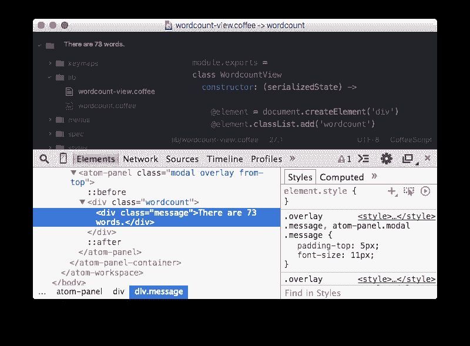

# 创建主题

Atom的界面使用HTML渲染，并且通过Less来定义样式，它是CSS的超集。不要担心之前从未听说过Less，它类似于CSS，但是带有一些便捷的扩展。

Atom支持两种主题：UI和语法。UI主题为树视图、选择夹、下拉列表和状态栏之类的元素定义样式。语法主题为编辑器中的代码定义样式。

主题可以从设置视图安装和修改，你可以选择`Atom > Preferences…`菜单，然后在左侧的侧栏中选择“Install”和“Theme”部分来打开它。

## 开始

主题是十分直截了当的，但是如果你在开始之前熟悉一些事情，会很有用处：

*   Less是CSS的超集，但是它拥有一些像变量这样便利的特性。如果你并不熟悉它的语法，花几分钟在[这里](https://speakerdeck.com/danmatthews/less-css)熟悉它。
*   你也可能想要复习一遍[package.json](https://atom.io/docs/v1.0.4/ch00/_atom_package_json)的概念。这个文件帮助你把主题分布给其它用户。
*   你的主题中的“package.json”包必须含有一个`theme`键，值为`ui`或者`syntax`，为了让Atom识别为主题。
*   你可以在atom.io上面找到现有的主题，或者建立它们的分支（fork）。

## 创建语法主题

让我们来创建你的第一个主题。

按下`cmd-shift-P`来开始，并且输入“Generate Syntax Theme”就会一个新的主题包。选择“Generate Syntax Theme”之后，Atom会询问你要把主题新建在哪个目录下。我们把要创建的主题叫做“motif-syntax”。提示：语法主题应该以“-syntax”结尾。

然后Atom会弹出一个窗口展示motif-syntax主题，带有一些预先创建的文件和文件夹。如果你打开设置视图（`cmd-,`），并且访问左边的Themes部分，你会看到Syntax Theme下拉列表中列出了Motif。从菜单中选择它来加载。现在打开新的编辑器之后，你应该看到motif-syntax主题被激活了。

打开styles/colors.less来修改预先定义的各个颜色变量。例如，把`@red`变成`#f4c2c1`。

接着打开styles/base.less来修改预先定义的选择器。选择器为编辑器中不同部分定义样式，例如注释、字符串和侧栏中的行号。

例如，可以把`.gutter``background-color`设置为`@red`。

通过按下`cmd-alt-ctrl-l`重启Atom，来在Atom窗口中查看你的修改。这真是极好的。

提示：你可以通过在dev模式中打开新窗口，来避免查看你所做的修改时重启Atom。来命令行中运行`atom --dev .`来打开dev模式的Atom窗口。也可以按下`cmd-shift-o`或者打开`View > Developer > Open in Dev Mode`菜单来执行。当你编辑你的主题时，修改会立即表现出来。

建议不要在你的语法主题中指定`font-family`，因为会覆盖Atom设置中的`Font Family`字段。如果你仍旧想要推荐一款适合你主题的字体，我们推荐你在README文件中这么做。

## 创建界面主题

界面主题必须提供`ui-variables.less`文件，它包含了核心主题提供的所有变量。这些在[“主题变量”](https://atom.io/docs/v1.0.4/ch00/_atom_theme_vars)一节会提到。

执行以下步骤来创建UI主题：

1.  创建以下仓库之一的分支：

    *   [atom-dark-ui](https://github.com/atom/atom-dark-ui)
    *   [atom-light-ui](https://github.com/atom/atom-light-ui)
2.  克隆分支到本地文件系统
3.  在主题的目录中打开命令行
4.  在命令行中通过运行`atom --dev .`，或者点击`View > Developer > Open in Dev Mode`菜单，以dev模式打开你的新主题
5.  在主题的`package.json`文件中修改主题的名字
6.  以`-ui`结尾的名字命名你的主题，例如`super-white-ui`
7.  运行`apm link`来把你的主题符号链接到`~/.atom/packages`
8.  使用`cmd-alt-ctrl-L`重启Atom
9.  通过设置视图的Themes部分中的UI Theme下拉列表来开启主题
10.  做一些修改。由于你在dev模式窗口下打开主题，修改会立即在编辑器中反映，并不需要重启。

## 开发的工作流

下面是一些使主题开发更快速更简单的工具。

### 即时重启

在你修改你的主题之后，按下`cmd-alt-ctrl-L`来重启不是十分理想。在dev模式的Atom窗口下，Atom支持样式的即时更新。

要想开启dev模式的窗口：

1.  通过选择`View > Developer > Open in Dev Mode`菜单，或者按下`cmd-shift-o`快捷键来直接在dev模式窗口中打开你的主题。
2.  修改你的主题并保存它。你的修改应该会马上应用。

如果你想要在任何时候都重新加载全部的样式，你可以使用`cmd-ctrl-shift-r`快捷键。

### 开发者工具

Atom基于Chrome浏览器，并且支持Chrome开发者工具。你可以选择`View > Toggle Developer Tools`菜单，或者使用`cmd-alt-i`快捷键来打开它。

开发者工具允许你查看各个元素，以及他们的CSS属性。



简单介绍请查看Google的[扩展教程](https://atom-test.s3-us-west-2.amazonaws.com/do../img/92/92f3d40644136d0bfca45a9a8040312c29cb8520/dev-tools.png)。

### Atom 样式指南

如果你在创建一个界面主题，你可能想要一种方式来查看你的主题如何影响系统中的组件。[样式指南](https://github.com/atom/styleguide)是一个页面，里面渲染了所有Atom支持的组件。

打开命令面板（`cmd-shift-P`）寻找“styleguide”，或者使用`cmd-ctrl-shift-g`快捷键来打开样式指南。


## 主题变量

Atom的UI提供了一些变量，你可以在你自己的主题或者包中使用它们。

### 在主题中使用

每个自定义的主题都要指定`ui-variables.less`文件，其中定义了所有下面的变量。主题列表中最上面的主题会被加载，以及可供导入。

### 在包中使用

在任何你的包的`.less`文件中，你可以通过从Atom导入`ui-variables`文件来访问主题变量。

你的包应该只指定结构化的样式，并且它们应该全部来自样式指南。你的包不应该指定颜色、内边距（padding）、或者使用绝对像素的任何东西。你应该使用主题变量来代替它。如果你遵循了这一点，你的包将会在任何主题下都表现得很好。

这里是一个`.less`文件的例子，一个包可以使用以下主题变量来定义：

```
@import "ui-variables";

.my-selector {
  background-color: @base-background-color;
  padding: @component-padding;
}
```

### 变量

**文本颜色**

*   `@text-color`
*   `@text-color-subtle`
*   `@text-color-highlight`
*   `@text-color-selected`
*   `@text-color-info` - 蓝色
*   `@text-color-success`- 绿色
*   `@text-color-warning` - 橙色或者黄色
*   `@text-color-error` - 红色

**背景颜色**

*   `@background-color-info` - 蓝色
*   `@background-color-success` - 绿色
*   `@background-color-warning` - 橙色或者黄色
*   `@background-color-error` - 红色
*   `@background-color-highlight`
*   `@background-color-selected`
*   `@app-background-color` - 所有编辑器组件下面的应用背景

**组件颜色**

*   `@base-background-color` -
*   `@base-border-color` -
*   `@pane-item-background-color` -
*   `@pane-item-border-color` -
*   `@input-background-color` -
*   `@input-border-color` -
*   `@tool-panel-background-color` -
*   `@tool-panel-border-color` -
*   `@inset-panel-background-color` -
*   `@inset-panel-border-color` -
*   `@panel-heading-background-color` -
*   `@panel-heading-border-color` -
*   `@overlay-background-color` -
*   `@overlay-border-color` -
*   `@button-background-color` -
*   `@button-background-color-hover` -
*   `@button-background-color-selected` -
*   `@button-border-color` -
*   `@tab-bar-background-color` -
*   `@tab-bar-border-color` -
*   `@tab-background-color` -
*   `@tab-background-color-active` -
*   `@tab-border-color` -
*   `@tree-view-background-color` -
*   `@tree-view-border-color` -
*   `@ui-site-color-1` -
*   `@ui-site-color-2` -
*   `@ui-site-color-3` -
*   `@ui-site-color-4` -
*   `@ui-site-color-5` -

**组件尺寸**

*   `@disclosure-arrow-size` -
*   `@component-padding` -
*   `@component-icon-padding` -
*   `@component-icon-size` -
*   `@component-line-height` -
*   `@component-border-radius` -
*   `@tab-height` -

**字体**

*   `@font-size` -
*   `@font-family` -