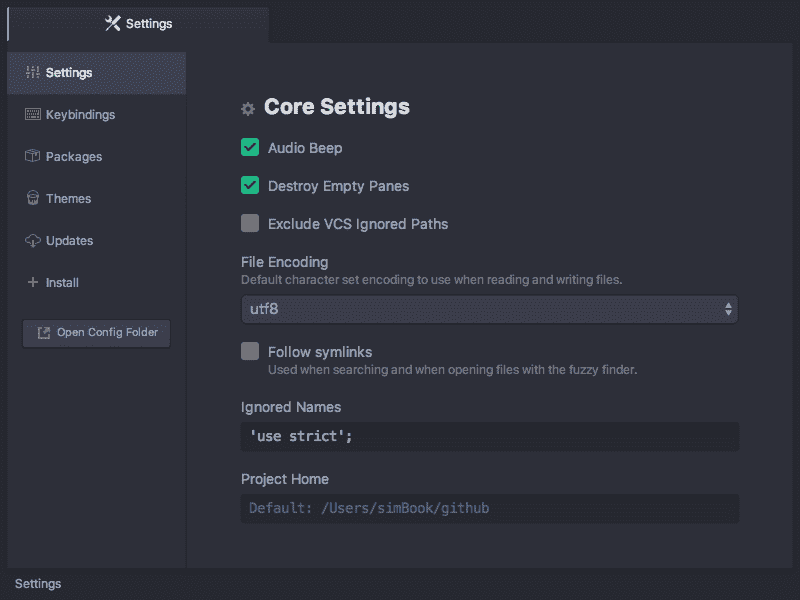
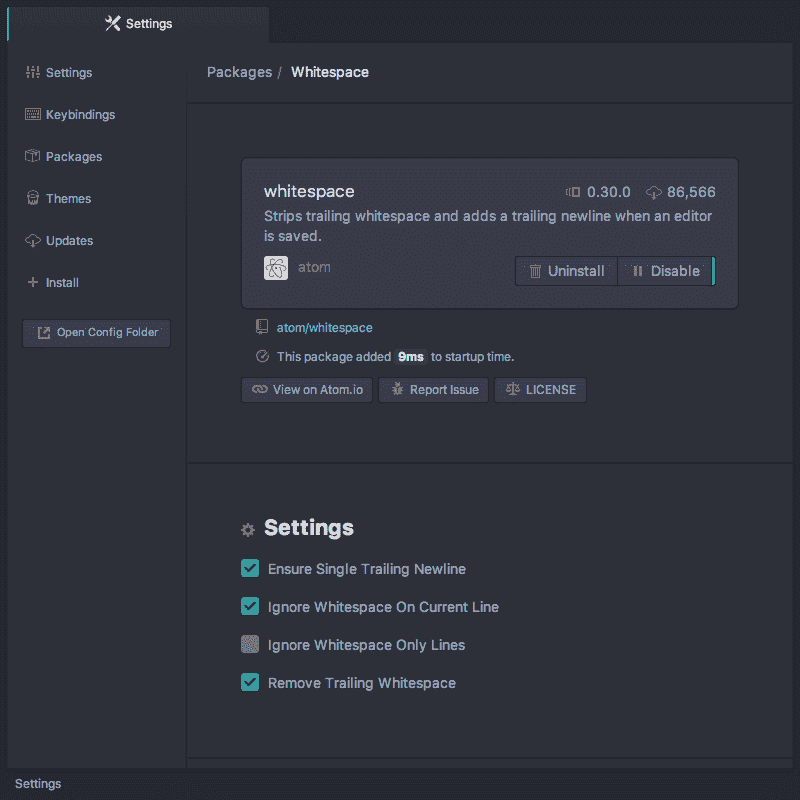
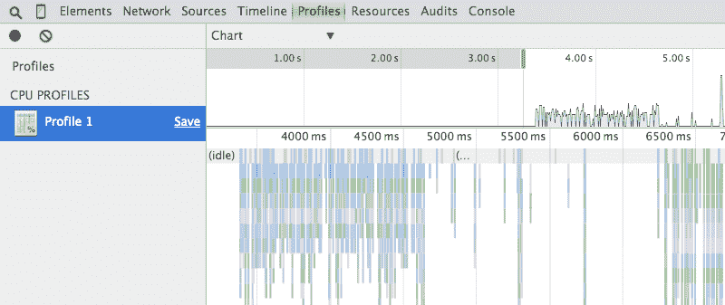

# 调试

Atom拱了一些工具来帮助你理解预料之外的行为和调试问题。这篇指南介绍了一些工具和方法用于帮助你调试，以及提供了一些提交工单（issue）时的帮助信息。

## 升级到最新版本

你可能遇到了在最新版本已经修复的问题。

如果你从源码中编译Atom，需要拉回（pull）master的最新版本并重新构建。

如果你使用发布版本，检查你所使用的Atom是什么版本：

```
$ atom --version
0.178.0-37a85bc
```

访问[发布列表](https://github.com/atom/atom/releases)来查看是否有更新的版本。你可以从发布页面下载Atom来升级到最新的版本，或者通过应用中的自动升级工具。应用中的自动升级工具在你重启Atom，或者点击`Atom > Check for Update`菜单之后，会检查和下载新的版本。

## 检查链接的包

如果你开发或者发布Atom的包，可能会有一些遗留的包链接到`~/.atom/packages`或者`~/.atom/dev/packages`目录下。你可以使用：

```
$ apm links
```

来列出所有链接的开发包。你可以使用`apm unlink`命令来移除链接，详见`apm unlink --help`。

## 检查Atom和包的设置

在一些情况下，预料之外的行为可能是Atom或者某个包中的错误配置或者缺少配置造成的。

使用`cmd-,`来打开Atom的设置视图，或者`Atom > Preferences`来打开菜单选项。



在设置面板中检查Atom的设置，每个选项在[这里](https://atom.io/docs/latest/customizing-atom#configuration-key-reference)都会有个详细的描述。例如，如果你希望Atom使用硬tab（真的tab）而不是软tab（空格），你应该取消“Soft Tabs”选项。

由于Atom自带一些包并且你可以自己安装附加的包，检查所有包的列表以及他们的设置。例如，如果你喜欢移除编辑器中间的竖直线，禁用Wrap Guide包。另外，如果你希望Atom移除行尾的空白字符，或者确保文件末尾有个空行，你可以在Whitespace包的选项中设置。



## 检查快捷键

如果你按下快捷键之后没有执行命令，或者执行了错误的命令，那个键位的快捷键可能出了些问题。Atom自带keybinding resolver，一个小巧的包来帮助你理解执行了哪个快捷键。


keybinding resolver会向你展示现有快捷键的列表，列表中包含以下内容：

*   快捷键的命令
*   快捷键有效时，用于定义上下文的CSS选择器
*   快捷键被定义的文件

如果匹配到多个快捷键，Atom会根据[选择器的特性和以及他们被加载的顺序](https://atom.io/docs/latest/advanced/keymaps#specificity-and-cascade-order)来决定执行哪个快捷键。如果你想要触发的命令在keybinding resolver中列出，但是并没有执行，一般由以下两种原因造成：

*   快捷键并没有在选择器定义的上下文中使用。例如，你不能在树视图没有焦点的情况下触发“Tree View: Add File”命令。
*   有另一个快捷键具有更高的优先级。这通常发生在你安装的包的快捷键和现有的快捷键冲突的时候。如果这个包的快捷键具有更高的特异性的选择器，或者更晚被加载，它就会覆盖现有的快捷键。

Atom首先会加载核心功能的快捷键，之后才是用户定义的快捷键。由于用户定义的快捷键在随后加载，你可以使用`keymap.cson`文件来调整快捷键并解决问题。例如，你可以[使用`unset!`指令来移除快捷键](https://atom.io/docs/latest/behind-atom-keymaps-in-depth#removing-bindings)。

如果你发现一个包的快捷键优先级要高于核心功能包，向这个包的GitHub 仓库提交一个工单可能是个好主意。

## 查看是否在安全模式下出现问题

Atom绝大多数的功能都来源于你安装的包。一些情况下，这些包可能会导致预料之外的行为、问题或者性能问题。

从命令行在安全模式下启动Atom，来检查是否是你安装的一个包导致了问题：

```
$ atom --safe
```

这会启动Atom，但是并不会加载`~/.atom/packages`和`~/.atom/dev/packages`中的包。如果安全模式下问题不再出现，那么可能那些包之一导致了问题。

要弄清楚到底是哪个包导致了问题，正常启动Atom，并且按下`cmd-,`来打开设置。由于设置可以让你禁用每个包，你可以依次禁用每个包，直到问题不再发生。在你禁用每个包来确保问题不再出现之后，重启（`cmd-q`）或者重新加载（`cmd-ctrl-alt-l`）Atom。

当你找到导致问题的包之后，你可以禁用或者卸载这个包，并且考虑向这个包的GitHub仓库提交工单。

## 检查你的配置文件

你可能在Atom的初始化脚本或者样式表中定义了一些个性化的功能。在一些情况中，这些个性化的调整可能会导致问题，所以清除这些文件，并重启Atom。

## 检查在开发者工具中的错误

当Atom中抛出了一个错误，开发者工具会在控制台标签页自动展示记录的错误。而如果开发者工具在错误触发之前打开，错误的整个栈轨迹会被记录：


如果你可以重现这个错误，使用这种方法来得到全部的栈轨迹。栈轨迹可能会指向你的初始化脚本，或者安装的某个特定的包，可以禁用它们并且向Github仓库提交工单。

## 在开发者页面的CPU profiler中判断性能问题

如果你在特定的情况中发现了性能问题，如果报告中包含了Chrome的CPU profiler截图，提供了一些什么东西比较慢的洞察，你的报告会很有用处。

要运行profiler，在命令面板中打开开发者工具（“Window: Toggle Dev Tools”），访问`Profiles`标签页，选择`Collect JavaScript CPU Profile`并点击start按钮。


然后返回Atom并且执行速度慢的操作来做记录。结束之后按下stop按钮。切换到`Chart`视图，会出现一副记录操作的图片。尝试放大缓慢的部分，并且截图来包含到你的报告中。你也可以保存并发送profile数据，通过按下左边面板中的名字（例如`Profile 1`）旁边的`Save`按钮。



详见[Chrome的CPU profiling文档](https://developer.chrome.com/devtools/docs/cpu-profiling)。

## 检查你是否安装了开发工具链

如果你在使用`apm install`安装一个包时出现问题，可能是因为那个包依赖了使用本地代码的库。所以你需要安装C++编译器和Python来安装它。

你可以运行`apm install --check`来查看Atom是否能够在你的机器上编译本地代码。

关于更多信息，在[构建指导](https://github.com/atom/atom/tree/master/docs/build-instructions)中查看你的平台上需要先满足的条件。