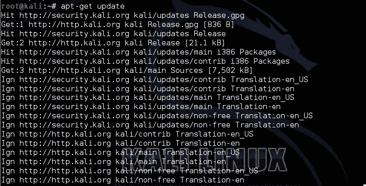
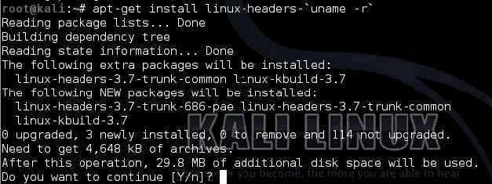
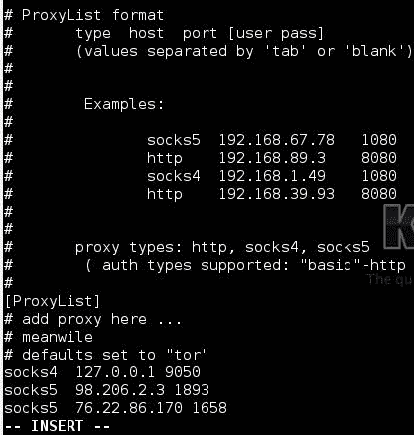
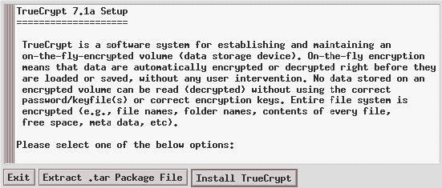
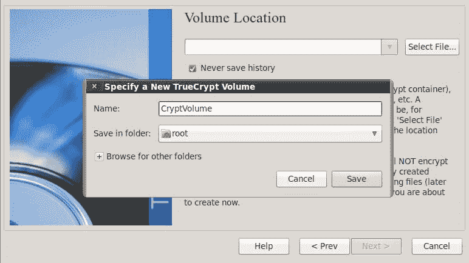
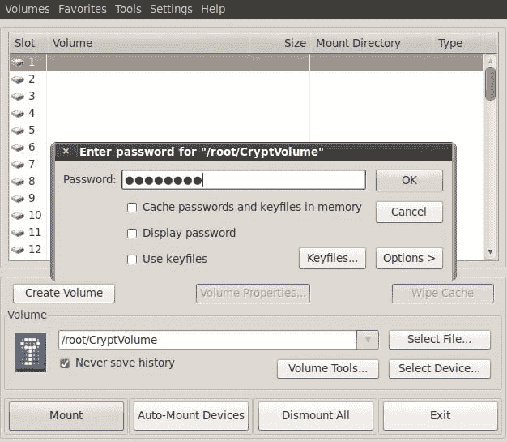

# 第二章 定制 Kali Linux

> 作者：Willie L. Pritchett, David De Smet
> 
> 译者：[飞龙](https://github.com/)
> 
> 协议：[CC BY-NC-SA 4.0](http://creativecommons.org/licenses/by-nc-sa/4.0/)

这一章会向你介绍Kali的定制，便于你更好地利用它。我们会涉及到ATI和英伟达GPU技术的安装和配置，以及后面章节所需的额外工具。基于ATI和英伟达GPU的显卡允许我们使用它们的图像处理单元（GPU）来执行与CPU截然不同的操作。我们会以ProxyChains的安装和数字信息的加密来结束这一章。

## 2.1 准备内核头文件

有时我们需要使用所需的内核头文件来编译代码。内核头文件是Linux内核的源文件。这个秘籍中，我们会解释准备内核头文件所需的步骤，便于以后使用。

### 准备

完成这个秘籍需要网络连接。

### 操作步骤

让我们开始准备内核头文件：

1.  我们首先通过执行下列命令升级发行版作为开始：

    ```
    apt-get update
    ```

    

2.  下面，我们需要再次使用`apt-get`来准备内核头文件，执行下列命令：

    ```
    apt-get install linux-headers - `uname –r`
    ```

    

3.  复制下列目录以及其中的全部内容：

    ```
    cd /usr/src/linux 
    cp -rf include/generated/* include/linux/
    ```

4.  我们现在已准备好编译需要内核头文件的代码。

## 2.2 安装 Broadcom 驱动

在这个秘籍中，我们将要安装 Broadcom 官方的Linux混合无线驱动。 使用Broadcom 无线USB适配器可以让我们在Kali上连接我们的无线USB接入点。对于这本书的其余秘籍，我们假设Broadcom 无线驱动已经安装。

### 准备

完成这个秘籍需要网络连接。

### 操作步骤

让我们开始安装 Broadcom 驱动：

1.  打开终端窗口，从[http://www.broadcom.com/support/802.11/linux_sta.php](http://www.broadcom.com/support/802.11/linux_sta.php)下载合适的Broadcom 驱动：

    ```
    cd /tmp/ 
    wget http://www.broadcom.com/docs/linux_sta/hybrid-portsrc_ x86_64-v5_100_82_112.tar.gz
    ```

    

2.  使用下列命令解压下载的驱动：

    ```
    mkdir broadcom 
    tar xvfz hybrid-portsrc_x86_64-v5_100_82_112.tar.gz –C /tmp/ broadcom
    ```

3.  修改`wl_cfg80211.c`文件，由于5.100.82.112版本中有个bug，会阻止小于2.6.39内核版本上的编译：

    ```
    vim /tmp/broadcom/src/wl/sys/wl_cfg80211.c
    ```

    观察代码段的1814行：

    ```
     #if LINUX_VERSION_CODE > KERNEL_VERSION(2, 6, 39) 
    ```

    将其改为：

    ```
     #if LINUX_VERSION_CODE >= KERNEL_VERSION(2, 6, 39) 
    ```

    并保存修改。

4.  编译代码：

    ```
    make clean
    make
    make install
    ```

5.  更新依赖：

    ```
    depmod -a
    ```

6.  通过下列命令找到加载的模块：

    ```
    lsmod | grep b43|ssb|bcma
    ```

7.  通过执行下列命令移除发现的模块：

    ```
    rmmod <module>b43
    ```

    其中`<module>`应为`b43`、`ssb`或`bcma`。

8.  将模块加入黑名单，防止它们在系统启动中加载：

    ```
    echo "blacklist <module>" >> /etc/modprobe.d/blacklist.conf 
    ```

    其中`<module>`应为`b43`、`ssb`或`wl`。

9.  最后，将新模块添加到Linux内核中，来使它成为启动进程的一部分：

    ```
    modprobe wl
    ```

## 2.3 安装和配置ATI显卡驱动

这个秘籍中，我们会详细讲解ATI显卡驱动的安装和配置，在此之前需要AMD Accelerated Parallel Processing (APP) SDK、OepnCL和CAL++。我们可以利用 ATI Stream技术的优势来运行计算密集型任务 – 它们通常运行在CPU上 – 使它们更快更高效地执行。更多ATI Stream技术相关的详细信息，请访问[www.amd.com/stream](www.amd.com/stream)。

### 准备

需要网络连接来完成这个秘籍。同时在开始这个秘籍之前需要准备内核头文件，它在第一节有所涉及。

### 操作步骤

让我们开始安装和配置ATI驱动：

1.  下载系统所需的ATI显示驱动：

    ```
    cd /tmp/ 
    wget http://www2.ati.com/drivers/linux/amd-driver-installer-121-x86.x86_64.run
    ```

    我们也可以从下面的网址下载显示驱动：[[http://support](http://support). amd.com/us/gpudownload/Pages/index.aspx]([http://support](http://support). amd.com/us/gpudownload/Pages/index.aspx)。

    

2.  通过键入下列命令来开始安装：

    ```
    sh amd-driver-installer-12-1-x86.x86_64.run
    ```

    

3.  在安装完成之后，重启你的系统来使改变生效，并且避免不稳定。

4.  为之后的步骤安装一些依赖：

    ```
    apt-get install libroot-python-dev libboost-python-dev libboost1.40-all-dev cmake
    ```

5.  下载并解压 AMD APP SDK，根据你的CPU架构：

    ```
    wget http://developer.amd.com/Downloads/AMD-APP-SDK-v2.6-lnx64.tgz 
    mkdir AMD-APP-SDK-v2.6-lnx64 
    tar zxvf AMD-APP-SDK-v2.6-lnx64.tgz –C /tmp/AMD-APP-SDK-v2.6-lnx64 
    cd AMD-APP-SDK-v2.6-lnx64
    ```

6.  通过下列命令安装AMD APP SDK：

    ```
    sh Install-AMD-APP.sh
    ```

7.  在`.bashsrc`文件中设置ATI Stream的路径：

    ```
    echo export ATISTREAMSDKROOT=/opt/AMDAPP/ >> ~/.bashrc 
    source ~/.bashrc
    ```

8.  下载并编译`calpp`：

    ```
    cd /tmp/ 
    svn co https://calpp.svn.sourceforge.net/svnroot/calpp calpp 
    cd calpp/trunk 
    cmake . 
    make 
    make install
    ```

9.  下载并编译`pyrit`：

    ```
    cd /tmp/ 
    svn co http://pyrit.googlecode.com/svn/trunk/ pyrit_src 
    cd pyrit_src/pyrit 
    python setup.py build 
    python setup.py install
    ```

10.  构建并安装OpenCL：

    ```
    cd /tmp/pyrit_src/cpyrit_opencl 
    python setup.py build 
    python setup.py install\
    ```

11.  对`cpyrit_calpp`的安装做一些小修改：

    ```
    cd /tmp/pyrit_source/cpyrit_calpp 
    vi setup.py
    ```

    找到下面这一行：

    ```
    VERSION = '0.4.0-dev' 
    ```

    把它改成：

    ```
    VERSION = '0.4.1-dev' 
    ```

    之后，找到下面这一行：

    ```
    CALPP_INC_DIRS.append(os.path.join(CALPP_INC_DIR, 'include')) 
    ```

    把它改成：

    ```
    CALPP_INC_DIRS.append(os.path.join(CALPP_INC_DIR, 'include/CAL'))
    ```

12.  最后将ATI GPU模块添加到pyrit：

    ```
    python setup.py build 
    python setup.py install
    ```

> 为了展示可用的CAL++设备和CPU的核数，我们需要键入下列命令：
> 
> ```
> pyrit list_cores
> ```
> 
> 为了进行跑分，我们只需要键入：
> 
> ```
> pyrit benchmark
> ```

## 2.4 安装和配置英伟达显卡驱动

这个秘籍中，我们会拥抱CUDA，英伟达的并行计算架构。在CUDA工具包的安装之后，首先会安装英伟达开发者显示驱动。通过使用GPU的威力，这会带来计算性能的戏剧性提升，它们通常用于一些类似密码破解的场合。

> 有关CUDA的更多信息，请浏览[他们的官方网站](http://www.nvidia.com/object/cuda_home_new.html)。

### 准备

需要网络连接来完成这个秘籍。

同时需要在开始之前准备内核头文件，这在第一节中有所涉及。

为了完成英伟达驱动的安装，需要关闭X会话。

### 操作步骤

让我们开始安装和配置英伟达显卡驱动：

1.  下载英伟达开发者显示驱动，根据你的CPU架构：

    ```
    cd /tmp/ 
    wget http://developer.download.nvidia.com/compute/cuda/4_1/rel/ drivers/NVIDIA-Linux-x86_64-285.05.33.run
    ```

    

2.  安装驱动：

    ```
    chmod +x NVIDIA-Linux-x86_64-285.05.33.run 
    ./NVIDIA-Linux-x86_64-285.05.33.run –kernel-source-path='/usr/src/ linux'
    ```

3.  下载CUDA工具包：

    ```
    wget http://developer.download.nvidia.com/compute/cuda/4_1/rel/ toolkit/cudatoolkit_4.1.28_linux_64_ubuntu11.04.run
    ```

4.  安装CUDA工具包到`/opt`：

    ```
    chmod +x cudatoolkit_4.1.28_linux_64_ubuntu11.04.run 
    ./cudatoolkit_4.1.28_linux_64_ubuntu11.04.runConfigure the environment variables required for nvcc to work: 
    echo PATH=$PATH:/opt/cuda/bin >> ~/.bashrc 
    echo LD_LIBRARY_PATH=$LD_LIBRARY_PATH:/opt/cuda/lib >> ~/.bashrc 
    echo export PATH >> ~/.bashrc 
    echo export LD_LIBRARY_PATH >> ~/.bashrc
    ```

5.  运行以下命令来使变量生效：

    ```
    source ~/.bashrc 
    ldconfig
    ```

6.  安装`pyrit`的依赖：

    ```
    apt-get install libssl-dev python-dev python-scapy
    ```

7.  下载并安装GPU增效工具`pyrit`：

    ```
    svn co http://pyrit.googlecode.com/svn/trunk/ pyrit_src 
    cd pyrit_src/pyrit 
    python setup.py build 
    python setup.py install
    ```

8.  最后，将英伟达GPU模块添加到`pyrit`：

    ```
    cd /tmp/pyrit_src/cpyrit_cuda 
    python setup.py 
    build python setup.py install
    ```

> 为了验证`nvcc`是否正确安装，我们需要键入下列命令：
> 
> ```
> nvcc -V
> ```
> 
> 为了进行跑分，我们只需要键入下列命令：
> 
> ```
> pyrit benchmark
> ```

## 2.5 升级和配置额外的安全工具

这个秘籍中，我们会涉及到升级Kali，以及配置一些额外的工具，它们对于之后的章节和秘籍十分实用。由于Kali的包在发布之间会不断升级，你很快就会发现比起之前在你的DVD中下载好的工具，又提供了一系列新的工具。我们会以升级来开始，之后获得Nessus的激活码，并以安装Squid来结束。

### 操作步骤

让我们开始进行升级，以及配置额外的安全工具。

1.  使用仓库中最新的修改来更新本地的包索引：

    ```
    apt-get update
    ```

2.  升级现有的包：

    ```
    apt-get upgrade
    ```

3.  升级到最新版本（如果可用的话）：

    ```
    apt-get dist-upgrade
    ```

4.  获得Nessus的激活码，通过在[这里]( [http://www.nessus.org/](http://www.nessus.org/) products/nessus/nessus-plugins/obtain-an-activation-code)注册。

5.  通过执行下列命令来激活Nessus：

    ```
    /opt/nessus/bin/nessus-fetch --register A60F-XXXX-XXXX-XXXX-0006 
    ```

    其中`A60F-XXXX-XXXX-XXXX-0006`应为你的激活码。

6.  为Nessus Web界面创建账户：

    ```
    /opt/nessus/sbin/nessus-adduser
    ```

7.  为了启动Nessus服务器，我们只需要执行下列命令：

    ```
    /etc/init.d/nessusd start
    ```

8.  安装Squid：

    ```
    apt-get install squid3 
    ```

9.  阻止Squid在启动时自动运行：

    ```
    update-rc.d -f squid3 remove
    ```

> 为了在仓库中找到特定的包，我们可以在`apt-get update`之后使用下列命令：
> 
> ```
> apt-cache search <keyword> 
> ```
> 
> 其中`<keyword>`是包名称或者正则表达式。

## 2.6 配置ProxyChains

这个章节中，我们会强制指定应用的网络连接使用用户定义的代理列表，来打破接受者和发送者之间的直接连接。

### 操作步骤

1.  打开ProxyChains的配置文件：

    ```
    vim /etc/proxychains.conf 
    ```

2.  解除我们打算使用的链接类型的注释，这里是`dynamic_chain`：

    

3.  向列表中添加一些代理服务器：

    

4.  使用我们的链式代理来解析目标主机：

    ```
    proxyresolv www.targethost.com 
    ```

5.  现在可以在我们打算使用的应用上运行ProxyChains，例如`msfconsole`：

    ```
    proxychains msfconsole
    ```

## 2.7 目录加密

这一章的最后一个秘籍关于信息隐私。我们会使用TrueCrypt通过密钥来隐藏重要和私密的数字信息，远离公众的眼睛。

### 操作步骤

1.  通过访问`Applications Menu | Kali | Forensics | Digital Anti Forensics | install truecrypt`来安装TrueCrypt。

    

    点击`Install TrueCrypt`（安装TrueCrypt）并且遵循屏幕上的指导。

2.  从`Applications Menu | Kali Linux | Forensics | Digital Anti Forensics | truecrypt`运行TrueCrypt，你会看到下面的窗口：

    

3.  点击`Create Volume`（新建卷）来启动`TrueCrypt Volume Creation Wizard`（TrueCrypt卷创建向导）。

4.  保留默认选项并点击`Next`。

5.  选择`Standard TrueCrypt`（标准TrueCrypt）模式并点击`Next`。

6.  点击`Select File…`（选择文件）按钮并为新的TrueCrypt卷指定名称和路径。完成后点击`Save`（保存）。

    

7.  点击`Next`按钮并选择打算使用的加密和哈希算法。

8.  在下个屏幕中，我们会为容器指定空间总量。

9.  现在我们需要为我们的卷键入密码。点击`Next`。

10.  选择文件系统类型。

11.  按需选择`Cross-Platform Support`（跨平台支持）。

12.  在下个屏幕中，向导会让我们在窗口内移动鼠标，来增加加密密钥的密码强度。完成后点击`Format`（格式化）按钮。

13.  格式化会开始，完成时TrueCrypt的卷就创建好了。按下`OK`或`Exit`（退出）。

14.  我们现在回到TrupCrypt窗口。

15.  从列表中选择一个`Slot`（槽）来解密我们的卷，点击`Select File…`（选择文件），并打开我们创建的卷。

16.  点击`Mount`（挂载）并键入我们的密码，完成后点击`OK`。

    

17.  我们现在可以通过在槽上双击或通过挂载目录来访问卷，以及在里面保存文件。当我们完成之后，只需要点击`Dismount All`（解除所有挂载）。

### 工作原理

这个秘籍中，我们配置了 Truecrypt，创建了保护卷，之后挂载了它。这是个用于保护数据安全性的实用工具。