# 第二章 侦查

> 作者：Gilberto Najera-Gutierrez
> 
> 译者：[飞龙](https://github.com/)
> 
> 协议：[CC BY-NC-SA 4.0](http://creativecommons.org/licenses/by-nc-sa/4.0/)

## 简介

在每个渗透测试中，无论对于网络还是 Web 应用，都有一套流程。其中需要完成一些步骤，来增加我们发现和利用每个影响我们目标的可能的漏洞的机会。例如：

*   侦查

*   枚举

*   利用

*   维持访问

*   清理踪迹

在 Web测试场景中，侦查是一个层面，其中测试者必须识别网络、防火墙和入侵检测系统中所有可能组件。它们也会收集关于公司、网络和雇员的最大信息。在我们的例子中，对于 Web 应用渗透测试，这个阶段主要关于了解应用、数据库、用户、服务器以及应用和我们之间的关系。

侦查是每个渗透测试中的必要阶段。我们得到了的目标信息越多，发现和利用漏洞时，我们拥有的选项就越多。

## 2.1 使用 Nmap 扫描和识别服务

Nmap 可能是世界上最广泛使用的端口扫描器。他可以用于识别活动主机、扫描 TCP 和 UDP 开放端口，检测防火墙，获得运行在远程主机上的服务版本，甚至是，可以使用脚本来发现和利用漏洞。

这个秘籍中，我们会使用 Nmap 来识别运行在目标应用上的所有服务。出于教学目的，我们会多次调用 Nmap 来实现它，但是这可以通过单个命令来完成。

### 准备

我们只需要将 vulnerable_vm 运行起来。

### 操作步骤

1.  首先，我们打算看看服务器是否响应 ping，或者服务器是否打开：

    ```
    nmap -sn 192.168.56.102
    ```

    

2.  现在我们直到它打开了让我们看看打开了哪些端口：

    ```
    nmap 192.168.56.102
    ```

    

3.  现在，我们要让 Nmap 向服务器询问正在运行的服务的版本，并且基于它猜测操作系统。

    ```
    nmap -sV -O 192.168.56.10
    ```

4.  我们可以看到，我们的 vulnerable_vm 使用 Linux 2.6 内核，并带有 Apache 2.2.14 Web 服务器，PHP 5.3.2，以及其它。

### 工作原理

Nmap 是个端口扫描器，这意味着它可以向一些指定 IP 的 TCP 或 UDP 端口发送封包，并检查是否有响应。如果有的话，这意味着端口是打开的，因此，端口上运行着服务。

在第一个名中，使用`-sn`参数，我们让 Nmap 只检查是否服务器响应 ICMP 请求（或 ping）。我们的服务器响应了，所以它是活动的。

第二个命令是调用 Nmap 的最简方式，它只指定目标 IP。所做的事情是先 ping 服务器，如果它响应了，Nmap 会向 1000 个 TCP 端口列表发送探针，来观察哪个端口响应，之后报告响应端口的结果。

第三个命令向第二个添加了如下两个任务：

*   `-sV`请求每个被发现的开放端口的 banner（头部或者自我识别），这是它用作版本的东西。

*   `-O`告诉 Nmap，尝试猜测运行在目标上的操作系统。使用开放端口和版本收集的信息。

### 更多

有一些其它的实用参数：

*   `-sT`：通常，在 root 用户下运行 Nmap 时，它使用 SYN 扫描类型。使用这个参数，我们就强制让扫描器执行完全连接的扫描。它更慢，并且会在服务器的日志中留下记录，但是它不太可能被入侵检测系统检测到。

*   `-Pn`：如果我们已经知道了主机是活动的或者不响应 ping，我们可以使用这个参数告诉 Nmap 跳过 ping 测试，并扫描所有指定目标，假设它们是开启的。

*   `-v`：这会开启详细模式。Nmap 会展示更多关于它所做事情和得到回复的信息。参数可以在相同命令中重复多次：次数越多，就越详细（也就是说，`-vv`或`-v -v -v -v`）。

*   `-p N1,N2,Nn`：如果我们打算测试特定端口或一些非标准端口，我们可能想这个参数。`N1`到`Nn`是打算让 Nmap 扫描的端口。例如，要扫描端口 21，80 到 90，和 137，参数应为：`-p 21,80-90,137`。

*   `--script=script_name`：Nmap 包含很多实用的漏洞检测、扫描和识别、登录测试、命令执行、用户枚举以及其它脚本。使用这个参数来告诉 Nmap 在目标的开放端口上运行脚本。你可能打算查看一些 Nmap 脚本，它们在：`https://nmap.org/nsedoc/scripts/`。

### 另见

虽然它最为流行，但是 Nmap 不是唯一可用的端口扫描器，并且，取决于不同的喜好，可能也不是最好的。下面是 Kali 中包含的一些其它的替代品：

*   unicornscan
*   hping3
*   masscan
*   amap
*   Metasploit scanning module

## 2.2 识别 Web 应用防火墙

Web 应用防火墙（WAF）是一个设备或软件，它可以检查发送到 Web 服务器的封包，以便识别和阻止可能的恶意封包，它们通常基于签名或正则表达式。

如果未检测到的 WAF 阻止了我们的请求或者封禁了我们的 IP，我们渗透测试中就要处理很多的麻烦。在执行渗透测试的时候，侦查层面必须包含检测和是被 WAF，入侵检测系统（IDS），或者入侵阻止系统（IPS）。这是必须的，为了采取必要的手段来防止被阻拦或禁止。

这个秘籍中，我们会使用不同的方法，并配合 Kali Linux 中的工具，阿里为检测和识别目标和我们之间的 Web 应用防火墙的存在。

### 操作步骤

1.  Nmap 包含了一些脚本，用于测试 WAF 的存在。让我们在 vulnerable-vm 上尝试它们：

    ```
    nmap -p 80,443 --script=http-waf-detect 192.168.56.102
    ```

    

    好的，没检测到任何 WAF。所以这个服务器上没有 WAF。

2.  现在，让我们在真正拥有防火墙的服务器上尝试相同命令。这里，我们会使用`example.com`，但是你可以在任何受保护的服务器上尝试它。

    ```
    nmap -p 80,443 --script=http-waf-detect www.example.com
    ```

    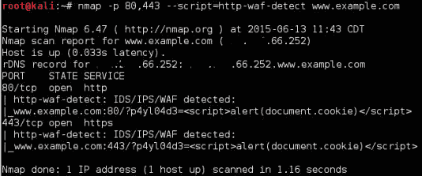

    Imperva 是 Web 应用防火墙市场的主流品牌之一。就像我们这里看到的，有一个保护网站的设备。

3.  这里是另一个 Nmap 脚本，可以帮助我们识别所使用的设备，并更加精确。脚本在下面：

    ```
    nmap -p 80,443 --script=http-waf-fingerprint www.example.com
    ```

    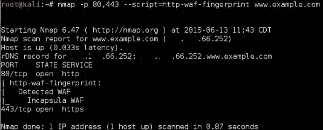

4.  另一个 Kali Linux 自带的工具可以帮助我们检测和是被 WAF，它叫做`waf00f`。假设`www.example.com`是受 WAF 保护的站点：

    ```
    wafw00f www.example.com
    ```

    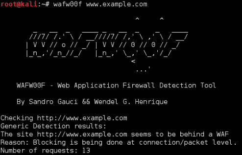

### 工作原理

WAF 检测的原理是通过发送特定请求到服务器，之后分析响应。例如，在`http-waf-detect`的例子中，它发送了一些基本的恶意封包，并对比响应，同时查找封包被阻拦、拒绝或检测到的标识。`http-waf-fingerprint`也一样，但是这个脚本也尝试拦截响应，并根据已知的不同 IDS 和 WAF 的模式对其分类。`wafw00f`也是这样。

## 2.3 查看源代码

查看网页的源代码允许我们理解一些程序的逻辑，检测明显的漏洞，以及在测试时有所参考，因为我们能够在测试之前和之后比较代码，并且使用比较结果来修改我们的下一次尝试。

这个秘籍中，我们会查看应用的源代码，并从中得出一些结论。

### 准备

为这个秘籍启动 vulnerable_vm。

### 操作步骤

1.  浏览 [http://192.168.56.102](http://192.168.56.102)。

2.  选择 WackoPicko 应用。

3.  右击页面并选择`View Page Source`（查看源代码）。会打开带有页面源代码的新窗口：

    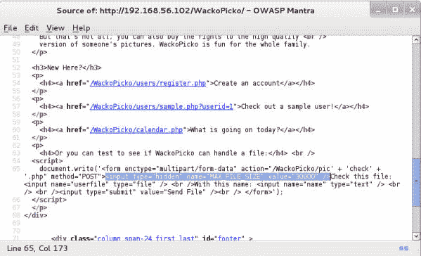

    根据源代码，我们可以发现页面所使用的库或外部文件，以及链接的去向。同时，在截图中可以看到，这个页面拥有一些隐藏的输入字段。选中的是`MAX_FILE_SIZE`，这意味着，当我们上传文件时，这个字段判断了文件允许上传的最大大小。所以，如果我们修改了这个值，我们可能就能够上传大于应用所预期的文件。这反映了一个重要的安全问题。

### 工作原理

网页的源代码在发现漏洞和分析应用对所提供输入的响应上非常有用。它也提供给我们关于应用内部如何工作，以及它是否使用了任何第三方库或框架的信息。

一些应用也包含使用 JS 或任何其它脚本语言编写的输入校验、编码和加密函数。由于这些代码在浏览器中执行，我们能够通过查看页面源代码来分析它，一旦我们看到了校验函数，我们就可以研究它并找到任何能够让我们绕过它或修改结果的安全缺陷。

## 4.4 使用 Firefox 分析和修改基本行为

Firebug 是个浏览器插件，允许我们分析网页的内部组件，例如表格元素、层叠样式表（CSS）类、框架以及其它。它也有展示 DOM 对象、错误代码和浏览器服务器之间的请求响应通信的功能。

在上一个秘籍中，我们看到了如何查看网页的 HTML 源代码以及发现影藏的输入字段。隐藏的字段为文件最大大小设置了一些默认值。在这个秘籍中，我们会看到如何使用浏览器的调试扩展，这里是 Firefox 或者 OWASP-Mantra 上的 Firebug。

### 准备

启动 vulnerable_vm，访问 [http://192.168.56.102/WackoPicko](http://192.168.56.102/WackoPicko)。

### 操作步骤

1.  右击`Check this file`（检查此文件），之后选择`Inspect Element with Firebug`（使用 Firebug 查看元素）。

    

2.  表单的第一个输入框存在`type="hidden"`参数，双击`hidden`。

3.  将`hidden`改成`text`之后按下回车键。

    

4.  现在双击参数值的 30000。

5.  将他改成 500000。

    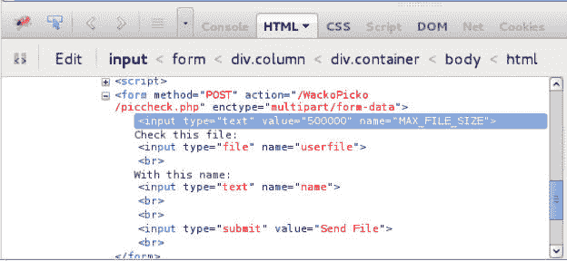

6.  现在，我们看到了页面上的新文本框，值为 500000。我们刚刚修改了文件大小上限，并添加了个表单字段来修改它。

    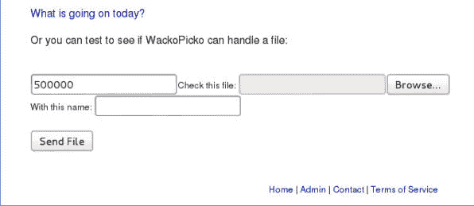

### 工作原理

一旦页面被浏览器收到，所有元素都可以修改，来改变浏览器解释它的方式。如果页面被重新加载，服务器所生成的版本会再次展示。

Firebug 允许我们修改几乎每个页面在浏览器中显示的层面。所以，如果存在建立在客户端的控制逻辑，我们可以使用工具来操作它。

### 更多

Firebug 不仅仅是个取消输入框的隐藏或修改值的工具，它也拥有一些其它的实用功能：

*   `Console`标签页展示错误，警告以及一些在加载页面时生成的其它消息。

*   `HTML`标签页是我们刚刚使用的页面，它以层次方式展示 HTML，所以允许我们修改它的内容。

*   `CSS`标签页用于查看和修改页面使用的 CSS 风格。

*   `Script`让我们能够看到完整的 HTML 源代码，设置会打断页面加载的断点，执行到它们时会打断加载，以及检查脚本运行时的变量值。

*   `DOM`标签页向我们展示了DOM（文档对象模型）对象，它们的值，以及层次结构。

*   `Net`展示了发送给服务器的请求和它的响应，它们的类型、尺寸、响应时间，和时间轴上的顺序。

*   `Cookies`包含由服务器设置的 Cookie，以及它们的值和参数，就像它的名字那样。

## 4.5 获取和修改 Cookie

Cookie 是由服务器发送给浏览器（客户端）的小型信息片段，用于在本地储存一些信息，它们和特定用户相关。在现代 Web 应用中，Cookie 用于储存用户特定的数据、例如主题颜色配置、对象排列偏好、上一个活动、以及（对我们更重要）会话标识符。

这个秘籍中，我们会使用浏览器的工具来查看 Cookie 的值，它们如何储存以及如何修改它们。

### 准备

需要运行我们的 vulnerable_vm。`192.168.56.102`用于该机器的 IP 地址，我们会使用 OWASP-Mantra 作为 Web 浏览器。

### 操作步骤

1.  浏览 [http://192.168.56.102/WackoPicko](http://192.168.56.102/WackoPicko)。

2.  从 Mantra 的菜单栏访问`Tools | Application Auditing | Cookies Manager +`。

    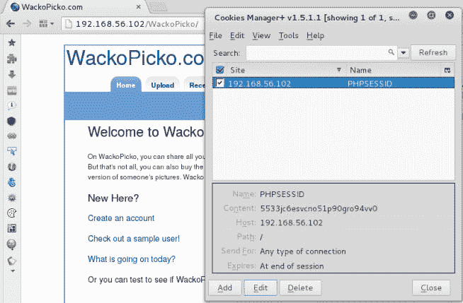

    在这个截图中，我们可以从这个插件中看到所有该时刻储存的Cookie，以及所有它们所属的站点。我们也可以修改它们的值，删除它们以及添加新的条目。

3.  从`192.168.56.102`选择`PHPSESSID`，之后点击`Edit`。

4.  将`Http Only`的值修改为`Yes`。

    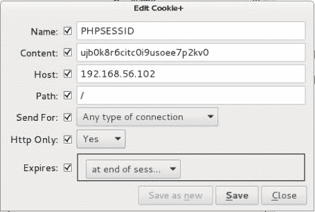

    我们刚刚修改的参数（`Http Only`）告诉浏览器，Cookie不能允许客户端脚本访问。

### 工作原理

Cookies Manager+ 是个浏览器插件，允许我们查看、修改或删除现有的 Cookie，以及添加新的条目。因为一些应用依赖于储存在这些 COokie 中的值，攻击者可以使用它们来输入恶意的模式，可能会修改页面行为，或者提供伪造信息用于获取高阶权限。

同时，在现代 Web 应用中，会话 Cookie 通常被使用，通常是登录完成之后的用户标识符的唯一兰苑。这会导致潜在的有效用户冒充，通过将 Cookie 值替换为某个活动会话的用户。

## 2.6 利用 robots.txt

要想进一步侦查，我们需要弄清楚是否站点有任何页面或目录没有链接给普通用户看。例如，内容管理系统或者内部网络的登录页面。寻找类似于它的站点会极大扩大我们的测试面，并给我们一些关于应用及其结构的重要线索。

这个秘籍中，我们会使用`robots.txt`文件来发现一些文件和目录，它们可能不会链接到主应用的任何地方。

### 操作步骤

1.  浏览 [http://192.168.56.102/vicnum/](http://192.168.56.102/vicnum/)。

2.  现在我们向 URL 添加`robots.txt`，之后我们会看到如下截图：

    

    这个文件告诉搜索引擎，`jotto`和`cgi-bin`的首页不允许被任何搜索引擎（User Agent）收录。

3.  让我们浏览 [http://192.168.56.102/vicnum/cgi-bin/](http://192.168.56.102/vicnum/cgi-bin/)。

    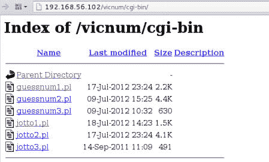

    我们可以直接点击和访问目录中的任何 Perl 脚本。

4.  让我们浏览 [http://192.168.56.102/vicnum/jotto/](http://192.168.56.102/vicnum/jotto/)。

    

5.  点击名称为`jotto`的文件，你会看到一些类似于下面的截图的东西：

    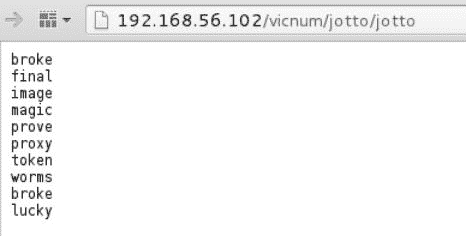

    Jooto 是个猜测五个字符的单词的游戏，这会不会是可能答案的列表呢？通过玩这个游戏来检验它，如果是的话，我们就已经黑掉了这个游戏。

### 工作原理

`robots.txt`是 Web 服务器所使用的文件，用于告诉搜索引擎有关应该被索引，或者不允许查看的文件或目录的信息。在攻击者的视角上，这告诉了我们服务器上是否有目录能够访问但对公众隐藏。这叫做“以隐蔽求安全”（也就是说假设用户不会发现一些东西的存在，如果它们不被告知的话）。

## 2.7 使用 DirBuster 发现文件和文件夹

DirBuster 是个工具，用于通过爆破来发现 Web 服务器中的现存文件和目录。我们会在这个秘籍中使用它来搜索文件和目录的特定列表。

### 准备

我们会使用一个文本文件，它包含我们要求 DirBuster 寻找的单词列表。创建文本文件`dictionary.txt`，包含下列东西：

*   info
*   server-status
*   server-info
*   cgi-bin
*   robots.txt
*   phpmyadmin
*   admin
*   login

### 操作步骤

1.  访问`Applications | Kali Linux | Web Applications | Web Crawlers | dirbuster`。

    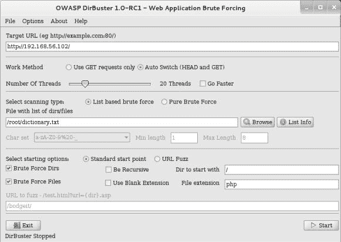

2.  在 DIrBuster 的窗口中，将目标 URL 设置为 [http://192.168.56.102/](http://192.168.56.102/)。

3.  将线程数设置为 20。

4.  选择`List based brute force`（基于爆破的列表）并点击`Browse`（浏览）。

5.  在浏览窗口中，选择我们刚刚创建的文件（`dictionary.txt`）。

6.  取消选择`Be Recursive`（递归）。

7.  对于这个秘籍，我们会让其它选项保持默认。

8.  点击`Start`（开始）。

    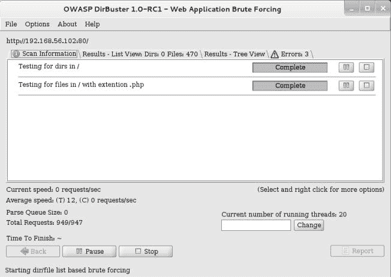

9.  如果我们查看`Resuults`（结果）标签页，我们会看到，DirBuster 已经找到了至少两个目录中的文件：`cgi-bin`和`phpmyadmin`。响应代码 200 意味着文件或目录存在且能够读取。PhpMyAdmin 是基于 Web 的 MySQL 数据库管理器，找到这个名称的目录告诉我们服务器中存在 DBMS，并且可能包含关于应用及其用户的相关信息。

    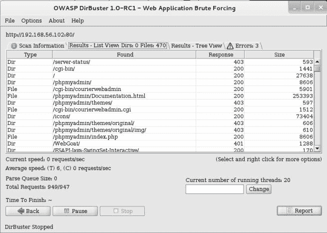

### 工作原理

DirBuster 是个爬虫和爆破器的组合，它允许页面上的所有连接，但是同时尝试可能文件的不同名称。这些名称可以保存在文件中，类似于我们所使用的那个，或者可以由 DirBuster 通过“纯粹暴力破解”选项，并为生成单词设置字符集和最小最大长度来自动生成。

为了判断文件是否存在，DirBuster 使用服务器生成的响应代码。最常见的响应在下面列出：

*   `200 OK`：文件存在并能够读取。

*   `404 File not found`：文件不存在。

*   `301 Moved permanently`：这是到给定 URL 的重定向。

*   `401 Unauthorized`：需要权限来访问这个文件。

*   `403 Forbidden`：请求有效但是服务器拒绝响应。

## 2.8 使用 Cewl 分析密码

在每次渗透测试中，查查都必须包含分析层面，其中我们会分析应用、部门或过程的名称、以及其它被目标组织使用的单词。当需要设置人员相关的用户名或密码的时候，这会帮助我们判断可能常被使用的组合。

这个秘籍中，我们会使用 CeWL 来获取应用所使用的单词列表。并保存它用于之后的登录页面暴力破解。

### 操作步骤

1.  首先，我们查看 CeWL 的帮助我文件，来获得能够做什么的更好想法。在终端中输入：

    ```
    cewl --help
    ```

    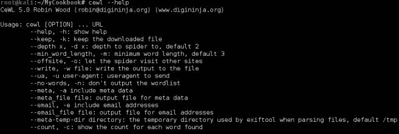

2.  我们会使用 CeWL 来获得 vulnerable_ vm 中 WackoPicko 应用的单词。我们想要长度最小为 5 的单词，显示单词数量并将结果保存到`cewl_WackoPicko.txt`。

    ```
    cewl -w cewl_WackoPicko.txt -c -m 5 http://192.168.56.102/ WackoPicko/
    ```

3.  现在，我们打开 CeWL 刚刚生成的文件，并查看“单词数量”偶对的列表。这个列表仍然需要一些过滤来去掉数量多但是不可能用于密码的单词，例如“Services”，“Content”或者“information”。

4.  让我们删除一些单词来构成单词列表的首个版本。我们的单词列表在删除一些单词和数量之后，应该看起来类似下面这样：

    *   WackoPicko
    *   Users
    *   person
    *   unauthorized
    *   Login
    *   Guestbook
    *   Admin
    *   access
    *   password
    *   Upload
    *   agree
    *   Member
    *   posted
    *   personal
    *   responsible
    *   account
    *   illegal
    *   applications
    *   Membership
    *   profile

### 工作原理

CeWL 是个 Kali 中的工具，爬取网站并提取独立单词的列表。他它也可以提供每次单词的重复次数，保存结果到文件，使用页面的元数据，以及其它。

### 另见

其它工具也可用于类似目的，它们中的一些生成基于规则或其它单词列表的单词列表，另一些可以爬取网站来寻找最常用的单词。

*   Crunch：这是基于由用户提供的字符集合的生成器。它使用这个集合来生成所有可能的组合。Crunch 包含在 Kali 中。

*   Wordlist Maker (WLM)：WLM 能够基于字符集来生成单词列表，也能够从文本文件和网页中提取单词（[http://www.pentestplus.co.uk/wlm.htm](http://www.pentestplus.co.uk/wlm.htm)）。

*   Common User Password Profiler (CUPP)：这个工具可以使用单词列表来为常见的用户名分析可能的密码，以及从数据库下载单词列表和默认密码（[https://github.com/Mebus/cupp](https://github.com/Mebus/cupp)）。

## 2.9 使用 John the Ripper 生成字典

John the Ripper 可能是世界上最受大多数渗透测试者和黑客欢迎的密码破解器。他拥有许多特性，例如自动化识别常见加密和哈希算法，使用字典，以及爆破攻击。因此，它允许我们对字典的单词使用规则、修改它们、以及在爆破中使用更丰富的单词列表而不用储存列表。最后这个特性是我们会在这个秘籍中使用的特性之一，用于基于极其简单的单词列表生成扩展字典。

### 准备

我们会使用上一节中生成的单词列表，来生成可能密码的字典。

### 操作步骤

1.  John拥有只展示用于破解特定密码文件的密码的选项。让我们使用我们的单词列表来尝试它：

    ```
    john --stdout --wordlist=cewl_WackoPicko.txt
    ```

    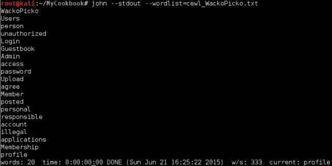

2.  另一个 John 的特性是让我们使用规则，以多种方式来修改列表中的每个单词，以便生成更复杂的字典。

    ```
    john --stdout --wordlist=cewl_WackoPicko.txt --rules
    ```

    你可以在结果中看到，John 通过转换大小写、添加后缀和前缀，以及将字母替换为数字和符号（leetspeak）来修改单词。

3.  现在我们需要执行相同操作，但是将列表发送给文件，便于我们之后使用：

    ```
    john --stdout --wordlist=cewl_WackoPicko.txt --rules > dict_ WackoPicko.txt
    ```

    

4.  现在，我们拥有了 999 个单词的字典，它会在之后使用，用于进行应用登录页面上的密码猜测攻击。

### 工作原理

虽然 John the Ripper 的目标并不是字典生成器，而是高效地使用单词列表来破解密码（它也做的非常好）。它的特性允许我们将其用于扩展现有单词列表，并创建更符合现代用户所使用的密码的字典。

这个秘籍中，我们使用了默认的规则集合来修改我们的单词。John 的规则定义在配置文件中，位于 Kali 的`/etc/john/john.conf`。

### 更多

有关为 John the Ripper创建和修改规则的更多信息，请见：[http://www.openwall.com/john/doc/RULES.shtml](http://www.openwall.com/john/doc/RULES.shtml)。

## 2.10 使用 ZAP 发现文件和文件夹

OWASP ZAP（Zed Attack Proxy）是个用于 Web 安全测试的全能工具。他拥有代理、被动和主动漏洞扫描器、模糊测试器、爬虫、HTTP 请求发送器，一起一些其他的有趣特性。这个秘籍中，我们会使用最新添加的“强制浏览”，它是 ZAP 内的 DisBuster 实现。

### 准备

这个秘籍中，我们需要将 ZAP 用做浏览器的代理。

1.  打开 OWASP ZAP，从应用的菜单栏中，访问`Applications | Kali Linux | Web Applications | Web Application Fuzzers | owasp-zap`。

2.  在 Mantra 或 Iceweasel 中，访问主菜单的`Preferences | Advanced | Network`，在`Connection`中点击`Settings`。

3.  选项`Manual proxy configuration`（手动代理配置），并将`127.0.0.1`设置为 HTTP 代理，8080 设置为端口。检查选项来为所有协议使用同一个代理，并点击`OK`。

    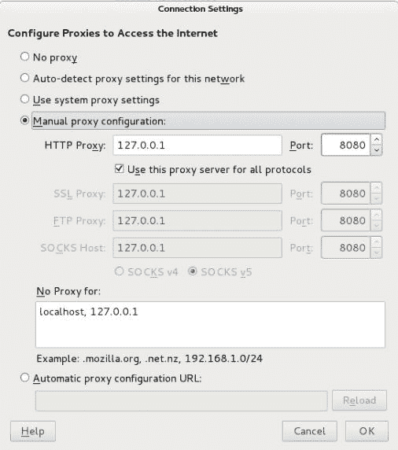

4.  现在，我们需要告诉 ZAP 从哪个文件获得目录名称。从 ZAP 的菜单中访问`Tools | Options | Forced Brows`，之后点击`Select File`。

5.  Kali 包含一些单词列表，我们会使用它们之一：选择文件`/usr/share/wordlists/dirbuster/directory-list-lowercase-2.3small.txt`，之后点击`Open`。

    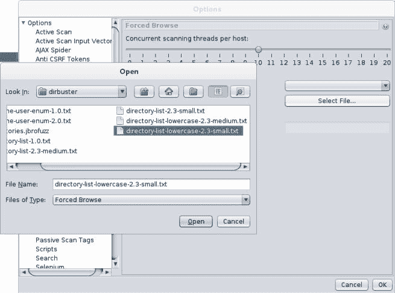

6.  提示框会告诉我们文件被加载了。点击`OK`之后再点击`OK`来离开`Options`对话框。

### 操作步骤

1.  合理配置代理之后，浏览

### 工作原理

当我们配置浏览器来将 ZAP 用作代理的时候，它并不直接发送给服务器任何我们打算浏览的页面的请求，而是发到我们定义的地址。这里是 ZAP 监听的地址。之后 ZAP 将请求转发给服务器但是不分析任何我们发送的信息。

ZAP 的强制浏览的工作方式和 DIrBuster 相同，它接受我们所配置的字典，并向服务器发送请求，就像它尝试浏览列表中的文件那样。如果文件存在，服务器会相应地响应。如果文件不存在或不能被我们的当前用户访问，服务器会返回错误。

### 另见

Kali 中包含的另一个非常实用的代理是 Burp Suite。它也拥有一些特别有趣的特性。其中可用作强制浏览的替代品是 Intruder。虽然 Burp Suite 并不特地用于该目的，但是它是个值得研究的通用工具。