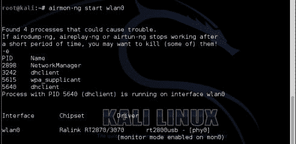
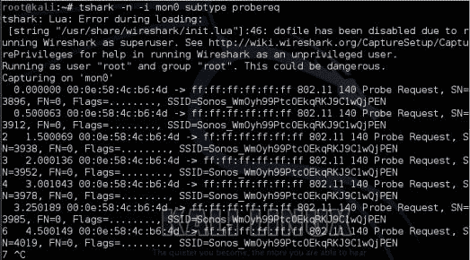

# 第十章 WPS 和 探针

> 作者：Vivek Ramachandran, Cameron Buchanan
> 
> 译者：[飞龙](https://github.com/)
> 
> 协议：[CC BY-NC-SA 4.0](http://creativecommons.org/licenses/by-nc-sa/4.0/)
> 
> 太阳底下无新事。
> 
> – 谚语

这一章由新的技巧组成，包括攻击 WPS 和探针监控，也包含了使无线测试更简单的 pineapple 工具。这些攻击和工具在本书第一版的发布过程中出现，我们要确保这本书尽可能全面。

## 10.1 WPS 攻击

无线保护设置（WPS）在 2006 年被引入，用于帮助没有无线知识的用户保护网络。其原理是它们的 WIFI 拥有单一隐藏的硬编码值，它可以允许密钥记忆来访问。新的设备可以通过按下 WIFI 路由上的按钮来验证。在房子外面的人不能解除设备，就不能获得访问权。所以这个问题被降解为记住 WPA 密钥或者设置更短的密钥。

2011 年末，爆破 WPS 验证系统的安全漏洞被公开。协商 WPS 交换所需的流量易于被一篇，并且 WPS Pin 本身只有 0~9 的 8 个字符。最开始，这可以提供 100,000,000 中可能性，与之相比，8 个字符的 azAZ09 密码拥有 218,340,105,584,896 种组合。

但是，这里存在进一步的漏洞：

*   在 WPS Pin 的八个字符中，最后一个是前七个的校验和，所以它可以预测，选择就只剩下 10,000,000 种了。

*   此外，前四个和后三个字符分别验证，这意味着一共有 11,000 种选择。

虽然验证机制中要判断两次，但是我们已经从 100,000,000 个可能的组合降到了 11,000。这相当于爆破算法时的六个小时的差异。这些判断使 WPS 更易受攻击。

在下一个实验中，我们会使用 Wash 和 Reaver 识别和攻击 WPS 漏洞配置。

### 实战时间 – WPS 攻击

遵循以下指南来开始：

1.  在我们攻击开启了 WPS 的接入点之前：我们首先要创建它。我们所使用的 TP-LINK 拥有这个也行，默认开启，它非常麻烦还是便捷。为了再三检查它，我们可以登入我们的路由并点击 WPS。它看起来是这样：

    

2.  现在我们确认它准备好了。我们需要启动我们的目标。我们需要配置我们的测试环境。我们打算使用 Wash 工具，并且 Wash 需要监控器接口来生效。就像我们之前做的那样，我们需要使用下列命令来启动：

    ```
    airmon-ng start wlan0
    ```

    输出是这样：

    

3.  我们拥有了监控接口，设置为`mon0`，我们可以使用下列命令调用 Wash：

    ```
    wash --ignore-fcs -i mon0
    ```

    `ignore fcs`选项是由于`wash`导致的已知请求格式的问题：

    

4.  我们会展示所有附近 支持 WPS 的设备。以及它们是否开启或解锁了 WPS，以及它们的版本：

    

5.  我们可以看到`Wireless Lab`支持 WPS。它使用版本 1 并且没有锁住。太好了。我们注意到 MAC 地址，它在我这里是`E8:94:F6:62:1E:8E`，这会作为下一个工具`reaver`的目标。

6.  Reaver 尝试爆破给定 MAC 地址的 WPS Pin。启动它的语法如下：

    ```
    reaver -i mon0 -b <mac> -vv
    ```

    输出是这样：

    

7.  启动之后，这个工具执行所有可能的 WPS 组合，并尝试验证。一旦它完成了，它会返回 WPS 码和密码，像这样：

    

8.  得到 WPA-PSK 之后，我们可以正常验证了。我把匹配 WPS Pin 的默认的 WPA-PSK 留给我的设备，你可以通过在`reaver`中指定 Pin 来实现，使用下列命令：

    ```
    reaver -i mon0 -b <mac> -vv -p 88404148
    ```

    将我的 Pin 换成你的。

### 刚刚发生了什么？

我们使用 Wash 成功识别了带有 WPS 漏洞实例的无线网络。之后我们使用 Reaver 来恢复 WPA 密钥和 WPS Pin。使用这个信息，我们之后能够验证网络并继续网络渗透测试。

### 试一试 – 速率限制

在之前的联系中，我们攻击了整个未加密的 WPS 安装。我们可以使用多种方法来进一步探索安全的安装，不需要移除 WPS。

尝试将 WPS Pin 设置为任意值并再次尝试，来看看 Reaver 是否能够快速破解。

获得允许你限制 WPS 尝试速率的路由器。尝试和调整你的攻击来避免触发锁定。

## 10.2 探针嗅探

我们已经谈到了探针，以及如何使用它们来识别隐藏的网络，和执行有效的伪造接入点攻击。它们也可以将个体识别为目标，或者在大范围内以最少的努力识别它们。

当设备打算连接网路是，它会发送探测请求，包含它自己的 MAC地址和想要连接的网络名称。我们可以使用工具，例如`airodump-ng`来跟踪它们。但是，如果我们希望识别个体是否在特定位置特定时间内出现，或者在 WIFI 使用中发现趋势，我们就需要不同的方式。

这一节中，我们会使用 tshark 和 Python 来收集数据。你会收到代码和完成了什么的解释。

### 实战时间 – 收集数据

遵循下列指南来开始：

1.  首先，我们需要寻找多个网络的设备。通常，普通的安卓或者 iPhone 智能收集就足够了。台式机通常不是良好的目标，因为它们只能待在一个地方。新的 iPhone 或安卓设备可能禁用了探测请求，或者不清楚，所以在你放弃之前检查一下。

2.  一旦你搞定了设备，确保打开了 WIFI。

3.  之后启动你的监控接口，像之前那样。

    

4.  下面要完成的事情就是使用`tshark`寻找探测请求，通过下列命令：

    ```
    tshark -n -i mon0 subtype probereq
    ```

    命令的截图如下：

    

5.  你这里的输出会有些混乱，因为`tshark`的默认输出没有为可读而涉及，只是尽可能展示很多信息。它看起来应该是这样：

    

6.  你已经可以看到 MAC 地址和探测请求的 SSID。但是，输出还可以更好。我们可以使用下列命令来使其更加可读取：

    ```
    tshark –n –i mon0 subtype probereq –T fields –e separator= -e wlan.sa –e wlan_mgt.ssid
    ```

    命令的截图如下：

    

7.  输出会变得更加可读：

    

8.  所以现在我们获得了可读格式的输出，下面呢？我们要创建 Python 脚本，执行命令并记录输出用于之后的分析。在执行代码之前，你需要确保你准备好了监控接口，并在目录中创建了`results.txt`文件。Python 脚本如下：

    ```
    import subprocess 
    import datetime 
    results = open("results.txt", "a") 
    while 1: 
        blah = subprocess.check_output(["tshark –n –i mon0 subtype probereq –T fields –e separator= -e wlan.sa –e wlan_mgt.ssid –c 100"], shell=True) 
        splitblah = blah.split("\n") 
        for value in splitblah[:-1]: 
            splitvalue = value.split("\t") 
            MAC = str(splitvalue[1]) 
            SSID = str(splitvalue[2]) 
            time = str(datetime.datetime.now()) 
            Results.write(MAC+" "+SSID+" "+time+"\r\n")
    ```

    让我们简单看一看 Python 脚本：

    *   `import subproces`库和`datetime`库：这允许我们引用子进程和日期时间库。`subprocess`允许我们从 Linux 命令行监控接口，而`datetime`库允许我们获得准确时间和日期。

    *   `while 1`：这行代码在停止之前一直执行。

    *   `results = open("results.txt", "a")`：这使用附加模式打开了文件，并将其赋给`results`。附加模式只允许脚本添加文件的内容，这会防止文件被覆写。

    *   `blah = subprocess.check_output(["tshark –n –I mon0 subtype probereq –T fields –e separator= -e wlan.sa –e wlan_mgt.ssid –c 100"], shell=True)`：这打开了 shell 来执行我们之前侧事故的`tshark`命令。这次唯一的区别就是`-c 100`。这个选项所做的就是将命令限制为 100 个查询。这允许我们将节骨哦返回给我们自己，而不需要停止程序。因为我们说过在写入结果之后永远运行，这个脚本会再次启动。

    *   这行代码从 shell 获得输出，并将其赋给变量`blah`。

    *   `splitblah = blah.split("\n")`：接收变量`blah`并按行分割。

    *   `for value in splitblah[:-1]`：对输入的每一行重复下面的操作，忽略包含头部的第一行。

    *   `splitvalue = value.split("\t")`：将每一行拆分成更小的片段，使用`tab`字符作为分隔符。

    *   下面的三行接收每个文本段并将其赋给变量：

        ```
        MAC = str(splitvalue[1]) 
        SSID = str(splitvalue[2]) 
        time = str(datetime.datetime.now()
        ```

    *   `results.write(MAC+" "+SSID+" "+time+"\r\n")`：接收所有这些值，将其写到文件中，由空格分隔，为了整洁最后附带回车和换行符。

写到文件的输出是整洁的文本行。

## 刚刚发生了什么？

我们从探测请求接收输入，并将其使用 Python 输出到文件中。

你可能会问自己它的目的是什么。这可以仅仅通过执行原始的`tshark`命令并添加`>> results.txt`来完成。你是对的，但是，我们创建了集成其它工具，可视化平台，数据库，以及服务的框架。

例如，使用 WiGLE 数据库，将 SSID 映射为位置，你就可以添加新的代码行接受 SSID 变量并查询 WIGLE 数据库。

作为替代，你也可以建立 MySQL 数据库并将输出保存到这里来执行 SQL 命令。

这一节向你提供了创建你自己的探测监控攻击的第一步。通过这个实验，并使用这个简单的代码作为第一步，就可以创建多数实用的工具。

### 试一试 – 扩展概念

研究什么工具可用于可视化和数据分析，并易于集成到 Python。例如 Maltego 的工具拥有免费版本，可以用于绘制信息。

为你自己建立 MySQL数据库来记录数据和重新调整之前的 Python 脚本，将结果输出到数据库。之后，构建另一个脚本（或在相同文件中）来获得数据并输出到 Maltego。

重新调整脚本来查询 WIGLE，之后从探测请求中收集地理位置数据。通过 Maltego 来输出数据。

尝试通过 Flask、Django 或 PHP 建立 Web 前端来展示你的数据。为展示数据研究现有的解决方案，并尝试通过与它们的创建者交谈来模拟和改进它们。

## 总结

这一章中，我们谈论了针对 WPS 的攻击，它在本书第一版的发布过程中出现。同时也初步尝试了将无线工具使用 Python 集成。我们已经到达了本书的末尾，我希望它充实而又有趣。七年后的第三版再见吧。