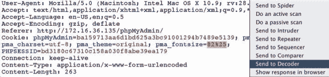

# 第七章 Web 应用扫描（二）

> 作者：Justin Hutchens
> 
> 译者：[飞龙](https://github.com/)
> 
> 协议：[CC BY-NC-SA 4.0](http://creativecommons.org/licenses/by-nc-sa/4.0/)

## 7.7 使用 BurpSuite Web 代理

虽然它有许多可用工具，BurpSuite 的主要功能就是拦截代理。这就是说，BurpSuite 拥有捕获请求和响应的功能，以及随后操作它们来将其转发到目的地。这个秘籍中，我们会讨论如何使用 BurpSuite 拦截或记录请求。

### 准备

为了使用 BurpSuite 对目标执行 Web 应用分析，你需要拥有运行一个或多个 Web 应用的远程系统。所提供的例子中，我们使用 Metasploitable2 实例来完成任务。 Metasploitable2 拥有多种预安装的漏洞 Web 应用，运行在 TCP 80 端口上。配置 Metasploitable2 的更多信息请参考第一章中的“安装 Metasploitable2”秘籍。

此外，你的 Web 浏览器需要配置来通过 BurpSuite 本地实例代理 Web 流量。关于将 BurpSuite 用作浏览器代理的更多信息，请参考第一章的“配置 BurpSuite”一节。

### 操作步骤

BurpSuite 的功能可以以被动或拦截模式使用。如果禁用了拦截器，所有请求和响应都会简单记录到`HTTP History`（HTTP 历史）标签页中。可以从列表中选择它们，来浏览它们或查看任何请求或响应的细节，像这样：

作为替代，`Intercept`（拦截器）按钮可以按下来捕获发送过程中的流量。这些请求可以在`Proxy`标签页中操作，之后会转发到目的地，或者丢弃。通过选择`Opyions`标签页，拦截器代理可以重新配置来定义所拦截的请求类型，或者甚至在响应到达浏览器之前拦截它们，像这样：

### 工作原理

BurpSuite 代理可以拦截或被动记录浏览器接受或发送的流量，因为它逻辑上配置在浏览器和任何远程设置之间。浏览器被配置来将所有请求发送给 Burp 的代理，之后代理会将它们转发给任何外部主机。由于这个配置，Burp 就可以捕获两边的发送中的请求和响应，或者记录所有发往或来自客户端浏览器的通信。

## 7.8 使用 BurpSuite Web 应用扫描器

BurpSuite 可以用作高效的 Web 应用漏洞扫描器。这个特性可以用于执行被动分析和主动扫描。这个秘籍中，我们会谈论如何使用 BurpSuite 执行被动和主动漏洞扫描。

### 准备

为了使用 BurpSuite 对目标执行 Web 应用分析，你需要拥有运行一个或多个 Web 应用的远程系统。所提供的例子中，我们使用 Metasploitable2 实例来完成任务。 Metasploitable2 拥有多种预安装的漏洞 Web 应用，运行在 TCP 80 端口上。配置 Metasploitable2 的更多信息请参考第一章中的“安装 Metasploitable2”秘籍。

此外，你的 Web 浏览器需要配置来通过 BurpSuite 本地实例代理 Web 流量。关于将 BurpSuite 用作浏览器代理的更多信息，请参考第一章的“配置 BurpSuite”一节。

### 操作步骤

通常，BurpSuite 会被动扫描所有范围内的 Web 内容，它们通过浏览器在连接代理时范围。术语“被动扫描”用于指代 BurpSuite被动观察来自或发往服务器的请求和响应，并检测内容中的任何漏洞标识。被动扫描不涉及任何注入或探针，或者其他确认可疑漏洞的尝试。

主动扫描可以通过右键点击任何站点地图中的对象，或者任何 HTTP 代理历史中的请求，并且选择`Actively scan this branch`，或者`Do an active scan`，像这样：

所有主动扫描的结果可以通过选择`Scanner`下方的`Scan queue`标签页来复查。通过双击任何特定的扫描项目，你可以复查特定的发现，因为它们属于该扫描，像这样：

主动扫描可以通过选择`Options`标签页来配置。这里，你可以定义要执行的扫描类型，扫描速度，以及扫描的彻底性。

### 工作原理

BurpSuite 的被动扫描器的工作原理是仅仅评估经过它的流量，这些流量在浏览器和任何远程服务器之间通信。这在识别一些非常明显的漏洞时非常有用，但是不足以验证许多存在于服务器中的更加严重的漏洞。主动扫描器的原理是发送一系列探针给请求中识别的参数。这些探针可以用于识别许多常见的 Web 应用漏洞，例如目录遍历、XSS 和 SQL 注入。

## 7.9 使用 BurpSuite Intruder（干扰器）

BurpSuite 中的另一个非常有用的工具就是 Intruder。这个工具通过提交大量请求来执行快节奏的攻击，同时操作请求中预定义的载荷位置。我们会使用 BurpSuite Intruder 来讨论如何自动化请求内容的操作。

### 准备

为了使用 BurpSuite 对目标执行 Web 应用分析，你需要拥有运行一个或多个 Web 应用的远程系统。所提供的例子中，我们使用 Metasploitable2 实例来完成任务。 Metasploitable2 拥有多种预安装的漏洞 Web 应用，运行在 TCP 80 端口上。配置 Metasploitable2 的更多信息请参考第一章中的“安装 Metasploitable2”秘籍。

此外，你的 Web 浏览器需要配置来通过 BurpSuite 本地实例代理 Web 流量。关于将 BurpSuite 用作浏览器代理的更多信息，请参考第一章的“配置 BurpSuite”一节。

### 操作步骤

为了使用 BurpSuite Intruder，需要通过拦截捕获或者代理历史向其发送请求。完成之后，右击请求并选择`Send to Intruder`，像这样：

在下面的例子中，DVWA`Brute Force`应用的登录入口中输入了用户名和密码。在发往 Intruder 之后，可以使用`Positions`标签页来设置载荷。为了尝试爆破管理员密码，需要设置的载荷位置只有`password`参数，像这样：

一旦载荷位置定义好了，被注入的载荷可以在`Payloads`标签页中配置。为了执行字典攻击，我们可以使用自定义或内建的字典列表。这个例子中，内建的`Passwords`列表用于这次攻击，像这样：、

一旦配置好了攻击，你可以点击屏幕顶端的`Intruder`菜单，之后点击`start attack`。这会通过将每个值插入到载荷位置，快速提交一系列请求。为了判断是否存在任何请求生成了完全不同的响应，我们可以将结果按照长度排序。这可以通过点击`Length`表头来完成，通过点击将长度降序排列，我们可以识别出某个长度其它响应的响应。这就是和长度密码相关（碰巧为`password`）的响应。成功的登录尝试会在下一个秘籍中进一步确认，那些我们会讨论 Comparer 的用法。

### 工作原理

BurpSuite Intruder 的原理是自动化载荷操作。它允许用户指定请求中的一个或多个载荷位置，之后提供大量选项，用于配置这些值如何插入到载荷位置。它们会每次迭代后修改。

## 7.10 使用 BurpSuite Comparer（比较器）

在执行 Web 应用评估是，能够轻易识别 HTTP 请求或者响应中的变化非常重要。Comparer 功能通过提供图形化的变化概览，简化了这一过程。这个秘籍中，我们会谈论如何使用 BurpSuite 识别和评估多种服务器响应。

### 准备

为了使用 BurpSuite 对目标执行 Web 应用分析，你需要拥有运行一个或多个 Web 应用的远程系统。所提供的例子中，我们使用 Metasploitable2 实例来完成任务。 Metasploitable2 拥有多种预安装的漏洞 Web 应用，运行在 TCP 80 端口上。配置 Metasploitable2 的更多信息请参考第一章中的“安装 Metasploitable2”秘籍。

此外，你的 Web 浏览器需要配置来通过 BurpSuite 本地实例代理 Web 流量。关于将 BurpSuite 用作浏览器代理的更多信息，请参考第一章的“配置 BurpSuite”一节。

### 操作步骤

任何包含不一致内容的异常通常都值得调查。响应中的变化通常是载荷产生了所需结果的明显标志。在前面使用 BurpSuite Intruder 来爆破 DVWA 登录的演示中，某个特定的载荷生成了比其它更长的响应。为了评估响应的变化，右击事件并点击`Send to Comparer (response)`。

将事件发送给 Comparer 之后，你可以选择屏幕上访的`Comparer`标签页来评估它们。确保之前的响应之一选择为`item 1`，另外的一个响应选择为`item 2`，像这样：

在屏幕下方，存在`compare words`和`compare words`的选项。这里我们选择`compare words`。我们可以看到，响应中一些内容的变化反映了登录成功。任何修改、删除或添加的内容都会在响应当中高亮显式，使其更加易于比较，像这样：

### 工作原理

BurpSuite Comparer 的原理是分析任意两个内容来源，并找出不同。这些不同被识别为修改、删除或添加的内容。快速区分内容中的变化可以用于高效判断特定操作的不同效果。

## 7.11 使用 BurpSuite Repeater（重放器）

在执行 Web 应用评估过程中，很多情况下需求手动测试来利用指定的漏洞。捕获代理中的每个响应、操作并转发非常消耗时间。BurpSuite 的 Repeater 功能通过一致化的操作和提交单个请用，简化了这个过程，并不需要在浏览器中每次重新生成流量。这个秘籍中，我们会讨论如何使用 BurpSuite 执行手动的基于本文的审计。

### 准备

为了使用 BurpSuite 对目标执行 Web 应用分析，你需要拥有运行一个或多个 Web 应用的远程系统。所提供的例子中，我们使用 Metasploitable2 实例来完成任务。 Metasploitable2 拥有多种预安装的漏洞 Web 应用，运行在 TCP 80 端口上。配置 Metasploitable2 的更多信息请参考第一章中的“安装 Metasploitable2”秘籍。

此外，你的 Web 浏览器需要配置来通过 BurpSuite 本地实例代理 Web 流量。关于将 BurpSuite 用作浏览器代理的更多信息，请参考第一章的“配置 BurpSuite”一节。

### 操作步骤

为了使用 BurpSuite Repeater，请求需要通过拦截捕获或者代理历史来发送给它。发送之后，右击请求之后选择`Send to Repeater`，像这样：

在这个例子中，用户生成的请求用于提供名称，服务器以 HTML 响应返回所提供的输入。为了测试跨站脚本的可能性，我们应该在这种攻击中首先注入一系列常见的字符，像这样：

在发送一系列字符之后，我们可以看到，所有字符都在 HTML 内容中返回，没有字符被转义。这很大程度上表示，这个功能存在跨站脚本漏洞。为了测试漏洞是否可以利用，我们可以输入标准的标识请求`<script>alert('xss')</ script>`，像这样：

通过查看返回的 HTML 内容，我们可以看到，开头的`script`标签已经从响应中移除了。这可能表明黑名单禁止在输入中使用`script`标签。黑名单的问题就是，它可以通过修改输入来绕过。这里，我们可以尝试通过修改标签中几个字符的大小写来绕过黑名单，像这样：

通过使用`<ScRiPt>`标签，我们可以看到，强加的限制已经绕过了，开始和闭合标签都包含在响应中。这可以通过在浏览器中输入请求来验证，像这样：

为了评估客户端浏览器中的响应，右击请求之后选择`Request in browser`。这会生成一个 URL，它可以用于重新在已连接到 Burp 代理的浏览器中提交请求。

我们可以手动复制提供的 URL，或者点击`Copy`按钮。这个URL 之后可以粘贴到浏览器中，而且请求会在浏览器中提交。假设跨站脚本攻击是成功的，客户端 JS 代码会在浏览器中渲染，并且屏幕上会出现提示框，像这样：

### 工作原理

BurpSuite Repeater 仅仅通过向 Web 提供文本界面来工作。Repeater 可以让用户通过直接操作请求和远程 Web 服务交互，而不是和 Web 浏览器交互。这在测试真实 HTML 输出比渲染在浏览器中的方式更加重要时非常有用。

## 7.12 使用 BurpSuite Decoder（解码器）

在处理 Web 应用流量时，你会经常看到出于混淆或功能性而编码的内容。BurpSuite Decoder 可以解码请求或响应中的内容，或按需编码内容。这个秘籍中，我们会讨论如何使用 BurpSuite 编码和解码内容。

### 准备

为了使用 BurpSuite 对目标执行 Web 应用分析，你需要拥有运行一个或多个 Web 应用的远程系统。所提供的例子中，我们使用 Metasploitable2 实例来完成任务。 Metasploitable2 拥有多种预安装的漏洞 Web 应用，运行在 TCP 80 端口上。配置 Metasploitable2 的更多信息请参考第一章中的“安装 Metasploitable2”秘籍。

此外，你的 Web 浏览器需要配置来通过 BurpSuite 本地实例代理 Web 流量。关于将 BurpSuite 用作浏览器代理的更多信息，请参考第一章的“配置 BurpSuite”一节。

### 操作步骤

为了向 BurpSuite Decoder 传递指定的值，高亮所需的字符串，右击它，并选择`Send to Decoder`。在下面的例子中，`Cookie`参数的值被发送到了解码器，像这样：

通过点击`Smart decode`按钮，BurpSuite 会自动将编码识别为 URL 编码，并将其解码到编码文本下面的区域中，像这样：

如果 BurpSuite 不能判断编码类型，可以以多种不同编码类型来手动解码，包括 URL、HTML、Base64、ASCII Hex，以及其它。解码器也能够使用`Encode as...`功能来编码输入的字符串。

### 工作原理

BurpSuite Decoder 在和 Web 应用交互时提供了编码和解码的平台。这个工具十分有用，因为 Web 上由多种编码类型经常用于处理和混淆目的。此外，`Smart decode`工具检测任何所提供输入的已知模式或签名，来判断内容所使用的编码类型，并对其解码。