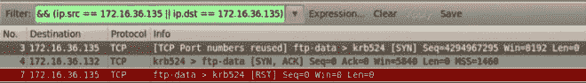
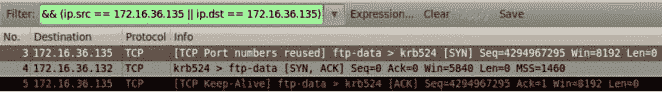

# 第三章 端口扫描（二）

> 作者：Justin Hutchens
> 
> 译者：[飞龙](https://github.com/)
> 
> 协议：[CC BY-NC-SA 4.0](http://creativecommons.org/licenses/by-nc-sa/4.0/)

## 3.6 Scapy 隐秘扫描

执行 TCP 端口扫描的一种方式就是执行一部分。目标端口上的 TCP 三次握手用于识别端口是否接受连接。这一类型的扫描指代隐秘扫描， SYN 扫描，或者半开放扫描。这个秘籍演示了如何使用 Scapy 执行 TCP 隐秘扫描。

### 准备

为了使用 Scapy 执行 TCP 隐秘 扫描，你需要一个运行 TCP 网络服务的远程服务器。这个例子中我们使用 Metasploitable2 实例来执行任务。配置 Metasploitable2 的更多信息请参考第一章中的“安装 Metasploitable2”秘籍。

此外，这一节也需要编写脚本的更多信息，请参考第一章中的“使用文本编辑器*VIM 和 Nano）。

### 操作步骤

为了展示如何执行 SYN 扫描，我们需要使用 Scapy 构造 TCP SYN 请求，并识别和开放端口、关闭端口以及无响应系统有关的响应。为了向给定端口发送 TCP SYN 请求，我们首先需要构建请求的各个层面。我们需要构建的第一层就是 IP 层：

```
root@KaliLinux:~# scapy 
Welcome to Scapy (2.2.0) 
>>> i = IP() 
>>> i.display()
###[ IP ]### 
    version= 4  
    ihl= None  
    tos= 0x0  
    len= None  
    id= 1  
    flags=   
    frag= 0  
    ttl= 64  
    proto= ip  
    chksum= None  
    src= 127.0.0.1  
    dst= 127.0.0.1  
    \options\ 
>>> i.dst = "172.16.36.135" 
>>> i.display() 
###[ IP ]### 
    version= 4  
    ihl= None  
    tos= 0x0  
    len= None  
    id= 1  
    flags=   
    frag= 0  
    ttl= 64  
    proto= ip  
    chksum= None  
    src= 172.16.36.180  
    dst= 172.16.36.135  
    \options\
```

为了构建请求的 IP 层，我们需要将`IP`对象赋给变量`i`。通过调用`display`函数，我们可以确定对象的属性配置。通常，发送和接受地址都设为回送地址，`127.0.0.1`。这些值可以通过修改目标地址来修改，也就是设置`i.dst`为想要扫描的地址的字符串值。通过再次调用`dislay`函数，我们看到不仅仅更新的目标地址，也自动更新了和默认接口相关的源 IP 地址。现在我们构建了请求的 IP 层，我们可以构建 TCP 层了。

```
>>> t = TCP() 
>>> t.display() 
###[ TCP ]### 
    sport= ftp_data  
    dport= http  
    seq= 0  
    ack= 0  
    dataofs= None  
    reserved= 0  
    flags= S  
    window= 8192  
    chksum= None  
    urgptr= 0  
    options= {}
```

为了构建请求的 TCP 层，我们使用和 IP 层相同的技巧。在这个立即中，`TCP`对象赋给了`t`变量。像之前提到的那样，默认的配置可以通过调用`display`函数来确定。这里我们可以看到目标端口的默认值为 HTTP 端口 80。对于我们的首次扫描，我们将 TCP 设置保留默认。现在我们创建了 TCP 和 IP 层，我们需要将它们叠放来构造请求。

```
>>> request = (i/t) 
>>> request.display() 
###[ IP ]### 
    version= 4  
    ihl= None  
    tos= 0x0  
    len= None  
    id= 1
    flags=   
    frag= 0  
    ttl= 64  
    proto= tcp  
    chksum= None  
    src= 172.16.36.180  
    dst= 172.16.36.135  
    \options\ 
###[ TCP ]### 
    sport= ftp_data     
    dport= http     
    seq= 0     
    ack= 0     
    dataofs= None     
    reserved= 0     
    flags= S     
    window= 8192     
    chksum= None     
    urgptr= 0     
    options= {}
```

我们可以通过以斜杠分离变量来叠放 IP 和 TCP 层。这些层面之后赋给了新的变量，它代表整个请求。我们之后可以调用`dispaly`函数来查看请求的配置。一旦构建了请求，可以将其传递给`sr1`函数来分析响应：

```
>>> response = sr1(request) 
...Begin emission: 
........Finished to send 1 packets. 
....* 
Received 16 packets, got 1 answers, remaining 0 packets 
>>> response.display() 
###[ IP ]### 
    version= 4L  
    ihl= 5L  
    tos= 0x0  
    len= 44
    id= 0  
    flags= DF  
    frag= 0L  
    ttl= 64  
    proto= tcp  
    chksum= 0x9970  
    src= 172.16.36.135  
    dst= 172.16.36.180  
    \options\ 
###[ TCP ]### 
    sport= http     
    dport= ftp_data     
    seq= 2848210323L     
    ack= 1     
    dataofs= 6L     
    reserved= 0L     
    flags= SA     
    window= 5840     
    chksum= 0xf82d     
    urgptr= 0     
    options= [('MSS', 1460)] 
###[ Padding ]### 
    load= '\x00\x00'
```

相同的请求可以不通过构建和堆叠每一层来执行。反之，我们使用单独的一条命令，通过直接调用函数并传递合适的参数：

```
>>> sr1(IP(dst="172.16.36.135")/TCP(dport=80)) 
.Begin emission: .............Finished to send 1 packets. 
....* 
Received 19 packets, got 1 answers, remaining 0 packets 
<IP  version=4L ihl=5L tos=0x0 len=44 id=0 flags=DF frag=0L ttl=64 proto=tcp chksum=0x9970 src=172.16.36.135 dst=172.16.36.180 options=[] |<TCP  sport=http dport=ftp_data seq=542529227 ack=1 dataofs=6L reserved=0L flags=SA window=5840 chksum=0x6864 urgptr=0 options=[('MSS', 1460)] |<Padding  load='\x00\x00' |>>>
```

要注意当 SYN 封包发往目标 Web 服务器的 TCP 端口 80，并且该端口上运行了 HTTP 服务时，响应中会带有 TCP 标识 SA 的值，这表明 SYN 和 ACK 标识都被激活。这个响应表明特定的目标端口是开放的，并接受连接。如果相同类型的封包发往不接受连接的端口，会收到不同的请求。

```
>>> response = sr1(IP(dst="172.16.36.135")/TCP(dport=4444)) 
..Begin emission: 
.Finished to send 1 packets. 
...* Received 7 packets, got 1 answers, remaining 0 packets 
>>> response.display() 
###[ IP ]### 
    version= 4L  
    ihl= 5L  
    tos= 0x0  
    len= 40  
    id= 0  
    flags= DF  
    frag= 0L 
    ttl= 64  
    proto= tcp 
    chksum= 0x9974 
    src= 172.16.36.135 
    dst= 172.16.36.180 
    \options\ 
###[ TCP ]### 
    sport= 4444    
    dport= ftp_data 
    seq= 0   
    ack= 1   
    dataofs= 5L  
    reserved= 0L  
    flags= RA  
    window= 0    
    chksum= 0xfd03   
    urgptr= 0
    options= {} 
###[ Padding ]### 
    load= '\x00\x00\x00\x00\x00\x00'
```

当 SYN 请求发送给关闭的端口时，返回的响应中带有 TCP 标识 RA，这表明 RST 和 ACK 标识为都被激活。ACK 为仅仅用于承认请求被接受，RST 为用于断开连接，因为端口不接受连接。作为替代，如果 SYN 封包发往崩溃的系统，或者防火墙过滤了这个请求，就可能接受不到任何信息。由于这个原因，在`sr1`函数在脚本中使用时，应该始终使用`timeout`选项，来确保脚本不会在无响应的主机上挂起。

```
>>> response = sr1(IP(dst="172.16.36.136")/TCP(dport=4444),timeout=1,verb ose=1) 
Begin emission: 
Finished to send 1 packets

Received 15 packets, got 0 answers, remaining 1 packets 
```

如果函数对无响应的主机使用时，`timeout`值没有指定，函数会无限继续下去。这个演示中，`timout`值为 1秒，用于使这个函数更加完备，响应的值可以用于判断是否收到了响应：

```
root@KaliLinux:~# 
python Python 2.7.3 (default, Jan  2 2013, 16:53:07) 
[GCC 4.7.2] on linux2 
Type "help", "copyright", "credits" or "license" for more information. 
>>> from scapy.all import * 
>>> response = sr1(IP(dst="172.16.36.136")/TCP(dport=4444),timeout=1,verb ose=1) 
Begin emission: 
WARNING: Mac address to reach destination not found. Using broadcast. Finished to send 1 packets.

Received 15 packets, got 0 answers, remaining 1 packets 
>>> if response == None: 
...     print "No Response!!!" 
... 
No Response!!!
```

Python 的使用使其更易于测试变量来识别`sr1`函数是否对其复制。这可以用作初步检验，来判断是否接收到了任何响应。对于接收到的响应，可以执行一系列后续检查来判断响应表明端口开放还是关闭。这些东西可以轻易使用 Python 脚本来完成，像这样：

```
#!/usr/bin/python

import logging 
logging.getLogger("scapy.runtime").setLevel(logging.ERROR) 
from scapy.all import * 
import sys

if len(sys.argv) != 4:   
    print "Usage - ./syn_scan.py [Target-IP] [First Port] [Last Port]"   
    print "Example - ./syn_scan.py 10.0.0.5 1 100"   
    print "Example will TCP SYN scan ports 1 through 100 on 10.0.0.5"   
    sys.exit()

ip = sys.argv[1] 
start = int(sys.argv[2]) 
end = int(sys.argv[3])

for port in range(start,end):   
    ans = sr1(IP(dst=ip)/TCP(dport=port),timeout=1,verbose=0)   
    if ans == None:      
        pass   
    else:      
        if int(ans[TCP].flags) == 18:    
            print port  
        else:       
            pass 
```

在这个 Python 脚本中，用于被提示来输入 IP 地址，脚本之后会对定义好的端口序列执行 SYN 扫描。脚本之后会得到每个连接的响应，并尝试判断响应的 SYN 和 ACK 标识是否激活。如果响应中出现并仅仅出现了这些标识，那么会输出相应的端口号码。

```
root@KaliLinux:~# chmod 777 syn_scan.py 
root@KaliLinux:~# ./syn_scan.py 
Usage - ./syn_scan.py [Target-IP] [First Port] [Last Port] 
Example - ./syn_scan.py 10.0.0.5 1 100 
Example will TCP SYN scan ports 1 through 100 on 10.0.0.5 
root@KaliLinux:~# ./syn_scan.py 172.16.36.135 1 100

21 
22 
23 
25 
53 
80 
```

运行这个脚本之后，输出会显示所提供的 IP 地址的系统上，前 100 个端口中的开放端口。

### 工作原理

这一类型的扫描由发送初始 SYN 封包给远程系统的目标 TCP 端口，并且通过返回的响应类型来判断端口状态来完成。如果远程系统返回了 SYN+ACK 响应，那么它正在准备建立连接，我们可以假设这个端口开放。如果服务返回了 RST 封包，这就表明端口关闭并且不接收连接。此外，如果没有返回响应，扫描系统和远程系统之间可能存在防火墙，它丢弃了请求。这也可能表明主机崩溃或者目标 IP 上没有关联任何系统。

## 3.7 Nmap 隐秘扫描

Nmap 拥有可以执行远程系统 SYN 扫描的扫描模式。这个秘籍展示了如何使用 Namp 执行 TCP 隐秘扫描。

### 准备

为了使用 Nmap 执行 TCP 隐秘扫描，你需要一个运行 TCP 网络服务的远程服务器。这个例子中我们使用 Metasploitable2 实例来执行任务。配置 Metasploitable2 的更多信息请参考第一章中的“安装 Metasploitable2”秘籍。

### 操作步骤

就像多数扫描需求那样，Nmap 拥有简化 TCP 隐秘扫描执行过程的选项。为了使用 Nmap 执行 TCP 隐秘扫描，应使用`-sS`选项，并附带被扫描主机的 IP 地址。

```
root@KaliLinux:~# nmap -sS 172.16.36.135 -p 80

Starting Nmap 6.25 ( http://nmap.org ) at 2013-12-17 21:47 EST
Nmap scan report for 172.16.36.135 
Host is up (0.00043s latency). 
PORT   STATE SERVICE 
80/tcp open  http 
MAC Address: 00:0C:29:3D:84:32 (VMware)

Nmap done: 1 IP address (1 host up) scanned in 13.05 seconds 
```

在提供的例子中，特定的 IP 地址的 TCP 80 端口上执行了 TCP 隐秘扫描。和 Scapy 中的技巧相似，Nmap 监听响应并通过分析响应中所激活的 TCP 标识来识别开放端口。我们也可以使用 Namp 执行多个特定端口的扫描，通过传递逗号分隔的端口号列表。

```
root@KaliLinux:~# nmap -sS 172.16.36.135 -p 21,80,443

Starting Nmap 6.25 ( http://nmap.org ) at 2013-12-17 21:48 EST 
Nmap scan report for 172.16.36.135 
Host is up (0.00035s latency). 
PORT    STATE  SERVICE 
21/tcp  open   ftp 
80/tcp  open   http 
443/tcp closed https 
MAC Address: 00:0C:29:3D:84:32 (VMware)

Nmap done: 1 IP address (1 host up) scanned in 13.05 seconds 
```

在这个例子中，目标 IP 地址的端口 21、80 和 443 上执行了 SYN 扫描。我们也可以使用 Namp 来扫描主机序列，通过标明要扫描的第一个和最后一个端口号，以破折号分隔：

```
root@KaliLinux:~# nmap -sS 172.16.36.135 -p 20-25

Starting Nmap 6.25 ( http://nmap.org ) at 2013-12-17 21:48 EST 
Nmap scan report for 172.16.36.135 
Host is up (0.00035s latency). 
PORT   STATE  SERVICE 
20/tcp closed ftp-data 
21/tcp open   ftp
22/tcp open   ssh 
23/tcp open   telnet 
24/tcp closed priv-mail 
25/tcp open   smtp 
MAC Address: 00:0C:29:3D:84:32 (VMware)

Nmap done: 1 IP address (1 host up) scanned in 13.05 seconds 
```

在所提供的例子中，SYN 扫描在 TCP 20 到 25 端口上执行。除了拥有指定被扫描端口的能力之外。Nmap 同时拥有配置好的 1000 和常用端口的列表。我们可以执行这些端口上的扫描，通过不带任何端口指定信息来运行 Nmap：

```
root@KaliLinux:~# nmap -sS 172.16.36.135

Starting Nmap 6.25 ( http://nmap.org ) at 2013-12-17 21:46 EST 
Nmap scan report for 172.16.36.135 
Host is up (0.00038s latency). N
ot shown: 977 closed ports 
PORT     STATE SERVICE 
21/tcp   open  ftp 
22/tcp   open  ssh 
23/tcp   open  telnet 
25/tcp   open  smtp 
53/tcp   open  domain 
80/tcp   open  http 
111/tcp  open  rpcbind 
139/tcp  open  netbios-ssn 
445/tcp  open  microsoft-ds 
512/tcp  open  exec 
513/tcp  open  login 
514/tcp  open  shell 
1099/tcp open  rmiregistry 
1524/tcp open  ingreslock 
2049/tcp open  nfs 
2121/tcp open  ccproxy-ftp 
3306/tcp open  mysql
5432/tcp open  postgresql 
5900/tcp open  vnc 
6000/tcp open  X11 
6667/tcp open  irc 
8009/tcp open  ajp13 
8180/tcp open  unknown 
MAC Address: 00:0C:29:3D:84:32 (VMware)

Nmap done: 1 IP address (1 host up) scanned in 13.17 seconds 
```

在上面的例子中，扫描了 Nmap 定义的 1000 个常用端口，用于识别 Metasploitable2 系统上的大量开放端口。虽然这个技巧在是被多数设备上很高效，但是也可能无法识别模糊的服务或者不常见的端口组合。如果扫描在所有可能的 TCP 端口上执行，所有可能的端口地址值都需要被扫描。定义了源端口和目标端口地址的 TCP 头部部分是 16 位长。并且，每一位可以为 1 或者 0。因此，共有`2 ** 16`或者 65536 个可能的 TCP 端口地址。对于要扫描的全部可能的地址空间，需要提供 0 到 65535 的端口范围，像这样：

```
root@KaliLinux:~# nmap -sS 172.16.36.135 -p 0-65535

Starting Nmap 6.25 ( http://nmap.org ) at 2013-12-17 21:51 EST 
Nmap scan report for 172.16.36.135 
Host is up (0.00033s latency). 
Not shown: 65506 closed ports 
PORT      STATE SERVICE 
21/tcp    open  ftp 
22/tcp    open  ssh 
23/tcp    open  telnet 
25/tcp    open  smtp 
53/tcp    open  domain 
80/tcp    open  http 
111/tcp   open  rpcbind 
139/tcp   open  netbios-ssn 
445/tcp   open  microsoft-ds 
512/tcp   open  exec 
513/tcp   open  login 
514/tcp   open  shell
1099/tcp  open  rmiregistry 
1524/tcp  open  ingreslock 
2049/tcp  open  nfs 
2121/tcp  open  ccproxy-ftp 
3306/tcp  open  mysql 
3632/tcp  open  distccd 
5432/tcp  open  postgresql 
5900/tcp  open  vnc 
6000/tcp  open  X11 
6667/tcp  open  irc 
6697/tcp  open  unknown 
8009/tcp  open  ajp13 
8180/tcp  open  unknown 
8787/tcp  open  unknown 
34789/tcp open  unknown 
50333/tcp open  unknown 
56375/tcp open  unknown 
57385/tcp open  unknown 
MAC Address: 00:0C:29:3D:84:32 (VMware)

Nmap done: 1 IP address (1 host up) scanned in 16.78 seconds 
```

这个例子中，Metasploitable2 系统上所有可能的 65536 和 TCP 地址都扫描了一遍。要注意该扫描中识别的多数服务都在标准的 Nmap 1000 扫描中识别过了。这就表明在尝试识别目标的所有可能的攻击面的时候，完整扫描是个最佳实践。Nmap 可以使用破折号记法，扫描主机列表上的 TCP 端口：

```
root@KaliLinux:~# nmap 172.16.36.0-255 -sS -p 80

Starting Nmap 6.25 ( http://nmap.org ) at 2013-12-17 21:56 EST 
Nmap scan report for 172.16.36.1 Host is up (0.00023s latency). 
PORT   STATE  SERVICE 
80/tcp closed http 
MAC Address: 00:50:56:C0:00:08 (VMware)

Nmap scan report for 172.16.36.2 Host is up (0.00018s latency). 
PORT   STATE  SERVICE 
80/tcp closed http 
MAC Address: 00:50:56:FF:2A:8E (VMware)

Nmap scan report for 172.16.36.132 Host is up (0.00047s latency). 
PORT   STATE  SERVICE 
80/tcp closed http 
MAC Address: 00:0C:29:65:FC:D2 (VMware)

Nmap scan report for 172.16.36.135 
Host is up (0.00016s latency). 
PORT   STATE SERVICE 
80/tcp open  http 
MAC Address: 00:0C:29:3D:84:32 (VMware)

Nmap scan report for 172.16.36.180 
Host is up (0.0029s latency). 
PORT   STATE SERVICE 
80/tcp open  http

Nmap done: 256 IP addresses (5 hosts up) scanned in 42.85 seconds 
```

这个例子中，TCP 80 端口的 SYN 扫描在指定地址范围内的所有主机上执行。虽然这个特定的扫描仅仅执行在单个端口上，Nmap 也能够同时扫描多个系统上的多个端口和端口范围。此外，Nmap 也能够进行配置，基于 IP 地址的输入列表来扫描主机。这可以通过`-iL`选项并指定文件名，如果文件存放于执行目录中，或者文件路径来完成。Nmap 之后会遍历输入列表中的每个地址，并对地址执行特定的扫描。

```
root@KaliLinux:~# cat iplist.txt 
172.16.36.1 
172.16.36.2 
172.16.36.132 
172.16.36.135

root@KaliLinux:~# nmap -sS -iL iplist.txt -p 80

Starting Nmap 6.25 ( http://nmap.org ) at 2013-12-17 21:59 EST 
Nmap scan report for 172.16.36.1 
Host is up (0.00016s latency). 
PORT   STATE  SERVICE 
80/tcp closed http 
MAC Address: 00:50:56:C0:00:08 (VMware)

Nmap scan report for 172.16.36.2 
Host is up (0.00047s latency). 
PORT   STATE  SERVICE 
80/tcp closed http 
MAC Address: 00:50:56:FF:2A:8E (VMware)

Nmap scan report for 172.16.36.132 
Host is up (0.00034s latency). 
PORT   STATE  SERVICE 
80/tcp closed http 
MAC Address: 00:0C:29:65:FC:D2 (VMware)

Nmap scan report for 172.16.36.135 
Host is up (0.00016s latency). 
PORT   STATE SERVICE 
80/tcp open  http 
MAC Address: 00:0C:29:3D:84:32 (VMware)

Nmap done: 4 IP addresses (4 hosts up) scanned in 13.05 seconds
```

### 工作原理

Nmap SYN 扫描背后的底层机制已经讨论过了。但是，Nmap 拥有多线程功能，是用于执行这类扫描的快速高效的方式。

## 3.8 Metasploit 隐秘扫描

除了其它已经讨论过的工具之外，Metasploit 拥有用于 SYN 扫描的辅助模块。这个秘籍展示了如何使用 Metasploit 来执行 TCP 隐秘扫描。

### 准备

为了使用 Metasploit 执行 TCP 隐秘扫描，你需要一个运行 TCP 网络服务的远程服务器。这个例子中我们使用 Metasploitable2 实例来执行任务。配置 Metasploitable2 的更多信息请参考第一章中的“安装 Metasploitable2”秘籍。

### 操作步骤

Metasploit 拥有可以对特定 TCP 端口执行 SYN 扫描的辅助模块。为了在 Kali 中启动 Metasploit，我们在终端中执行`msfconsole`命令。

```
root@KaliLinux:~# msfconsole 
IIIIII    dTb.dTb        _.---._
  II     4'  v  'B   .'"".'/|\`.""'.  
  II     6.     .P  :  .' / | \ `.  :  
  II     'T;. .;P'  '.'  /  |  \  `.'  
  II      'T; ;P'    `. /   |   \ .' 
IIIIII     'YvP'       `-.__|__.-'

I love shells --egypt

Using notepad to track pentests? Have Metasploit Pro report on hosts, services, sessions and evidence -- type 'go_pro' to launch it now.

       =[ metasploit v4.6.0-dev [core:4.6 api:1.0] 
+ -- --=[ 1053 exploits - 590 auxiliary - 174 post 
+ -- --=[ 275 payloads - 28 encoders - 8 nops

msf > use auxiliary/scanner/portscan/syn 
msf  auxiliary(syn) > show options

Module options (auxiliary/scanner/portscan/syn):

    Name       Current Setting  Required  Description   
    ----       ---------------  --------  ---------- 
    BATCHSIZE  256              yes       The number of hosts to scan per set   
    INTERFACE                   no        The name of the interface   
    PORTS      1-10000          yes       Ports to scan (e.g. 2225,80,110-900)   
    RHOSTS                      yes       The target address range or CIDR identifier   
    SNAPLEN    65535            yes       The number of bytes to capture   
    THREADS    1                yes       The number of concurrent threads   
    TIMEOUT    500              yes       The reply read timeout in milliseconds 
```

为了在 Metasploit 中执行 SYN 扫描，以辅助模块的相对路径调用`use`命令。一旦模块被选中，可以执行`show options`命令来确认或修改扫描配置。这个命令会展示四列的表格，包括`name`、`current settings`、`required`和`description`。`name`列标出了每个可配置变量的名称。`current settings`列列出了任何给定变量的现有配置。`required`列标出对于任何给定变量，值是否是必须的。`description`列描述了每个变量的功能。任何给定变量的值可以使用`set`命令，并且将新的值作为参数来修改。

```
msf  auxiliary(syn) > set RHOSTS 172.16.36.135 
RHOSTS => 172.16.36.135 
msf  auxiliary(syn) > set THREADS 20 
THREADS => 20 
msf  auxiliary(syn) > set PORTS 80 
PORTS => 80 
msf  auxiliary(syn) > show options

Module options (auxiliary/scanner/portscan/syn):

   Name       Current Setting  Required  Description   
   ----       ---------------  --------  ---------- 
   BATCHSIZE  256              yes       The number of hosts to scan per set
   INTERFACE                   no        The name of the interface   
   PORTS      80               yes       Ports to scan (e.g. 2225,80,110-900)   
   RHOSTS     172.16.36.135    yes       The target address range or CIDR identifier   
   SNAPLEN    65535            yes       The number of bytes to capture   
   THREADS    20               yes       The number of concurrent threads   
   TIMEOUT    500              yes       The reply read timeout in milliseconds
```

在上面的例子中，`RHOSTS`值修改为我们打算扫描的远程系统的 IP 地址。地外，线程数量修改为 20。`THREADS`的值定义了在后台执行的当前任务数量。确定线程数量涉及到寻找一个平衡，既能提升任务速度，又不会过度消耗系统资源。对于多数系统，20 个线程可以足够快，并且相当合理。`PORTS`值设为 TCP 端口 80（HTTP）。修改了必要的变量之后，可以再次使用`show options`命令来验证。一旦所需配置验证完毕，就可以执行扫描了。

```
msf  auxiliary(syn) > run

[*] TCP OPEN 172.16.36.135:80 [*] Scanned 1 of 1 hosts (100% complete) 
[*] Auxiliary module execution completed The run command is used in Metasploit to execute the selected auxiliary module. In the example provided, the run command executed a TCP SYN scan against port 80 of the specified IP address. We can also run this TCP SYN scan module against a sequential series  of TCP ports by supplying the first and last values, separated by a dash notation:

msf  auxiliary(syn) > set PORTS 0-100 
PORTS => 0-100 
msf  auxiliary(syn) > show options

Module options (auxiliary/scanner/portscan/syn):

   Name       Current Setting  Required  Description   
   ----       ---------------  --------  ---------- 
   BATCHSIZE  256              yes       The number of hosts to scan per set   
   INTERFACE                   no        The name of the interface
   PORTS      0-100            yes       Ports to scan (e.g. 2225,80,110-900)   
   RHOSTS     172.16.36.135    yes       The target address range or CIDR identifier   
   SNAPLEN    65535            yes       The number of bytes to capture   
   THREADS    20               yes       The number of concurrent threads   
   TIMEOUT    500              yes       The reply read timeout in milliseconds

msf  auxiliary(syn) > run

[*]  TCP OPEN 172.16.36.135:21 
[*]  TCP OPEN 172.16.36.135:22 
[*]  TCP OPEN 172.16.36.135:23 
[*]  TCP OPEN 172.16.36.135:25 
[*]  TCP OPEN 172.16.36.135:53 
[*]  TCP OPEN 172.16.36.135:80 
[*] Scanned 1 of 1 hosts (100% complete) 
[*] Auxiliary module execution completed 
```

上面的例子中，所指定的远程主机的钱 100 个 TCP 端口上执行了 TCP SYN 扫描。虽然这个扫描识别了目标系统的多个设备，我们不能确认所有设备都识别出来，除非所有可能的端口地址都扫描到。定义来源和目标端口地址的TCP 头部部分是 16 位长。并且，每一位可以为 1 或者 0。因此，共有`2 ** 16`或 65536 个可能的 TCP 端口地址。对于要扫描的整个地址空间，需要提供 0 到 65535 的 端口范围，像这样：

```
msf  auxiliary(syn) > set PORTS 0-65535 
PORTS => 0-65535 
msf  auxiliary(syn) > show options

Module options (auxiliary/scanner/portscan/syn):

   Name       Current Setting  Required  Description   
   ----       ---------------  --------  ---------- 
   BATCHSIZE  256              yes       The number of hosts to scan per set   
   INTERFACE                   no        The name of the interface
   PORTS      0-65535          yes       Ports to scan (e.g. 2225,80,110-900)   
   RHOSTS     172.16.36.135    yes       The target address range or CIDR identifier   
   SNAPLEN    65535            yes       The number of bytes to capture   
   THREADS    20               yes       The number of concurrent threads   
   TIMEOUT    500              yes       The reply read timeout in milliseconds 

msf  auxiliary(syn) > run

[*]  TCP OPEN 172.16.36.135:21 
[*]  TCP OPEN 172.16.36.135:22 
[*]  TCP OPEN 172.16.36.135:23 
[*]  TCP OPEN 172.16.36.135:25 
[*]  TCP OPEN 172.16.36.135:53 
[*]  TCP OPEN 172.16.36.135:80 
[*]  TCP OPEN 172.16.36.135:111 
[*]  TCP OPEN 172.16.36.135:139 
[*]  TCP OPEN 172.16.36.135:445 
[*]  TCP OPEN 172.16.36.135:512 
[*]  TCP OPEN 172.16.36.135:513 
[*]  TCP OPEN 172.16.36.135:514 
[*]  TCP OPEN 172.16.36.135:1099 
[*]  TCP OPEN 172.16.36.135:1524 
[*]  TCP OPEN 172.16.36.135:2049 
[*]  TCP OPEN 172.16.36.135:2121 
[*]  TCP OPEN 172.16.36.135:3306 
[*]  TCP OPEN 172.16.36.135:3632 
[*]  TCP OPEN 172.16.36.135:5432 
[*]  TCP OPEN 172.16.36.135:5900 
[*]  TCP OPEN 172.16.36.135:6000 
[*]  TCP OPEN 172.16.36.135:6667 
[*]  TCP OPEN 172.16.36.135:6697 
[*]  TCP OPEN 172.16.36.135:8009 
[*]  TCP OPEN 172.16.36.135:8180 
[*]  TCP OPEN 172.16.36.135:8787 
[*]  TCP OPEN 172.16.36.135:34789
[*]  TCP OPEN 172.16.36.135:50333 
[*]  TCP OPEN 172.16.36.135:56375 
[*]  TCP OPEN 172.16.36.135:57385 
[*] Scanned 1 of 1 hosts (100% complete) 
[*] Auxiliary module execution completed
```

在这个李忠，远程系统的所有开放端口都由扫描所有可能的 TCP 端口地址来识别。我们也可以修改扫描配置使用破折号记法来扫描地址序列。

```
msf  auxiliary(syn) > set RHOSTS 172.16.36.0-255 
RHOSTS => 172.16.36.0-255 
msf  auxiliary(syn) > show options

Module options (auxiliary/scanner/portscan/syn):

   Name       Current Setting  Required  Description   
   ----       ---------------  --------  ---------- 
   BATCHSIZE  256              yes       The number of hosts to scan per set   
   INTERFACE                   no        The name of the interface   
   PORTS      80               yes       Ports to scan (e.g. 2225,80,110-900)   
   RHOSTS     172.16.36.0-255  yes       The target address range or CIDR identifier   
   SNAPLEN    65535            yes       The number of bytes to capture   
   THREADS    20               yes       The number of concurrent threads   
   TIMEOUT    500              yes       The reply read timeout in milliseconds

msf  auxiliary(syn) > run

[*] TCP OPEN 172.16.36.135:80 
[*] Scanned 256 of 256 hosts (100% complete) 
[*] Auxiliary module execution completed
```

这个例子中，TCP SYN 扫描执行在由`RHOST`变量指定的所有主机地址的 80 端口上。与之相似，`RHOSTS`可以使用 CIDR 记法定义网络范围。

```
msf  auxiliary(syn) > set RHOSTS 172.16.36.0/24 
RHOSTS => 172.16.36.0/24 
msf  auxiliary(syn) > show options

Module options (auxiliary/scanner/portscan/syn):

   Name       Current Setting  Required  Description   
   ----       ---------------  --------  ---------- 
   BATCHSIZE  256              yes       The number of hosts to scan per set   
   INTERFACE                   no        The name of the interface   
   PORTS      80               yes       Ports to scan (e.g. 2225,80,110-900)   
   RHOSTS     172.16.36.0/24   yes       The target address range or CIDR identifier   
   SNAPLEN    65535            yes       The number of bytes to capture   
   THREADS    20               yes       The number of concurrent threads   
   TIMEOUT    500              yes       The reply read timeout in milliseconds

msf  auxiliary(syn) > run

[*] TCP OPEN 172.16.36.135:80 
[*] Scanned 256 of 256 hosts (100% complete) 
[*] Auxiliary module execution completed
```

### 工作原理

Metasploit SYN 扫描辅助模块背后的底层原理和任何其它 SYN 扫描工具一样。对于每个被扫描的端口，会发送 SYN 封包。SYN+ACK 封包会用于识别活动服务。使用 MEtasploit 可能更加有吸引力，因为它拥有交互控制台，也因为它是个已经被多数渗透测试者熟知的工具。

## 7.9 hping3 隐秘扫描

除了我们之前学到了探索技巧，hping3 也可以用于执行端口扫描。这个秘籍展示了如何使用 hping3 来执行 TCP 隐秘扫描。

### 准备

为了使用 hping3 执行 TCP 隐秘扫描，你需要一个运行 TCP 网络服务的远程服务器。这个例子中我们使用 Metasploitable2 实例来执行任务。配置 Metasploitable2 的更多信息请参考第一章中的“安装 Metasploitable2”秘籍。

### 操作步骤

除了我们之前学到了探索技巧，hping3 也可以用于执行端口扫描。为了使用 hping3 执行端口扫描，我们需要以一个整数值使用`--scan`模式来指定要扫描的端口号。

```
root@KaliLinux:~# hping3 172.16.36.135 --scan 80 -S 
Scanning 172.16.36.135 (172.16.36.135), port 80 
1 ports to scan, use -V to see all the replies 
+----+-----------+---------+---+-----+-----+-----+ 
|port| serv name |  flags  |ttl| id  | win | len | 
+----+-----------+---------+---+-----+-----+-----+ 
   80 http       : .S..A...  64     0  5840    46 
All replies received. Done. 
Not responding ports: 
```

上面的例子中，SYN 扫描执行在指定 IP 地址的 TCP 端口 80 上。`-S`选项指明了发给远程系统的封包中激活的 TCP 标识。表格展示了接收到的响应封包中的属性。我们可以从输出中看到，接收到了SYN+ACK 响应，所以这表示目标主机端口 80 是开放的。此外，我们可以通过输入够好分隔的端口号列表来扫描多个端口，像这样：

```
root@KaliLinux:~# hping3 172.16.36.135 --scan 22,80,443 -S 
Scanning 172.16.36.135 (172.16.36.135), port 22,80,443 
3 ports to scan, use -V to see all the replies
+----+-----------+---------+---+-----+-----+-----+ 
|port| serv name |  flags  |ttl| id  | win | len | 
+----+-----------+---------+---+-----+-----+-----+ 
   22 ssh        : .S..A...  64     0  5840    46   
   80 http       : .S..A...  64     0  5840    46 
All replies received. Done. 
Not responding ports: 
```

在上面的扫描输出中，你可以看到，仅仅展示了接受到 SYN+ACK 标识的结果。要注意和发送到 443 端口的 SYN 请求相关的响应并没有展示。从输出中可以看出，我们可以通过使用`-v`选项增加详细读来查看所有响应。此外，可以通过传递第一个和最后一个端口地址值，来扫描端口范围，像这样：

```
root@KaliLinux:~# hping3 172.16.36.135 --scan 0-100 -S 
Scanning 172.16.36.135 (172.16.36.135), port 0-100 
101 ports to scan, use -V to see all the replies 
+----+-----------+---------+---+-----+-----+-----+ 
|port| serv name |  flags  |ttl| id  | win | len | 
+----+-----------+---------+---+-----+-----+-----+   
   21 ftp        : .S..A...  64     0  5840    46   
   22 ssh        : .S..A...  64     0  5840    46   
   23 telnet     : .S..A...  64     0  5840    46   
   25 smtp       : .S..A...  64     0  5840    46   
   53 domain     : .S..A...  64     0  5840    46   
   80 http       : .S..A...  64     0  5840    46 
All replies received. Done. 
Not responding ports: 
```

这个例子中，100 个端口的扫描足以识别 Metasploitable2 系统上的服务。但是，为了执行 所有 TCP 端口的扫描，需要扫描所有可能的端口地址值。定义了源端口和目标端口地址的 TCP 头部部分是 16 位长。并且，每一位可以为 1 或者 0。因此，共有`2 ** 16`或者 65536 个可能的 TCP 端口地址。对于要扫描的全部可能的地址空间，需要提供 0 到 65535 的端口范围，像这样：

```
root@KaliLinux:~# hping3 172.16.36.135 --scan 0-65535 -S 
Scanning 172.16.36.135 (172.16.36.135), port 0-65535 
65536 ports to scan, use -V to see all the replies
+----+-----------+---------+---+-----+-----+-----+ 
|port| serv name |  flags  |ttl| id  | win | len | 
+----+-----------+---------+---+-----+-----+-----+   
   21 ftp        : .S..A...  64     0  5840    46   
   22 ssh        : .S..A...  64     0  5840    46   
   23 telnet     : .S..A...  64     0  5840    46   
   25 smtp       : .S..A...  64     0  5840    46   
   53 domain     : .S..A...  64     0  5840    46  
  111 sunrpc     : .S..A...  64     0  5840    46 
 1099 rmiregistry: .S..A...  64     0  5840    46 
 1524 ingreslock : .S..A...  64     0  5840    46 
 2121 iprop      : .S..A...  64     0  5840    46 
 8180            : .S..A...  64     0  5840    46 
34789            : .S..A...  64     0  5840    46  
  512 exec       : .S..A...  64     0  5840    46  
  513 login      : .S..A...  64     0  5840    46  
  514 shell      : .S..A...  64     0  5840    46 
 3632 distcc     : .S..A...  64     0  5840    46 
 5432 postgresql : .S..A...  64     0  5840    46 
56375            : .S..A...  64     0  5840    46   
   80 http       : .S..A...  64     0  5840    46  
  445 microsoft-d: .S..A...  64     0  5840    46 
 2049 nfs        : .S..A...  64     0  5840    46 
 6667 ircd       : .S..A...  64     0  5840    46
 6697            : .S..A...  64     0  5840    46 
57385            : .S..A...  64     0  5840    46  
  139 netbios-ssn: .S..A...  64     0  5840    46 
 6000 x11        : .S..A...  64     0  5840    46 
 3306 mysql      : .S..A...  64     0  5840    46 
 5900            : .S..A...  64     0  5840    46 
 8787            : .S..A...  64     0  5840    46 
50333            : .S..A...  64     0  5840    46 
 8009            : .S..A...  64     0  5840    46 
All replies received. Done. 
Not responding ports:
```

### 工作原理

hping3 不用于一些已经提到的其它工具，因为它并没有 SYN 扫描模式。但是反之，它允许你指定 TCP 封包发送时的激活的 TCP 标识。在秘籍中的例子中，`-S`选项让 hping3 使用 TCP 封包的 SYN 标识。

## 3.10 Scapy 连接扫描

在多数扫描工具当中，TCP 连接扫描比 SYN 扫描更加容易。这是因为 TCP 连接扫描并不需要为了生成和注入 SYN 扫描中使用的原始封包而提升权限。Scapy 是它的一大例外。Scapy 实际上非常难以执行完全的 TCP 三次握手，也不实用。但是，出于更好理解这个过程的目的，我们来看看如何使用 Scapy 执行连接扫描。

### 准备

为了使用 Scapy 执行全连接扫描，你需要一个运行 UDP 网络服务的远程服务器。这个例子中我们使用 Metasploitable2 实例来执行任务。配置 Metasploitable2 的更多信息请参考第一章中的“安装 Metasploitable2”秘籍。

此外，这一节也需要编写脚本的更多信息，请参考第一章中的“使用文本编辑器*VIM 和 Nano）。

### 操作步骤

Scapy 中很难执行全连接扫描，因为系统内核不知道你在 Scapy 中发送的请求，并且尝试阻止你和远程系统建立完整的三次握手。你可以在 Wireshark 或 tcpdump 中，通过发送 SYN 请求并嗅探相关流量来看到这个过程。当你接收到来自远程系统的 SYN+ACK 响应时，Linux 内核会拦截它，并将其看做来源不明的响应，因为它不知道你在 Scapy 中 发送的请求。并且系统会自动使用 TCP RST 封包来回复，因此会断开握手过程。考虑下面的例子：

```
#!/usr/bin/python

import logging 
logging.getLogger("scapy.runtime").setLevel(logging.ERROR) 
from scapy.all import *

response = sr1(IP(dst="172.16.36.135")/TCP(dport=80,flags='S')) 
reply = sr1(IP(dst="172.16.36.135")/TCP(dport=80,flags='A',ack=(respon se[TCP].seq + 1)))
```

这个 Python 脚本的例子可以用做 POC 来演系统破坏三次握手的问题。这个脚本假设你将带有开放端口活动系统作为目标。因此，假设 SYN+ACK 回复会作为初始 SYN 请求的响应而返回。即使发送了最后的 ACK 回复，完成了握手，RST 封包也会阻止连接建立。我们可以通过观察封包发送和接受来进一步演示。

```
#!/usr/bin/python

import logging 
logging.getLogger("scapy.runtime").setLevel(logging.ERROR) 
from scapy.all import *

SYN = IP(dst="172.16.36.135")/TCP(dport=80,flags='S')

print "-- SENT --" 
SYN.display()

print "\n\n-- RECEIVED --" 
response = sr1(SYN,timeout=1,verbose=0) 
response.display()

if int(response[TCP].flags) == 18:   
    print "\n\n-- SENT --"   
    ACK = IP(dst="172.16.36.135")/TCP(dport=80,flags='A',ack=(response[    TCP].seq + 1))   
    response2 = sr1(ACK,timeout=1,verbose=0)   
    ACK.display()   
    print "\n\n-- RECEIVED --"   
    response2.display() 
else:   
    print "SYN-ACK not returned"
```

在这个 Python 脚本中，每个发送的封包都在传输之前展示，并且每个收到的封包都在到达之后展示。在检验每个封包所激活的 TCP 标识的过程中，我们可以看到，三次握手失败了。考虑由脚本生成的下列输出：

```
root@KaliLinux:~# ./tcp_connect.py 
-- SENT -
###[ IP ]###
    version   = 4  
    ihl       = None  
    tos       = 0x0  
    len       = None  
    id        = 1  
    flags     =   
    frag      = 0  
    ttl       = 64  
    proto     = tcp  
    chksum    = None  
    src       = 172.16.36.180  
    dst       = 172.16.36.135  
    \options   \ 
###[ TCP ]### 
    sport     = ftp_data     
    dport     = http     
    seq       = 0     
    ack       = 0     
    dataofs   = None     
    reserved  = 0     
    flags     = S     
    window    = 8192     
    chksum    = None     
    urgptr    = 0     
    options   = {}
-- RECEIVED -
###[ IP ]### 
    version   = 4L  
    ihl       = 5L  
    tos       = 0x0  
    len       = 44  
    id        = 0  
    flags     = DF
    frag      = 0L  
    ttl       = 64  
    proto     = tcp  
    chksum    = 0x9970  
    src       = 172.16.36.135  
    dst       = 172.16.36.180  
    \options   \ 
###[ TCP ]### 
    sport     = http     
    dport     = ftp_data     
    seq       = 3013979073L     
    ack       = 1     
    dataofs   = 6L     
    reserved  = 0L     
    flags     = SA     
    window    = 5840     
    chksum    = 0x801e     
    urgptr    = 0     
    options   = [('MSS', 1460)] 
###[ Padding ]### 
    load      = '\x00\x00'
-- SENT -
###[ IP ]### 
    version   = 4  
    ihl       = None  
    tos       = 0x0  
    len       = None  
    id        = 1  
    flags     =   
    frag      = 0  
    ttl       = 64  
    proto     = tcp  
    chksum    = None
    src       = 172.16.36.180  
    dst       = 172.16.36.135  
    \options   \ 
###[ TCP ]### 
    sport     = ftp_data     
    dport     = http     
    seq       = 0     
    ack       = 3013979074L     
    dataofs   = None     
    reserved  = 0     
    flags     = A     
    window    = 8192     
    chksum    = None     
    urgptr    = 0     
    options   = {}
-- RECEIVED -
###[ IP ]### 
    version   = 4L  
    ihl       = 5L  
    tos       = 0x0  
    len       = 40  
    id        = 0  
    flags     = DF  
    frag      = 0L  
    ttl       = 64  
    proto     = tcp  
    chksum    = 0x9974  
    src       = 172.16.36.135  
    dst       = 172.16.36.180  
    \options   \ 
###[ TCP ]### 
    sport     = http     
    dport     = ftp_data
    seq       = 3013979074L     
    ack       = 0     
    dataofs   = 5L     
    reserved  = 0L     
    flags     = R     
    window    = 0     
    chksum    = 0xaeb8     
    urgptr    = 0     
    options   = {} 
###[ Padding ]### 
    load      = '\x00\x00\x00\x00\x00\x00'
```

在脚本的输出中，我们看到了四个封包。第一个封包是发送的 SYN 请求，第二个封包时接收到的 SYN+ACK 回复，第三个封包时发送的 ACK 回复，之后接收到了 RST 封包，它是最后的 ACK 回复的响应。最后一个封包表明，在建立连接时出现了问题。Scapy 中可能能够建立完成的三次握手，但是它需要对本地 IP 表做一些调整。尤其是，如果你去掉发往远程系统的 TSR 封包，你就可以完成握手。通过使用 IP 表建立过滤机制，我们可以去掉 RST 封包来完成三次握手，而不会干扰到整个系统（这个配置出于功能上的原理并不推荐）。为了展示完整三次握手的成功建立，我们使用 Netcat 建立 TCP 监听服务。之后尝试使用 Scapy 连接开放的端口。

```
admin@ubuntu:~$ nc -lvp 4444 
listening on [any] 4444 ... 
```

这个例子中，我们在 TCP 端口 4444 开启了监听服务。我们之后可以修改之前的脚本来尝试连接 端口 4444 上的 Netcat 监听服务。

```
#!/usr/bin/python

import logging 
logging.getLogger("scapy.runtime").setLevel(logging.ERROR) 
from scapy.all import *

response = sr1(IP(dst="172.16.36.135")/TCP(dport=4444,flags='S')) 
reply = sr1(IP(dst="172.16.36.135")/TCP(dport=4444,flags='A',ack=(resp onse[TCP].seq + 1)))
```

这个脚本中，SYN 请求发送给了监听端口。收到 SYN+ACK 回复之后，会发送 ACK回复。为了验证连接尝试被系统生成的 RST 封包打断，这个脚本应该在 Wireshark 启动之后执行，来捕获请求蓄力。我们使用 Wireshark 的过滤器来隔离连接尝试序列。所使用的过滤器是`tcp && (ip.src == 172.16.36.135 || ip.dst == 172.16.36.135)`。过滤器仅仅用于展示来自或发往被扫描系统的 TCP 流量。像这样：



既然我们已经精确定位了问题。我们可以建立过滤器，让我们能够去除系统生成的 RST 封包。这个过滤器可以通过修改本地 IP 表来建立：

> 以如下方式修改本地 IP 表会通过阻塞所有发出的 RST 响应，改变和目标系统之间的 TCP/IP 事务的处理方式。确保常见的 iptable 规则在这个秘籍完成之后移除，或者之后使用下列命令刷新 iptable。
> 
> ```
> iptables --flush
> ```

```
root@KaliLinux:~# iptables -A OUTPUT -p tcp --tcp-flags RST RST -d 172.16.36.135 -j DROP 
root@KaliLinux:~# iptables --list 
Chain INPUT (policy ACCEPT) 
target     prot opt source               destination         

Chain FORWARD (policy ACCEPT) 
target     prot opt source               destination      

Chain OUTPUT (policy ACCEPT) 
target     prot opt source               destination         
DROP       tcp  --  anywhere             172.16.36.135       tcp flags:RST/RST
```

在这个例子中，本地 IP 表的修改去除了所有发往被扫描主机的目标地址的 TCP RST 封包。`list`选项随后可以用于查看 IP 表的条目，以及验证配置已经做了修改。为了执行另一次连接尝试，我们需要确保 Natcat 仍旧监听目标的 4444 端口，像这样：

```
admin@ubuntu:~$ nc -lvp 4444 
listening on [any] 4444 ...
```

和之前相同的 Python 脚本可以再次使用，同时 WIreshark 会捕获后台的流量。使用之前讨论的显示过滤器，我们可以轻易专注于所需的流量。要注意三次握手的所有步骤现在都可以完成，而不会收到系统生成的 RST 封包的打断，像这样：



此外，如果我们看一看运行在目标系统的 Netcat 服务，我们可以注意到，已经建立了连接。这是用于确认成功建立连接的进一步的证据。这可以在下面的输出中看到：

```
admin@ubuntu:~$ nc -lvp 4444 
listening on [any] 4444 ... 172.16.36.132: inverse host lookup failed: No address associated with name 
connect to [172.16.36.135] from (UNKNOWN) [172.16.36.132] 42409
```

虽然这个练习对理解和解决 TCP 连接的问题十分有帮助，恢复 IP 表的条目也十分重要。RST 封包 是 TCP 通信的重要组成部分，去除这些响应会影响正常的通信功能。洗唛按的命令可以用于刷新我们的 iptable 规则，并验证刷新成功：

```
root@KaliLinux:~# iptables --flush 
root@KaliLinux:~# iptables --list 
Chain INPUT (policy ACCEPT) 
target     prot opt source               destination   

Chain FORWARD (policy ACCEPT) 
target     prot opt source               destination    

Chain OUTPUT (policy ACCEPT) 
target     prot opt source               destination 
```

就像例子中展示的那样，`flush`选项应该用于清楚 IP 表的条目。我们可以多次使用`list`选项来验证 IP 表的条目已经移除了。

### 工作原理

执行 TCP 连接扫描的同居通过执行完整的三次握手，和远程系统的所有被扫描端口建立连接。端口的状态取决于连接是否成功建立。如果连接建立，端口被认为是开放的，如果连接不能成功建立，端口被认为是关闭的。