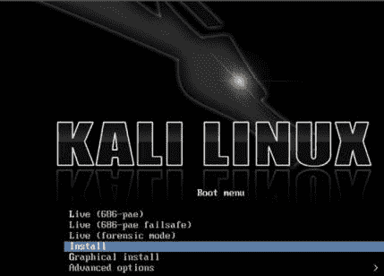
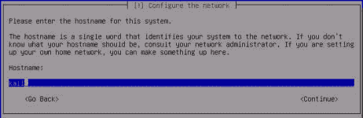

# 第一章 起步（二）

> 作者：Justin Hutchens
> 
> 译者：[飞龙](https://github.com/)
> 
> 协议：[CC BY-NC-SA 4.0](http://creativecommons.org/licenses/by-nc-sa/4.0/)

## 1.6 增加 Windows 的攻击面

为了进一步提高Windows操作系统上可用的攻击面，添加易受攻击的软件以及启用或禁用某些集成组件很重要。

### 准备

在修改Windows中的配置来增加攻击面之前，你需要在其中一个虚拟机上安装操作系统。 如果尚未执行此操作，请参阅本章中的“安装Windows Server”秘籍。

### 操作步骤

启用远程服务，特别是未打补丁的远程服务，通常是将一些漏洞引入系统的有效方法。 首先，你需要在Windows系统上启用简单网络管理协议（SNMP）。 为此，请打开左下角的开始菜单，然后单击`Control Panel`（控制面板）。 双击`Add or Remove Programs`（添加或删除程序）图标，然后单击屏幕左侧的`Add/Remove Windows Components`（添加/删除Windows组件）链接，你会看到以下界面：


从这里，你可以看到可以在操作系统上启用或禁用的组件列表。 向下滚动到`Management and Monitoring Tools`（管理和监控工具），并双击它来打开其中包含的选项，如以下屏幕截图所示：


打开后，请确保选中 SNMP 和 WMI SNMP Provider 的复选框。 这将允许在系统上执行远程SNMP查询。 单击确定后，会开始安装这些服务。 这些服务的安装需要 Windows XP 映像光盘，VMware 可能在虚拟机映像后删除。 如果是这种情况，你会收到一个弹出请求让你插入光盘，如以下屏幕截图所示：


为此，请访问虚拟机设置。 确保已启用虚拟光驱，然后浏览主机文件系统中的ISO文件来添加光盘：


一旦检测到光盘，SNMP服务的安装会自动完成。 `Windows Components Wizard`（Windows组件向导）应在安装完成时通知你。 除了添加服务之外，还应删除操作系统中包含的一些默认服务。 为此，请再次打开`Control Panel`（控制面板），然后双击`Security Center`（安全中心）图标。 滚动到页面底部，单击`Windows Firewall`（Windows防火墙）的链接，并确保此功能已关闭，如以下屏幕截图所示：


关闭Windows防火墙功能后，单击`OK`返回上一级菜单。 再次滚动到底部，然后单击`Automatic Updates`（自动更新）链接，并确保它也关闭。

### 工作原理

在操作系统上启用功能服务和禁用安全服务大大增加了泄密的风险。 通过增加操作系统上存在的漏洞数量，我们还增加了可用于学习攻击模式和利用的机会的数量。 这个特定的秘籍只注重 Windows 中集成组件的操作，来增加攻击面。 但是，安装各种具有已知漏洞的第三方软件包也很有用。 可以在以下 URL 中找到易受攻击的软件包：

*   [http://www.exploit-db.com/](http://www.exploit-db.com/)
*   [http://www.oldversion.com/](http://www.oldversion.com/)

## 1.7 安装 Kali Linux

Kali Linux 是一个完整的渗透测试工具库，也可用作许多扫描脚本的开发环境，这将在本书中讨论。

### 准备

在你的虚拟安全测试环境中安装 Kali Linux 之前，你需要从受信任的来源获取 ISO 文件（映像文件）。 Kali Linux ISO 可以从`http://www.kali.org/downloads/`下载。

### 操作步骤

从 Kali Linux 映像文件启动后，你会看到初始启动菜单。 在这里，向下滚动到第四个选项，`Install`，然后按`Enter`键开始安装过程：



一旦开始，系统会引导你通过一系列问题完成安装过程。 最初，系统会要求你提供你的位置（国家）和语言。 然后，你会获得一个选项，可以手动选择键盘配置或使用指导检测过程。 下一步回请求你为系统提供主机名。 如果系统需要加入域，请确保主机名是唯一的，如以下屏幕截图所示：



接下来，你需要设置 root 帐户的密码。 建议设置一个相当复杂的密码，不会轻易攻破。 看看下面的截图：


接下来，系统会要求你提供所在时区。系统将使用IP地理位置作为你的位置的最佳猜测。 如果这不正确，请手动选择正确的时区：


为了设置磁盘分区，使用默认方法和分区方案应足以用于实验目的：


建议你使用镜像来确保 Kali Linux 中的软件保持最新：


接下来，系统会要求你提供 HTTP 代理地址。 本书中所述的任何练习都不需要外部 HTTP 代理，因此可以将其留空：


最后，选择`Yes`来安装 GRUB 引导加载程序，然后按`Enter`键完成安装过程。 当系统加载时，你可以使用安装期间提供的 root 帐户和密码登录：


### 工作原理

Kali Linux 是一个 Debian Linux 发行版，其中包含大量预安装的第三方渗透工具。 虽然所有这些工具都可以独立获取和安装，Kali Linux 提供的组织和实现使其成为任何渗透测试者的有力工具。

## 1.8 配置和使用 SSH

同时处理多个虚拟机可能会变得乏味，耗时和令人沮丧。 为了减少从一个 VMware 屏幕跳到另一个 VMware 屏幕的需要，并增加虚拟系统之间的通信便利性，在每个虚拟系统上配置和启用SSH非常有帮助。 这个秘籍讨论了如何在每个 Linux 虚拟机上使用 SSH。

### 准备

为了在虚拟机上使用 SSH，必须先在主机系统上安装 SSH 客户端。 SSH 客户端集成到大多数 Linux 和 OS X 系统中，并且可以从终端接口访问。 如果你使用 Windows主机，则需要下载并安装 Windows 终端服务客户端。 一个免费和容易使用的是PuTTY。 PuTTY可以从`http://www.putty.org/`下载。

### 操作步骤

你首先需要在图形界面中直接从终端启用 SSH。 此命令需要在虚拟机客户端中直接运行。 除了 Windows XP 虚拟机，环境中的所有其他虚拟机都是 Linux 发行版，并且应该原生支持 SSH。 启用此功能的步骤在几乎所有 Linux 发行版中都是相同的，如下所示：


`/etc/init.d/ssh start`命令可用于启动服务。 如果你没有使用`root`登录，则需要将`sudo`预置到此命令。 如果接收到错误，则可能是设备上未安装 SSH 守护程序。 如果是这种情况，执行`apt-get install ssh`命令可用于安装 SSH 守护程序。 然后，`ifconfig`可用于获取系统的IP地址，这将用于建立SSH连接。 激活后，现在可以使用 SSH 从主机系统访问 VMware 客户系统。 为此，请最小化虚拟机并打开主机的 SSH 客户端。

如果你使用 Mac OSX 或 Linux 作为主机系统，则可以直接从终端调用客户端。 或者，如果你在 Windows 主机上运行虚拟机，则需要使用终端模拟器，如PuTTY。 在以下示例中，我们通过提供 Kali 虚拟机的 IP 地址建立 SSH 会话：

```
DEMOSYS:~ jhutchens$ ssh root@172.16.36.244 
The authenticity of host '172.16.36.244 (172.16.36.244)' can't be established. 
RSA key fingerprint is c7:13:ed:c4:71:4f:89:53:5b:ee:cf:1f:40:06:d9:11. 
Are you sure you want to continue connecting (yes/no)? yes 
Warning: Permanently added '172.16.36.244' (RSA) to the list of known hosts. 
root@172.16.36.244's password: 
Linux kali 3.7-trunk-686-pae #1 SMP Debian 3.7.2-0+kali5 i686

The programs included with the Kali GNU/Linux system are free software; the exact distribution terms for each program are described in the individual files in /usr/share/doc/*/copyright.

Kali GNU/Linux comes with ABSOLUTELY NO WARRANTY, to the extent permitted by applicable law. root@kali:~# 
```

> 下载示例代码
> 
> 你可以从`http://www.packtpub.com`下载你从帐户中购买的所有Packt图书的示例代码文件。 如果你在其他地方购买此书，可以访问`http：//www.packtpub。 com / support`并注册，以使文件能够直接发送给你。

SSH客户端的适当用法是`ssh [user] @ [IP address]`。 在提供的示例中，SSH 将使用`root`帐户访问 Kali 系统（由提供的 IP 地址标识）。 由于主机未包含在已知主机列表中，因此将首次提示你确认连接。 为此，请输入`yes`。 然后会提示你输入`root`帐户的密码。 输入后，你应该可以通过远程shell访问系统。 相同的过程可以在Windows中使用PuTTY完成。 它可以通过本秘籍的准备就绪部分提供的链接下载。 下载后，打开PuTTY并在“主机名”字段中输入虚拟机的IP地址，并确保 SSH 单选按钮选中，如以下屏幕截图所示：


一旦设置了连接配置，单击`Open`按钮启动会话。 系统会提示我们输入用户名和密码。 我们应该输入我们连接的系统的凭据。 一旦认证过程完成，我们会被远程终端授予系统的访问权限，如以下屏幕截图所示：


通过将公钥提供给远程主机上的`authorized_keys`文件，可以避免每次都进行身份验证。 执行此操作的过程如下：

```
root@kali:~# ls .ssh 
ls: cannot access .ssh: No such file or directory 
root@kali:~# mkdir .ssh 
root@kali:~# cd .ssh/ r
oot@kali:~/.ssh# nano authorized_keys
```

首先，确保`.ssh`隐藏目录已存在于根目录中。 为此，请以目录名称使用`ls`。 如果它不存在，请使用`mkdir`创建目录。 然后，使用`cd`命令将当前位置更改为该目录。 然后，使用Nano或VIM创建名为`authorized_keys`的文件。 如果你不熟悉如何使用这些文本编辑器，请参阅本章中的“使用文本编辑器（VIM和Nano）”秘籍。 在此文件中，你应该粘贴SSH客户端使用的公钥，如下所示：

```
DEMOSYS:~ jhutchens$ ssh root@172.16.36.244 
Linux kali 3.7-trunk-686-pae #1 SMP Debian 3.7.2-0+kali5 i686

The programs included with the Kali GNU/Linux system are free software; the exact distribution terms for each program are described in the individual files in /usr/share/doc/*/copyright.

Kali GNU/Linux comes with ABSOLUTELY NO WARRANTY, to the extent permitted by applicable law. 
Last login: Sat May 10 22:38:31 2014 from 172.16.36.1 
root@kali:~#
```

一旦操作完毕，你应该能够连接到SSH，而不必提供验证的密码。

### 工作原理

SSH在客户端和服务器之间建立加密的通信通道。 此通道可用于提供远程管理服务，并使用安全复制（SCP）安全地传输文件。

## 1.9 在 Kali 上安装 Nessus

Nessus是一个功能强大的漏洞扫描器，可以安装在Kali Linux平台上。该秘籍讨论了安装，启动和激活Nessus服务的过程。

### 准备

在尝试在 Kali Linux 中安装Nessus漏洞扫描程序之前，你需要获取一个激活代码。此激活代码是获取审计插件所必需的，Nessus用它来评估联网系统。如果你打算在家里或者在你的实验室中使用Nessus，你可以免费获得家庭版密钥。或者，如果你要使用Nessus审计生产系统，则需要获取专业版密钥。在任一情况下，你都可以在`http：// www. tenable.com/products/nessus/nessus-plugins/obtain-an-activation-code`获取此激活码。

### 操作步骤

一旦你获得了你的激活代码，你将需要在`http://www.tenable.com/products/nessus/ select-your-operating-system`下载Nessus安装包。以下屏幕截图显示了Nessus可以运行的各种平台及其相应的安装包的列表：


为已安装的操作系统的体系结构选择适当的安装包。 一旦你选择它，阅读并同意Tenable提供的订阅协议。 然后你的系统将下载安装包。 单击保存文件，然后浏览要保存到的位置：


在提供的示例中，我已将安装程序包保存到根目录。 下载后，你可以从命令行完成安装。 这可以通过 SSH 或通过图形桌面上的终端以下列方式完成：

```
root@kali:~# ls 
Desktop  Nessus-5.2.6-debian6_i386.deb 
root@kali:~# dpkg -i Nessus-5.2.6-debian6_i386.deb 
Selecting previously unselected package nessus. 
(Reading database ... 231224 files and directories currently installed.) 
Unpacking nessus 
(from Nessus-5.2.6-debian6_i386.deb) ... 
Setting up nessus (5.2.6) ... 
nessusd (Nessus) 5.2.6 [build N25116] for Linux 
Copyright (C) 1998 - 2014 Tenable Network Security, Inc

Processing the Nessus plugins... [##################################################]

All plugins loaded

  - You can start nessusd by typing /etc/init.d/nessusd start 
  - Then go to https://kali:8834/ to configure your scanner

root@kali:~# /etc/init.d/nessusd start 
$Starting Nessus : . 
```

使用`ls`命令验证安装包是否在当前目录中。 你应该会在响应中看到它。 然后可以使用Debian软件包管理器（`dpkg`）工具安装服务。 `-i`参数告诉软件包管理器安装指定的软件包。 安装完成后，可以使用命令`/etc/init.d/nessusd start`启动服务。 Nessus完全从Web界面运行，可以从其他机器轻松访问。 如果你想从Kali系统管理Nessus，你可以通过网络浏览器访问它：`https：//127.0.0.1:8834/`。 或者，你可以通过Web浏览器使用Kali Linux虚拟机的IP地址从远程系统（如主机操作系统）访问它。 在提供的示例中，从主机操作系统访问Nessus服务的响应URL是`https://172.16.36.244:8834`：


默认情况下，Nessus服务使用自签名SSL证书，因此你将收到不受信任的连接警告。 对于安全实验室使用目的，你可以忽略此警告并继续。 这可以通过展开`I Understand the Risks`选项来完成，如以下屏幕截图所示：


当你展开了此选项时，你可以单击`Add Exception`按钮。 这会防止每次尝试访问服务时都必须处理此警告。 将服务作为例外添加后，你将看到欢迎屏幕。 从这里，点击`Get Started`按钮。 这会将你带到以下屏幕：


必须设置的第一个配置是管理员的用户帐户和关联的密码。 这些凭据会用于登录和使用Nessus服务。 输入新的用户名和密码后，单击`Next`继续; 您会看到以下屏幕：


然后，你需要输入激活代码。 如果你没有激活码，请参阅本秘籍的准备就绪部分。 最后，输入激活码后，你会返回到登录页面，并要求输入你的用户名和密码。 在此处，你需要输入在安装过程中创建的相同凭据。 以下是之后每次访问URL时，Nessus 会加载的默认屏幕：


### 工作原理

正确安装后，可以从主机系统和安装了图形Web浏览器的所有虚拟机访问Nessus漏洞扫描程序。 这是因为Nessus服务托管在TCP端口8834上，并且主机和所有其他虚拟系统拥有位于相同私有IP空间中的网络接口。

## 1.10 在 Kali 上配置 Burp Suite

Burp Suite Proxy是实用而强大的 Web 应用程序审计工具之一。 但是，它不是一个可以轻松地单击来启动的工具。 我们必须修改Burp Suite 应用程序和相关 Web 浏览器中的配置，以确保每个配置与其他设备正确通信。

### 准备

在 Kali Linux 中首次启动 Burp Suite 不需要做任何事情。 免费版是一个集成工具，它已经安装了。 或者，如果你选择使用专业版本，可以在`https://pro.portswigger.net/buy/`购买许可证。 许可证相对便宜，对于额外的功能非常值得。 然而，免费版仍然非常有用，并且为用户免费提供大多数核心功能。

### 操作步骤

Burp Suite 是一个 GUI 工具，需要访问图形桌面才能运行。 因此，Burp Suite 不能通过 SSH 使用。 在 Kali Linux 中有两种方法启动 Burp Suite。 你可以在`Applications`菜单中浏览`Applications | Kali Linux | Top 10 Security Tools | burpsuite`。 或者，你可以通过将其传给 bash 终端中的 Java 解释器来执行它，如下所示：

```
root@kali:~# java -jar /usr/bin/burpsuite.jar 
```

加载 Burp Suite 后，请确保代理监听器处于活动状态，并在所需的端口上运行。 提供的示例使用 TCP 端口 8080。 我们可以通过选择`Proxy`选项卡，然后选择下面的`Options`选项卡来验证这些配置，如以下屏幕截图所示：


在这里，你会看到所有代理监听器的列表。 如果没有，请添加一个。 要与 Kali Linux 中的 IceWeasel Web 浏览器一起使用，请将监听器配置为侦听`127.0.0.1`地址上的特定端口。 此外，请确保激活`Running`复选框。 在Burp Suite 中配置监听器之后，还需要修改 IceWeasel 浏览器配置来通过代理转发流量。 为此，请通过单击屏幕顶部的`weasel globe`图标打开 IceWeasel。 打开后，展开`Edit`下拉菜单，然后单击`Preferences`以获取以下屏幕截图：


在 IceWeasel 首选项菜单中，单击顶部的高级`Advanced`选项按钮，然后选择`Network`选项卡。 然后，单击`Connection`标题下的`Settings`按钮。 这将打开`Connection Settings`配置菜单，如以下屏幕截图所示：


默认情况下，代理单选按钮设置为`Use system proxy settings`（使用系统代理设置）。 这需要更改为`Manual proxy configuration`（手动代理配置）。 手动代理配置应与 Burp Suite 代理监听器配置相同。 在所提供的示例中，HTTP 代理地址设置为`127.0.0.1`，端口值设置为 TCP 8080.要捕获其他流量（如 HTTPS），请单击`Use this proxy server for all protocols`（为所有协议使用此代理服务器）复选框。 要验证一切是否正常工作，请尝试使用 IceWeasel 浏览器浏览网站，如以下屏幕截图所示：


如果你的配置正确，您应该看到浏览器尝试连接，但没有任何内容将在浏览器中呈现。 这是因为从浏览器发送的请求被代理拦截。 代理拦截是 Burp Suite 中使用的默认配置。 要确认请求已成功捕获，请返回 Burp Suite 代理接口，如图所示：


在这里，你应该看到捕获的请求。 要继续将浏览器用于其他用途，你可以将代理配置更改为被动监听，只需点击`Intercept is on`（拦截开启）按钮就可以将其禁用，或者你可以将浏览器中的代理设置更改回`Use system proxy settings`（使用系统代理设置选项），使用 Burp 时使用手动代理设置。

### 工作原理

在 Burp Suite 中使用的初始配置在 TCP 8080 上创建了一个监听端口。该端口由 Burp Suite 用于拦截所有 Web 流量，并接收由响应返回的入站流量。 通过将 IceWeasel Web 浏览器的代理配置指向此端口，我们让浏览器中生成的所有流量都通过 Burp Suite 代理进行路由。 由于 Burp 提供的功能，我们现在可以随意修改途中的流量。

## 1.11 使用文本编辑器（VIM 和 Nano）

文本编辑器会经常用于创建或修改文件系统中的现有文件。 你应该在任何时候使用文本编辑器在 Kali 中创建自定义脚本。 你还应在任何时候使用文本编辑器修改配置文件或现有渗透测试工具。

### 准备

在 Kali Linux 中使用文本编辑器工具之前，不需要执行其他步骤。 VIM和Nano都是集成工具，已经安装在操作系统中。

### 操作步骤

为了使用 Kali 中的 VIM 文本编辑器创建文件，请使用`vim`命令，并带有要创建或修改的文件名称：

```
root@kali:~# vim vim_demo.txt 
```

在提供的示例中，VIM 用于创建名为`vim_demo.txt`的文件。 由于当前没有文件以该名称存在于活动目录中，VIM 自动创建一个新文件并打开一个空文本编辑器。 为了开始在编辑器中输入文本，请按`I`或`Insert`按钮。 然后，开始输入所需的文本，如下所示：

```
Write to file demonstration with VIM 
~                                                                       
~                                                                        
~                                                                        
~
```

在提供的示例中，只有一行添加到文本文件。 但是，在大多数情况下，在创建新文件时，很可能使用多行。 完成后，按`Esc`键退出插入模式并在 VIM 中进入命令模式。 然后，键入`:wq`并按`Enter`键保存。 然后，你可以使用以下 bash 命令验证文件是否存在并验证文件的内容：

```
root@kali:~# ls 
Desktop  vim_demo.txt 
root@kali:~# cat vim_demo.txt 
Write to file demonstration with VIM 
```

`ls`命令可以用来查看当前目录的内容。 在这里，你可以看到`vim_demo.txt`文件已创建。 `cat`命令可用于读取和显示文件的内容。 也可以使用的替代文本编辑器是 Nano。 Nano 的基本用法与 VIM 非常相似。 为了开始，请使用`nano`命令，后面带有要创建或修改的文件名称：

```
root@kali:~# nano nano_demo.txt
```

在提供的示例中，`nano`用于打开名为`nano_demo.txt`的文件。 由于当前不存在具有该名称的文件，因此将创建一个新文件。 与 VIM 不同，没有单独的命令和写入模式。 相反，写入文件可以自动完成，并且通过按`Ctrl`键和特定的字母键来执行命令。 这些命令的列表可以始终在文本编辑器界面的底部看到：

```
GNU nano 2.2.6             File: nano_demo.txt                                

Write to file demonstration with Nano
```

提供的示例向`nano_demo.txt`文件写入了一行。 要关闭编辑器，可以使用`Ctrl + X`，然后会提示您使用`y`保存文件或使用`n`不保存文件。 系统会要求你确认要写入的文件名。 默认情况下，会使用 Nano 执行时提供的名称填充。 但是，可以更改此值，并将文件的内容另存为不同的文件名，如下所示：

```
root@kali:~# ls 
Desktop  nano_demo.txt  vim_demo.txt 
root@kali:~# cat nano_demo.txt 
Write to file demonstration with Nano 
```

一旦完成，可以再次使用`ls`和`cat`命令来验证文件是否写入目录，并分别验证文件的内容。 这个秘籍的目的是讨论每个这些编辑器的基本使用来编写和操纵文件。 然而要注意，这些都是非常强大的文本编辑器，有大量其他用于文件编辑的功能。 有关其用法的更多信息，请使用`man`命令访问手册页，后面带有特定文本编辑器的名称。

### 工作原理

文本编辑器只不过是命令行驱动的字符处理工具。 这些工具中的每个及其所有相关功能可以在不使用任何图形界面而执行。 由于没有任何图形组件，这些工具需要非常少的开销，并且极快。 因此，他们能够非常有效并快速修改文件，或通过远程终端接口（如 SSH 或 Telnet）处理文件。