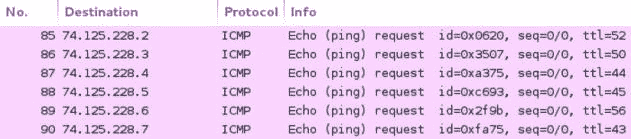

# 第二章 探索扫描（二）

> 作者：Justin Hutchens
> 
> 译者：[飞龙](https://github.com/)
> 
> 协议：[CC BY-NC-SA 4.0](http://creativecommons.org/licenses/by-nc-sa/4.0/)

## 2.7 使用 Scapy 发现第三层

Scapy 是一种工具，允许用户制作并向网络中注入自定义数据包。 此工具可以用于构建 ICMP 协议请求，并将它们注入网络来分析响应。 这个特定的秘籍演示了如何使用 Scapy 在远程主机上执行第3层发现。

### 准备

使用 Scapy 执行第三层发现不需要实验环境，因为 Internet 上的许多系统都将回复 ICMP 回显请求。但是，强烈建议你只在您自己的实验环境中执行任何类型的网络扫描，除非你完全熟悉您受到任何管理机构施加的法律法规。如果你希望在实验环境中执行此技术，你需要至少有一个响应 ICMP 请求的系统。在提供的示例中，使用 Linux 和 Windows 系统的组合。有关在本地实验环境中设置系统的更多信息，请参阅第一章中的“安装 Metasploitable2”和“安装 Windows Server”秘籍。此外，本节还需要使用文本编辑器（如 VIM 或 Nano）将脚本写入文件系统。有关编写脚本的更多信息，请参阅第一章中的“使用文本编辑器（VIM 和 Nano）”秘籍。

### 操作步骤

为了使用 Scapy 发送 ICMP 回显请求，我们需要开始堆叠层级来发送请求。 堆叠数据包时的一个好的经验法则是,通过 OSI 按照的各层进行处理。 你可以通过使用斜杠分隔每个层级来堆叠多个层级。 为了生成 ICMP 回显请求，IP 层需要与 ICMP 请求堆叠。 为了开始，请使用`scapy`命令打开 Scapy 交互式控制台，然后将`IP`对象赋给变量：

```
root@KaliLinux:~# scapy Welcome to Scapy (2.2.0) 
>>> ip = IP() 
>>> ip.display() 
###[ IP ]###
  version= 4
  ihl= None
  tos= 0x0
  len= None
  id= 1
  flags=
  frag= 0
  ttl= 64
  proto= ip
  chksum= None
  src= 127.0.0.1
  dst= 127.0.0.1
  \options\ 
```

将新值赋给目标地址属性后，可以通过再次调用`display()`函数来验证更改。 请注意，当目标 IP 地址值更改为任何其他值时，源地址也会从回送地址自动更新为与默认接口关联的 IP 地址。 现在 `IP` 对象的属性已经适当修改了，我们将需要在我们的封包栈中创建第二层。 要添加到栈的下一个层是 ICMP 层，我们将其赋给单独的变量：

```
>>> ping = ICMP() 
>>> ping.display() 
###[ ICMP ]###
  type= echo-request  
  code= 0  
  chksum= None  
  id= 0x0  
  seq= 0x0 
```

在所提供的示例中，ICMP 对象使用`ping`变量名称初始化。 然后可以调用`display()`函数来显示 ICMP 属性的默认配置。 为了执行 ICMP 回显请求，默认配置就足够了。 现在两个层都已正确配置，它们可以堆叠来准备发送。 在 Scapy 中，可以通过使用斜杠分隔每个层级来堆叠层级。 看看下面的命令集：

```
>>> ping_request = (ip/ping) 
>>> ping_request.display() 
###[ IP ]###
  version= 4
  ihl= None
  tos= 0x0
  len= None
  id= 1
  flags=
  frag= 0
  ttl= 64
  proto= icmp
  chksum= None
  src= 172.16.36.180
  dst= 172.16.36.135
  \options\
###[ ICMP ]###
     type= echo-request
     code= 0
     chksum= None
     id= 0x0
     seq= 0x0
```

一旦堆叠层级被赋给一个变量，`display()`函数可以显示整个栈。 以这种方式堆叠层的过程通常被称为数据报封装。 现在已经堆叠了层级，并已经准备好发送请求。 这可以使用 Scapy 中的`sr1()`函数来完成：

```
>>> ping_reply = sr1(ping_request) 
..Begin emission:
.........
Finished to send 1 packets. 
...* 
Received 15 packets, got 1 answers, remaining 0 packets 
>>> ping_reply.display() 
###[ IP ]###
  version= 4L
  ihl= 5L
  tos= 0x0
  len= 28
  id= 62577
  flags=
  frag= 0L
  ttl= 64
  proto= icmp
  chksum= 0xe513
  src= 172.16.36.135
  dst= 172.16.36.180
  \options\ 
###[ ICMP ]###
     type= echo-reply
     code= 0
     chksum= 0xffff
     id= 0x0
     seq= 0x0 
###[ Padding ]###
        load= '\x00\x00\x00\x00\x00\x00\x00\x00\x00\x00\x00\x00\x00\x00\ x00\x00\x00\x00' 
```

在提供的示例中，`sr1()`函数赋给了`ping_reply`变量。 这将执行该函数，然后将结果传递给此变量。 在接收到响应后，在`ping_reply`变量上调用`display()`函数来查看响应的内容。请注意，此数据包是从我们发送初始请求的主机发送的，目标地址是 Kali 系统的 IP 地址。 另外，注意响应的 ICMP 类型是回应应答。 基于此示例，使用 Scapy 发送和接收 ICMP 的过程看起来很有用，但如果你尝试对非响应的目标地址使用相同的步骤，你会很快注意到问题：

```
>>> ip.dst = "172.16.36.136" 
>>> ping_request = (ip/ping) 
>>> ping_reply = sr1(ping_request) 
.Begin emission: 
......................................................................... ......................................................................... ........... 
Finished to send 1 packets 
.................................. .................................................................... 
                        *** {TRUNCATED} *** 
```

示例输出被截断，但此输出应该无限继续，直到你使用`Ctrl + C`强制关闭。不向函数提供超时值，`sr1()`函数会继续监听，直到接收到响应。 如果主机不是活动的，或者如果 IP 地址没有与任何主机关联，则不会发送响应，并且该功能也不会退出。 为了在脚本中有效使用此函数，应定义超时值：

```
>>> ping_reply = sr1(ping_request, timeout=1) 
.Begin emission: 
....................................................................... ....................................................................... 
Finished to send 1 packets. 
.................................... 
Received 3982 packets, got 0 answers, remaining 1 packets
```

通过提供超时值作为传递给`sr1()`函数的第二个参数，如果在指定的秒数内没有收到响应，进程将退出。 在所提供的示例中，`sr1()`函数用于将 ICMP 请求发送到无响应地址，因为未收到响应，会在 1 秒后退出。 到目前为止提供的示例中，我们将函数赋值给变量，来创建持久化和可操作的对象。 但是，这些函数不必复制给变量，也可以通过直接调用函数生成。

```
>>> answer = sr1(IP(dst="172.16.36.135")/ICMP(),timeout=1) 
.Begin emission:
...*
Finished to send 1 packets.
Received 5 packets, got 1 answers, remaining 0 packets 
>>> response.display() 
###[ IP ]###
  version= 4L
  ihl= 5L
  tos= 0x0
  len= 28
  id= 62578
  flags=
  frag= 0L
  ttl= 64
  proto= icmp
  chksum= 0xe512
  src= 172.16.36.135
  dst= 172.16.36.180
  \options\ 
###[ ICMP ]###
     type= echo-reply
     code= 0
     chksum= 0xffff
     id= 0x0
     seq= 0x0 
###[ Padding ]###
        load= '\x00\x00\x00\x00\x00\x00\x00\x00\x00\x00\x00\x00\x00\x00\ x00\x00\x00\x00' 
```

在这里提供的示例中，之前使用四个单独的命令完成的所有工作，实际上可以通过直接调用函数的单个命令来完成。 请注意，如果在超时值指定的时间范围内， ICMP 请求没有收到 IP 地址的回复，调用对象会产生异常。 由于未收到响应，因此此示例中赋值为响应的应答变量不会初始化：

```
>>> answer = sr1(IP(dst="83.166.169.231")/ICMP(),timeout=1) 
Begin emission: 
..........................................
Finished to send 1 packets. 
......................................................................... ..........................
Received 1180 packets, got 0 answers, remaining 1 packets 
>>> answer.display() 
Traceback (most recent call last):  File "<console>", line 1, in <module> AttributeError: 'NoneType' object has no attribute 'display'
```

有关这些不同响应的知识，可以用于生成在多个 IP 地址上按顺序执行 ICMP 请求的脚本。 脚本会循环遍历目标 IP 地址中最后一个八位字节的所有可能值，并为每个值发送一个 ICMP 请求。 当从每个`sr1()`函数返回时，将评估响应来确定是否接收到应答的响应：

```
#!/usr/bin/python

import logging 
logging.getLogger("scapy.runtime").setLevel(logging.ERROR) 
from scapy.all import *

if len(sys.argv) != 2:   
    print "Usage - ./pinger.py [/24 network address]"   
    print "Example - ./pinger.py 172.16.36.0"   
    print "Example will perform an ICMP scan of the 172.16.36.0/24 range"   
    sys.exit()

address = str(sys.argv[1]) 
prefix = address.split('.')[0] + '.' + address.split('.')[1] + '.' + address.split('.')[2] + '.'

for addr in range(1,254):   
    answer=sr1(ARP(pdst=prefix+str(addr)),timeout=1,verbose=0)   
    if answer == None:      
        pass   
    else:      
        print prefix+str(addr)
```

脚本的第一行标识了 Python 解释器所在的位置，以便脚本可以在不传递到解释器的情况下执行。 然后脚本导入所有 Scapy 函数，并定义 Scapy 日志记录级别，以消除脚本中不必要的输出。 还导入了子过程库，以便于从系统调用中提取信息。 第二个代码块是条件测试，用于评估是否向脚本提供了所需的参数。 如果在执行时未提供所需的参数，则脚本将输出使用情况的说明。 该说明包括工具的用法，示例和所执行任务的解释。

在这个代码块之后，有一个单独的代码行将所提供的参数赋值给`interface`变量。下一个代码块使用`check_output()`子进程函数执行`ifconfig`系统调用，该调用也使用`grep`和`cut`从作为参数提供的本地接口提取 IP 地址。然后将此输出赋给`ip`变量。然后使用`split`函数从 IP 地址字符串中提取`/ 24`网络前缀。例如，如果`ip`变量包含`192.168.11.4`字符串，则值为`192.168.11`。它将赋给`prefix`变量。

最后一个代码块是一个用于执行实际扫描的`for`循环。 `for`循环遍历介于 0 和 254 之间的所有值，并且对于每次迭代，该值随后附加到网络前缀后面。在早先提供的示例的中，将针对`192.168.11.0`和`192.168.11.254`之间的每个 IP 地址发送 ICMP 回显请求。然后对于每个回复的活动主机，将相应的 IP 地址打印到屏幕上，以表明主机在 LAN 上活动。一旦脚本被写入本地目录，你可以在终端中使用句号和斜杠，然后是可执行脚本的名称来执行它。看看以下用于执行脚本的命令：

```
root@KaliLinux:~# ./pinger.py 
Usage - ./pinger.py [/24 network address] 
Example - ./pinger.py 172.16.36.0 
Example will perform an ICMP scan of the 172.16.36.0/24 range 
root@KaliLinux:~# ./pinger.py 
172.16.36.0 
172.16.36.2 
172.16.36.1 
172.16.36.132 
172.16.36.135 
```

如果在没有提供任何参数的情况下执行脚本，则会将使用方法输出到屏幕。 使用方法输出表明，此脚本需要用于定义要扫描的`/ 24`网络的单个参数。 提供的示例使用`172.16.36.0`网络地址来执行脚本。 该脚本然后输出在`/ 24`网络范围上的活动 IP 地址的列表。 此输出也可以使用尖括号重定向到输出文本文件，后跟输出文件名。 一个例子如下：

```
root@KaliLinux:~# ./pinger.py 172.16.36.0 > output.txt 
root@KaliLinux:~# ls output.txt 
output.txt 
root@KaliLinux:~# cat output.txt 
172.16.36.1 
172.16.36.2 
172.16.36.132 
172.16.36.135
```

然后可以使用`ls`命令来验证输出文件是否已写入文件系统，或者可以使用`cat`命令查看其内容。 也可以修改此脚本，来接受 IP 地址列表作为输入。 为此，必须更改`for`循环来循环遍历从指定的文本文件读取的行。 一个例子如下：

```
#!/usr/bin/python

import logging 
logging.getLogger("scapy.runtime").setLevel(logging.ERROR) 
from scapy.all import *

if len(sys.argv) != 2:   
    print "Usage - ./pinger.py [filename]"   
    print "Example - ./pinger.py iplist.txt"   
    print "Example will perform an ICMP ping scan of the IP addresses listed in iplist.txt"   
    sys.exit()

filename = str(sys.argv[1]) 
file = open(filename,'r')

for addr in file:   
    ans=sr1(IP(dst=addr.strip())/ICMP(),timeout=1,verbose=0)   
    if ans == None:      
        pass   
    else:      
        print addr.strip()
```

与之前的脚本唯一的主要区别是，它接受一个输入文件名作为参数，然后循环遍历此文件中列出的每个 IP 地址进行扫描。 与其他脚本类似，生成的输出包括响应 ICMP 回显请求的系统的相关 IP 地址的简单列表，其中包含 ICMP 回显响应：

```
root@KaliLinux:~# ./pinger.py 
Usage - ./pinger.py [filename] 
Example - ./pinger.py iplist.txt 
Example will perform an 
ICMP ping scan of the IP addresses listed in iplist.txt 
root@KaliLinux:~# ./pinger.py iplist.txt 
172.16.36.1 
172.16.36.2 
172.16.36.132 
172.16.36.135 
```

此脚本的输出可以以相同的方式重定向到输出文件。 使用作为参数提供的输入文件来执行脚本，然后使用尖括号重定向输出，后跟输出文本文件的名称。 一个例子如下：

```
root@KaliLinux:~# ./pinger.py iplist.txt > output.txt 
root@KaliLinux:~# ls output.txt 
output.txt 
root@KaliLinux:~# cat output.txt 
172.16.36.1 
172.16.36.2 
172.16.36.132 
172.16.36.135 
```

### 工作原理

此处使用 Scapy 通过构造包括 IP 层和附加的 ICMP 请求的请求来执行 ICMP 第三层发现。 IP 层能够将封包路由到本地网络之外，并且 ICMP 请求用于从远程系统请求响应。 在 Python 脚本中使用此技术，可以按顺序执行此任务，来扫描多个系统或整个网络范围。

## 2.8 使用 Nmap 发现第三层

Nmap 是 Kali Linux 中最强大和最通用的扫描工具之一。 因此，毫不奇怪，Nmap 也支持 ICMP 发现扫描。 该秘籍演示了如何使用 Nmap 在远程主机上执行第三层发现。

### 准备

使用 Nmap 执行第三层发现不需要实验环境，因为 Internet 上的许多系统都将回复 ICMP 回显请求。但是，强烈建议你只在您自己的实验环境中执行任何类型的网络扫描，除非你完全熟悉您受到任何管理机构施加的法律法规。如果你希望在实验环境中执行此技术，你需要至少有一个响应 ICMP 请求的系统。在提供的示例中，使用 Linux 和 Windows 系统的组合。有关在本地实验环境中设置系统的更多信息，请参阅第一章中的“安装 Metasploitable2”和“安装 Windows Server”秘籍。此外，本节还需要使用文本编辑器（如 VIM 或 Nano）将脚本写入文件系统。有关编写脚本的更多信息，请参阅第一章中的“使用文本编辑器（VIM 和 Nano）”秘籍。

### 操作步骤

Nmap是一种自适应工具，它可以按需自动调整，并执行第2层，第3层或第4层发现。 如果`-sn`选项在 Nmap 中用于扫描本地网段上不存在的 IP 地址，则 ICMP 回显请求将用于确定主机是否处于活动状态和是否响应。 为了对单个目标执行 ICMP 扫描，请使用带有`-sn`选项的Nmap，并传递要扫描的 IP 地址作为参数：

```
root@KaliLinux:~# nmap -sn 74.125.228.1
Starting Nmap 6.25 ( http://nmap.org ) at 2013-12-16 23:05 EST 
Nmap scan report for iad23s05-in-f1.1e100.net (74.125.228.1) 
Host is up (0.00013s latency). 
Nmap done: 1 IP address (1 host up) scanned in 0.02 seconds 
```

此命令的输出表明了设备是否已启动，还会提供有关所执行扫描的详细信息。 此外请注意，系统名称也已确定。 Nmap 还执行 DNS 解析来在扫描输出中提供此信息。 它还可以用于使用破折号符号扫描 IP 地址连续范围。 Nmap 默认情况下是多线程的，并且并行运行多个进程。 因此，Nmap 在返回扫描结果时非常快。 看看下面的命令：

```
root@KaliLinux:~# nmap -sn 74.125.228.1-255
Starting Nmap 6.25 ( http://nmap.org ) at 2013-12-16 23:14 EST 
Nmap scan report for iad23s05-in-f1.1e100.net (74.125.228.1) 
Host is up (0.00012s latency). 
Nmap scan report for iad23s05-in-f2.1e100.net (74.125.228.2) 
Host is up (0.0064s latency). 
Nmap scan report for iad23s05-in-f3.1e100.net (74.125.228.3) 
Host is up (0.0070s latency). 
Nmap scan report for iad23s05-in-f4.1e100.net (74.125.228.4) 
Host is up (0.00015s latency). 
Nmap scan report for iad23s05-in-f5.1e100.net (74.125.228.5) 
Host is up (0.00013s latency). 
Nmap scan report for iad23s05-in-f6.1e100.net (74.125.228.6) 
Host is up (0.00012s latency). 
Nmap scan report for iad23s05-in-f7.1e100.net (74.125.228.7) 
Host is up (0.00012s latency). 
Nmap scan report for iad23s05-in-f8.1e100.net (74.125.228.8) 
Host is up (0.00012s latency). 
                    *** {TRUNCATED} ***
```

在提供的示例中，Nmap 用于扫描整个`/ 24`网络范围。 为了方便查看，此命令的输出被截断。 通过使用 Wireshark 分析通过接口的流量，你可能会注意到这些地址没有按顺序扫描。 这可以在以下屏幕截图中看到。 这是 Nmap 的多线程特性的进一步证据，并展示了当其他进程完成时，如何从队列中的地址启动进程：



或者，Nmap 也可用于扫描输入文本文件中的 IP 地址。 这可以使用`-iL`选项，后跟文件或文件路径的名称来完成：

```
root@KaliLinux:~# cat iplist.txt 
74.125.228.13 74.125.228.28 
74.125.228.47 74.125.228.144 
74.125.228.162 74.125.228.211 
root@KaliLinux:~# nmap -iL iplist.txt -sn
Starting Nmap 6.25 ( http://nmap.org ) at 2013-12-16 23:14 EST 
Nmap scan report for iad23s05-in-f13.1e100.net (74.125.228.13) 
Host is up (0.00010s latency). 
Nmap scan report for iad23s05-in-f28.1e100.net (74.125.228.28) 
Host is up (0.0069s latency). 
Nmap scan report for iad23s06-in-f15.1e100.net (74.125.228.47) 
Host is up (0.0068s latency). 
Nmap scan report for iad23s17-in-f16.1e100.net (74.125.228.144) 
Host is up (0.00010s latency). 
Nmap scan report for iad23s18-in-f2.1e100.net (74.125.228.162) 
Host is up (0.0077s latency). 
Nmap scan report for 74.125.228.211 
Host is up (0.00022s latency). 
Nmap done: 6 IP addresses (6 hosts up) scanned in 0.04 seconds
```

在提供的示例中，执行目录中存在六个 IP 地址的列表。 然后将此列表输入到 Nmap 中，并扫描每个列出的地址来尝试识别活动主机。

### 工作原理

Nmap 通过对提供的范围或文本文件中的每个 IP 地址发出 ICMP 回显请求，来执行第3层扫描。 由于 Nmap 是一个多线程工具，所以它会并行发送多个请求，结果会很快返回给用户。 由于 Nmap 的发现功能是自适应的，它只会使用 ICMP 发现，如果 ARP 发现无法有效定位本地子网上的主机。 或者，如果 ARP 发现或 ICMP 发现都不能有效识别给定 IP 地址上的活动主机时，那么将采第四层发现技术。

## 2.9 使用 fping 探索第三层

`fping`工具费长类似于著名的`ping`工具。 但是，它也内建了在`ping`中不存在的许多附加功能。 这些附加功能让`fping`能够用作功能扫描工具，无需额外修改。 该秘籍演示了如何使用`fping`在远程主机上执行第3层发现。

### 准备

使用`fping`执行第三层发现不需要实验环境，因为 Internet 上的许多系统都将回复 ICMP 回显请求。但是，强烈建议你只在您自己的实验环境中执行任何类型的网络扫描，除非你完全熟悉您受到任何管理机构施加的法律法规。如果你希望在实验环境中执行此技术，你需要至少有一个响应 ICMP 请求的系统。在提供的示例中，使用 Linux 和 Windows 系统的组合。有关在本地实验环境中设置系统的更多信息，请参阅第一章中的“安装 Metasploitable2”和“安装 Windows Server”秘籍。

### 操作步骤

`fping`非常类似于添加了一些额外功能的`ping`工具。 它可以以`ping`的相同方式，向单个目标发送 ICMP 回显请求，以确定它是否活动。 这通过将 IP 地址作为参数传递给`fping`实用程序来完成：

```
root@KaliLinux:~# fping 172.16.36.135 
172.16.36.135 is alive 
```

与标准`ping`工具不同，`fping`会在收到单个应答后停止发送 ICMP 回显请求。 在接收到回复时，它将显示对应该地址的主机是活动的。 或者，如果未从地址接收到响应，则在确定主机不可达之前，`fping`通常尝试联系系统四次：

```
root@KaliLinux:~# fping 172.16.36.136 
ICMP Host Unreachable from 172.16.36.180 for ICMP Echo sent to 172.16.36.136 
ICMP Host Unreachable from 172.16.36.180 for ICMP Echo sent to 172.16.36.136 
ICMP Host Unreachable from 172.16.36.180 for ICMP Echo sent to 172.16.36.136 
ICMP Host Unreachable from 172.16.36.180 for ICMP Echo sent to 
172.16.36.136 172.16.36.136 is unreachable
```

可以使用`-c count`选项修改此默认连接尝试次数，并向其提供一个定义尝试次数的整数值：

```
root@KaliLinux:~# fping 172.16.36.135 -c 1 
172.16.36.135 : [0], 84 bytes, 0.67 ms (0.67 avg, 0% loss)

172.16.36.135 : xmt/rcv/%loss = 1/1/0%, min/avg/max = 0.67/0.67/0.67 
root@KaliLinux:~# fping 172.16.36.136 -c 1

172.16.36.136 : xmt/rcv/%loss = 1/0/100%
```

当以这种方式执行时，输出更加隐蔽一些，但可以通过仔细分析来理解。 任何主机的输出包括 IP 地址，尝试次数（`xmt`），接收的回复数（`rcv`）和丢失百分比（`%loss`）。 在提供的示例中，`fping`发现第一个地址处于联机状态。 这可以由接收的字节数和应答的等待时间都被返回的事实来证明。 你还可以通过检查百分比损失，来轻松确定是否存在与提供的 IP 地址关联的活动主机。 如果百分比损失为 100，则未收到回复。

与`ping`（最常用作故障排除工具）不同，`fping`内建了集成功能，可扫描多个主机。 可以使用`fping`扫描主机序列，使用`-g`选项动态生成 IP 地址列表。 要指定扫描范围，请使用该参数传递所需序列范围中的第一个和最后一个 IP 地址：

```
root@KaliLinux:~# fping -g 172.16.36.1 172.16.36.4 
172.16.36.1 is alive 
172.16.36.2 is alive 
ICMP Host Unreachable from 172.16.36.180 for ICMP Echo sent to 172.16.36.3
ICMP Host Unreachable from 172.16.36.180 for ICMP Echo sent to 172.16.36.3 
ICMP Host Unreachable from 172.16.36.180 for ICMP Echo sent to 172.16.36.3 
ICMP Host Unreachable from 172.16.36.180 for ICMP Echo sent to 172.16.36.3 
ICMP Host Unreachable from 172.16.36.180 for ICMP Echo sent to 172.16.36.4 
ICMP Host Unreachable from 172.16.36.180 for ICMP Echo sent to 172.16.36.4 
ICMP Host Unreachable from 172.16.36.180 for ICMP Echo sent to 172.16.36.4 
ICMP Host Unreachable from 172.16.36.180 for ICMP Echo sent to 172.16.36.4 172.16.36.3 is unreachable 
172.16.36.4 is unreachable
```

生成列表选项也可用于基于 CIDR 范围符号生成列表。 以相同的方式，`fping`将循环遍历这个动态生成的列表并扫描每个地址：

```
root@KaliLinux:~# fping -g 172.16.36.0/24 
172.16.36.1 is alive 
172.16.36.2 is alive 
ICMP Host Unreachable from 172.16.36.180 for ICMP Echo sent to 172.16.36.3 
ICMP Host Unreachable from 172.16.36.180 for ICMP Echo sent to 172.16.36.4 
ICMP Host Unreachable from 172.16.36.180 for ICMP Echo sent to 172.16.36.5 
ICMP Host Unreachable from 172.16.36.180 for ICMP Echo sent to 172.16.36.6 
ICMP Host Unreachable from 172.16.36.180 for ICMP Echo sent to 172.16.36.7 
ICMP Host Unreachable from 172.16.36.180 for ICMP Echo sent to 172.16.36.8 
ICMP Host Unreachable from 172.16.36.180 for ICMP Echo sent to 172.16.36.9 
                    *** {TRUNCATED} *** 
```

最后，`fping`还可以用于扫描由输入文本文件的内容指定的一系列地址。 要使用输入文件，请使用`-f`文件选项，然后提供输入文件的文件名或路径：

```
root@KaliLinux:~# fping -f iplist.txt 172.16.36.2 is alive 172.16.36.1 is alive 172.16.36.132 is alive 172.16.36.135 is alive 172.16.36.180 is alive 
ICMP Host Unreachable from 172.16.36.180 for ICMP Echo sent to 172.16.36.203 
ICMP Host Unreachable from 172.16.36.180 for ICMP Echo sent to 172.16.36.203 
ICMP Host Unreachable from 172.16.36.180 for ICMP Echo sent to 172.16.36.203 
ICMP Host Unreachable from 172.16.36.180 for ICMP Echo sent to 172.16.36.203 
ICMP Host Unreachable from 172.16.36.180 for ICMP Echo sent to 172.16.36.205 
ICMP Host Unreachable from 172.16.36.180 for ICMP Echo sent to 172.16.36.205 
ICMP Host Unreachable from 172.16.36.180 for ICMP Echo sent to 172.16.36.205 
ICMP Host Unreachable from 172.16.36.180 for ICMP Echo sent to 172.16.36.205 
172.16.36.203 is unreachable 
172.16.36.205 is unreachable 
172.16.36.254 is unreachable
```

### 工作原理

`fping`工具执行ICMP发现的方式与我们之前讨论的其他工具相同。 对于每个 IP 地址，`fping`发送一个或多个 ICMP 回显请求，然后评估所接收的响应以识别活动主机。 `fping`还可以用于通过提供适当的参数，来扫描一系列系统或 IP 地址的输入列表。 因此，我们不必使用`bash`脚本来操作工具，就像使用`ping`操作一样，使其成为有效的扫描工具。

## 2.10 使用 hping3 探索第三层

`hping3`可以用于以多种不同方式执行主机发现的更多功能。 它比`fping`更强大，因为它可以执行多种不同类型的发现技术，但作为扫描工具不太有用，因为它只能用于定位单个主机。 然而，这个缺点可以使用 bash 脚本克服。 该秘籍演示了如何使用`hping3`在远程主机上执行第3层发现。

### 准备

使用`hping3`执行第三层发现不需要实验环境，因为 Internet 上的许多系统都将回复 ICMP 回显请求。但是，强烈建议你只在您自己的实验环境中执行任何类型的网络扫描，除非你完全熟悉您受到任何管理机构施加的法律法规。如果你希望在实验环境中执行此技术，你需要至少有一个响应 ICMP 请求的系统。在提供的示例中，使用 Linux 和 Windows 系统的组合。有关在本地实验环境中设置系统的更多信息，请参阅第一章中的“安装 Metasploitable2”和“安装 Windows Server”秘籍。

`hping3`是一个非常强大的发现工具，具有大量可操作的选项和模式。它能够在第3层和第4层上执行发现。为了使用`hping3`对单个主机地址执行基本的 ICMP 发现， 只需要将要测试的 IP 地址和所需的 ICMP 扫描模式传递给它：

```
root@KaliLinux:~# hping3 172.16.36.1 --icmp 
HPING 172.16.36.1 (eth1 172.16.36.1): icmp mode set, 28 headers + 0 data bytes 
len=46 ip=172.16.36.1 ttl=64 id=41835 icmp_seq=0 rtt=0.3 ms 
len=46 ip=172.16.36.1 ttl=64 id=5039 icmp_seq=1 rtt=0.3 ms 
len=46 ip=172.16.36.1 ttl=64 id=54056 icmp_seq=2 rtt=0.6 ms 
len=46 ip=172.16.36.1 ttl=64 id=50519 icmp_seq=3 rtt=0.5 ms 
len=46 ip=172.16.36.1 ttl=64 id=47642 icmp_seq=4 rtt=0.4 ms 
^C 
--- 172.16.36.1 hping statistic --5 packets transmitted, 
5 packets received, 0% packet loss 
round-trip min/avg/max = 0.3/0.4/0.6 ms 
```

提供的演示使用`Ctrl + C`停止进程。与标准`ping`工具类似，`hping3` ICMP 模式将无限继续，除非在初始命令中指定了特定数量的数据包。 为了定义要发送的尝试次数，应包含`-c`选项和一个表示所需尝试次数的整数值：

```
root@KaliLinux:~# hping3 172.16.36.1 --icmp -c 2 
HPING 172.16.36.1 (eth1 172.16.36.1): icmp mode set, 28 headers + 0 data bytes 
len=46 ip=172.16.36.1 ttl=64 id=40746 icmp_seq=0 rtt=0.3 ms 
len=46 ip=172.16.36.1 ttl=64 id=12231 icmp_seq=1 rtt=0.5 ms
--- 
172.16.36.1 hping statistic --
2 packets transmitted, 2 packets received, 0% packet loss 
round-trip min/avg/max = 0.3/0.4/0.5 ms
```

虽然`hping3`默认情况下不支持扫描多个系统，但可以使用 bash 脚本轻易编写脚本。 为了做到这一点，我们必须首先确定与活动地址相关联的输出，以及与非响应地址相关联的输出之间的区别。 为此，我们应该在未分配主机的 IP 地址上使用相同的命令：

```
root@KaliLinux:~# hping3 172.16.36.4 --icmp -c 2 
HPING 172.16.36.4 (eth1 172.16.36.4): icmp mode set, 28 headers + 0 data bytes
--- 
172.16.36.4 hping statistic --
2 packets transmitted, 0 packets received, 100% packet loss 
round-trip min/avg/max = 0.0/0.0/0.0 ms 
1 packets transmitted, 1 packets received, 0% packet loss 
round-trip min/avg/max = 0.2/0.2/0.2 ms
--- 172.16.36.4 hping statistic --
1 packets transmitted, 0 packets received, 100% packet loss 
round-trip min/avg/max = 0.0/0.0/0.0 ms 
```

尽管产生了期望的结果，在这种情况下，`grep`函数似乎不能有效用于输出。 由于`hping3`中的输出显示处理，它难以通过管道传递到`grep`函数，并只提取所需的行，我们可以尝试通过其他方式解决这个问题。 具体来说，我们将尝试确定输出是否可以重定向到一个文件，然后我们可以直接从文件中`grep`。 为此，我们尝试将先前使用的两个命令的输出传递给`handle.txt`文件：

```
root@KaliLinux:~# hping3 172.16.36.1 --icmp -c 1 >> handle.txt

--- 172.16.36.1 hping statistic --
1 packets transmitted, 1 packets received, 0% packet loss 
round-trip min/avg/max = 0.4/0.4/0.4 ms 
root@KaliLinux:~# hping3 172.16.36.4 --icmp -c 1 >> handle.txt

--- 172.16.36.4 hping statistic --
1 packets transmitted, 0 packets received, 100% packet loss 
round-trip min/avg/max = 0.0/0.0/0.0 ms 
root@KaliLinux:~# cat handle.txt 
HPING 172.16.36.1 (eth1 172.16.36.1): icmp mode set, 28 headers + 0 data bytes 
len=46 ip=172.16.36.1 ttl=64 id=56022 icmp_seq=0 rtt=0.4 ms 
HPING 172.16.36.4 (eth1 172.16.36.4): icmp mode set, 28 headers + 0 data bytes 
```

虽然这种尝试并不完全成功，因为输出没有完全重定向到文件，我们可以看到通过读取文件中的输出，足以创建一个有效的脚本。 具体来说，我们能够重定向一个唯一的行，该行只与成功的`ping`尝试相关联，并且包含该行中相应的 IP 地址。 要验证此解决方法是否可行，我们需要尝试循环访问`/ 24`范围中的每个地址，然后将结果传递到`handle.txt`文件：

```
root@KaliLinux:~# for addr in $(seq 1 254); do hping3 172.16.36.$addr --icmp -c 1 >> handle.txt & done

--- 172.16.36.2 hping statistic --
1 packets transmitted, 1 packets received, 0% packet loss
round-trip min/avg/max = 6.6/6.6/6.6 ms

--- 172.16.36.1 hping statistic --
1 packets transmitted, 1 packets received, 0% packet loss 
round-trip min/avg/max = 55.2/55.2/55.2 ms

--- 172.16.36.8 hping statistic --
1 packets transmitted, 0 packets received, 100% packet loss 
round-trip min/avg/max = 0.0/0.0/0.0 ms 
                    *** {TRUNCATED} ***
```

通过这样做，仍然有大量的输出（提供的输出为了方便而被截断）包含未重定向到文件的输出。 但是，以下脚本的成功不取决于初始循环的过多输出，而是取决于从输出文件中提取必要信息的能力：

```
root@KaliLinux:~# ls 
Desktop  handle.txt  pinger.sh 
root@KaliLinux:~# grep len handle.txt 
len=46 ip=172.16.36.2 ttl=128 id=7537 icmp_seq=0 rtt=6.6 ms 
len=46 ip=172.16.36.1 ttl=64 id=56312 icmp_seq=0 rtt=55.2 ms 
len=46 ip=172.16.36.132 ttl=64 id=47801 icmp_seq=0 rtt=27.3 ms 
len=46 ip=172.16.36.135 ttl=64 id=62601 icmp_seq=0 rtt=77.9 ms
root@KaliLinux:~# grep len handle.txt | cut -d " " -f 2 
ip=172.16.36.2 
ip=172.16.36.1 
ip=172.16.36.132 
ip=172.16.36.135
root@KaliLinux:~# grep len handle.txt | cut -d " " -f 2 | cut -d "=" -f 2 
172.16.36.2 
172.16.36.1 
172.16.36.132
172.16.36.135 
```

通过将输出使用管道连接到一系列`cut`函数，我们可以从输出中提取 IP 地址。 现在我们已经成功地确定了一种方法，来扫描多个主机并轻易识别结果，我们应该将其集成到一个脚本中。 将所有这些操作组合在一起的功能脚本的示例如下：

```
#!/bin/bash 
if [ "$#" -ne 1 ]; then
    echo "Usage - ./ping_sweep.sh [/24 network address]" 
    echo "Example - ./ping_sweep.sh 172.16.36.0" 
    echo "Example will perform an ICMP ping sweep of the 172.16.36.0/24 network and output to an output.txt file" 
    exit 
fi

prefix=$(echo $1 | cut -d '.' -f 1-3)

for addr in $(seq 1 254); do 
    hping3 $prefix.$addr --icmp -c 1 >> handle.txt; 
done

grep len handle.txt | cut -d " " -f 2 | cut -d "=" -f 2 >> output.txt 
rm handle.txt 
```

在提供的 bash 脚本中，第一行定义了 bash 解释器的位置。 接下来的代码块执行测试来确定是否提供了预期的一个参数。 这通过评估提供的参数的数量是否不等于 1 来确定。如果未提供预期参数，则输出脚本的用法，并且退出脚本。 用法输出表明，脚本需要接受`/ 24`网络地址作为参数。 下一行代码从提供的网络地址中提取网络前缀。 例如，如果提供的网络地址是`192.168.11.0`，则前缀变量将被赋值为`192.168.11`。 然后对`/ 24`范围内的每个地址执行`hping3`操作，并将每个任务的结果输出放入`handle.txt`文件中。

一旦完成，`grep`用于从`handle`文件中提取与活动主机响应相关联的行，然后从这些行中提取 IP 地址。 然后将生成的 IP 地址传递到`output.txt`文件，并从目录中删除`handle.txt`临时文件。 此脚本可以使用句号和斜杠，后跟可执行脚本的名称执行：

```
root@KaliLinux:~# ./ping_sweep.sh 
Usage - ./ping_sweep.sh [/24 network address] 
Example - ./ping_sweep.sh 172.16.36.0 
Example will perform an ICMP ping sweep of the 172.16.36.0/24 network and output to an output.txt file 
root@KaliLinux:~# ./ping_sweep.sh 172.16.36.0
--- 172.16.36.1 hping statistic --
1 packets transmitted, 1 packets received, 0% packet loss 
round-trip min/avg/max = 0.4/0.4/0.4 ms
--- 172.16.36.2 hping statistic --
1 packets transmitted, 1 packets received, 0% packet loss 
round-trip min/avg/max = 0.5/0.5/0.5 ms
--- 172.16.36.3 hping statistic --
1 packets transmitted, 0 packets received, 100% packet loss 
round-trip min/avg/max = 0.0/0.0/0.0 ms
                        *** {TRUNCATED} ***
```

一旦完成，脚本应该返回一个`output.txt`文件到执行目录。 这可以使用`ls`验证，并且`cat`命令可以用于查看此文件的内容：

```
root@KaliLinux:~# ls output.txt 
output.txt 
root@KaliLinux:~# cat output.txt 
172.16.36.1 
172.16.36.2 
172.16.36.132 
172.16.36.135 
172.16.36.253 
```

当脚本运行时，你仍然会看到在初始循环任务时看到的大量输出。 幸运的是，你发现的主机列表不会在此输出中消失，因为它每次都会写入你的输出文件。

### 工作原理

我们需要进行一些调整，才能使用`hping3`对多个主机或地址范围执行主机发现。 提供的秘籍使用 bash 脚本顺序执行 ICMP 回应请求。 这是可性的，因为成功和不成功的请求能够生成唯一响应。 通过将函数传递给一个循环，并将唯一响应传递给`grep`，我们可以高效开发出一个脚本，对多个系统依次执行 ICMP 发现，然后输出活动主机列表。

## 2.11 使用 Scapy 探索第四层

多种不同方式可以用于在第四层执行目标发现。可以使用用户数据报协议（UDP）或传输控制协议（TCP）来执行扫描。 Scapy 可以用于使用这两种传输协议来制作自定义请求，并且可以与 Python 脚本结合使用以开发实用的发现工具。 此秘籍演示了如何使用 Scapy 执行 TCP 和 UDP 的第四层发现。

### 准备

使用 Scapy 执行第四层发现不需要实验环境，因为 Internet 上的许多系统都将回复 TCP 和 UDP 请求。但是，强烈建议你只在您自己的实验环境中执行任何类型的网络扫描，除非你完全熟悉您受到任何管理机构施加的法律法规。如果你希望在实验环境中执行此技术，你需要至少有一个响应 TCP/UDP 请求的系统。在提供的示例中，使用 Linux 和 Windows 系统的组合。有关在本地实验环境中设置系统的更多信息，请参阅第一章中的“安装 Metasploitable2”和“安装 Windows Server”秘籍。此外，本节还需要使用文本编辑器（如 VIM 或 Nano）将脚本写入文件系统。有关编写脚本的更多信息，请参阅第一章中的“使用文本编辑器（VIM 和 Nano）”秘籍。

### 操作步骤

为了验证从活动主机接收到的 RST 响应，我们可以使用 Scapy 向已知的活动主机发送 TCP ACK 数据包。 在提供的示例中，ACK 数据包将发送到 TCP 目标端口 80。此端口通常用于运行 HTTP Web 服务。 演示中使用的主机当前拥有在此端口上运行的 Apache 服务。 为此，我们需要构建我们的请求的每个层级。 要构建的第一层是IP层。 看看下面的命令：

```
root@KaliLinux:~# scapy Welcome to Scapy (2.2.0) 
>>> i = IP() 
>>> i.display() 
###[ IP ]###
  version= 4
  ihl= None
  tos= 0x0
  len= None
  id= 1
  flags=
  frag= 0
  ttl= 64
  proto= ip
  chksum= None
  src= 127.0.0.1
  dst= 127.0.0.1
  \options\ 
>>> i.dst="172.16.36.135" 
>>> i.display() 
###[ IP ]###
  version= 4
  ihl= None
  tos= 0x0
  len= None
  id= 1
  flags=
  frag= 0
  ttl= 64
  proto= ip
  chksum= None
  src= 172.16.36.180
  dst= 172.16.36.135
  \options\ 
```

这里，我们将`i`变量初始化为`IP`对象，然后重新配置标准配置，将目标地址设置为目标服务器的 IP 地址。 请注意，当为目标地址提供除回送地址之外的任何 IP 地址时，源 IP 地址会自动更新。 我们需要构建的下一层是我们的 TCP 层。 这可以在以下命令中看到：

```
>>> t = TCP() 
>>> t.display()
###[ TCP ]###
  sport= ftp_data
  dport= http
  seq= 0
  ack= 0
  dataofs= None
  reserved= 0
  flags= S
  window= 8192
  chksum= None
  urgptr= 0
  options= {} 
>>> t.flags='A' 
>>> t.display() 
###[ TCP ]###
  sport= ftp_data
  dport= http
  seq= 0
  ack= 0
  dataofs= None
  reserved= 0
  flags= A
  window= 8192
  chksum= None
  urgptr= 0
  options= {}
```

这里，我们将`t`变量初始化为`TCP`对象。 注意，对象的默认配置已经将目标端口设置为 HTTP 或端口 80。这里，我们只需要将 TCP 标志从`S`（SYN）更改为`A`（ACK）。 现在，可以通过使用斜杠分隔每个层级来构建栈，如以下命令中所示：

```
>>> request = (i/t) 
>>> request.display() 
###[ IP ]###
  version= 4
  ihl= None
  tos= 0x0
  len= None
  id= 1
  flags=
  frag= 0
  ttl= 64
  proto= tcp
  chksum= None
  src= 172.16.36.180
  dst= 172.16.36.135
  \options\ 
###[ TCP ]###
     sport= ftp_data
     dport= http
     seq= 0
     ack= 0
     dataofs= None
     reserved= 0
     flags= A
     window= 8192
     chksum= None
     urgptr= 0
     options= {} 
```

这里，我们将整个请求栈赋给`request`变量。 现在，可以使用`send`和`recieve`函数跨线路发送请求，然后可以评估响应来确定目标地址的状态：

```
>>> response = sr1(request) 
Begin emission: 
.......Finished to send 1 packets. 
....* 
Received 12 packets, got 1 answers, remaining 0 packets 
>>> response.display() 
###[ IP ]###
  version= 4L
  ihl= 5L
  tos= 0x0
  len= 40
  id= 0
  flags= DF
  frag= 0L
  ttl= 64
  proto= tcp
  chksum= 0x9974
  src= 172.16.36.135
  dst= 172.16.36.180
  \options\ 
###[ TCP ]###
     sport= http
     dport= ftp_data
     seq= 0
     ack= 0
     dataofs= 5L
     reserved= 0L
     flags= R
     window= 0
     chksum= 0xe21
     urgptr= 0
     options= {} 
###[ Padding ]###
        load= '\x00\x00\x00\x00\x00\x00' 
```

请注意，远程系统使用设置了 RST 标志的 TCP 数据包进行响应。 这由分配给`flags`属性的`R`值表示。 通过直接调用函数，可以将堆叠请求和发送和接收响应的整个过程压缩为单个命令：

```
>>> response = sr1(IP(dst="172.16.36.135")/TCP(flags='A')) 
.Begin emission: 
................
Finished to send 1 packets. 
....* 
Received 22 packets, got 1 answers, remaining 0 packets 
>>> response.display() 
###[ IP ]###
  version= 4L
  ihl= 5L
  tos= 0x0
  len= 40
  id= 0
  flags= DF
  frag= 0L
  ttl= 64
  proto= tcp
  chksum= 0x9974
  src= 172.16.36.135
  dst= 172.16.36.180
  \options\ 
###[ TCP ]###
     sport= http
     dport= ftp_data
     seq= 0
     ack= 0
     dataofs= 5L
     reserved= 0L
     flags= R
     window= 0
     chksum= 0xe21
     urgptr= 0
     options= {} 
###[ Padding ]###
        load= '\x00\x00\x00\x00\x00\x00' 
```

现在我们已经确定了与发送到活动主机上的打开端口的 ACK 数据包相关联的响应，让我们尝试向活动系统上的已关闭端口发送类似的请求，并确定响应是否有任何变化：

```
>>> response = sr1(IP(dst="172.16.36.135")/TCP(dport=1111,flags='A')) 
.Begin emission: 
.........
Finished to send 1 packets. 
....* 
Received 15 packets, got 1 answers, remaining 0 packets 
>>> response.display() 
###[ IP ]###
  version= 4L
  ihl= 5L
  tos= 0x0
  len= 40
  id= 0
  flags= DF
  frag= 0L
  ttl= 64
  proto= tcp
  chksum= 0x9974
  src= 172.16.36.135
  dst= 172.16.36.180
  \options\ 
###[ TCP ]###
     sport= 1111
     dport= ftp_data
     seq= 0
     ack= 0
     dataofs= 5L
     reserved= 0L
     flags= R
     window= 0
     chksum= 0xa1a
     urgptr= 0
     options= {} 
###[ Padding ]###
        load= '\x00\x00\x00\x00\x00\x00' 
```

在此请求中，目标 TCP 端口已从默认端口 80 更改为端口 1111（未在其上运行服务的端口）。 请注意，从活动系统上的打开端口和关闭端口返回的响应是相同的。 无论这是否是在扫描端口上主动运行的服务，活动系统都会返回 RST 响应。 另外，应当注意，如果将类似的扫描发送到与活动系统无关的 IP 地址，则不会返回响应。 这可以通过将请求中的目标 IP 地址修改为与实际系统无关的 IP 地址来验证：

```
>>> response = sr1(IP(dst="172.16.36.136")/TCP(dport=80,flags='A'),timeo ut=1) 
Begin emission:
......................................................................... ......................................................................... ......
Finished to send 1 packets. 
..................... 
Received 3559 packets, got 0 answers, remaining 1 packets
```

因此，通过查看，我们发现对于发送到活动主机任何端口的 ACK 数据包，无论端口状态如何，都将返回 RST 数据包，但如果没有活动主机与之相关，则不会从 IP 接收到响应。 这是一个好消息，因为它意味着，我们可以通过只与每个系统上的单个端口进行交互，在大量系统上执行发现扫描。 将 Scapy 与 Python 结合使用，我们可以快速循环访问`/ 24`网络范围中的所有地址，并向每个系统上的仅一个 TCP 端口发送单个 ACK 数据包。 通过评估每个主机返回的响应，我们可以轻易输出活动 IP 地址列表。

```
#!/usr/bin/python

import logging 
logging.getLogger("scapy.runtime").setLevel(logging.ERROR) 
from scapy.all import *

if len(sys.argv) != 2:   
    print "Usage - ./ACK_Ping.py [/24 network address]"   
    print "Example - ./ACK_Ping.py 172.16.36.0"   
    print "Example will perform a TCP ACK ping scan of the 172.16.36.0/24 range"  
    sys.exit()

address = str(sys.argv[1]) 
prefix = address.split('.')[0] + '.' + address.split('.')[1] + '.' + address.split('.')[2] + '.'

for addr in range(1,254):
    response = sr1(IP(dst=prefix+str(addr))/TCP(dport=80,flags='A'), timeout=1,verbose=0)  
    try:      
        if int(response[TCP].flags) == 4:         
            print "172.16.36."+str(addr)   
    except:      
        pass 
```

提供的示例脚本相当简单。 当循环遍历 IP 地址中的最后一个八位字节的每个可能值时，ACK 封包被发送到 TCP 端口 80，并且评估响应来确定响应中的 TCP 标志的整数转换是否具有值`4` （与单独 RST 标志相关的值）。 如果数据包具有 RST 标志，则脚本将输出返回响应的系统的 IP 地址。 如果没有收到响应，Python 无法测试响应变量的值，因为没有为其赋任何值。 因此，如果没有返回响应，将发生异常。 如果返回异常，脚本将会跳过。 生成的输出是活动目标 IP 地址的列表。 此脚本可以使用句号和斜杠，后跟可执行脚本的名称执行：

```
root@KaliLinux:~# ./ACK_Ping.py 
Usage - ./ACK_Ping.py [/24 network address] 
Example - ./ACK_Ping.py 172.16.36.0 
Example will perform a TCP ACK ping scan of the 172.16.36.0/24 range 
root@KaliLinux:~# ./ACK_Ping.py 
172.16.36.1 
172.16.36.2 
172.16.36.132 
172.16.36.135 
```

类似的发现方法可以用于使用 UDP 协议来执行第四层发现。 为了确定我们是否可以使用 UDP 协议发现主机，我们需要确定如何从任何运行 UDP 的活动主机触发响应，而不管系统是否有在 UDP 端口上运行服务。 为了尝试这个，我们将首先在 Scapy 中构建我们的请求栈：

```
root@KaliLinux:~# scapy Welcome to Scapy (2.2.0) 
>>> i = IP() 
>>> i.dst = "172.16.36.135" 
>>> u = UDP() 
>>> request = (i/u) 
>>> request.display()
###[ IP ]###
  version= 4
  ihl= None
  tos= 0x0
  len= None
  id= 1
  flags=
  frag= 0
  ttl= 64
  proto= udp
  chksum= None
  src= 172.16.36.180
  dst= 172.16.36.135
  \options\ 
###[ UDP ]###
     sport= domain
     dport= domain
     len= None
     chksum= None
```

注意，UDP对象的默认源和目标端口是域名系统（DNS）。 这是一种常用的服务，可用于将域名解析为 IP 地址。 发送请求是因为它是有助于判断，IP 地址是否与活动主机相关联。 发送此请求的示例可以在以下命令中看到：

```
>>> reply = sr1(request,timeout=1,verbose=1) 
Begin emission: 
Finished to send 1 packets.
Received 7 packets, got 0 answers, remaining 1 packets
```

尽管与目标 IP 地址相关的主机是活动的，但我们没有收到响应。 讽刺的是，缺乏响应实际上是由于 DNS 服务正在目标系统上使用。这是因为活动服务通常配置为仅响应包含特定内容的请求。 你可能会自然想到，有时可以尝试通过探测未运行服务的 UDP 端口来高效识别主机，假设 ICMP 流量未被防火墙阻止。 现在，我们尝试将同一请求发送到不在使用的不同 UDP 端口：

```
>>> u.dport = 123 
>>> request = (i/u)
>>> reply = sr1(request,timeout=1,verbose=1) 
Begin emission: Finished to send 1 packets.
Received 5 packets, got 1 answers, remaining 0 packets 
>>> reply.display() 
###[ IP ]###
  version= 4L
  ihl= 5L
  tos= 0xc0
  len= 56
  id= 62614
  flags=
  frag= 0L
  ttl= 64
  proto= icmp
  chksum= 0xe412
  src= 172.16.36.135
  dst= 172.16.36.180
  \options\ 
###[ ICMP ]###
     type= dest-unreach
     code= port-unreachable
     chksum= 0x9e72
     unused= 0 
###[ IP in ICMP ]###
        version= 4L
        ihl= 5L
        tos= 0x0
        len= 28
        id= 1
        flags=
        frag= 0L
        ttl= 64
        proto= udp
        chksum= 0xd974
        src= 172.16.36.180
        dst= 172.16.36.135
        \options\
###[ UDP in ICMP ]###
           sport= domain       
           dport= ntp        
           len= 8          
           chksum= 0x5dd2 
```

通过将请求目标更改为端口 123，然后重新发送它，我们现在会收到一个响应，表明目标端口不可达。如果检查此响应的源 IP 地址，你可以看到它是从发送原始请求的主机发送的。此响应随后表明原始目标 IP 地址处的主机处于活动状态。不幸的是，在这些情况下并不总是返回响应。这种技术的效率在很大程度上取决于你正在探测的系统及其配置。正因为如此，UDP 发现通常比 TCP 发现更难执行。它从来不会像发送带有单个标志的 TCP 数据包那么简单。在服务确实存在的情况下，通常需要服务特定的探测。幸运的是，有各种相当复杂的 UDP 扫描工具，可以使用各种 UDP 请求和服务特定的探针，来确定活动主机是否关联了任何给定的IP地址。

### 工作原理

这里提供的示例使用 UDP 和 TCP 发现方式。 我们能够使用 Scapy 来制作自定义请求，来使用这些协议识别活动主机。 在 TCP 的情况下，我们构造了自定义的 ACK 封包并将其发送到每个目标系统上的任意端口。 在接收到 RST 应答的情况下，系统被识别为活动的。 或者，空的 UDP 请求被发送到任意端口，来尝试请求 ICMP 端口不可达响应。 响应可用作活动系统的标识。 然后这些技术中的每一个都可以在 Python 脚本中使用，来对多个主机或地址范围执行发现。

## 2.12 使用 Nmap 探索第四层

除了集成到 Nmap 工具中的许多其他扫描功能，还有一个选项用于执行第四层发现。 这个具体的秘籍演示了如何使用 Nmap 执行 TCP 和 UDP 协议的第4层发现。

### 准备

使用 Nmap 执行第四层发现不需要实验环境，因为 Internet 上的许多系统都将回复 TCP 和 UDP 请求。但是，强烈建议你只在您自己的实验环境中执行任何类型的网络扫描，除非你完全熟悉您受到任何管理机构施加的法律法规。如果你希望在实验环境中执行此技术，你需要至少有一个响应 TCP/UDP 请求的系统。在提供的示例中，使用 Linux 和 Windows 系统的组合。有关在本地实验环境中设置系统的更多信息，请参阅第一章中的“安装 Metasploitable2”和“安装 Windows Server”秘籍。此外，本节还需要使用文本编辑器（如 VIM 或 Nano）将脚本写入文件系统。有关编写脚本的更多信息，请参阅第一章中的“使用文本编辑器（VIM 和 Nano）”秘籍。

### 操作步骤

在 Nmap 中有一些选项用于发现运行 TCP 和 UDP 的主机。 Nmap 的 UDP 发现已配置为，使用必需的唯一载荷来触发无响应的服务。 为了使用 UDP 执行发现扫描，请使用`-PU`选项和端口来测试：

```
root@KaliLinux:~# nmap 172.16.36.135 -PU53 -sn

Starting Nmap 6.25 ( http://nmap.org ) at 2013-12-11 20:11 EST 
Nmap scan report for 172.16.36.135 Host is up (0.00042s latency). 
MAC Address: 00:0C:29:3D:84:32 (VMware) 
Nmap done: 1 IP address (1 host up) scanned in 0.13 seconds 
This UDP discovery scan can also be modified to perform a scan of a sequential range by using dash notation. In the example provided, we will scan the entire 172.16.36.0/24 address range: 
root@KaliLinux:~# nmap 172.16.36.0-255 -PU53 -sn

Starting Nmap 6.25 ( http://nmap.org ) at 2013-12-17 06:33 EST 
Nmap scan report for 172.16.36.1 
Host is up (0.00020s latency). 
MAC Address: 00:50:56:C0:00:08 (VMware) 
Nmap scan report for 172.16.36.2 
Host is up (0.00018s latency). 
MAC Address: 00:50:56:FF:2A:8E (VMware) 
Nmap scan report for 172.16.36.132 
Host is up (0.00037s latency). 
MAC Address: 00:0C:29:65:FC:D2 (VMware) 
Nmap scan report for 172.16.36.135 
Host is up (0.00041s latency).
MAC Address: 00:0C:29:3D:84:32 (VMware) 
Nmap scan report for 172.16.36.180 
Host is up. 
Nmap scan report for 172.16.36.254 
Host is up (0.00015s latency). 
MAC Address: 00:50:56:EB:E1:8A (VMware) 
Nmap done: 256 IP addresses (6 hosts up) scanned in 3.91 seconds 
```

与之类似，也可以对输入列表所定义的一系列 IP 地址执行 Nmap UDP ping 请求。 在提供的示例中，我们使用同一目录中的`iplist.txt`文件来扫描以下列出的每个主机：

```
root@KaliLinux:~# nmap -iL iplist.txt -sn -PU53
Starting Nmap 6.25 ( http://nmap.org ) at 2013-12-17 06:36 EST 
Nmap scan report for 172.16.36.2 
Host is up (0.00015s latency). 
MAC Address: 00:50:56:FF:2A:8E (VMware) 
Nmap scan report for 172.16.36.1 
Host is up (0.00024s latency). 
MAC Address: 00:50:56:C0:00:08 (VMware) 
Nmap scan report for 172.16.36.135 
Host is up (0.00029s latency). 
MAC Address: 00:0C:29:3D:84:32 (VMware) 
Nmap scan report for 172.16.36.132 
Host is up (0.00030s latency). 
MAC Address: 00:0C:29:65:FC:D2 (VMware) 
Nmap scan report for 172.16.36.180 
Host is up. 
Nmap scan report for 172.16.36.254 
Host is up (0.00021s latency). 
MAC Address: 00:50:56:EB:E1:8A (VMware) 
Nmap done: 6 IP addresses (6 hosts up) scanned in 0.31 seconds 
```

尽管来自这些示例中的每一个的输出表明发现了六个主机，但是这不一定标识六个主机都通过 UDP 发现方法被发现。 除了在 UDP 端口 53 上执行的探测之外，Nmap 还将利用任何其它发现技术，来发现在指定范围内或在输入列表内的主机。 虽然`-sn`选项有效防止了 Nmap 执行 TCP 端口扫描，但它不会完全隔离我们的 UDP ping 请求。 虽然没有有效的方法来隔离这个任务，你可以通过分析 Wireshark 或 TCPdump 中的流量，来确定通过 UDP 请求发现的主机。 或者，Nmap 也可以用于以 Scapy 的相同方式，来执行 TCP ACK ping。 为了使用 ACK 数据包识别活动主机，请结合你要使用的端口使用`-PA`选项：

```
root@KaliLinux:~# nmap 172.16.36.135 -PA80 -sn

Starting Nmap 6.25 ( http://nmap.org ) at 2013-12-11 20:09 EST 
Nmap scan report for 172.16.36.135 
Host is up (0.00057s latency). 
MAC Address: 00:0C:29:3D:84:32 (VMware) 
Nmap done: 1 IP address (1 host up) scanned in 0.21 seconds 
```

TCP ACK ping 发现方法还可以使用破折号符号在一定范围的主机上执行，或者可以基于输入列表在指定的主机地址上执行：

```
root@KaliLinux:~# nmap 172.16.36.0-255 -PA80 -sn

Starting Nmap 6.25 ( http://nmap.org ) at 2013-12-17 06:46 EST 
Nmap scan report for 172.16.36.132 
Host is up (0.00033s latency). 
MAC Address: 00:0C:29:65:FC:D2 (VMware) 
Nmap scan report for 172.16.36.135 
Host is up (0.00013s latency). 
MAC Address: 00:0C:29:3D:84:32 (VMware) 
Nmap scan report for 172.16.36.180 
Host is up. 
Nmap done: 256 IP addresses (3 hosts up) scanned in 3.43 seconds 

root@KaliLinux:~# nmap -iL iplist.txt -PA80 -sn

Starting Nmap 6.25 ( http://nmap.org ) at 2013-12-17 06:47 EST 
Nmap scan report for 172.16.36.135 
Host is up (0.00033s latency). 
MAC Address: 00:0C:29:3D:84:32 (VMware)

Nmap scan report for 172.16.36.132 
Host is up (0.00029s latency). 
MAC Address: 00:0C:29:65:FC:D2 (VMware) 
Nmap scan report for 172.16.36.180 
Host is up. 
Nmap done: 3 IP addresses (3 hosts up) scanned in 0.31 seconds 
```

### 工作原理

Nmap 用于执行 TCP 发现的技术的基本原理，与 Scapy 用于执行 TCP 发现的技术相同。 Nmap 向目标系统上的任意端口发送一系列 TCP ACK 数据包，并尝试请求 RST 响应作为活动系统的标识。 然而，Nmap 用于执行 UDP 发现的技术有点不同于 Scapy 的技术。 Nmap 不仅仅依赖于可能不一致或阻塞的 ICMP 主机不可达响应，而且通过向目标端口发送服务特定请求，尝试请求响应，来执行主机发现。

## 2.13 使用 hping3 来探索第四层

我们之前讨论过，使用`hping3`来执行第3层 ICMP 发现。 除了此功能，`hping3`还可以用于执行 UDP 和 TCP 主机发现。 然而，如前所述，`hping3`被开发用于执行定向请求，并且需要一些脚本来将其用作有效的扫描工具。 这个秘籍演示了如何使用`hping3`来执行 TCP 和 UDP 协议的第4层发现。

### 准备

使用`hping3`执行第四层发现不需要实验环境，因为 Internet 上的许多系统都将回复 TCP 和 UDP 请求。但是，强烈建议你只在您自己的实验环境中执行任何类型的网络扫描，除非你完全熟悉您受到任何管理机构施加的法律法规。如果你希望在实验环境中执行此技术，你需要至少有一个响应 TCP/UDP 请求的系统。在提供的示例中，使用 Linux 和 Windows 系统的组合。有关在本地实验环境中设置系统的更多信息，请参阅第一章中的“安装 Metasploitable2”和“安装 Windows Server”秘籍。此外，本节还需要使用文本编辑器（如 VIM 或 Nano）将脚本写入文件系统。有关编写脚本的更多信息，请参阅第一章中的“使用文本编辑器（VIM 和 Nano）”秘籍。

### 操作步骤

与 Nmap 不同，`hping3`通过隔离任务，能够轻易识别能够使用 UDP 探针发现的主机。 通过使用`--udp`选项指定 UDP 模式，可以传输 UDP 探针来尝试触发活动主机的回复：

```
root@KaliLinux:~# hping3 --udp 172.16.36.132 
HPING 172.16.36.132 (eth1 172.16.36.132): udp mode set, 28 headers + 0 data bytes 
ICMP Port Unreachable from ip=172.16.36.132 name=UNKNOWN   status=0 port=2792 seq=0 
ICMP Port Unreachable from ip=172.16.36.132 name=UNKNOWN   status=0 port=2793 seq=1 
ICMP Port Unreachable from ip=172.16.36.132 name=UNKNOWN   status=0 port=2794 seq=2 ^F
ICMP Port Unreachable from ip=172.16.36.132 name=UNKNOWN   status=0 port=2795 seq=3 
^C 
--- 172.16.36.132 hping statistic --
4 packets transmitted, 4 packets received, 0% packet loss 
round-trip min/avg/max = 1.8/29.9/113.4 ms 
```

在提供的演示中，`Ctrl + C`用于停止进程。在 UDP 模式下使用`hping3`时，除非在初始命令中定义了特定数量的数据包，否则将无限继续发现。 为了定义要发送的尝试次数，应包含`-c`选项和一个表示所需尝试次数的整数值：

```
root@KaliLinux:~# hping3 --udp 172.16.36.132 -c 1 
HPING 172.16.36.132 (eth1 172.16.36.132): udp mode set, 28 headers + 0 data bytes 
ICMP Port Unreachable from ip=172.16.36.132 name=UNKNOWN   status=0 port=2422 seq=0

--- 172.16.36.132 hping statistic --
1 packets transmitted, 1 packets received, 0% packet loss 
round-trip min/avg/max = 104.8/104.8/104.8 ms 
```

虽然`hping3`默认情况下不支持扫描多个系统，但可以使用 bash 脚本轻易编写脚本。 为了做到这一点，我们必须首先确定与活动地址相关的输出，以及与非响应地址相关的输出之间的区别。 为此，我们应该在未分配主机的 IP 地址上使用相同的命令：

```
root@KaliLinux:~# hping3 --udp 172.16.36.131 -c 1 
HPING 172.16.36.131 (eth1 172.16.36.131): udp mode set, 28 headers + 0 data bytes
--- 172.16.36.131 hping statistic 
--1 packets transmitted, 0 packets received, 100% packet loss 
round-trip min/avg/max = 0.0/0.0/0.0 ms 
```

通过识别这些请求中的每一个的相关响应，我们可以确定出我们可以`grep`的唯一字符串; 此字符串能够隔离成功的发现尝试与失败的发现尝试。 在以前的请求中，你可能已经注意到，“ICMP 端口不可达”的短语仅在返回响应的情况下显示。 基于此，我们可以通过对`Unreachable`进行`grep`来提取成功的尝试。 为了确定此方法在脚本中的有效性，我们应该尝试连接两个先前的命令，然后将输出传递给我们的`grep`函数。 假设我们选择的字符串对于成功的尝试是唯一的，我们应该只看到与活动主机相关的输出：

```
root@KaliLiniux:~# hping3 --udp 172.16.36.132 -c 1; hping3 --udp 172.16.36.131 -c 1 | grep "Unreachable"HPING 172.16.36.132 (eth1 172.16.36.132): udp mode set, 28 headers + 0 data bytes 
ICMP Port Unreachable from ip=172.16.36.132 name=UNKNOWN   status=0 port=2836 seq=0

--- 172.16.36.132 hping statistic --
1 packets transmitted, 1 packets received, 0% packet loss 
round-trip min/avg/max = 115.2/115.2/115.2 ms
--- 172.16.36.131 hping statistic --
1 packets transmitted, 0 packets received, 100% packet loss 
round-trip min/avg/max = 0.0/0.0/0.0 ms 
```

尽管产生了期望的结果，在这种情况下，`grep`函数似乎不能有效用于输出。 由于`hping3`中的输出显示处理，它难以通过管道传递到`grep`函数，并只提取所需的行，我们可以尝试通过其他方式解决这个问题。 具体来说，我们将尝试确定输出是否可以重定向到一个文件，然后我们可以直接从文件中`grep`。 为此，我们尝试将先前使用的两个命令的输出传递给`handle.txt`文件：

```
root@KaliLinux:~# hping3 --udp 172.16.36.132 -c 1 >> handle.txt

--- 172.16.36.132 hping statistic --
1 packets transmitted, 1 packets received, 0% packet loss 
round-trip min/avg/max = 28.6/28.6/28.6 ms 
root@KaliLinux:~# hping3 --udp 172.16.36.131 -c 1 >> handle.txt

--- 172.16.36.131 hping statistic --
1 packets transmitted, 0 packets received, 100% packet loss 
round-trip min/avg/max = 0.0/0.0/0.0 ms 
root@KaliLinux:~# ls Desktop  handle.txt 
root@KaliLinux:~# cat handle.txt 
HPING 172.16.36.132 (eth1 172.16.36.132): udp mode set, 28 headers + 0 data bytes 
ICMP Port Unreachable from ip=172.16.36.132 name=UNKNOWN   status=0 port=2121 seq=0 
HPING 172.16.36.131 (eth1 172.16.36.131): udp mode set, 28 headers + 0 data bytes
```

虽然这种尝试并不完全成功，因为输出没有完全重定向到文件，我们可以看到通过读取文件中的输出，足以创建一个有效的脚本。 具体来说，我们能够重定向一个唯一的行，该行只与成功的`ping`尝试相关联，并且包含该行中相应的 IP 地址。 要验证此解决方法是否可行，我们需要尝试循环访问`/ 24`范围中的每个地址，然后将结果传递到`handle.txt`文件：

```
root@KaliLinux:~# for addr in $(seq 1 254); do hping3 --udp 172.16.36.$addr -c 1 >> handle.txt; done
--- 172.16.36.1 hping statistic --
1 packets transmitted, 0 packets received, 100% packet loss 
round-trip min/avg/max = 0.0/0.0/0.0 ms

--- 172.16.36.2 hping statistic --
1 packets transmitted, 0 packets received, 100% packet loss 
round-trip min/avg/max = 0.0/0.0/0.0 ms
--- 172.16.36.3 hping statistic --
1 packets transmitted, 0 packets received, 100% packet loss 
round-trip min/avg/max = 0.0/0.0/0.0 ms 
```

通过这样做，仍然有大量的输出（提供的输出为了方便而被截断）包含未重定向到文件的输出。 但是，以下脚本的成功不取决于初始循环的过多输出，而是取决于从输出文件中提取必要信息的能力：

```
root@KaliLinux:~# ls 
Desktop  handle.txt 
root@KaliLinux:~# grep Unreachable handle.txt 
ICMP Port Unreachable from ip=172.16.36.132 HPING 172.16.36.133 (eth1 172.16.36.133): udp mode set, 28 headers + 0 data bytes 
ICMP Port Unreachable from ip=172.16.36.135 HPING 172.16.36.136 (eth1 172.16.36.136): udp mode set, 28 headers + 0 data bytes 
```

完成扫描循环后，可以使用`ls`命令在当前目录中确定输出文件，然后可以直接从此文件中对`Unreachable`的唯一字符串进行`grep`，如下一个命令所示。 在输出中，我们可以看到，列出了通过 UDP 探测发现的每个活动主机。 此时，剩下的唯一任务是从此输出中提取 IP 地址，然后将此整个过程重新创建为单个功能脚本：

```
root@KaliLinux:~# grep Unreachable handle.txt 
ICMP Port Unreachable from ip=172.16.36.132 
HPING 172.16.36.133 (eth1 172.16.36.133): udp mode set, 28 headers + 0 data bytes 
ICMP Port Unreachable from ip=172.16.36.135 
HPING 172.16.36.136 (eth1 172.16.36.136): udp mode set, 28 headers + 0 data bytes 
root@KaliLinux:~# grep Unreachable handle.txt | cut -d " " -f 5 ip=172.16.36.132 ip=172.16.36.135 
root@KaliLinux:~# grep Unreachable handle.txt | cut -d " " -f 5 | cut -d "=" -f 2 172.16.36.132 172.16.36.135 
```

通过将输出使用管道连接到一系列`cut`函数，我们可以从输出中提取 IP 地址。 现在我们已经成功地确定了一种方法，来扫描多个主机并轻易识别结果，我们应该将其集成到一个脚本中。 将所有这些操作组合在一起的功能脚本的示例如下：

```
#!/bin/bash
if [ "$#" -ne 1 ]; then 
    echo "Usage - ./udp_sweep.sh [/24 network address]" 
    echo "Example - ./udp_sweep.sh 172.16.36.0" 
    echo "Example will perform a UDP ping sweep of the 172.16.36.0/24 network and output to an output.txt file" 
    exit 
fi

prefix=$(echo $1 | cut -d '.' -f 1-3)

for addr in $(seq 1 254); do 
    hping3 $prefix.$addr --udp -c 1 >> handle.txt; 
done

grep Unreachable handle.txt | cut -d " " -f 5 | cut -d "=" -f 2 >> output.txt 
rm handle.txt 
```

在提供的 bash 脚本中，第一行定义了 bash 解释器的位置。 接下来的代码块执行测试来确定是否提供了预期的一个参数。 这通过评估提供的参数的数量是否不等于 1 来确定。如果未提供预期参数，则输出脚本的用法，并且退出脚本。 用法输出表明，脚本需要接受`/ 24`网络地址作为参数。 下一行代码从提供的网络地址中提取网络前缀。 例如，如果提供的网络地址是`192.168.11.0`，则前缀变量将被赋值为`192.168.11`。 然后对`/ 24`范围内的每个地址执行`hping3`操作，并将每个任务的结果输出放入`handle.txt`文件中。

```
root@KaliLinux:~# ./udp_sweep.sh 
Usage - ./udp_sweep.sh [/24 network address] 
Example - ./udp_sweep.sh 172.16.36.0 
Example will perform a UDP ping sweep of the 172.16.36.0/24 network and output to an output.txt file
root@KaliLinux:~# ./udp_sweep.sh 172.16.36.0
--- 172.16.36.1 hping statistic --
1 packets transmitted, 0 packets received, 100% packet loss 
round-trip min/avg/max = 0.0/0.0/0.0 ms
--- 172.16.36.2 hping statistic --
1 packets transmitted, 0 packets received, 100% packet loss 
round-trip min/avg/max = 0.0/0.0/0.0 ms
--- 172.16.36.3 hping statistic --
1 packets transmitted, 0 packets received, 100% packet loss 
round-trip min/avg/max = 0.0/0.0/0.0 ms
                *** {TRUNCATED} ***
root@KaliLinux:~# ls output.txt 
output.txt 
root@KaliLinux:~# cat output.txt 
172.16.36.132 
172.16.36.135 
172.16.36.253 
```

当脚本运行时，你仍然会看到在初始循环任务时看到的大量输出。 幸运的是，你发现的主机列表不会在此输出中消失，因为它每次都会写入你的输出文件。

你还可以使用`hping3`执行 TCP 发现。 TCP 模式实际上是`hping3`使用的默认发现模式，并且可以通过将要扫描的 IP 地址传递到`hping3`来使用此模式：

```
root@KaliLinux:~# hping3 172.16.36.132 
HPING 172.16.36.132 (eth1 172.16.36.132): NO FLAGS are set, 40 headers + 0 data bytes 
len=46 ip=172.16.36.132 ttl=64 DF id=0 sport=0 flags=RA seq=0 win=0 rtt=3.7 ms 
len=46 ip=172.16.36.132 ttl=64 DF id=0 sport=0 flags=RA seq=1 win=0 rtt=0.7 ms 
len=46 ip=172.16.36.132 ttl=64 DF id=0 sport=0 flags=RA seq=2 win=0 rtt=2.6 ms 
^C 
--- 172.16.36.132 hping statistic --
3 packets transmitted, 3 packets received, 0% packet loss 
round-trip min/avg/max = 0.7/2.3/3.7 ms 
```

我们之前创建一个bash脚本循环访问`/ 24`网络并使用`hping3`执行 UDP 发现，与之相似，我们可以为 TCP 发现创建一个类似的脚本。 首先，必须确定唯一短语，它存在于活动主机的相关输出中，但不在非响应主机的相关输出中。 为此，我们必须评估每个响应：

```
root@KaliLinux:~# hping3 172.16.36.132 -c 1 
HPING 172.16.36.132 (eth1 172.16.36.132): NO FLAGS are set, 40 headers + 0 data bytes 
len=46 ip=172.16.36.132 ttl=64 DF id=0 sport=0 flags=RA seq=0 win=0 rtt=3.4 ms
--- 172.16.36.132 hping statistic --
1 packets transmitted, 1 packets received, 0% packet loss 
round-trip min/avg/max = 3.4/3.4/3.4 ms 
root@KaliLinux:~# hping3 172.16.36.131 -c 1 
HPING 172.16.36.131 (eth1 172.16.36.131): NO FLAGS are set, 40 headers + 0 data bytes
--- 172.16.36.131 hping statistic --
1 packets transmitted, 0 packets received, 100% packet loss 
round-trip min/avg/max = 0.0/0.0/0.0 ms 
```

在这种情况下，长度值仅存在于活动主机的相关输出中。 再一次，我们可以开发一个脚本，将输出重定向到临时`handle`文件，然后`grep`此文件的输出来确定活动主机：

```
#!/bin/bash
if [ "$#" -ne 1 ]; then 
    echo "Usage - ./tcp_sweep.sh [/24 network address]" 
    echo "Example - ./tcp_sweep.sh 172.16.36.0" 
    echo "Example will perform a TCP ping sweep of the 172.16.36.0/24 network and output to an output.txt file" 
    exit 
fi

prefix=$(echo $1 | cut -d '.' -f 1-3)

for addr in $(seq 1 254); do 
    hping3 $prefix.$addr -c 1 >> handle.txt; 
done

grep len handle.txt | cut -d " " -f 2 | cut -d "=" -f 2 >> output.txt
 rm handle.txt 
```

此脚本的执行方式类似于 UDP 发现脚本。 唯一的区别是在循环序列中执行的命令，`grep`值和提取 IP 地址的过程。 执行后，此脚本将生成一个`output.txt`文件，其中将包含使用 TCP 发现方式来发现的主机的相关 IP 地址列表。

```
root@KaliLinux:~# ./tcp_sweep.sh 
Usage - ./tcp_sweep.sh [/24 network address] 
Example - ./tcp_sweep.sh 172.16.36.0 
Example will perform a TCP ping sweep of the 172.16.36.0/24 network and output to an output.txt file 
root@KaliLinux:~# ./tcp_sweep.sh 172.16.36.0
--- 172.16.36.1 hping statistic --
1 packets transmitted, 1 packets received, 0% packet loss 
round-trip min/avg/max = 0.4/0.4/0.4 ms
--- 172.16.36.2 hping statistic --
1 packets transmitted, 1 packets received, 0% packet loss 
round-trip min/avg/max = 0.6/0.6/0.6 ms
--- 172.16.36.3 hping statistic --
1 packets transmitted, 0 packets received, 100% packet loss 
round-trip min/avg/max = 0.0/0.0/0.0 ms
                    *** {TRUNCATED} *** 
```

你可以使用`ls`命令确认输出文件是否已写入执行目录，并使用`cat`命令读取其内容。 这可以在以下示例中看到：

```
root@KaliLinux:~# ls output.txt 
output.txt 
root@KaliLinux:~# cat output.txt 
172.16.36.1 
172.16.36.2 
172.16.36.132 
172.16.36.135 
172.16.36.253 
```

### 工作原理

在提供的示例中，`hping3`使用 ICMP 主机不可达响应，来标识具有 UDP 请求的活动主机，并使用空标志扫描来标识具有 TCP 请求的活动主机。 对于 UDP 发现，一系列空 UDP 请求被发送到任意目标端口，来试图请求响应。 对于 TCP 发现，一系列 TCP 请求被发送到目的端口 0，并没有激活标志位。 所提供的示例请求激活了 ACK + RST 标志的响应。 这些任务中的每一个都传递给了 bash 中的循环，来在多个主机或一系列地址上执行扫描。