# 第二章 准备实验环境

> 作者：Aditya Gupta
> 
> 译者：[飞龙](https://github.com/)
> 
> 协议：[CC BY-NC-SA 4.0](http://creativecommons.org/licenses/by-nc-sa/4.0/)

在上一章中，我们了解了 Android 安全性及其体系结构的基础知识。 在本章中，我们将了解如何建立 Android 渗透测试实验环境，其中包括下载和配置 Android SDK 和 Eclipse。 我们将深入了解 ADB，并了解如何创建和配置 Android 虚拟设备（AVD）。

## 2.1 建立开发环境

为了构建 Android 应用程序或创建 Android 虚拟设备，我们需要配置开发环境，以便运行这些应用程序。 因此，我们需要做的第一件事是下载 Java 开发工具包（JDK），其中包括 Java 运行时环境（JRE）：

1.  为了下载 JDK，我们需要访问`http://www.oracle.com/technetwork/java/javase/downloads/index.html`，并根据我们所在的平台下载 JDK 7。

    就像下载它并运行下载的可执行文件一样简单。 在以下屏幕截图中，你可以看到我的系统上安装了 Java：

    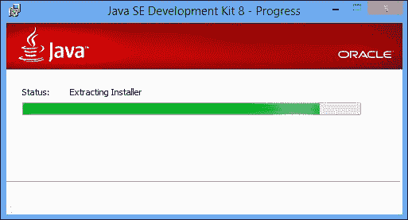

2.  一旦我们下载并安装了 JDK，我们需要在我们的系统上设置环境变量，以便可以从任何路径执行 Java。

    对于 Windows 用户，我们需要右键单击`My Computer`（我的电脑）图标，然后选择`Properties`（属性）选项。

3.  接下来，我们需要从顶部选项卡列表中选择`Advanced system settings`（高级系统设置）选项：

    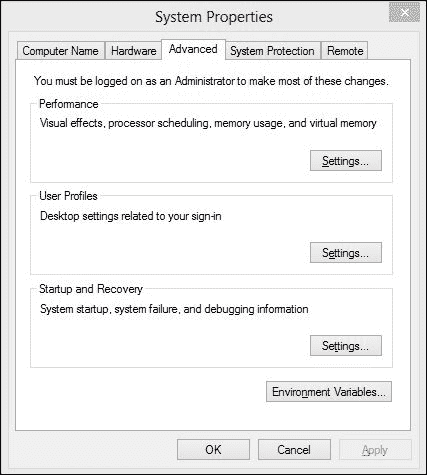

4.  一旦我们进入了`System Properties`（系统属性）对话框，在右下角，我们可以看到`Environment Variables...`（环境变量）选项。 当我们点击它，我们可以看到另一个窗口，包含系统变量及其值，在`System variables`（系统变量）部分下：

    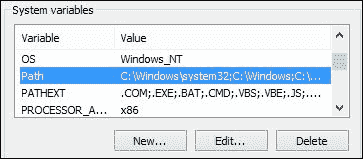

5.  在新的弹出对话框中，我们需要单击`Variables`（变量）下的`PATH`文本框，并键入 Java 安装文件夹的路径：

    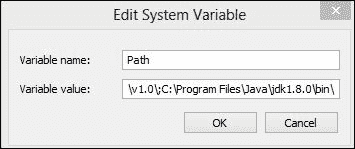

    对于 Mac OS X，我们需要编辑`/.bash_profile`文件，并将 Java 的路径追加到`PATH`变量。

    在 Linux 机器中，我们需要编辑`./bashrc`文件并附加环境变量行。 这里是命令：

    ```
    $ nano ~/.bashrc
    $ export JAVA_HOME=`/usr/libexec/java_home -v 1.6` or export JAVA_HOME=`/usr/libexec/java_home -v 1.7`
    ```

    你还可以通过从终端运行以下命令来检查 Java 是否已正确安装和配置：

    ```
    $ java --version
    ```

6.  一旦我们下载并配置了 Java 的环境变量，我们需要执行的下一步是下载`http://developer.android.com/sdk/index.html`中提供的 Android ADT 包。

    ADT 包是由 Android 团队准备的一个完整的包，包括配置了 ADT 插件，Android SDK 工具，Android 平台工具，最新的 Android 平台和模拟器的 Android 系统映像的 Eclipse。这大大简化了早期下载和使用 Android SDK 配置 Eclipse 的整个过程，因为现在的一切都已预先配置好了。

7.  一旦我们下载了 ADT 包，我们可以解压它，并打开 Eclipse 文件夹。

8.  启动时，ADT 包将要求我们配置 Eclipse 的工作区。`workspace`（工作空间）是所有 Android 应用程序开发项目及其文件将被存储的位置。在这种情况下，我已将所有内容保留默认，并选中`Use this as the default and do not ask me again`（使用此为默认值，不再询问我）复选框：

    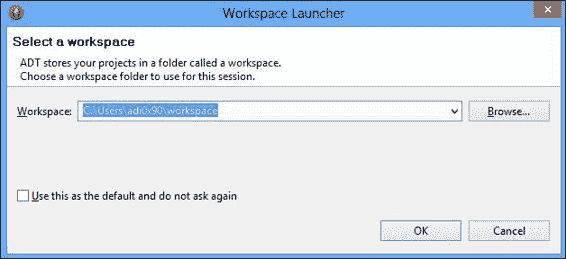

9.  一旦完全启动，我们可以继续创建 Android 虚拟设备。 Android 虚拟设备是配置用于特定版本的 Android 的模拟器配置。 模拟器是与 Android SDK 软件包一起提供的虚拟设备，通过它，开发人员可以运行正常设备的应用程序，并与他们在实际设备上进行交互。 这对于没有 Android 设备但仍然想创建 Android 应用程序的开发者也很有用。

### 注

这里要注意的一个有趣的特性是，在 Android 中，模拟器运行在 ARM 上，模拟的所有的事情与真实设备完全相同。 然而，在 iOS 中，我们的模拟器只是模拟环境，并不拥有所有相同组件和平台。

## 2.2 创建 Android 虚拟设备

为了创建Android虚拟设备，我们需要执行以下操作：

1.  访问 Eclipse 的顶部栏，然后点击 Android 图标旁边的设备图标。 这将打开一个新的`Android Virtual Device Manager`（Android 虚拟设备管理器）窗口，其中包含所有虚拟设备的列表。 这是一个很好的选择，通过点击`New`（新建）按钮，创建一个新的虚拟设备。

2.  我们还可以通过从终端运行 android 命令并访问工具，然后管理 AVD 来启动 Android 虚拟设备。 或者，我们可以简单指定 AVD 名称，并使用模拟器`-avd [avd-name]`命令来启动特定的虚拟设备。

    这会打开一个新窗口，其中包含需要为 Android 虚拟设备配置的所有属性（尚未创建）。 我们将配置所有选项，如下面的截图所示：

    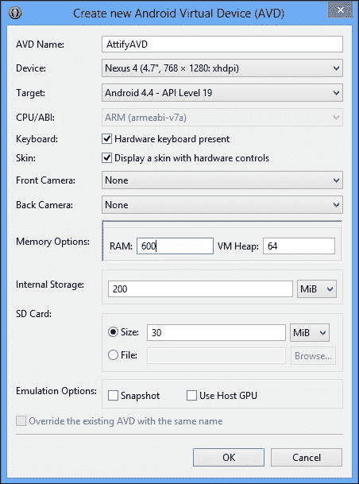

3.  一旦我们点击`OK`并返回到 AVD 管理器窗口，我们将看到我们新创建的 AVD。

4.  现在，只需选择新的 AVD，然后单击`Start...`（开始）来启动我们创建的虚拟设备。

    它可能需要很长时间，来为你的第一次使用加载，因为它正在配置所有的硬件和软件配置，来给我们真正的电话般的体验。

5.  在以前的配置中，为了节省虚拟设备的启动时间，选中`Snapshot`复选框也是一个不错的选择。

6.  一旦设备加载，我们现在可以访问我们的命令提示符，并使用 android 命令检查设备配置。 此二进制文件位于安装中的`/sdk/tools`文件夹下的`adt-bundle`文件夹中。

7.  我们还要设置位于`sdk`文件夹中的`tools`和`platform-tools`文件夹的位置，就像我们之前使用环境变量一样。

8.  为了获取我们系统中已连接（或加载）的设备的详细配置信息，可以运行以下命令：

    ```
    android list avd
    ```

    我们在下面的屏幕截图中可以看到，上面的命令的输出显示了我们系统中所有现有 Android 虚拟设备的列表：

    

9.  我们现在将继续，使用 ADB 或 Android Debug Bridge 开始使用设备，我们在上一章中已经看到。 我们还可以通过在终端中执行`emulator -avd [avdname]`命令来运行模拟器。

## 2.3 渗透测试实用工具

现在，让我们详细了解一些有用的 Android 渗透测试实用工具，如 Android Debug Bridge，Burp Suite 和 APKTool。

### Android Debug Bridge

Android Debug Bridge 是一个客户端 - 服务器程序，允许用户与模拟器器或连接的 Android 设备交互。 它包括客户端（在系统上运行），处理通信的服务器（也在系统上运行）以及作为后台进程在模拟器和设备上上运行的守护程序。 客户端用于 ADB 通信的默认端口始终是 5037，设备使用从 5555 到 5585 的端口。

让我们继续，通过运行`adb devices`命令开始与启动的模拟器交互。 它将显示模拟器已启动并运行以及连接到 ADB：

```
C:\Users\adi0x90\Downloads\adt-bundle\sdk\platform-tools>adb devices
List of devices attached
emulator-5554   device
```

在某些情况下，即使模拟器正在运行或设备已连接，你也不会在输出中看到设备。 在这些情况下，我们需要重新启动 ADB 服务器，杀死服务器，然后再次启动它：

```
C:\Users\adi0x90\Downloads\adt-bundle\sdk\platform-tools>adb kill-server

C:\Users\adi0x90\Downloads\adt-bundle\sdk\platform-tools>adb start-server
* daemon not running. starting it now on port 5037 *
* daemon started successfully *
```

我们还可以使用`pm`（包管理器）工具获取所有已安装的软件包的列表，这可以在 ADB 中使用：

```
adb shell pm list packages
```

如下面的屏幕截图所示，我们将获得设备上安装的所有软件包的列表，这在以后的阶段可能会有用：

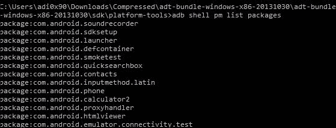

此外，我们可以使用`dumpsys meminfo`然后是`adb shell`命令，获取所有应用程序及其当前内存占用的列表

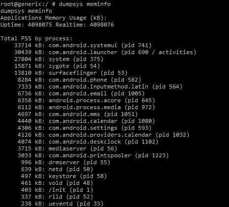

我们还可以获取`logcat`（这是一个读取 Android 设备事件日志的工具），并将其保存到特定文件，而不是在终端上打印：

```
adb logcat -d -f /data/local/logcats.log 
```

此处的`-d`标志指定转储完整日志文件的并退出，`-f`标志指定写入文件而不是在终端上打印。 这里我们使用`/data/local`位置，而不是任何其他位置，因为这个位置在大多数设备中是可写的。

我们还可以使用`df`命令检查文件系统以及可用空间和大小：

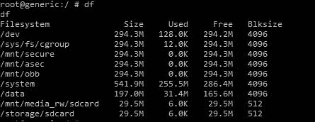

在 Android SDK 中还有另一个很棒的工具，称为 MonkeyRunner。 此工具用于自动化和测试 Android 应用程序，甚至与应用程序交互。 例如，为了使用 10 个自动化触摸，敲击和事件来测试应用程序，我们可以在`adb shell`中使用`monkey 10`命令：

```
root@generic:/ # monkey 10
monkey 10
Events injected: 10
## Network stats: elapsed time=9043ms (0ms mobile, 0ms wifi, 9043ms not connected)
```

这些是一些有用的工具和命令，我们可以在 ADB 中使用它们。 我们现在将继续下载一些我们将来使用的其他工具。

### Burp Suite

我们将在接下来的章节中使用的最重要的工具之一是 Burp 代理。 我们将使用它来拦截和分析网络流量。 应用程序中的许多安全漏洞可以通过拦截流量数据来评估和发现。 在以下步骤中执行此操作：

1.  我们现在从官方网站`http://portswigger.net/burp/download.html`下载 burp 代理。
    下载并安装后，你需要打开 Burp 窗口，它如以下屏幕截图所示。 你还可以使用以下命令安装 Burp：

    ```
    java –jar burp-suite.jar
    ```

    我们在下面的截图中可以看到，我们运行了 Burp 并显示了默认界面：

    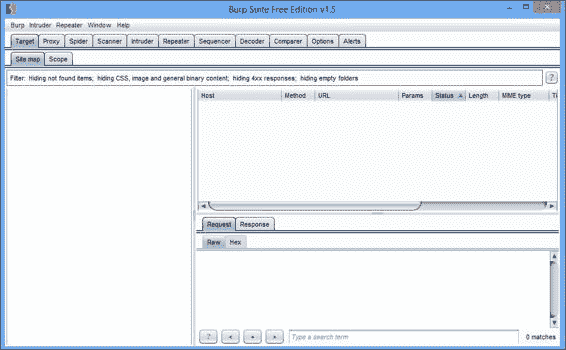

2.  在 Burp Suite 工具中，我们需要通过单击`Proxy`（代理）选项卡并访问`Options`（选项）选项卡来配置代理设置。

3.  在`Options`选项卡中，我们可以看到默认选项被选中，这是`127.0.0.1:8080`。 这意味着从我们的系统端口`8080`发送的所有流量将由 Burp Suite 拦截并且在它的窗口显示。

4.  我们还需要通过选择默认代理`127.0.0.1:8080`并单击`Edit`（编辑）来检查隐藏的代理选项。

5.  接下来，我们需要访问`Request handling`（请求处理）选项卡，并选中`Support invisible proxying (enable only if needed)`（支持不可见代理（仅在需要时启用））复选框：

    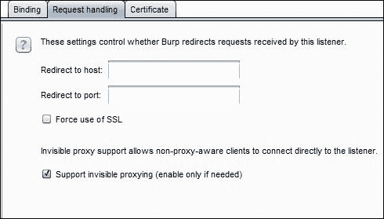

6.  最后，我们使用`invisible`选项运行代理：

    

7.  一旦设置了代理，我们将启动我们的模拟器与我们刚刚设置的代理。 我们将使用以下模拟器命令来使用`http-proxy`选项：

    ```
    emulator -avd [name of the avd] -http-proxy 127.0.0.1:8080
    ```

    我们可以在下面的截图中看到命令如何使用：

    

因此，我们已经配置了 Burp 代理和模拟器，导致所有的模拟器流量现在会通过 Burp。 在这里，你在访问使用 SSL 的网站时可能会遇到问题，我们将在后面的章节中涉及这些问题。

### APKTool

Android 逆向工程中最重要的工具之一是 APKTool。 它为逆向第三方和封闭的二进制 Android 应用程序而设计。 这个工具将是我们在未来章节中的逆向主题和恶意软件分析的重点之一。 为了开始使用 APKTool，请执行以下步骤：

1.  为了下载 APKTool，我们需要访问`https://code.google.com/p/android-apktool/downloads/list`。

    在这里，我们需要下载两个文件：`apktool1.5.3.tar.bz2`，其中包含 apktool 主二进制文件，另一个文件取决于平台 - 无论是 Windows，Mac OS X 还是 Linux。

2.  一旦下载和配置完成，出于便利，我们还需要将 APKTool 添加到我们的环境变量。 此外，最好将 APKTool 设置为环境变量，或者首先将其安装在`/usr/bin`中。 然后我们可以从我们的终端运行 APKTool，像下面的截图这样：

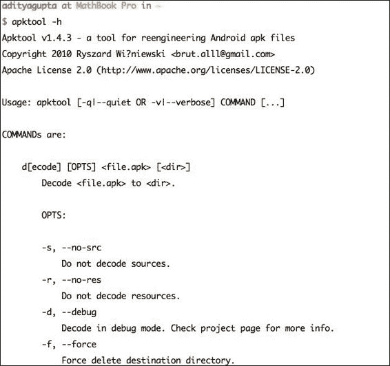

## 总结

在本章中，我们使用 Android SDK，ADB，APKTool 和 Burp Suite 建立了 Android 渗透测试环境。 这些是 Android 渗透测试者应该熟悉的最重要的工具。

在下一章中，我们将学习如何逆向和审计 Android 应用程序。 我们还将使用一些工具，如 APKTool，dex2jar，jd-gui 和一些我们自己的命令行必杀技。