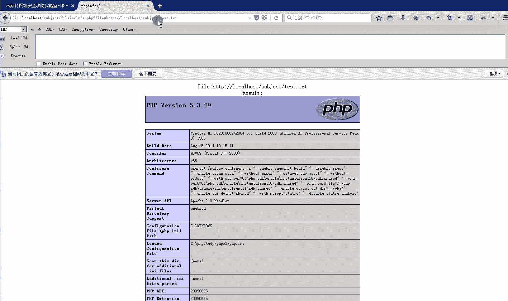
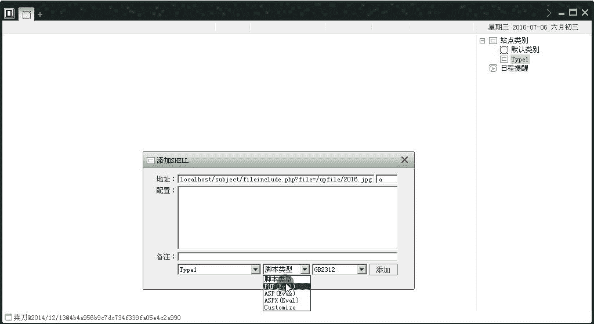
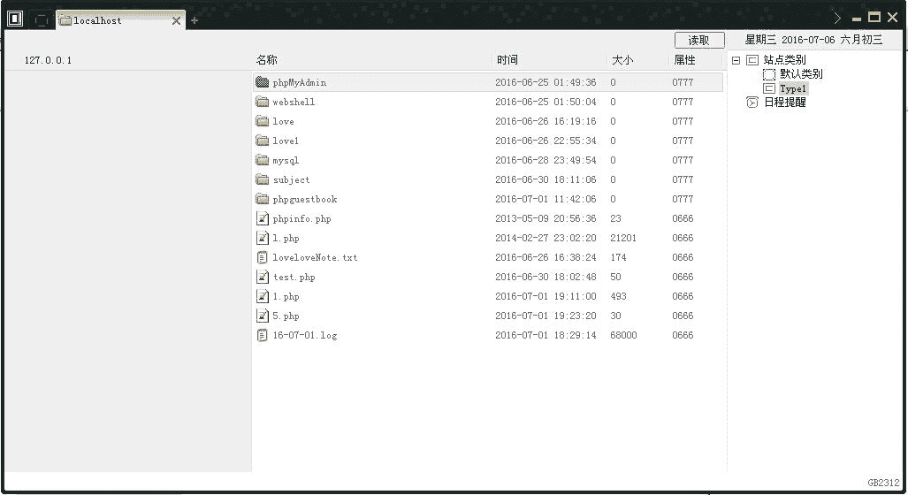

# 米斯特白帽培训讲义 漏洞篇 文件包含

> 讲师：[gh0stkey](https://www.zhihu.com/people/gh0stkey/answers)
> 
> 整理：[飞龙](https://github.com/)
> 
> 协议：[CC BY-NC-SA 4.0](http://creativecommons.org/licenses/by-nc-sa/4.0/)

## 原理

文件包含就是将一个文件包含到自己的文件中执行。它可分为本地包含和远程包含，本地包含即包含本地磁盘上的文件，文件名称是相对路径或绝对路径，远程包含即包含互联网上的文件，文件名称是 URL。

## 示例代码

比如我们有一个`test.txt`文件，仅仅调用`phpinfo`来测试：

```
<?php phpinfo();?>
```

然后我们在相同目录下放置一个`fileinclude.php`，如下：

```
<?php
$file=@$_GET['file'];
$b=@$_GET['b'];
if($file!==null){
    echo "<center>File:".$file."<br/>Result:</center>";
    include $file;
}else if($b!==null){
    echo "<center>File:".$b."<br/>Result:</center>";
    require($b);
    require($b.".php");
}
```

第一行代码获取 URL 参数`file`的内容。第二行代码获得 URL 参数`b`的内容。3 ~ 5 行首先判断`$file`是否为空，若不为空，输出其内容，并将其作为文件名称包含。6 ~ 9 行，若`$file`为空，则判断`$b`是否为空，不为空的话，输出其内容，并将其作为文件名称包含。

我们在相同目录下执行`php -S 0.0.0.0:80`，之后访问`http://localhost/fileinclude.php?file=test.txt`，会看到`phpinfo`的输出。



为了演示远程包含，我们需要将 PHP 配置文件中的`allow_url_include`设置为`on`，之后重启 PHP。远程包含的话，我们需要将`file`参数改为`http://localhost/text.txt`，可以看到相同结果。

## 如何挖掘

首先对 URL 进行分析，看看是否和文件相关，比如`www.test.com/xxx.php?file=yyy`。带有文件相关的敏感名称都可以进行挖掘。

## 利用

当我们发现了本地或远程包含漏洞时，首先寻找上传点，比如用户头像上传功能。然后我们可以构造一个纯文本文件，内容为`<?php phpinfo();?>`，并将其命名为`xxx.jpg`。

之后我们就可以把`xxx.jpg`上传上去，并通过应用得到它的位置，假设是`/upload/xxx.jpg`，然后我们就可以把`file`参数的值改为它。以前面的代码为例，URL 是`http://localhost/fileinclude.php?file=/upload/xxx.jpg`。

要注意这个漏洞是无！视！扩！展！名！的！跟文件上传漏洞不一样，文件上传漏洞中如果我们上传的文件不是`.php`就执行不了（当然也有一些绕过手段），但是文件包含漏洞中的用户名是任意的，前面我们上传了`.txt`，证实有效，那么这个`.jpg`也是有效的。

如果我们把`xxx.jpg`的内容改为菜刀的一句话，那就可以用菜刀连接。





再说一下远程包含，远程包含的条件比较苛刻，目标网站需要把`allow_url_open`给打开。所以有本地包含不一定有远程包含，有远程包含一定就有本地包含。但是，远程包含的利用相对简单，只要将代码上传到自己博客，或者任何能通过 URL 访问到的地方就可以了。后续步骤是一样的。