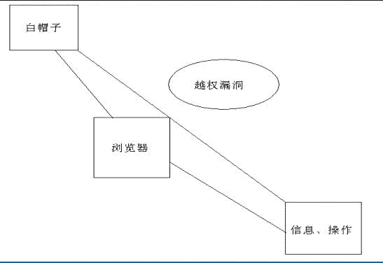
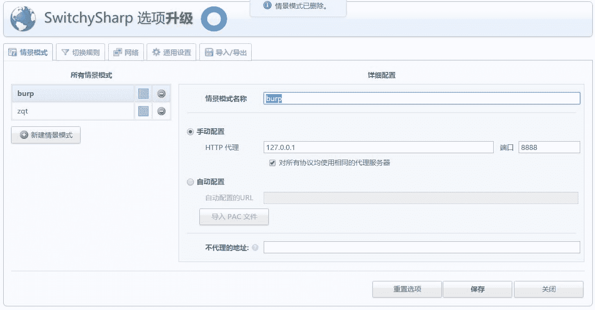
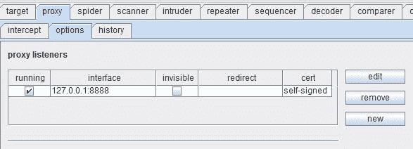
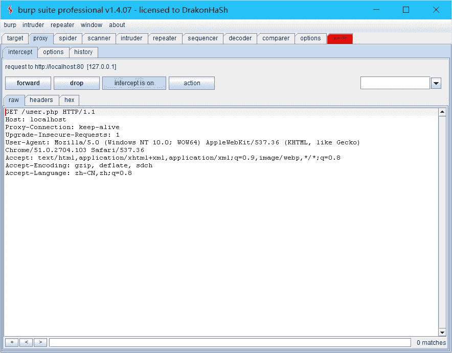
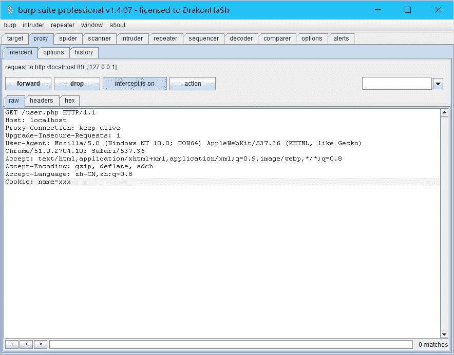
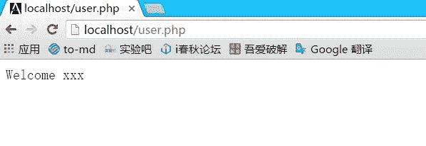

# 米斯特白帽培训讲义 漏洞篇 越权

> 讲师：[gh0stkey](https://www.zhihu.com/people/gh0stkey/answers)
> 
> 整理：[飞龙](https://github.com/)
> 
> 协议：[CC BY-NC-SA 4.0](http://creativecommons.org/licenses/by-nc-sa/4.0/)

越权漏洞是 Web 应用程序中一种常见的安全漏洞。它的威胁在于一个账户即可控制全站用户数据。当然这些数据仅限于存在漏洞功能对应的数据。越权漏洞的成因主要是开发人员在对数据进行增、删、改、查时对客户端请求的数据过于信任而遗漏了权限的判定。所以测试越权就是和开发人员拼细心的过程。



## 信息遍历

```
<?php
$id = @$_GET['id'];
$arr = array('1', '2', '3', '4', '5');
if(in_array($id, $arr, true)) 
    echo "用户名：$id 密码：123456";
else
    echo "信息出错";
```

这段代码首先从 URL 参数中读取 ID，之后与现存 ID 比对，如果存在则输出 ID 和密码，不存在则报错。这里 ID 是被查询的信息，假设系统里一共就五个 ID。由于这里不存在过滤，那么我们可以不绕过任何东西来查询它们。

## 隐藏式后台

一些网站的后台不存在任何用户校验，反之，它会把后台隐藏起来。隐藏之后，公开页面上不存在任何到后台的链接，但是如果直接输入 URL，还是可以访问的。那我们就能使用扫描器扫出后台地址，然后直接访问。

## Cookie 绕过

有些时候，我们可以绕过 Cookie、JS 代码的验证执行越权。

首先看一段代码：

```
<!-- pass-cookie.php -->
<form action="" method="post">
    <input type="text" name="name"/>
    <input type="password" name="pass"/>
    <input type="submit" value="登录"/>
</form>
<?php
$name=@$_POST['name'];
$pass=@$_POST['pass'];
if($name=="admin" && $pass=="admin123"){
    setcookie('name','admin');
    header("Location:user.php");
}
```

这段代码模拟了登录页面，如果账号是`admin`，密码是`admin123`，则在 Cookie 中将`name`设置为`admin`，然后跳到`user.php`。

再来看`user.php`：

```
<?php
if (!isset($_COOKIE["name"])){
    header("Location:past-cookie.php");
}else{
    $name=$_COOKIE['name'];
    echo "Welcome ".$name;
}
```

这段代码先检验 Cookie中的`name`，不存在则跳回去，存在则输出其值。

这段代码的最大问题就是验证极其不严密，它拿到`name`之后并没有验证它是谁，也没有使用数据库来查询。就像劲舞团里面，我们按特定的键才能通过，他这个漏洞就相当于，游戏需要我们按下`Z`，但是我们按下`X`也能通过，甚至按任意键也可以。

既然 Cookie 是用户可控的，那我们就可以伪造一个值了，我们接下来会用到 BurpSuite。首先在 浏览器中将代理设为`127.0.0.1:8888`：




之后打开 Burp，设置代理，并打开拦截模式：




假设我们不经过登录页面，直接访问`user.php`，Burp 中应该能看到拦截到的请求：



我们伪造`Cookie: name=xxx`，然后放行：





成功绕过了验证。

## JS 绕过

JS 绕过则是把所有校验放在前端，比如，`user.php`的内容改为：

```
<script> function chkcookies()
{
  var NameOfCookie="name";
  var c = document.cookie.indexOf(NameOfCookie+"="); 
  if (c != -1)
  {
    return true;
    alert("登录成功");
    var str_html="<h1>欢迎登录本系统</h1>";
    document.write(str_html);
  }
  else
  {
   alert("请不要非法访问");
   location.href="past-js.php";
  }
  return false;
}
chkcookies(); </script>
```

那我们就不必改什么 Cookie了，直接访问服务器拿到纯文本，之后不解释 JS 就可以了。