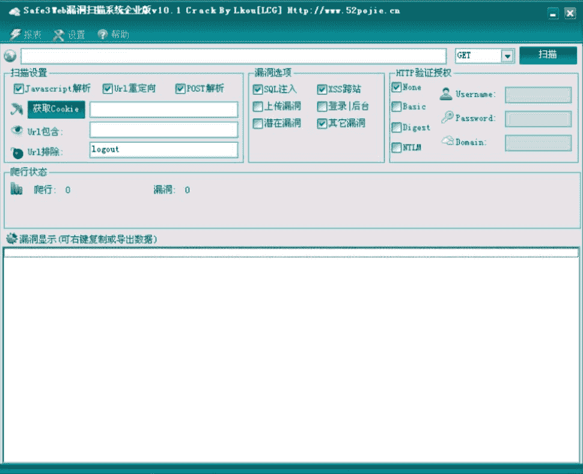
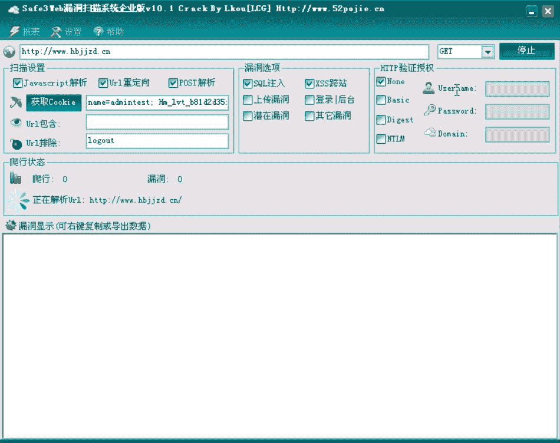
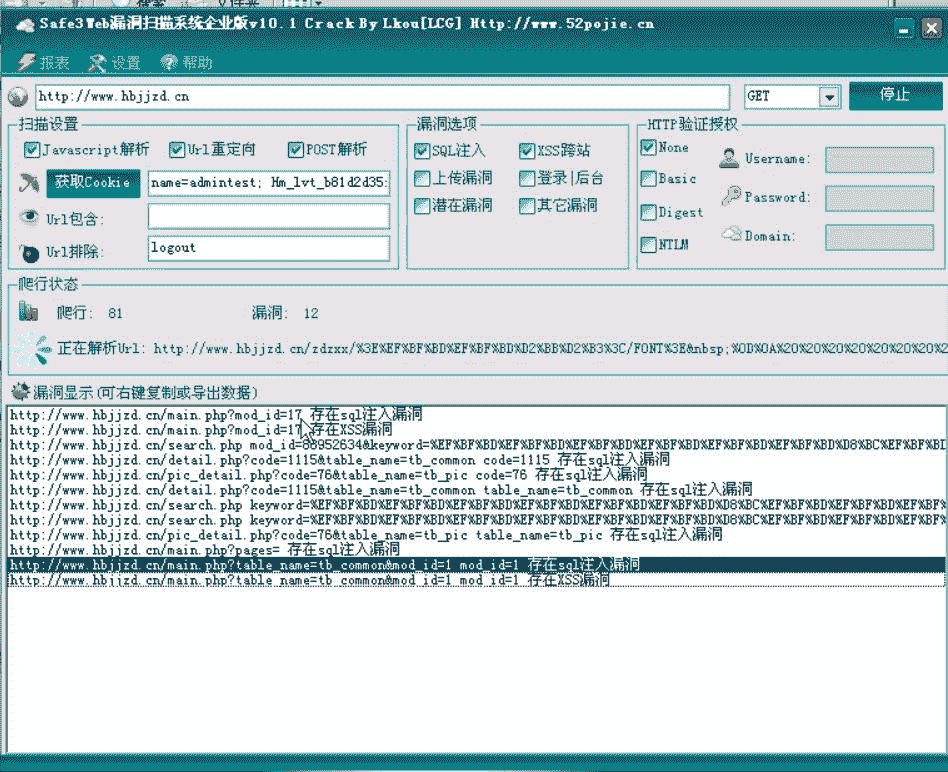
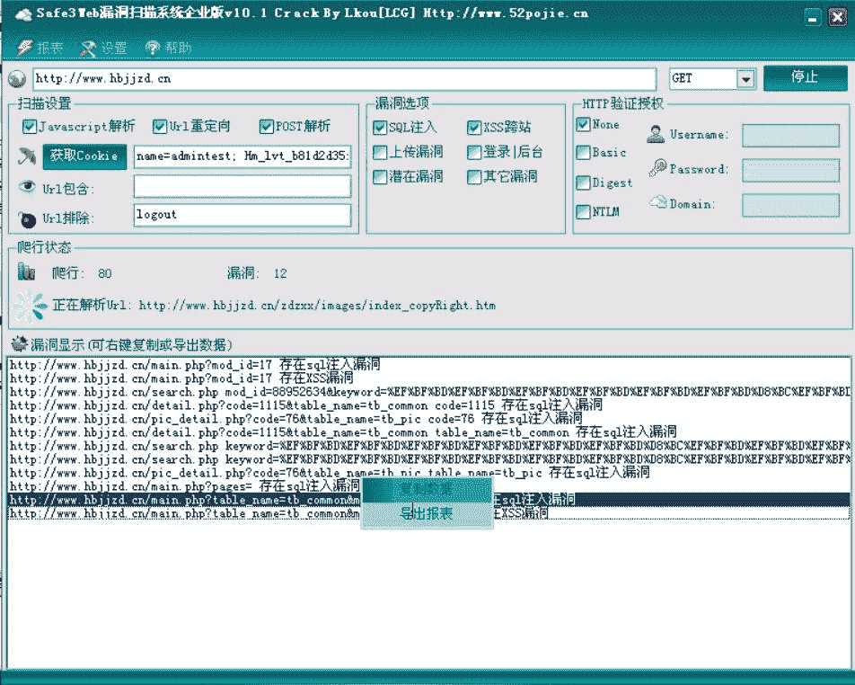
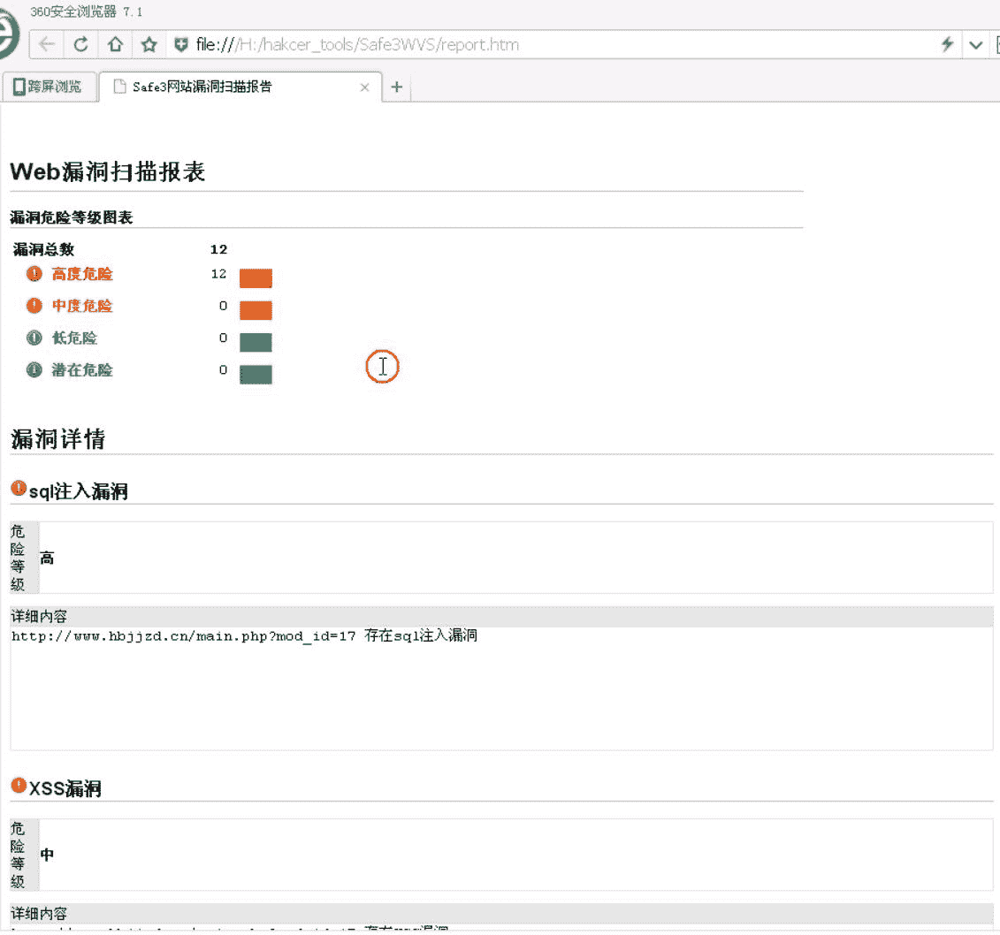
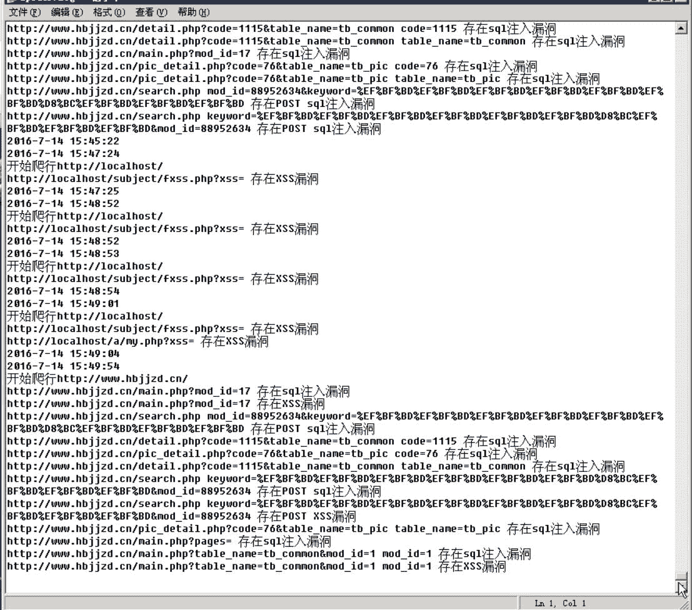

# 米斯特白帽培训讲义 工具篇 Safe3 WVS

> 讲师：[gh0stkey](https://www.zhihu.com/people/gh0stkey/answers)
> 
> 整理：[飞龙](https://github.com/)
> 
> 协议：[CC BY-NC-SA 4.0](http://creativecommons.org/licenses/by-nc-sa/4.0/)

## 介绍

Safe3 WVS 是一款使用较为领先的智能化爬虫技术及 SQL 注入状态检测技术的工具，相比国内外同类产品智能化程度更高，速度更快，结果更准确。

所以我们一般用它检测 SQL 注入漏洞。不过目前也可以利用这款工具进行反射 XSS 的挖掘，因为他可以通过自动化的载荷来测试并判断网页源码，从而判断是否存在反射型 XSS 漏洞。



## 下载

首先需要下载并安装 .net 2.0 框架，XP 之前可以需要单独安装，Win7 之后都自带了。

然后在[吾爱云盘](http://down.52pojie.cn/LCG/Safe3WVS_10.1_Crack_By_Lkou%5bLCG%5d.rar)下载 Safe3。

下载之后无需安装，直接打开使用即可。

## 注入漏洞的扫描


打开程序主界面后，我们在上方的输入框中输入 URL。在漏洞设置分组框中选择“sql注入”和“xss”。然后如果需要设置 cookie 的话，在扫描设置分组框中输入 cookie，cookie 可以通过浏览器来获取，不同浏览器的获取方法不同。



填写完毕之后点击“开始”按钮，扫描结束之后我们会在下方的列表框中看到漏洞信息。



我们可以在列表框中点击右键，然后选择导出报表。





在 Safe3 的目录下，我们会看到一个`spider.log`，这个文件以纯文本的形式保存了漏洞信息。我们打开它：



我们可以编写一个`python`文件来提取其中的 SQL 注入 URL：

```
# coding: utf-8

fi = open('spider.log', 'r')
fo = open('spider_sql.log', 'w')

for line in fi.readlines():
    line = line.strip('\n')
    if 'sql注入' in line:
        url = line.split(' ')[0]
        print url
        fo.write(url)
        fo.write('\n')

fi.close()
fo.close()
```