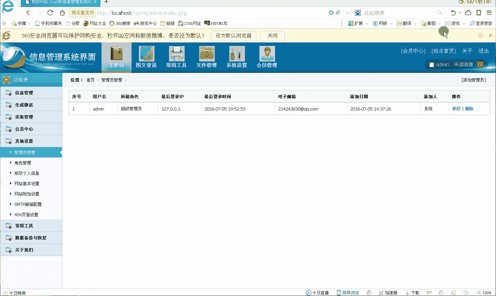
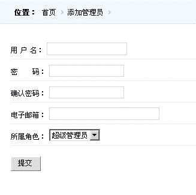
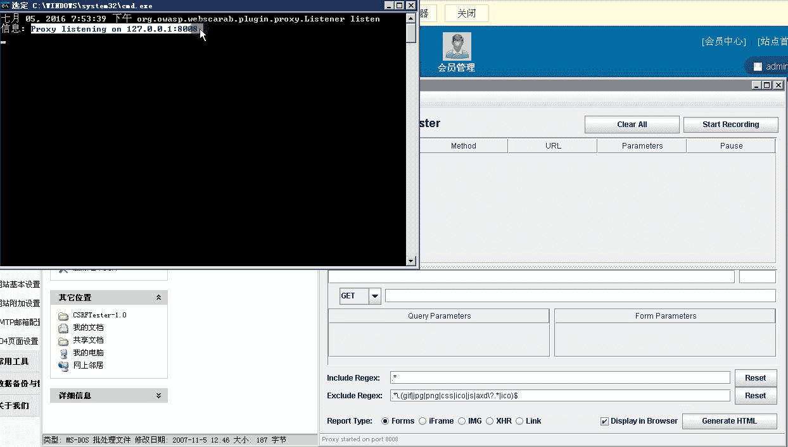
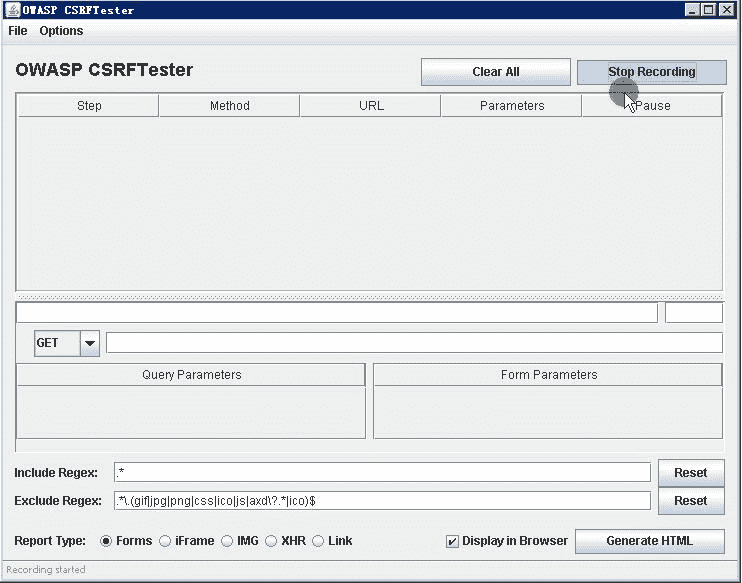
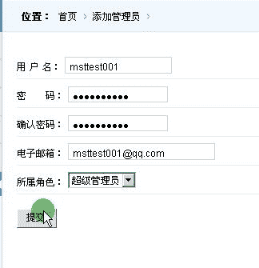
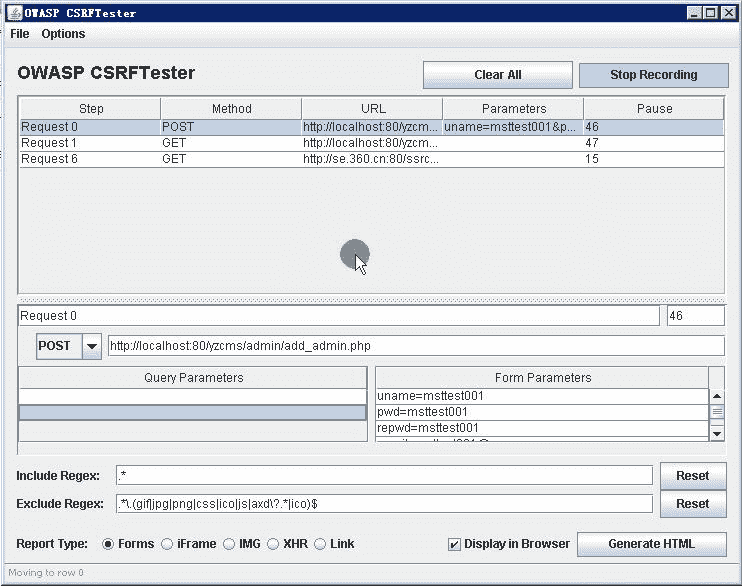
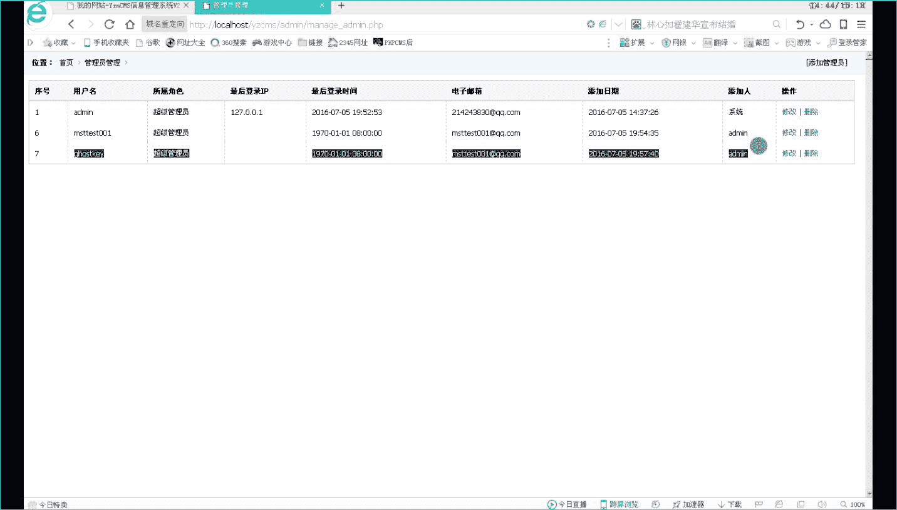

# 米斯特白帽培训讲义 漏洞篇 CSRF

> 讲师：[gh0stkey](https://www.zhihu.com/people/gh0stkey/answers)
> 
> 整理：[飞龙](https://github.com/)
> 
> 协议：[CC BY-NC-SA 4.0](http://creativecommons.org/licenses/by-nc-sa/4.0/)

CSRF（Cross-site request forgery跨站请求伪造，也被称为“One Click Attack”或者Session Riding，通常缩写为CSRF或者XSRF，是一种对网站的恶意利用。尽管听起来像跨站脚本（XSS），但它与XSS非常不同，并且攻击方式几乎相左。XSS利用站点内的信任用户，而CSRF则通过伪装来自受信任用户的请求来利用受信任的网站。与XSS攻击相比，CSRF攻击往往不大流行（因此对其进行防范的资源也相当稀少）和难以防范，所以被认为比XSS更具危险性。

CSRF 攻击的原理就是攻击者创建一个链接，受害者点击它之后就可以完成攻击者想要的操作，这些操作一般是删除文章，创建用户之类。比如某网站的删除文章链接是`http://www.xxx.com/post/<id>/delete`，那么攻击者可以直接构造出来发给有权限的人，它点击之后就可以将文章删除。当然，攻击者也可以使用当下流行的短网址服务来伪造 URL，避免受到怀疑。

与传统的认知相反， POST 方式并不能防止 CSRF，这是因为浏览器中的 JS 拥有发送 POST 请求的能力。比如攻击者可以编写一个带表单的页面，包含目标 URL 和所有所需字段，然后再用 JS 代码提交表单。之后把这个表单放到网络上可以访问的地方，再把这个链接发给受害者，诱导他点击。

所以这个东西也叫作“One Click”，意思就是说，整个攻击只通过一次点击来完成。换个角度，通过两次相关步骤来完成的操作就不会有这个问题。

## 利用

我们可以使用 OWASP 的 CSRF-Tester 来半自动利用 CSRF 漏洞，还可以生成用于利用的 exp 页面。

要注意的是，它不会为你判断是否存在 CSRF 漏洞，想想也知道，一个网站上的一次完成的操作简直太多了，那所有这些操作都存在 CSRF 漏洞吗？并不是，只有重要的，不可挽回的操作才能算 CSRF 操作，而这个是机器判断不了的。所以你首先要知道哪里有 CSRF 漏洞，才能使用工具。

我们用它来利用 yzcms，这是一款开源的 CMS。我们首先访问后台：

我们点击右上方的添加管理员：

当我们创建的时候，浏览器会向服务器发请求。我们就可以伪造这个请求，构造出 exp 页面，然后让已经登录的管理员去访问这个页面，就能成功创建管理员。

我们打开工具，我们看到工具一打开，就监听了本机的 8008 端口：

我们需要将浏览器的代理配置为`127.0.0.1:8008`。然后点击`Start Recording`，它会开始抓取请求。

这时我们返回 CMS 页面，模拟创建一个管理员：

我们可以看到它捕获到了若干请求，POST 的那个就是创建管理员的请求。我们点击这个请求那一行，观察下方的`Form Parameters`，没有任何的 Token 验证。

参数的值可以任意修改。我们看一看底下的`Report Type`，这个就是构造方式，可以选择使用`<form>`、`<iframe>`、``、AJAX、或者`<a>`来构造。这里我们选择 Forms。之后我们点击右边的`Generate HTML`，选择一个地方来保存。

我们可以把这个文件发给受害者，让他打开。也可以放到网上把链接发给受害者。我们试着打开它，当我们打开之后，我们可以看到，成功添加了我们所需的管理员。

