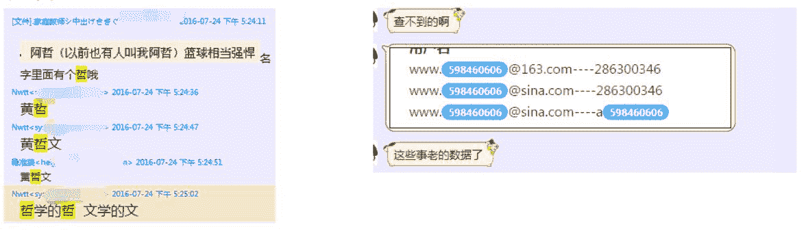
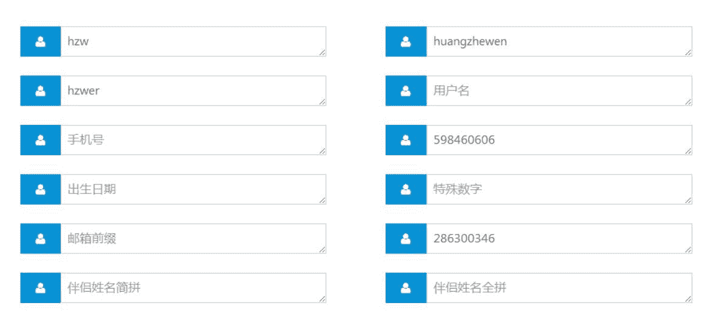
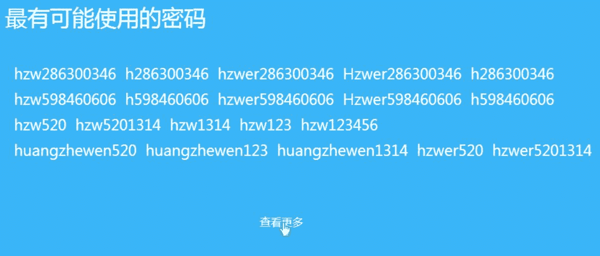
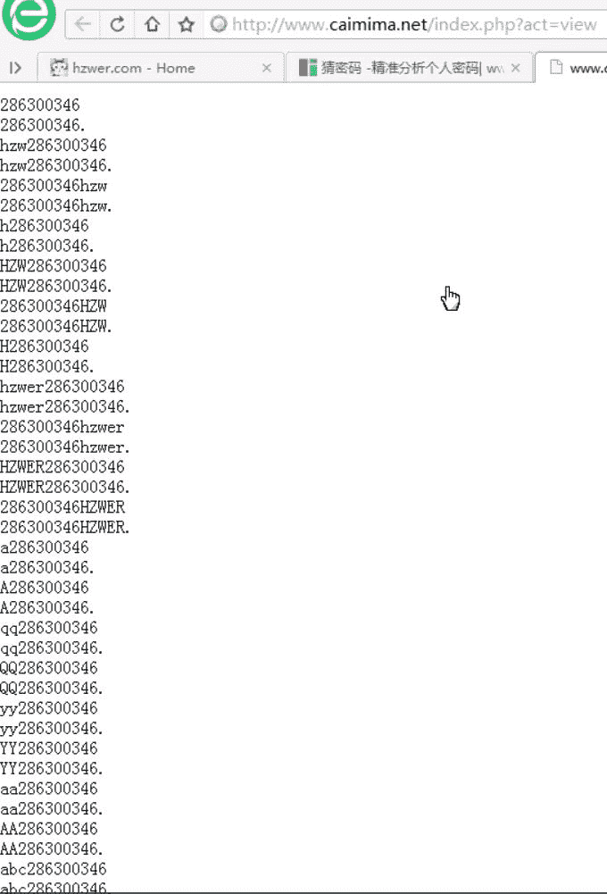
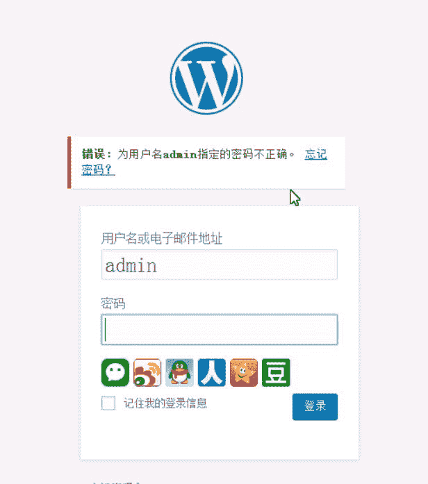
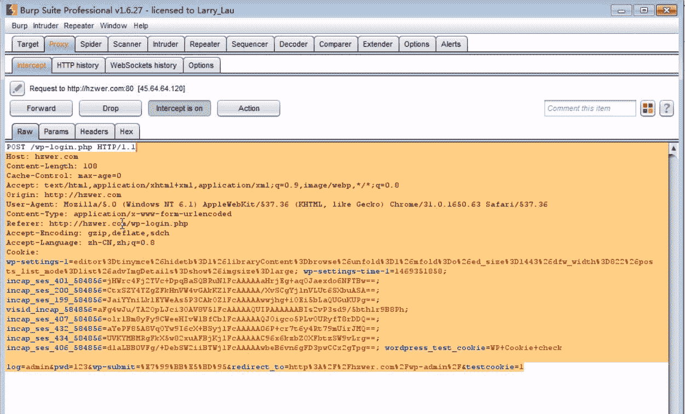
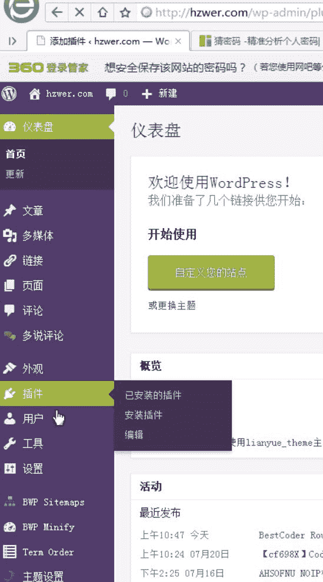
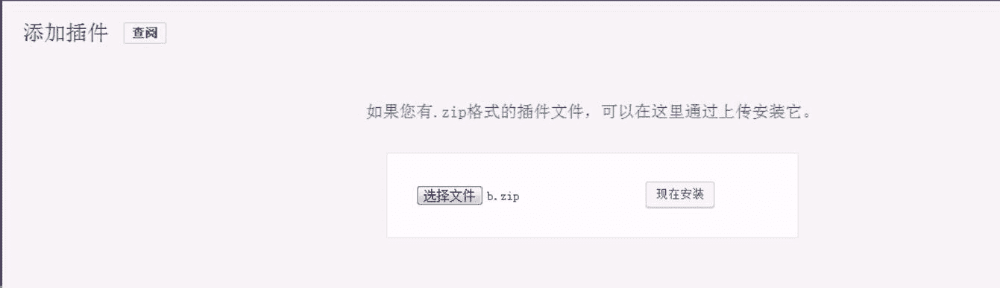
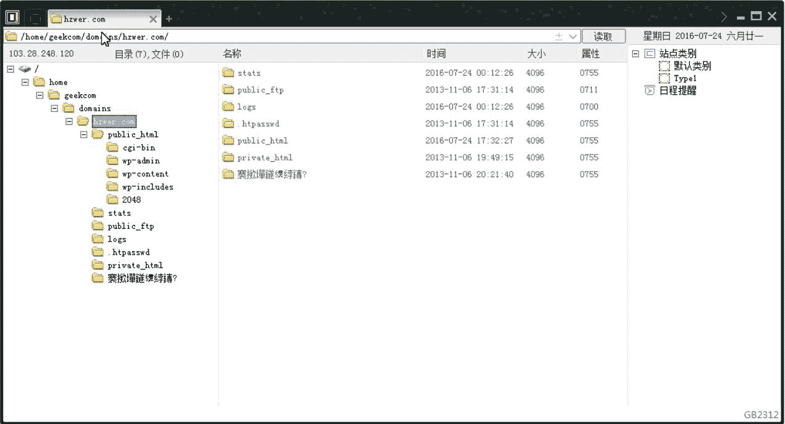

# 米斯特白帽培训讲义 实战篇 WordPress

> 讲师：[gh0stkey](https://www.zhihu.com/people/gh0stkey/answers)
> 
> 整理：[飞龙](https://github.com/)
> 
> 协议：[CC BY-NC-SA 4.0](http://creativecommons.org/licenses/by-nc-sa/4.0/)

目标是`http://hzwer.com`。

首先有学员社到了他的个人信息和老密码：

然后我们利用`www.caimima.net`这个网站来生成字典。

我们在“姓名简拼”中输入“hzw”，“英文名”中输入“hzwer”，姓名全拼中输入“huangzhewen”，“QQ 号”中输入“598460606”，“历史密码”中输入“286300346”。

然后点击提交：

然后点击查看更多：

把这个东西保存为`hzwer.txt`。

然后他的网站是 WordPress 程序，登录页面是`wp-login.php`，直接访问它。我们尝试为用户名输入`admin`，密码随便输入然后提交：

显示“为用户名`admin`指定的密码不正确”，说明用户名`admin`是存在的。

接下来要爆破密码，打开 Burp 抓包：

发送到 Intruder，进行爆破。选择之前保存的字典：

[http://ww2.sinaimg.cn/large/841aea59jw1fb49r8kmxnj20ye0r576g.jpg](http://ww2.sinaimg.cn/large/841aea59jw1fb49r8kmxnj20ye0r576g.jpg)

爆破成功之后，登录后台，鼠标移动到左侧的“插件”，然后点击“安装插件”：

在之后的页面中点击“上传插件”。

我们把一句话写入`a.php`，将它压缩为`b.zip`。然后在上传页面处选择该文件后，点击“现在安装”：

WebShell 上传到了`/wp-content/upgrade/b/a.php`。拿菜刀连接便可成功拿到 Shell。

