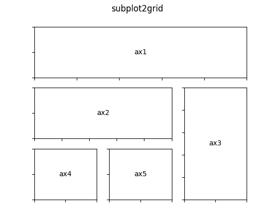
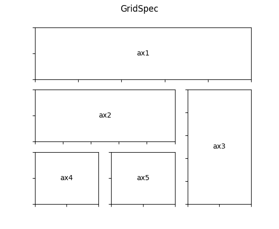
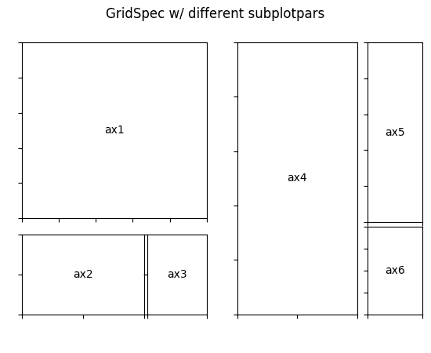
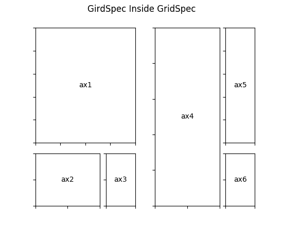
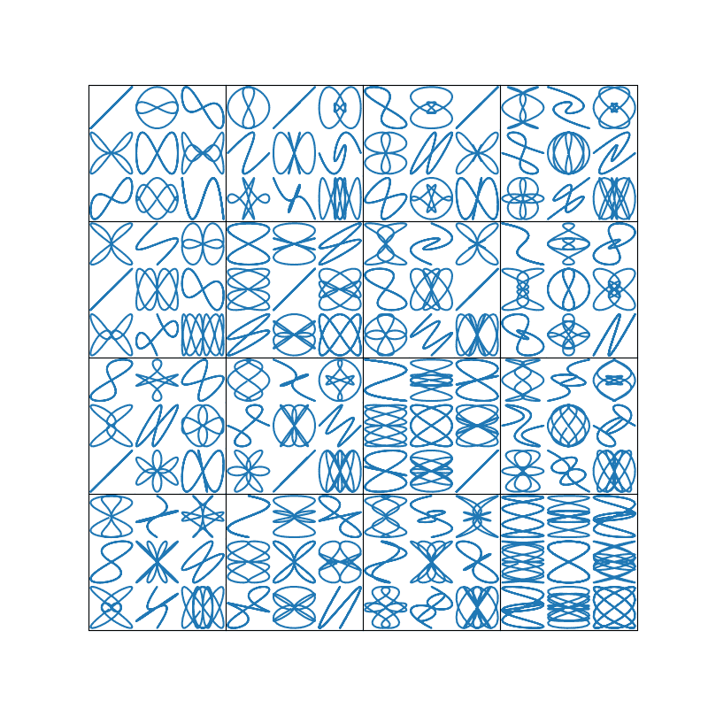
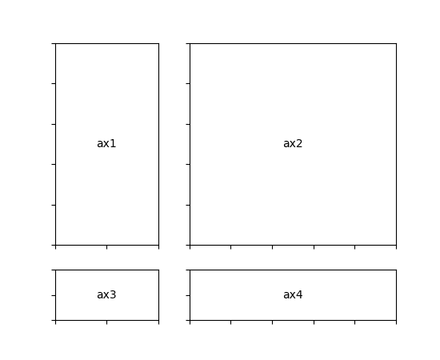

# 使用 GridSpec 自定义子图位置

> 原文：[Customizing Location of Subplot Using GridSpec](http://matplotlib.org/users/gridspec.html)
> 
> 译者：[飞龙](https://github.com/)
> 
> 协议：[CC BY-NC-SA 4.0](http://creativecommons.org/licenses/by-nc-sa/4.0/)

`GridSpec`

指定子图将放置的网格的几何位置。 需要设置网格的行数和列数。 子图布局参数（例如，左，右等）可以选择性调整。

`SubplotSpec`

指定在给定`GridSpec`中的子图位置。

`subplot2grid`

一个辅助函数，类似于`pyplot.subplot`，但是使用基于 0 的索引，并可使子图跨越多个格子。

## `subplot2grid`基本示例

要使用subplot2grid，你需要提供网格的几何形状和网格中子图的位置。 对于简单的单网格子图：

```
ax = plt.subplot2grid((2,2),(0, 0))
```

等价于：

```
ax = plt.subplot(2,2,1)
```

```
 nRow=2, nCol=2
(0,0) +-------+-------+
      |   1   |       |
      +-------+-------+
      |       |       |
      +-------+-------+
```

要注意不想`subplot`，`gridspec`中的下标从 0 开始。

为了创建跨越多个格子的子图，

```
ax2 = plt.subplot2grid((3,3), (1, 0), colspan=2)
ax3 = plt.subplot2grid((3,3), (1, 2), rowspan=2)
```

例如，下列命令：

```
ax1 = plt.subplot2grid((3,3), (0,0), colspan=3)
ax2 = plt.subplot2grid((3,3), (1,0), colspan=2)
ax3 = plt.subplot2grid((3,3), (1, 2), rowspan=2)
ax4 = plt.subplot2grid((3,3), (2, 0))
ax5 = plt.subplot2grid((3,3), (2, 1))
```

会创建：



## `GridSpec`和`SubplotSpec`

你可以显式创建`GridSpec`并用它们创建子图。

例如，

```
ax = plt.subplot2grid((2,2),(0, 0))
```

等价于：

```
import matplotlib.gridspec as gridspec
gs = gridspec.GridSpec(2, 2)
ax = plt.subplot(gs[0, 0])
```

`gridspec`示例提供类似数组（一维或二维）的索引，并返回`SubplotSpec`实例。例如，使用切片来返回跨越多个格子的`SubplotSpec`实例。

上面的例子会变成：

```
gs = gridspec.GridSpec(3, 3)
ax1 = plt.subplot(gs[0, :])
ax2 = plt.subplot(gs[1,:-1])
ax3 = plt.subplot(gs[1:, -1])
ax4 = plt.subplot(gs[-1,0])
ax5 = plt.subplot(gs[-1,-2])
```



## 调整 `GridSpec`布局

在显式使用`GridSpec`的时候，你可以调整子图的布局参数，子图由`gridspec`创建。

```
gs1 = gridspec.GridSpec(3, 3)
gs1.update(left=0.05, right=0.48, wspace=0.05)
```

这类似于`subplots_adjust`，但是他只影响从给定`GridSpec`创建的子图。

下面的代码

```
gs1 = gridspec.GridSpec(3, 3)
gs1.update(left=0.05, right=0.48, wspace=0.05)
ax1 = plt.subplot(gs1[:-1, :])
ax2 = plt.subplot(gs1[-1, :-1])
ax3 = plt.subplot(gs1[-1, -1])

gs2 = gridspec.GridSpec(3, 3)
gs2.update(left=0.55, right=0.98, hspace=0.05)
ax4 = plt.subplot(gs2[:, :-1])
ax5 = plt.subplot(gs2[:-1, -1])
ax6 = plt.subplot(gs2[-1, -1])
```

会产生



## 使用 `SubplotSpec`创建 `GridSpec`

你可以从`SubplotSpec`创建`GridSpec`，其中它的布局参数设置为给定`SubplotSpec`的位置的布局参数。

```
gs0 = gridspec.GridSpec(1, 2)

gs00 = gridspec.GridSpecFromSubplotSpec(3, 3, subplot_spec=gs0[0])
gs01 = gridspec.GridSpecFromSubplotSpec(3, 3, subplot_spec=gs0[1])
```



## 使用`SubplotSpec`创建复杂嵌套的`GridSpec`

这里有一个更复杂的嵌套`gridspec`的示例，我们通过在每个 3x3 内部网格中隐藏适当的脊线，在 4x4 外部网格的每个单元格周围放置一个框。



## 网格尺寸可变的`GridSpec`

通常，`GridSpec`创建大小相等的网格。你可以调整行和列的相对高度和宽度，要注意绝对高度值是无意义的，有意义的只是它们的相对比值。

```
gs = gridspec.GridSpec(2, 2,
                       width_ratios=[1,2],
                       height_ratios=[4,1]
                       )

ax1 = plt.subplot(gs[0])
ax2 = plt.subplot(gs[1])
ax3 = plt.subplot(gs[2])
ax4 = plt.subplot(gs[3])
```

