# 密致布局指南

> 原文：[Tight Layout guide](http://matplotlib.org/users/tight_layout_guide.html)
> 
> 译者：[飞龙](https://github.com/)
> 
> 协议：[CC BY-NC-SA 4.0](http://creativecommons.org/licenses/by-nc-sa/4.0/)

`tight_layout`会自动调整子图参数，使之填充整个图像区域。这是个实验特性，可能在一些情况下不工作。它仅仅检查坐标轴标签、刻度标签以及标题的部分。

## 简单的示例

在 matplotlib 中，轴域（包括子图）的位置以标准化图形坐标指定。 可能发生的是，你的轴标签或标题（有时甚至是刻度标签）会超出图形区域，因此被截断。

```
plt.rcParams['savefig.facecolor'] = "0.8"

def example_plot(ax, fontsize=12):
     ax.plot([1, 2])
     ax.locator_params(nbins=3)
     ax.set_xlabel('x-label', fontsize=fontsize)
     ax.set_ylabel('y-label', fontsize=fontsize)
     ax.set_title('Title', fontsize=fontsize)

plt.close('all')
fig, ax = plt.subplots()
example_plot(ax, fontsize=24)
```

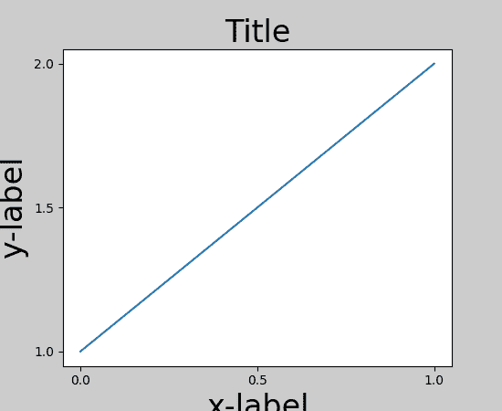

为了避免它，轴域的位置需要调整。对于子图，这可以通过调整子图参数（[移动轴域的一条边来给刻度标签腾地方](http://matplotlib.org/faq/howto_faq.html#howto-subplots-adjust)）。Matplotlib v1.1 引入了一个新的命令`tight_layout()`，自动为你解决这个问题。

```
plt.tight_layout()
```

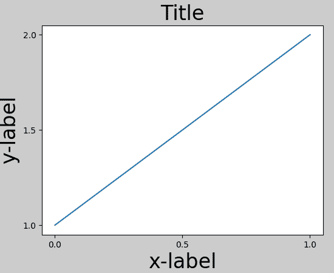

当你拥有多个子图时，你会经常看到不同轴域的标签叠在一起。

```
plt.close('all')
fig, ((ax1, ax2), (ax3, ax4)) = plt.subplots(nrows=2, ncols=2)
example_plot(ax1)
example_plot(ax2)
example_plot(ax3)
example_plot(ax4)
```

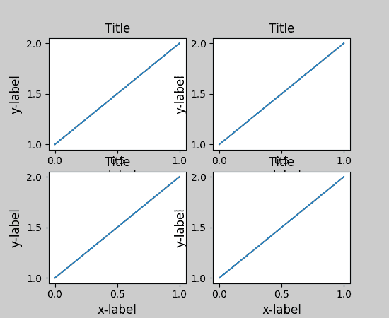

`tight_layout()`也会调整子图之间的间隔来减少堆叠。

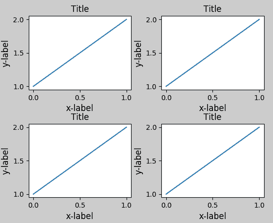

`tight_layout()`可以接受关键字参数`pad`、`w_pad`或者`h_pad`，这些参数图像边界和子图之间的额外边距。边距以字体大小单位规定。

```
plt.tight_layout(pad=0.4, w_pad=0.5, h_pad=1.0)
```

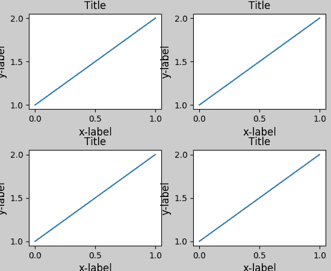

即使子图大小不同，`tight_layout()`也能够工作，只要网格的规定的兼容的。在下面的例子中，`ax1`和`ax2`是 2x2 网格的子图，但是`ax3`是 1x2 网格。

```
plt.close('all')
fig = plt.figure()

ax1 = plt.subplot(221)
ax2 = plt.subplot(223)
ax3 = plt.subplot(122)

example_plot(ax1)
example_plot(ax2)
example_plot(ax3)

plt.tight_layout()
```

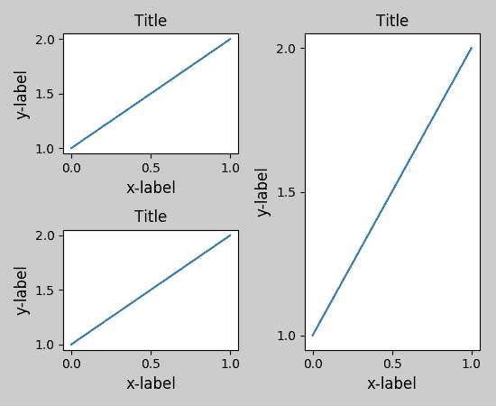

它适用于使用`subplot2grid()`创建的子图。 一般来说，从`gridspec`（[使用`GridSpec`自定义子布局的位置](http://matplotlib.org/users/gridspec.html#gridspec-guide)）创建的子图也能正常工作。

```
plt.close('all')
fig = plt.figure()

ax1 = plt.subplot2grid((3, 3), (0, 0))
ax2 = plt.subplot2grid((3, 3), (0, 1), colspan=2)
ax3 = plt.subplot2grid((3, 3), (1, 0), colspan=2, rowspan=2)
ax4 = plt.subplot2grid((3, 3), (1, 2), rowspan=2)

example_plot(ax1)
example_plot(ax2)
example_plot(ax3)
example_plot(ax4)

plt.tight_layout()
```

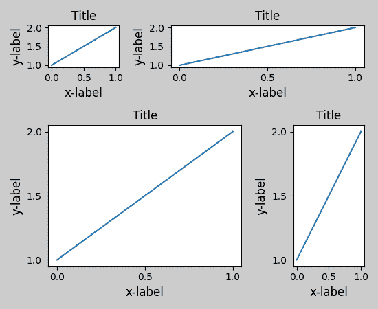

虽然没有彻底测试，它看起来也适用于`aspect`不为`auto`的子图（例如带有图像的轴域）。

```
arr = np.arange(100).reshape((10,10))

plt.close('all')
fig = plt.figure(figsize=(5,4))

ax = plt.subplot(111)
im = ax.imshow(arr, interpolation="none")

plt.tight_layout()
```

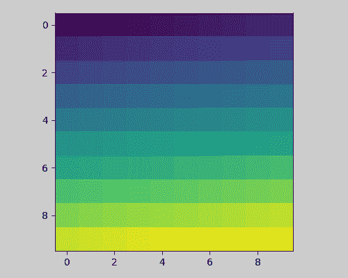

## 警告

*   `tight_layout()`只考虑刻度标签，轴标签和标题。 因此，其他艺术家可能被截断并且也可能重叠。
*   它假定刻度标签，轴标签和标题所需的额外空间与轴域的原始位置无关。 这通常是真的，但在罕见的情况下不是。
*   `pad = 0`将某些文本剪切几个像素。 这可能是当前算法的错误或限制，并且不清楚为什么会发生。 同时，推荐使用至少大于 0.3 的间隔。

## 和`GridSpec`一起使用

`GridSpec`拥有自己的`tight_layout()`方法（pyplot API 的`tight_layout()`也能生效）。

```
 plt.close('all')
fig = plt.figure()

import matplotlib.gridspec as gridspec

gs1 = gridspec.GridSpec(2, 1)
ax1 = fig.add_subplot(gs1[0])
ax2 = fig.add_subplot(gs1[1])

example_plot(ax1)
example_plot(ax2)

gs1.tight_layout(fig)
```

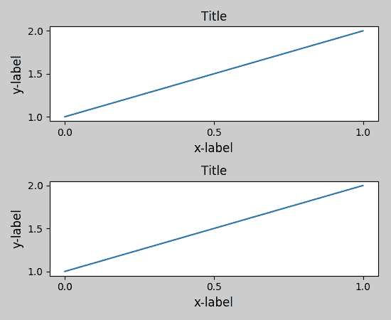

你可以提供一个可选的`rect`参数，指定子图所填充的边框。 坐标必须为标准化图形坐标，默认值为`(0, 0, 1, 1)`。

```
gs1.tight_layout(fig, rect=[0, 0, 0.5, 1])
```

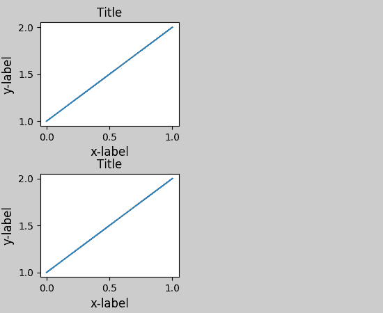

例如，这可用于带有多个`gridspecs`的图形。

```
gs2 = gridspec.GridSpec(3, 1)

for ss in gs2:
    ax = fig.add_subplot(ss)
    example_plot(ax)
    ax.set_title("")
    ax.set_xlabel("")

ax.set_xlabel("x-label", fontsize=12)

gs2.tight_layout(fig, rect=[0.5, 0, 1, 1], h_pad=0.5)
```

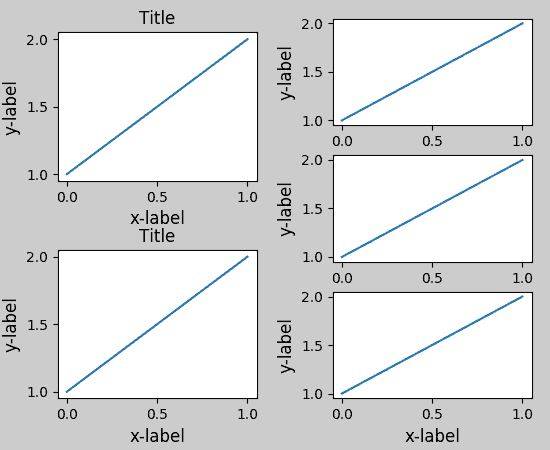

我们可以尝试匹配两个网格的顶部和底部。

```
top = min(gs1.top, gs2.top)
bottom = max(gs1.bottom, gs2.bottom)

gs1.update(top=top, bottom=bottom)
gs2.update(top=top, bottom=bottom)
```

虽然这应该足够好了，调整顶部和底部可能也需要调整`hspace`。 为了更新`hspace`和`vspace`，我们再次使用更新后的`rect`参数调用`tight_layout()`。 注意，`rect`参数指定的区域包括刻度标签。因此，我们将底部（正常情况下为 0）增加每个`gridspec`的底部之差。 顶部也一样。

```
top = min(gs1.top, gs2.top)
bottom = max(gs1.bottom, gs2.bottom)

gs1.tight_layout(fig, rect=[None, 0 + (bottom-gs1.bottom),
                            0.5, 1 - (gs1.top-top)])
gs2.tight_layout(fig, rect=[0.5, 0 + (bottom-gs2.bottom),
                            None, 1 - (gs2.top-top)],
                 h_pad=0.5)
```

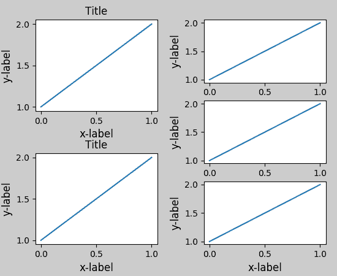

## 和`AxesGrid1`一起使用

虽然受限但也支持`axes_grid1`工具包

```
plt.close('all')
fig = plt.figure()

from mpl_toolkits.axes_grid1 import Grid
grid = Grid(fig, rect=111, nrows_ncols=(2,2),
            axes_pad=0.25, label_mode='L',
            )

for ax in grid:
    example_plot(ax)
    ax.title.set_visible(False)

plt.tight_layout()
```

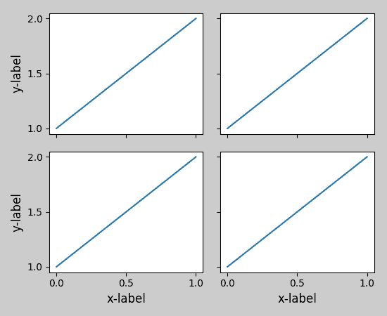

## 颜色条

如果你使用`colorbar`命令创建了颜色条，创建的颜色条是`Axes`而不是`Subplot`的实例，所以`tight_layout`没有效果。在 Matplotlib v1.1 中，你可以使用`gridspec`将颜色条创建为子图。

```
plt.close('all')
arr = np.arange(100).reshape((10,10))
fig = plt.figure(figsize=(4, 4))
im = plt.imshow(arr, interpolation="none")

plt.colorbar(im, use_gridspec=True)

plt.tight_layout()
```

![])[http://matplotlib.org/_images/tight_layout_guide-14.png](http://matplotlib.org/_images/tight_layout_guide-14.png)

另一个选项是使用`AxesGrid1`工具包，显式为颜色条创建一个轴域：

```
plt.close('all')
arr = np.arange(100).reshape((10,10))
fig = plt.figure(figsize=(4, 4))
im = plt.imshow(arr, interpolation="none")

from mpl_toolkits.axes_grid1 import make_axes_locatable
divider = make_axes_locatable(plt.gca())
cax = divider.append_axes("right", "5%", pad="3%")
plt.colorbar(im, cax=cax)

plt.tight_layout()
```

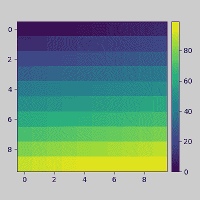