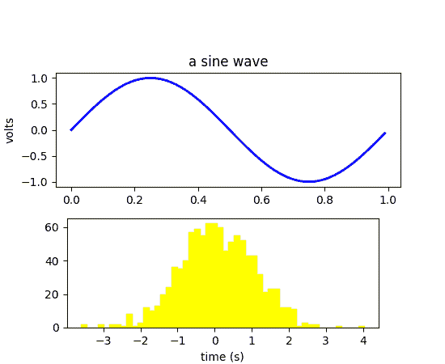

# 艺术家教程

> 原文：[Artist tutorial](http://matplotlib.org/users/artists.html)
> 
> 译者：[飞龙](https://github.com/)
> 
> 协议：[CC BY-NC-SA 4.0](http://creativecommons.org/licenses/by-nc-sa/4.0/)

matplotlib API 有三个层级。 `matplotlib.backend_bases.FigureCanvas`是绘制图形的区域，`matplotlib.backend_bases.Renderer`是知道如何在`ChartCanvas`上绘制的对象，而`matplotlib.artist.Artist`是知道如何使用渲染器在画布上画图的对象。 `FigureCanvas`和`Renderer`处理与用户界面工具包（如 wxPython）或 PostScript® 等绘图语言交互的所有细节，`Artist`处理所有高级结构，如表示和布局图形，文本和线条。用户通常要花费95％的时间来处理艺术家。

有两种类型的艺术家：基本类型和容器类型。基本类型表示我们想要绘制到画布上的标准图形对象：`Line2D`，`Rectangle`，`Text`，`AxesImage`等，容器是放置它们的位置（`Axis`，`Axes`和`Figure`）。标准用法是创建一个`Figure`实例，使用`Figure`创建一个或多个`Axes`或`Subplot`实例，并使用`Axes`实例的辅助方法来创建基本类型。在下面的示例中，我们使用`matplotlib.pyplot.figure()`创建一个`Figure`实例，这是一个便捷的方法，用于实例化`Figure`实例并将它们与你的用户界面或绘图工具包`FigureCanvas`连接。正如我们将在下面讨论的，这不是必须的 - 你可以直接使用 PostScript，PDF，Gtk+ 或 wxPython `FigureCanvas`实例，直接实例化你的图形并连接它们 - 但是因为我们在这里关注艺术家 API，我们让`pyplot`为我们处理一些细节：

```
import matplotlib.pyplot as plt
fig = plt.figure()
ax = fig.add_subplot(2,1,1) # two rows, one column, first plot
```

`Axes`可能是 matplotlib API 中最重要的类，你将在大多数时间使用它。 这是因为`Axes`是大多数对象所进入的绘图区域，`Axes`有许多特殊的辅助方法（`plot()`，`text()`，`hist()`，`imshow()`）来创建最常见的图形基本类型 `Line2D`，`Text`，`Rectangle`，`Image`）。 这些辅助方法将获取你的数据（例如 numpy 数组和字符串），并根据需要创建基本`Artist`实例（例如，`Line2D`），将它们添加到相关容器中，并在请求时绘制它们。 大多数人可能熟悉子图，这只是`Axes`的一个特例，它存在于`Subplot`实例的列网格的固定行上。 如果要在任意位置创建`Axes`，只需使用`add_axes()`方法，该方法接受`[left, bottom, width, height]`值的列表，以 0~1 的图形相对坐标为单位：

```
fig2 = plt.figure()
ax2 = fig2.add_axes([0.15, 0.1, 0.7, 0.3])
```

以我们的例子继续：

```
import numpy as np
t = np.arange(0.0, 1.0, 0.01)
s = np.sin(2*np.pi*t)
line, = ax.plot(t, s, color='blue', lw=2)
```

在这个例子中，`ax`是上面的`fig.add_subplot`调用创建的`Axes`实例（记住`Subplot`只是`Axes`的一个子类），当你调用`ax.plot`时，它创建一个`Line2D`实例并将其添加到`Axes.lines`列表中。 在下面的 ipython 交互式会话中，你可以看到`Axes.lines`列表的长度为 1，并且包含由`line, = ax.plot...`调用返回的相同线条：

```
In [101]: ax.lines[0]
Out[101]: <matplotlib.lines.Line2D instance at 0x19a95710>

In [102]: line
Out[102]: <matplotlib.lines.Line2D instance at 0x19a95710>
```

如果你对`ax.plot`进行连续调用（并且保持状态为『on』，这是默认值），则将在列表中添加其他线条。 你可以稍后通过调用列表方法删除线条；任何一个方法都可以：

```
del ax.lines[0]
ax.lines.remove(line)  # one or the other, not both!
```

轴域也拥有辅助方法，用于设置和装饰 x 和 y 轴的刻度、刻度标签和轴标签：

```
xtext = ax.set_xlabel('my xdata') # returns a Text instance
ytext = ax.set_ylabel('my ydata')
```

当你调用`ax.set_xlabel`时，它将信息传递给`XAxis`的`Text`实例，每个`Axes`实例都包含`XAxis`和`YAxis`，它们处理刻度、刻度标签和轴标签的布局和绘制。

尝试创建下面的图形：



## 自定义你的对象

图中的每个元素都由一个 matplotlib 艺术家表示，每个元素都有一个扩展属性列表用于配置它的外观。 图形本身包含一个`Rectangle`，正好是图形的大小，你可以使用它来设置图形的背景颜色和透明度。 同样，每个`Axes`边框（在通常的 matplotlib 绘图中是标准的白底黑边）拥有一个`Rectangle`实例，用于确定轴域的颜色，透明度和其他属性，这些实例存储为成员变量`Figure.patch`和`Axes.patch`（『Patch』是一个继承自 MATLAB 的名称，它是图形上的一个颜色的 2D『补丁』，例如矩形，圆和多边形）。每个 matplotlib 艺术家都有以下属性。

| 属性 | 描述 |
| --- | --- |
| alpha | 透明度 - 0 ~ 1 的标量 |
| animated | 用于帮助动画绘制的布尔值 |
| axes | 艺术家所在的轴域，可能为空 |
| clip_box | 用于剪切艺术家的边框 |
| clip_on | 剪切是否开启 |
| clip_path | 艺术家被剪切的路径 |
| contains | 一个拾取函数，用于判断艺术家是否位于拾取点 |
| figure | 艺术家所在的图形实例，可能为空 |
| label | 文本标签（用于自动标记） |
| picker | 控制对象拾取的 Python 对象 |
| transform | 变换 |
| visible | 布尔值，表示艺术家是否应该绘制 |
| zorder | 确定绘制顺序的数值 |
| rasterized | 布尔值，是否将向量转换为光栅图形（出于压缩或 eps 透明度） |

每个属性都使用一个老式的`setter`或`getter`（是的，我们知道这会刺激 Python 爱好者，我们计划支持通过属性或 traits 直接访问，但它还没有完成）。 例如，要将当前`alpha`值变为一半：

```
a = o.get_alpha()
o.set_alpha(0.5*a)
```

如果你打算可以一次性设置一些属性，你也可以以关键字参数使用`set`方法，例如：

```
o.set(alpha=0.5, zorder=2)
```

如果你在 Python 交互式 Shell 中工作，检查`Artist`属性的一种方便的方法是使用`matplotlib.artist.getp()`函数（在 pylab 中只需要`getp()`），它列出了属性及其值。 这适用于从`Artist`派生的类，例如`Figure`和`Rectangle`。 这里是上面提到的`Figure`的矩形属性：

```
In [149]: matplotlib.artist.getp(fig.patch)
    alpha = 1.0
    animated = False
    antialiased or aa = True
    axes = None
    clip_box = None
    clip_on = False
    clip_path = None
    contains = None
    edgecolor or ec = w
    facecolor or fc = 0.75
    figure = Figure(8.125x6.125)
    fill = 1
    hatch = None
    height = 1
    label =
    linewidth or lw = 1.0
    picker = None
    transform = <Affine object at 0x134cca84>
    verts = ((0, 0), (0, 1), (1, 1), (1, 0))
    visible = True
    width = 1
    window_extent = <Bbox object at 0x134acbcc>
    x = 0
    y = 0
    zorder = 1
```

所有类的文档字符串也包含`Artist`属性，因此你可以查阅交互式『帮助』或 [`Artist`模块](http://matplotlib.org/api/artist_api.html#artist-api)，来获取给定对象的属性列表。

## 对象容器

现在我们知道如何检查和设置我们想要配置的给定对象的属性，现在我们需要如何获取该对象。 前面提到了两种对象：基本类型和容器类型。 基本类型通常是你想要配置的东西（`Text`实例的字体，`Line2D`的宽度），虽然容器也有一些属性 - 例如 `Axes`是一个容器艺术家，包含你的绘图中的许多基本类型，但它也有属性，比如`xscale`来控制`xaxis`是『线性』还是『对数』。 在本节中，我们将回顾各种容器对象存储你想要访问的艺术家的位置。

## 图形容器

顶层容器艺术家是`matplotlib.figure.Figure`，它包含图形中的所有内容。 图形的背景是一个`Rectangle`，存储在`Figure.patch`中。 当你向图形中添加子图（`add_subplot()`）和轴域（`add_axes()`）时，这些会附加到`Figure.axes`。 它们也由创建它们的方法返回：

```
In [156]: fig = plt.figure()

In [157]: ax1 = fig.add_subplot(211)

In [158]: ax2 = fig.add_axes([0.1, 0.1, 0.7, 0.3])

In [159]: ax1
Out[159]: <matplotlib.axes.Subplot instance at 0xd54b26c>

In [160]: print fig.axes
[<matplotlib.axes.Subplot instance at 0xd54b26c>, <matplotlib.axes.Axes instance at 0xd3f0b2c>]
```

因为图形维护了『当前轴域』（见`figure.gca`和图`figure.sca`）的概念以支持 pylab/pyplot 状态机，所以不应直接从轴域列表中插入或删除轴域，而应使用`add_subplot()`和`add_axes()`方法进行插入，并使用`delaxes()`方法进行删除。 然而，你可以自由地遍历轴域列表或索引，来访问要自定义的`Axes`实例。 下面是一个打开所有轴域网格的示例：

```
for ax in fig.axes:
    ax.grid(True)
```

图形还拥有自己的文本，线条，补丁和图像，你可以使用它们直接添加基本类型。 图形的默认坐标系统简单地以像素（这通常不是你想要的）为单位，但你可以通过设置你添加到图中的艺术家的`transform`属性来控制它。

更有用的是『图形坐标系』，其中`(0,0)`是图的左下角，`(1,1)`是图的右上角，你可以通过将`Artist`的变换设置为`fig.transFigure`来获得：

```
In [191]: fig = plt.figure()

In [192]: l1 = matplotlib.lines.Line2D([0, 1], [0, 1],
           transform=fig.transFigure, figure=fig)

In [193]: l2 = matplotlib.lines.Line2D([0, 1], [1, 0],
           transform=fig.transFigure, figure=fig)

In [194]: fig.lines.extend([l1, l2])

In [195]: fig.canvas.draw()
```


这里是图形可以包含的艺术家总结：

| 图形属性 | 描述 |
| --- | --- |
| `axes` | `Axes`实例的列表（包括`Subplot`） |
| `patch` | `Rectangle`背景 |
| `images` | `FigureImages`补丁的列表 - 用于原始像素显示 |
| `legends` | 图形`Legend`实例的列表（不同于`Axes.legends`） |
| `lines` | 图形`Line2D`实例的列表（很少使用，见`Axes.lines`） |
| `patches` | 图形补丁列表（很少使用，见`Axes.patches`） |
| `texts` | 图形`Text`实例的列表 |

## 轴域容器

`matplotlib.axes.Axes`是 matplotlib 宇宙的中心 - 它包含绝大多数在一个图形中使用的艺术家，并带有许多辅助方法来创建和添加这些艺术家本身，以及访问和自定义所包含的艺术家的辅助方法。 就像`Figure`那样，它包含一个`Patch patch`，它是一个用于笛卡尔坐标的`Rectangle`和一个用于极坐标的`Cirecle`; 这个补丁决定了绘图区域的形状，背景和边框：

```
ax = fig.add_subplot(111)
rect = ax.patch  # a Rectangle instance
rect.set_facecolor('green')
```

当调用绘图方法（例如通常是`plot()`）并传递数组或值列表时，该方法将创建一个`matplotlib.lines.Line2D()`实例，将所有`Line2D`属性作为关键字参数传递， 将该线条添加到`Axes.lines`容器，并将其返回给你：

```
In [213]: x, y = np.random.rand(2, 100)

In [214]: line, = ax.plot(x, y, '-', color='blue', linewidth=2)
```

`plot`返回一个线条列表，因为你可以传入多个`x,y`偶对来绘制，我们将长度为一的列表的第一个元素解构到`line`变量中。 该线条已添加到`Axes.lines`列表中：

```
In [229]: print ax.lines
[<matplotlib.lines.Line2D instance at 0xd378b0c>]
```

与之类似，创建补丁的方法（如`bar()`）会创建一个矩形列表，将补丁添加到`Axes.patches`列表中：

```
In [233]: n, bins, rectangles = ax.hist(np.random.randn(1000), 50, facecolor='yellow')

In [234]: rectangles
Out[234]: <a list of 50 Patch objects>

In [235]: print len(ax.patches)
```

你不应该直接将对象添加到`Axes.lines`或`Axes.patches`列表，除非你确切知道你在做什么，因为`Axes`需要在它创建和添加对象做一些事情。 它设置`Artist`的`figure`和`axes`属性，以及默认`Axes`变换（除非设置了变换）。 它还检查`Artist`中包含的数据，来更新控制自动缩放的数据结构，以便可以调整视图限制来包含绘制的数据。 但是，你可以自己创建对象，并使用辅助方法（如`add_line()`和`add_patch()`）将它们直接添加到`Axes`。 这里是一个注释的交互式会话，说明正在发生什么：

```
In [261]: fig = plt.figure()

In [262]: ax = fig.add_subplot(111)

# create a rectangle instance
In [263]: rect = matplotlib.patches.Rectangle( (1,1), width=5, height=12)

# by default the axes instance is None
In [264]: print rect.get_axes()
None

# and the transformation instance is set to the "identity transform"
In [265]: print rect.get_transform()
<Affine object at 0x13695544>

# now we add the Rectangle to the Axes
In [266]: ax.add_patch(rect)

# and notice that the ax.add_patch method has set the axes
# instance
In [267]: print rect.get_axes()
Axes(0.125,0.1;0.775x0.8)

# and the transformation has been set too
In [268]: print rect.get_transform()
<Affine object at 0x15009ca4>

# the default axes transformation is ax.transData
In [269]: print ax.transData
<Affine object at 0x15009ca4>

# notice that the xlimits of the Axes have not been changed
In [270]: print ax.get_xlim()
(0.0, 1.0)

# but the data limits have been updated to encompass the rectangle
In [271]: print ax.dataLim.bounds
(1.0, 1.0, 5.0, 12.0)

# we can manually invoke the auto-scaling machinery
In [272]: ax.autoscale_view()

# and now the xlim are updated to encompass the rectangle
In [273]: print ax.get_xlim()
(1.0, 6.0)

# we have to manually force a figure draw
In [274]: ax.figure.canvas.draw()
```

有非常多的`Axes`辅助方法用于创建基本艺术家并将它们添加到他们各自的容器中。 下表总结了他们的一部分，他们创造的`Artist`的种类，以及他们在哪里存储它们。

| 辅助方法 | 艺术家 | 容器 |
| --- | --- | --- |
| `ax.annotate` - 文本标注 | `Annotate` | `ax.texts` |
| `ax.bar` - 条形图 | `Rectangle` | `ax.patches` |
| `ax.errorbar` - 误差条形图 | `Line2D` 和 `Rectangle` | `ax.lines` 和 `ax.patches` |
| `ax.fill` - 共享区域 | `Polygon` | `ax.patches` |
| `ax.hist` - 直方图 | `Rectangle` | `ax.patches` |
| `ax.imshow` - 图像数据 | `AxesImage` | `ax.images` |
| `ax.legend` - 轴域图例 | `Legend` | `ax.legends` |
| `ax.plot` - xy 绘图 | `Line2D` | `ax.lines` |
| `ax.scatter` - 散点图 | `PolygonCollection` | `ax.collections` |
| `ax.text` - 文本 | `Text` | `ax.texts` |

除了所有这些艺术家，`Axes`包含两个重要的艺术家容器：`XAxis`和`YAxis`，它们处理刻度和标签的绘制。 它们被存储为实例变量`xaxis`和`yaxis`。 `XAxis`和`YAxis`容器将在下面详细介绍，但请注意，`Axes`包含许多辅助方法，它们会将调用转发给`Axis`实例，因此你通常不需要直接使用它们，除非你愿意。 例如，你可以使用`Axes`辅助程序方法设置`XAxis`刻度标签的字体大小：

```
for label in ax.get_xticklabels():
    label.set_color('orange')
```

下面是轴域所包含的艺术家的总结

| 轴域属性 | 描述 |
| --- | --- |
| `artists` | `Artist`实例的列表 |
| `patch` | 用于轴域背景的`Rectangle`实例 |
| `collections` | `Collection`实例的列表 |
| `images` | `AxesImage`的列表 |
| `legends` | `Legend`实例的列表 |
| `lines` | `Line2D`实例的列表 |
| `patches` | `Patch`实例的列表 |
| `texts` | `Text`实例的列表 |
| `xaxis` | `matplotlib.axis.XAxis`实例 |
| `yaxis` | `matplotlib.axis.YAxis`实例 |

## 轴容器

`matplotlib.axis.Axis`实例处理刻度线，网格线，刻度标签和轴标签的绘制。你可以分别为y轴配置左和右刻度，为x轴分别配置上和下刻度。 `Axis`还存储在自动缩放，平移和缩放中使用的数据和视图间隔，以及`Locator`和`Formatter`实例，它们控制刻度位置以及它们表示为字符串的方式。

每个`Axis`对象都包含一个`label`属性（这是 pylab 在调用`xlabel()`和`ylabel()`时修改的东西）以及主和次刻度的列表。刻度是`XTick`和`YTick`实例，它包含渲染刻度和刻度标签的实际线条和文本基本类型。因为刻度是按需动态创建的（例如，当平移和缩放时），你应该通过访问器方法`get_major_ticks()`和`get_minor_ticks()`访问主和次刻度的列表。虽然刻度包含所有下面要提及的基本类型，`Axis`方法包含访问器方法来返回刻度线，刻度标签，刻度位置等：

```
In [285]: axis = ax.xaxis

In [286]: axis.get_ticklocs()
Out[286]: array([ 0.,  1.,  2.,  3.,  4.,  5.,  6.,  7.,  8.,  9.])

In [287]: axis.get_ticklabels()
Out[287]: <a list of 10 Text major ticklabel objects>

# note there are twice as many ticklines as labels because by
#  default there are tick lines at the top and bottom but only tick
#  labels below the xaxis; this can be customized
In [288]: axis.get_ticklines()
Out[288]: <a list of 20 Line2D ticklines objects>

# by default you get the major ticks back
In [291]: axis.get_ticklines()
Out[291]: <a list of 20 Line2D ticklines objects>

# but you can also ask for the minor ticks
In [292]: axis.get_ticklines(minor=True)
Out[292]: <a list of 0 Line2D ticklines objects>
```

下面是`Axis`的一些有用的访问器方法的总结（它们拥有相应的`setter`，如`set_major_formatter`）。

| 访问器方法 | 描述 |
| --- | --- |
| get_scale | 轴的比例，例如`'log'`或`'linear'` |
| get_view_interval | 轴视图范围的内部实例 |
| get_data_interval | 轴数据范围的内部实例 |
| get_gridlines | 轴的网格线列表 |
| get_label | 轴标签 - `Text`实例 |
| get_ticklabels | `Text`实例的列表 - 关键字`minor=True |
| get_ticklines | `Line2D`实例的列表 - 关键字`minor=True |
| get_ticklocs | `Tick`位置的列表 - 关键字`minor=True |
| get_major_locator | 用于主刻度的`matplotlib.ticker.Locator`实例 |
| get_major_formatter | 用于主刻度的`matplotlib.ticker.Formatter`实例 |
| get_minor_locator | 用于次刻度的`matplotlib.ticker.Locator`实例 |
| get_minor_formatter | 用于次刻度的`matplotlib.ticker.Formatter`实例 |
| get_major_ticks | 用于主刻度的`Tick`实例列表 |
| get_minor_ticks | 用于次刻度的`Tick`实例列表 |
| grid | 为主或次刻度打开或关闭网格 |

这里是个例子，出于美观不太推荐，它自定义了轴域和刻度属性。

```
import numpy as np
import matplotlib.pyplot as plt

# plt.figure creates a matplotlib.figure.Figure instance
fig = plt.figure()
rect = fig.patch # a rectangle instance
rect.set_facecolor('lightgoldenrodyellow')

ax1 = fig.add_axes([0.1, 0.3, 0.4, 0.4])
rect = ax1.patch
rect.set_facecolor('lightslategray')

for label in ax1.xaxis.get_ticklabels():
    # label is a Text instance
    label.set_color('red')
    label.set_rotation(45)
    label.set_fontsize(16)

for line in ax1.yaxis.get_ticklines():
    # line is a Line2D instance
    line.set_color('green')
    line.set_markersize(25)
    line.set_markeredgewidth(3)

plt.show()
```


## 刻度容器

`matplotlib.axis.Tick`是我们从`Figure`到`Axes`再到`Axis`再到`Tick`的最终的容器对象。`Tick`包含刻度和网格线的实例，以及上侧和下侧刻度的标签实例。 每个都可以直接作为`Tick`的属性访问。此外，也有用于确定上标签和刻度是否对应`x`轴，以及右标签和刻度是否对应`y`轴的布尔变量。

| 刻度属性 | 描述 |
| --- | --- |
| `tick1line` | `Line2D`实例 |
| `tick2line` | `Line2D`实例 |
| `gridline` | `Line2D`实例 |
| `label1` | `Text`实例 |
| `label2` | `Text`实例 |
| `gridOn` | 确定是否绘制刻度线的布尔值 |
| `tick1On` | 确定是否绘制主刻度线的布尔值 |
| `tick2On` | 确定是否绘制次刻度线的布尔值 |
| `label1On` | 确定是否绘制主刻度标签的布尔值 |
| `label2On` | 确定是否绘制次刻度标签的布尔值 |

这里是个例子，使用美元符号设置右侧刻度，并在`y`轴右侧将它们设成绿色。

```
import numpy as np
import matplotlib.pyplot as plt
import matplotlib.ticker as ticker

# Fixing random state for reproducibility
np.random.seed(19680801)

fig = plt.figure()
ax = fig.add_subplot(111)
ax.plot(100*np.random.rand(20))

formatter = ticker.FormatStrFormatter('$%1.2f')
ax.yaxis.set_major_formatter(formatter)

for tick in ax.yaxis.get_major_ticks():
    tick.label1On = False
    tick.label2On = True
    tick.label2.set_color('green')

plt.show()
```

