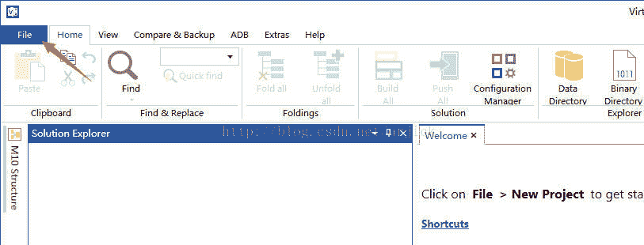

# 安卓逆向系列教程（三）静态分析工具

> 作者：[飞龙](https://github.com/wizardforcel)

以下工具可能都需要先安装 JDK，安装方法就不说了，随便一搜就是。

## Android Killer

几年之前，我们要破解 APK，可能需要用到 apktool、dex2jar、jd-gui 以及 smali2java 等工具。还需要在控制台中键入命令，但现在有了集成工具，一切都变得省事了。

我们从[这里](http://www.pd521.com/thread-136-1-1.html)下载 Android Killer。

我们打开`AndroidKiller.exe`，它的启动界面是这样，很酷吧。

打开之后，点击左上角的“打开”按钮，选择要反编译的 APK，或者直接把 APK 拖进来。软件会马上开始反编译。

等一会儿，我们会看到反编译完成。之后切换到“工程管理器”，可以看到项目的结构，点击其中的文件可以在右边看到文件内容：

点击编辑框上方的 Java 图标，就会打开熟悉的 jd-gui 窗口：

我们切换到“工程搜索”，在下方的“搜索字符”输入框中输入`app_name`，点击下方的“搜索”。下方的框中会显示结果。我们点击结果，编辑框中会定位到具体文件。我们可以修改一下。

之后我们点击`Android`选项卡，点击第一项“编译”。

等一小会儿，重编译就完成了。

如果我们启动了模拟器，可以使用右边的几个按钮安装并运行。

此外，“工具”选项卡中有很多实用工具，大家可以一一尝试。

## APK 改之理

在[这里](http://www.cr173.com/soft/61648.html)下载软件。

双击`ApkIDE.exe`启动程序。如果是 XP 系统启动不了它，请下载安装 .Net Framework 2.0。

第一次启动时，软件会自动查找系统中的 JRE 安装目录，如果没有找到会提示你配置 SDK，可以点击菜单 “工具->配置SDK` 对 JDK 进行配置，如下图。JDK 的安装路径必须配置（如果不配置，则无法进行修改操作），Android SDK 则随意（有些功能需要用到它，比如 ddms 等，但这些功能都无关修改工作）。

单击菜单“项目->打开Apk”选择要修改的 Apk 文件（注：文件名称必须只有字母、数字、下划线、空格、点号等组成，不能包含中文或其它亚洲字符）。

在打开 Apk 文件时 Apk 改之理会先对其进行基本的解析（包括它的名称、包、权限等)，然后根据该 apk 应用的包名生成它的同名工作目录，如果这个工作目录已经存在，Apk 改之理会询问是否要重新反编译 Apk。这里要注意，已有的工作目录通常是你以前修改这个 Apk 应用时所生成的工作目录，如果你要继续这个修改操作，则单击“否”继续使用它，否则就重新反编译得到一个全新的源代码。

提示：如果你想继续旧工作但却误点了“是”按钮，也不用担心，删除的目录被扔进了系统垃圾箱，你可以直接去系统回收站恢复。恢复时注意，如果你之前成功对这个应用进行过 dex2jar 操作（由软件在反编译 apk 时自动进行，但可能会因一些原因而失败），那么回收站中会看到两个同名的目录，选中它们右键恢复即可。（注：这个特性 Apk 改之理 2.1 或更高版本中有效）

现在你可以使用软件的搜索、替换等功能来对源代码进行修改，这种修改包括汉化、去广告、改名、替换资源、图片、xx 等等。下图中各个图标按钮都有提示文字，可以将鼠标悬浮在按钮上显示文字提示。具体的各项说明会单独写个文章来详细解释，基本上也没什么难点。

这里先提示一些没有说明的小功能：

（1）在文件树上，或搜索后得到的文件列表上，按住 Shift 键并单击鼠标右键会直接显示操作系统菜单。

（2）在“输入输出面板组”的搜索结果面板中，搜索结果列表以标签的形式各自分开，鼠标悬浮在标签上会显示对应搜索结果的搜索条件。

（3）工作目录下的第一个`build`目录下的文件不会被搜索(因为这个是 Apktool 编译时用到的，与我们的修改无直接关系)。

修改完成后单击菜单“编译->编译生成Apk”重新将源代码打包成 apk 文件，新生成的 apk 存放在原 apk 的同级目录下，其名称以`ApkIDE_`开头。

单击菜单“编译->获取生成的”可以直接在资源浏览器中定位到 apk 所在的目录。

直接测试 Apk 需要用到菜单“ADB”下的菜单命令，如果你已经将设备连接到电脑，或者直接在电脑上打开了安卓模拟器，可以单击菜单“ADB->安装生成的APK”直接向设备或模拟器安装修改生成的 apk，然后再可以使用`adb logcat`来观察其运行状况。

如果发现 ADB 相关命令不起作用，你可以先用`adb devices`命令查看设备是否连接成功（可以直接在输入输出面板组的命令窗口输入`adb devices`），也可以使用菜单“工具->Dalvik Debug Monitor Service”（ddms）来测试。

## JEB

首先在[这里](http://download.csdn.net/detail/chuchus/9426005)下载软件。

打开软件之后，点击左上角的文件夹图标，之后选择要反编译的 APK 来打开文件。之后会进行反编译，完成后，主界面是这样：

左边的树形图会显示项目的所有包和类。右边的编辑框中会显示 Smali 代码，以及字符串等资源。选择`Decompiled Java`选项卡，还会看到对应的 Java 代码。

## VTS（Virtuous Ten Studio）

打开 VTS 之后，首先我们需要点击`File->New Solution`新建一个 solution：

接下来需要选择要反编译的文件：

之后是项目类型、项目名称、解决方案名称及位置：

这里我们全选：

最后选择 Apktool 的版本：

然后它会开始反编译：

完成后可以在左侧看到目录：

点击里面的文件可以查看 Smali 代码：

在文件上点击右键，会看到`Open Java Source`：

我们点击它，可以查看 Java 代码：

我们可以点击`Home->Build All`来重编译。

