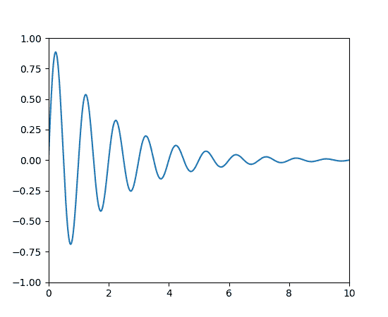
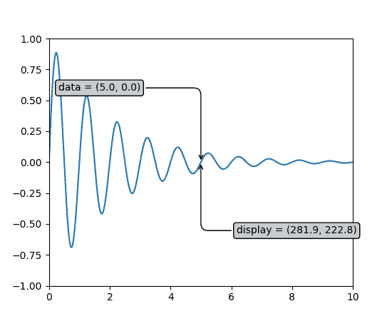
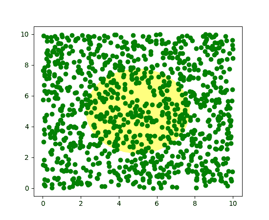
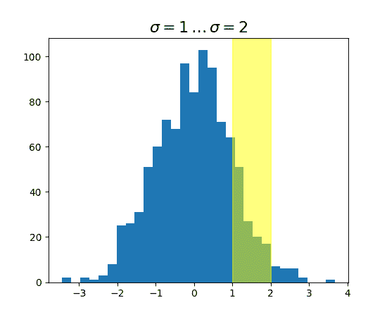

# 变换教程

> 原文：[Transformations Tutorial](http://matplotlib.org/users/transforms_tutorial.html)
> 
> 译者：[飞龙](https://github.com/)
> 
> 协议：[CC BY-NC-SA 4.0](http://creativecommons.org/licenses/by-nc-sa/4.0/)

像任何图形包一样，matplotlib 建立在变换框架之上，以便在坐标系，用户数据坐标系，轴域坐标系，图形坐标系和显示坐标系之间轻易变换。 在 95 ％的绘图中，你不需要考虑这一点，因为它发生在背后，但随着你接近自定义图形生成的极限，它有助于理解这些对象，以便可以重用 matplotlib 提供给你的现有变换，或者创建自己的变换（见`matplotlib.transforms`）。 下表总结了现有的坐标系，你应该在该坐标系中使用的变换对象，以及该系统的描述。 在『变换对象』一列中，`ax`是`Axes`实例，`fig`是一个图形实例。

| 坐标系 | 变换对象 | 描述 |
| --- | --- | --- |
| 数据 | `ax.transData` | 用户数据坐标系，由`xlim`和`ylim`控制 |
| 轴域 | `ax.transAxes` | 轴域坐标系；`(0,0)`是轴域左下角，`(1,1)`是轴域右上角 |
| 图形 | `fig.transFigure` | 图形坐标系；`(0,0)`是图形左下角，`(1,1)`是图形右上角 |
| 显示 | `None` | 这是显示器的像素坐标系; `(0,0)`是显示器的左下角，`(width, height)`是显示器的右上角，以像素为单位。 或者，可以使用恒等变换（`matplotlib.transforms.IdentityTransform()`）来代替`None`。 |

上表中的所有变换对象都接受以其坐标系为单位的输入，并将输入变换到显示坐标系。 这就是为什么显示坐标系没有『变换对象』的原因 - 它已经以显示坐标为单位了。 变换也知道如何反转自身，从显示返回自身的坐标系。 这在处理来自用户界面的事件（通常发生在显示空间中），并且你想知道数据坐标系中鼠标点击或按键按下的位置时特别有用。

## 数据坐标

让我们从最常用的坐标，数据坐标系开始。 每当向轴域添加数据时，matplotlib 会更新数据对象，`set_xlim()`和`set_ylim()`方法最常用于更新。 例如，在下图中，数据的范围在`x`轴上为从 0 到 10，在`y`轴上为从 -1 到 1。

```
import numpy as np
import matplotlib.pyplot as plt

x = np.arange(0, 10, 0.005)
y = np.exp(-x/2.) * np.sin(2*np.pi*x)

fig = plt.figure()
ax = fig.add_subplot(111)
ax.plot(x, y)
ax.set_xlim(0, 10)
ax.set_ylim(-1, 1)

plt.show()
```



你可以使用`ax.transData`实例将数据变换为显示坐标系，无论是单个点或是一系列点，如下所示：

```
In [14]: type(ax.transData)
Out[14]: <class 'matplotlib.transforms.CompositeGenericTransform'>

In [15]: ax.transData.transform((5, 0))
Out[15]: array([ 335.175,  247.   ])

In [16]: ax.transData.transform([(5, 0), (1,2)])
Out[16]:
array([[ 335.175,  247\.   ],
       [ 132.435,  642.2  ]])
```

你可以使用`inverted()`方法创建一个变换，从显示坐标变换为数据坐标：

```
In [41]: inv = ax.transData.inverted()

In [42]: type(inv)
Out[42]: <class 'matplotlib.transforms.CompositeGenericTransform'>

In [43]: inv.transform((335.175,  247.))
Out[43]: array([ 5.,  0.])
```

如果你一直关注本教程，如果你的窗口大小或 dpi 设置不同，显示坐标的确切值可能会有所不同。 同样，在下面的图形中，在 ipython 会话中，由显示标记的点可能并不相同，因为文档图形大小默认值是不同的。



> 注意
> 
> 如果在 GUI 后端中运行上述示例中的源代码，你还可能发现数据和显示标注的两个箭头不会指向完全相同的点。 这是因为显示点是在显示图形之前计算的，并且 GUI 后端可以在创建图形时稍微调整图形大小。 如果你自己调整图的大小，效果更明显。 这是你很少想要处理显示空间的一个很好的原因，但是你可以连接到`'on_draw'`事件来更新图上的图坐标；请参阅[事件处理和选择](http://matplotlib.org/users/event_handling.html#event-handling-tutorial)。

当你更改轴的`x`或`y`的范围时，将更新数据范围，以便变换生成新的显示点。 注意，当我们只是改变`ylim`，只有`y`显示坐标改变，当我们改变`xlim`也同理。 我们在谈论 [Bbox](http://matplotlib.org/api/transformations.html#matplotlib.transforms.Bbox) 时会深入。

```
In [54]: ax.transData.transform((5, 0))
Out[54]: array([ 335.175,  247.   ])

In [55]: ax.set_ylim(-1,2)
Out[55]: (-1, 2)

In [56]: ax.transData.transform((5, 0))
Out[56]: array([ 335.175     ,  181.13333333])

In [57]: ax.set_xlim(10,20)
Out[57]: (10, 20)

In [58]: ax.transData.transform((5, 0))
Out[58]: array([-171.675     ,  181.13333333])
```

## 轴域坐标

在数据坐标系之后，轴域可能是第二有用的坐标系。 这里，点`(0,0)`是轴域或子图的左下角，`(0.5,0.5)`是中心，`(1.0,1.0)`是右上角。 你还可以引用范围之外的点，因此`(-0.1,1.1)`位于轴的左上方。 此坐标系在将文本放置在轴中时非常有用，因为你通常需要在固定的位置（例如，轴域窗格的左上角）放置文本气泡，并且在平移或缩放时保持该位置固定。 这里是一个简单的例子，创建四个面板，并将他们标记为`'A'`，`'B'`，`'C'`，`'D'`，你经常在期刊上看到它们。


你也可以在轴坐标系中创建线条或者补丁，但是以我的经验，这比使用`ax.transAxes`放置文本更不实用。 尽管如此，这里是一个愚蠢的例子，它在数据空间中绘制了一些随机点，并且覆盖在一个半透明的圆上面，这个圆以轴域的中心为圆心，半径为轴域的四分之一。 - 如果你的轴域不保留高宽比（见`set_aspect ()`），它将看起来像一个椭圆。 使用平移/缩放工具移动，或手动更改数据的`xlim`和`ylim`，你将看到数据移动，但圆将保持固定，因为它不在数据坐标中，并且将始终保持在轴域的中心 。



## 混合变换

在数据与轴域坐标混合的混合坐标空间中绘制是非常实用的，例如创建一个水平跨度，突出`y`数据的一些区域但横跨`x`轴，而无论数据限制，平移或缩放级别等。实际上这些混合线条和跨度非常有用，我们已经内置了一些函数来使它们容易绘制（参见`axhline()`，`axvline()`，`axhspan()`，`axvspan()`），但是为了教学目的，我们使用混合变换实现这里的水平跨度。 这个技巧只适用于可分离的变换，就像你在正常的笛卡尔坐标系中看到的，但不能为不可分离的变换，如`PolarTransform`（极坐标变换）。

```
import numpy as np
import matplotlib.pyplot as plt
import matplotlib.patches as patches
import matplotlib.transforms as transforms

fig = plt.figure()
ax = fig.add_subplot(111)

x = np.random.randn(1000)

ax.hist(x, 30)
ax.set_title(r'$\sigma=1 \/ \dots \/ \sigma=2$', fontsize=16)

# the x coords of this transformation are data, and the
# y coord are axes
trans = transforms.blended_transform_factory(
    ax.transData, ax.transAxes)

# highlight the 1..2 stddev region with a span.
# We want x to be in data coordinates and y to
# span from 0..1 in axes coords
rect = patches.Rectangle((1,0), width=1, height=1,
                         transform=trans, color='yellow',
                         alpha=0.5)

ax.add_patch(rect)

plt.show()
```



> 注
> 
> 混合变换非常有用，其中`x`为数据坐标而`y`为轴域坐标，我们拥有辅助方法来返回内部使用的版本 mpl ，用于绘制`ticks`，`ticklabels`以及其他。方法是`matplotlib.axes.Axes.get_xaxis_transform()`和`matplotlib.axes.Axes.get_yaxis_transform()`。 因此，在上面的示例中，`blended_transform_factory()`的调用可以替换为`get_xaxis_transform`：
> 
> ```
> trans = ax.get_xaxis_transform()
> ```

## 使用偏移变换来创建阴影效果

变换的一个用法，是创建偏离另一变换的新变换，例如，放置一个对象，相对于另一对象有一些偏移。 通常，你希望物理尺寸上有一些移位，例如以点或英寸，而不是数据坐标为单位，以便移位效果在不同的缩放级别和 dpi 设置下保持不变。

偏移的一个用途是创建一个阴影效果，其中你绘制一个与第一个相同的对象，刚好在它的右边和下面，调整`zorder`来确保首先绘制阴影，然后绘制对象，阴影在它之上。 变换模块具有辅助变换`ScaledTranslation`。 它可以这样来实例化：

```
trans = ScaledTranslation(xt, yt, scale_trans)
```

其中`xt`和`yt`是变换的偏移，`scale_trans`是变换，在应用偏移之前的变换期间缩放`xt`和`yt`。 一个典型的用例是，将图形的`fig.dpi_scale_trans`变换用于`scale_trans`参数，来在实现最终的偏移之前，首先将以点为单位的`xt`和`yt`缩放到显示空间。
DPI 和英寸偏移是常见的用例，我们拥有一个特殊的辅助函数，来在`matplotlib.transforms.offset_copy()`中创建它，它返回一个带有附加偏移的新变换。 但在下面的示例中，我们将自己创建偏移变换。 注意使用加法运算符：

```
offset = transforms.ScaledTranslation(dx, dy,
         fig.dpi_scale_trans)
shadow_transform = ax.transData + offset
```

这里显示了，可以使用加法运算符将变换链起来。 该代码表示：首先应用数据变换`ax.transData`，然后由`dx`和`dy`点翻译数据。 在[排版](https://en.wikipedia.org/wiki/Point_%28typography%29)中，一个点是 1/72 英寸，通过以点为单位指定偏移，你的图形看起来是一样的，无论所保存的 dpi 分辨率。

```
import numpy as np
import matplotlib.pyplot as plt
import matplotlib.patches as patches
import matplotlib.transforms as transforms

fig = plt.figure()
ax = fig.add_subplot(111)

# make a simple sine wave
x = np.arange(0., 2., 0.01)
y = np.sin(2*np.pi*x)
line, = ax.plot(x, y, lw=3, color='blue')

# shift the object over 2 points, and down 2 points
dx, dy = 2/72., -2/72.
offset = transforms.ScaledTranslation(dx, dy,
  fig.dpi_scale_trans)
shadow_transform = ax.transData + offset

# now plot the same data with our offset transform;
# use the zorder to make sure we are below the line
ax.plot(x, y, lw=3, color='gray',
  transform=shadow_transform,
  zorder=0.5*line.get_zorder())

ax.set_title('creating a shadow effect with an offset transform')
plt.show()
```


## 变换流水线

我们在本教程中一直使用的`ax.transData`变换是三种不同变换的组合，它们构成从数据到显示坐标的变换流水线。 Michael Droettboom 实现了变换框架，提供了一个干净的 API，它隔离了在极坐标和对数坐标图中发生的非线性投影和尺度，以及在平移和缩放时发生的线性仿射变换。 这里有一个效率问题，因为你可以平移和放大你的轴域，它会影响仿射变换，但你可能不需要计算潜在的昂贵的非线性比例或简单的导航事件的投影。 也可以将仿射变换矩阵相乘在一起，然后在一步之中将它们应用于坐标。 这对所有可能的变换不都是有效的。

这里是在`ax.transData`实例在基本可分离的`Axes`类中的定义方式。

```
self.transData = self.transScale + (self.transLimits + self.transAxes)
```

我们已经在`Axes`坐标中引入了上面的`transAxes`实例，它将轴或子图边界框的`(0,0)`，`(1,1)`角映射到显示空间，所以让我们看看这两个部分。

`self.transLimits`是从数据到轴域坐标的变换; 也就是说，它将你的视图`xlim`和`ylim`映射到轴域单位空间（然后`transAxes`将该单位空间用于显示空间）。 我们可以在这里看到这一点：

```
In [80]: ax = subplot(111)

In [81]: ax.set_xlim(0, 10)
Out[81]: (0, 10)

In [82]: ax.set_ylim(-1,1)
Out[82]: (-1, 1)

In [84]: ax.transLimits.transform((0,-1))
Out[84]: array([ 0.,  0.])

In [85]: ax.transLimits.transform((10,-1))
Out[85]: array([ 1.,  0.])

In [86]: ax.transLimits.transform((10,1))
Out[86]: array([ 1.,  1.])

In [87]: ax.transLimits.transform((5,0))
Out[87]: array([ 0.5,  0.5])
```

而且我们可以使用相同的反转变换，从轴域单位坐标变换回数据坐标。

```
In [90]: inv.transform((0.25, 0.25))
Out[90]: array([ 2.5, -0.5])
```

最后一个是`self.transScale`属性，它负责数据的可选非线性缩放，例如对数轴域。 当`Axes`初始化时，这只是设置为恒等变换，因为基本的 matplotlib 轴域具有线性缩放，但是当你调用对数缩放函数如`semilogx()`或使用`set_xscale`显式设置为对数时，`ax.transScale`属性为处理非线性投影而设置。 缩放变换是相应`xaxis`和`yaxis` 的`Axis`实例的属性。 例如，当调用`ax.set_xscale('log')`时，`xaxis`会将其缩放更新为`matplotlib.scale.LogScale`实例。

对于不可分离的轴域，`PolarAxes`，还有一个要考虑的部分，投影变换。 `matplotlib.projections.polar.PolarAxes`的`transData`类似于典型的可分离 matplotlib 轴域，带有一个额外的部分，`transProjection`：

```
self.transData = self.transScale + self.transProjection + \
    (self.transProjectionAffine + self.transAxes)
```

`transProjection`将来自空间的投影，例如，地图数据的纬度和经度，或极坐标数据的半径和极角，处理为可分离的笛卡尔坐标系。 在`matplotlib.projections`包中有几个投影示例，深入了解的最好方法是打开这些包的源代码，看看如何自己制作它，因为 matplotlib 支持可扩展的轴域和投影。 Michael Droettboom 提供了一个创建一个锤投影轴域的很好的教程示例；请参阅 api 示例代码：[`custom_projection_example.py`](http://matplotlib.org/examples/api/custom_projection_example.html#api-custom-projection-example)。