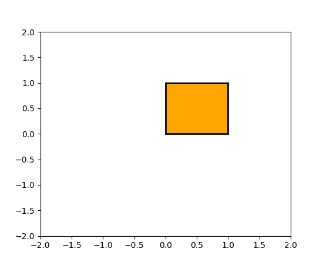
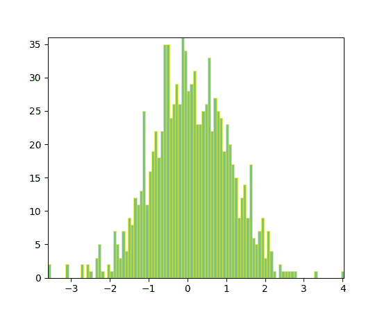

# 路径教程

> 原文：[Path Tutorial](http://matplotlib.org/users/path_tutorial.html)
> 
> 译者：[飞龙](https://github.com/)
> 
> 协议：[CC BY-NC-SA 4.0](http://creativecommons.org/licenses/by-nc-sa/4.0/)

位于所有`matplotlib.patch`对象底层的对象是`Path`，它支持`moveto`，`lineto`，`curveto`命令的标准几个，来绘制由线段和样条组成的简单和复合轮廓。 路径由`(x,y)`顶点的`(N,2)`数组，以及路径代码的长度为 N 的数组实例化。 例如，为了绘制`(0,0)`到`(1,1)`的单位矩形，我们可以使用这个代码：

```
import matplotlib.pyplot as plt
from matplotlib.path import Path
import matplotlib.patches as patches

verts = [
    (0., 0.), # left, bottom
    (0., 1.), # left, top
    (1., 1.), # right, top
    (1., 0.), # right, bottom
    (0., 0.), # ignored
    ]

codes = [Path.MOVETO,
         Path.LINETO,
         Path.LINETO,
         Path.LINETO,
         Path.CLOSEPOLY,
         ]

path = Path(verts, codes)

fig = plt.figure()
ax = fig.add_subplot(111)
patch = patches.PathPatch(path, facecolor='orange', lw=2)
ax.add_patch(patch)
ax.set_xlim(-2,2)
ax.set_ylim(-2,2)
plt.show()
```



下面的路径代码会被接受：

| 代码 | 顶点 | 描述 |
| --- | --- | --- |
| `STOP` | 1 （被忽略） | 标志整个路径终点的标记（当前不需要或已忽略） |
| `MOVETO` | 1 | 提起笔并移动到指定顶点 |
| `LINETO` | 1 | 从当前位置向指定顶点画线 |
| `CURVE3` | 2 （一个控制点，一个终点） | 从当前位置，以给定控制点向给定端点画贝塞尔曲线 |
| `CURVE4` | 3 （两个控制点，一个终点） | 从当前位置，以给定控制点向给定端点画三次贝塞尔曲线 |
| `CLOSEPOLY` | 1 （点自身被忽略） | 向当前折线的起点画线 |

## 贝塞尔示例

一些路径组件需要以多个顶点来指定：例如`CURVE3`是具有一个控制点和一个端点的贝塞尔曲线，`CURVE4`具有用做两个控制点和端点的三个顶点。 下面的示例显示了`CURVE4`贝塞尔曲线 - 贝塞尔曲线将包含在起始点，两个控制点和终点的凸包中：

```
import matplotlib.pyplot as plt
from matplotlib.path import Path
import matplotlib.patches as patches

verts = [
    (0., 0.),  # P0
    (0.2, 1.), # P1
    (1., 0.8), # P2
    (0.8, 0.), # P3
    ]

codes = [Path.MOVETO,
         Path.CURVE4,
         Path.CURVE4,
         Path.CURVE4,
         ]

path = Path(verts, codes)

fig = plt.figure()
ax = fig.add_subplot(111)
patch = patches.PathPatch(path, facecolor='none', lw=2)
ax.add_patch(patch)

xs, ys = zip(*verts)
ax.plot(xs, ys, 'x--', lw=2, color='black', ms=10)

ax.text(-0.05, -0.05, 'P0')
ax.text(0.15, 1.05, 'P1')
ax.text(1.05, 0.85, 'P2')
ax.text(0.85, -0.05, 'P3')

ax.set_xlim(-0.1, 1.1)
ax.set_ylim(-0.1, 1.1)
plt.show()
```


## 复合路径

所有在 matplotlib，Rectangle，Circle，Polygon 等中的简单补丁原语都是用简单的路径实现的。通过使用复合路径，通常可以更有效地实现绘制函数，如`hist()`和`bar()`，它们创建了许多原语，例如一堆`Rectangle`，通常可使用复合路径来实现。`bar`创建一个矩形列表，而不是一个复合路径，很大程度上出于历史原因：路径代码是比较新的，`bar`在它之前就存在。虽然我们现在可以改变它，但它会破坏旧的代码，所以如果你需要为了效率，在你自己的代码中这样做，例如，创建动画条形图，在这里我们将介绍如何创建复合路径，替换`bar`中的功能。

我们将通过为每个直方图的条形创建一系列矩形，来创建直方图图表：矩形宽度是条形的宽度，矩形高度是该条形中的数据点数量。首先，我们将创建一些随机的正态分布数据并计算直方图。因为 numpy 返回条形边缘而不是中心，所以下面的示例中`bins`的长度比`n`的长度大 1：

```
# histogram our data with numpy
data = np.random.randn(1000)
n, bins = np.histogram(data, 100)
```

我们现在将提取矩形的角。 下面的每个`left`，`bottom`等数组长度为`len(n)`，其中`n`是每个直方图条形的计数数组：

```
# get the corners of the rectangles for the histogram
left = np.array(bins[:-1])
right = np.array(bins[1:])
bottom = np.zeros(len(left))
top = bottom + n
```

现在我们必须构造复合路径，它由每个矩形的一系列`MOVETO`，`LINETO`和`CLOSEPOLY`组成。 对于每个矩形，我们需要 5 个顶点：一个代表`MOVETO`，三个代表`LINETO`，一个代表`CLOSEPOLY`。 如上表所示，`closepoly`的顶点被忽略，但我们仍然需要它来保持代码与顶点对齐：

```
nverts = nrects*(1+3+1)
verts = np.zeros((nverts, 2))
codes = np.ones(nverts, int) * path.Path.LINETO
codes[0::5] = path.Path.MOVETO
codes[4::5] = path.Path.CLOSEPOLY
verts[0::5,0] = left
verts[0::5,1] = bottom
verts[1::5,0] = left
verts[1::5,1] = top
verts[2::5,0] = right
verts[2::5,1] = top
verts[3::5,0] = right
verts[3::5,1] = bottom
```

剩下的就是创建路径了，将其添加到`PathPatch`，将其添加到我们的轴域：

```
barpath = path.Path(verts, codes)
patch = patches.PathPatch(barpath, facecolor='green',
  edgecolor='yellow', alpha=0.5)
ax.add_patch(patch)
```

结果为：

