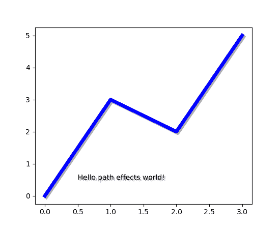

# 路径效果指南

> 原文：[Path effects guide](http://matplotlib.org/users/patheffects_guide.html)
> 
> 译者：[飞龙](https://github.com/)
> 
> 协议：[CC BY-NC-SA 4.0](http://creativecommons.org/licenses/by-nc-sa/4.0/)

Matplotlib 的`patheffects`模块提供了一些功能，用于将多个绘制层次应用到任何艺术家，并可以通过路径呈现。

可以对其应用路径效果的艺术家包括`Patch`，`Line2D`，`Collection`，甚至文本。 每个艺术家的路径效果都可以通过`set_path_effects`方法（`set_path_effects`）控制，它需要一个`AbstractPathEffect`的可迭代实例。

最简单的路径效果是普通效果，它简单地绘制艺术家，并没有任何效果：

```
import matplotlib.pyplot as plt
import matplotlib.patheffects as path_effects

fig = plt.figure(figsize=(5, 1.5))
text = fig.text(0.5, 0.5, 'Hello path effects world!\nThis is the normal '
                          'path effect.\nPretty dull, huh?',
                ha='center', va='center', size=20)
text.set_path_effects([path_effects.Normal()])
plt.show()
```


## 添加阴影

比正常效果更有趣的路径效果是阴影，我们可以应用于任何基于路径的艺术家。 `SimplePatchShadow`和`SimpleLineShadow`类通过在基本艺术家下面绘制填充补丁或线条补丁来实现它：

```
import matplotlib.pyplot as plt
import matplotlib.patheffects as path_effects

text = plt.text(0.5, 0.5, 'Hello path effects world!',
                path_effects=[path_effects.withSimplePatchShadow()])

plt.plot([0, 3, 2, 5], linewidth=5, color='blue',
         path_effects=[path_effects.SimpleLineShadow(),
                       path_effects.Normal()])
plt.show()
```



请注意本示例中设置路径效果的两种方法。 第一个使用`with *`类，来包含“正常”效果之后的所需功能，而后者明确定义要绘制的两个路径效果。

## 让艺术家脱颖而出

使艺术家在视觉上脱颖而出的一个好方法是，在实际艺术家下面以粗体颜色绘制轮廓。 `Stroke`路径效果使其相对简单：

```
import matplotlib.pyplot as plt
import matplotlib.patheffects as path_effects

fig = plt.figure(figsize=(7, 1))
text = fig.text(0.5, 0.5, 'This text stands out because of\n'
                          'its black border.', color='white',
                          ha='center', va='center', size=30)
text.set_path_effects([path_effects.Stroke(linewidth=3, foreground='black'),
                       path_effects.Normal()])
plt.show()
```


重要的是注意，这种效果能够工作，因为我们已经绘制两次文本路径：一次使用粗黑线，然后另一次使用原始文本路径在上面绘制。

您可能已经注意到，`Stroke`、`SimplePatchShadow`和`SimpleLineShadow`的关键字不是通常的`Artist`关键字（例如`facecolor`和`edgecolor`等）。这是因为使用这些路径效果，我们操作了 matplotlib 的较低层。实际上，接受的关键字是用于`matplotlib.backend_bases.GraphicsContextBase`实例的关键字，它们为易于创建新的后端而设计，而不是用于其用户界面。

## 对路径效果艺术家的更大控制

如前所述，一些路径效果的操作级别低于大多数用户操作，这意味着设置关键字（如`facecolor`和`edgecolor`）会导致`AttributeError`。幸运的是，有一个通用的`PathPatchEffect`路径效果，它创建一个具有原始路径的`PathPatch`类。此效果的关键字与`PathPatch`相同：

```
import matplotlib.pyplot as plt
import matplotlib.patheffects as path_effects

fig = plt.figure(figsize=(8, 1))
t = fig.text(0.02, 0.5, 'Hatch shadow', fontsize=75, weight=1000, va='center')
t.set_path_effects([path_effects.PathPatchEffect(offset=(4, -4), hatch='xxxx',
                                                  facecolor='gray'),
                    path_effects.PathPatchEffect(edgecolor='white', linewidth=1.1,
                                                 facecolor='black')])
plt.show()
```

