# 标注

> 原文：[Annotation](http://matplotlib.org/users/annotations.html)
> 
> 译者：[飞龙](https://github.com/)
> 
> 协议：[CC BY-NC-SA 4.0](http://creativecommons.org/licenses/by-nc-sa/4.0/)

## 基本标注

使用`text()`会将文本放置在轴域的任意位置。 文本的一个常见用例是标注绘图的某些特征，而`annotate()`方法提供辅助函数，使标注变得容易。 在标注中，有两个要考虑的点：由参数`xy`表示的标注位置和`xytext`的文本位置。 这两个参数都是`(x, y)`元组。

```
import numpy as np
import matplotlib.pyplot as plt

fig = plt.figure()
ax = fig.add_subplot(111)

t = np.arange(0.0, 5.0, 0.01)
s = np.cos(2*np.pi*t)
line, = ax.plot(t, s, lw=2)

ax.annotate('local max', xy=(2, 1), xytext=(3, 1.5),
            arrowprops=dict(facecolor='black', shrink=0.05),
            )

ax.set_ylim(-2,2)
plt.show()
```

[源代码](http://matplotlib.org/mpl_examples/pyplots/annotation_basic.py)

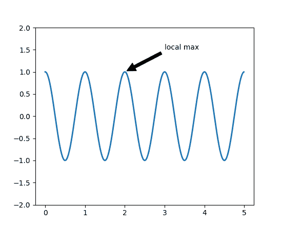

在该示例中，`xy`（箭头尖端）和`xytext`位置（文本位置）都以数据坐标为单位。 有多种可以选择的其他坐标系 - 你可以使用`xycoords`和`textcoords`以及下列字符串之一（默认为`data`）指定`xy`和`xytext`的坐标系。

| 参数 | 坐标系 |
| `'figure points'` | 距离图形左下角的点数量 |
| `'figure pixels'` | 距离图形左下角的像素数量 |
| `'figure fraction'` | 0,0 是图形左下角，1,1 是右上角 |
| `'axes points'` | 距离轴域左下角的点数量 |
| `'axes pixels'` | 距离轴域左下角的像素数量 |
| `'axes fraction'` | 0,0 是轴域左下角，1,1 是右上角 |
| `'data'` | 使用轴域数据坐标系 |

例如将文本以轴域小数坐标系来放置，我们可以：

```
ax.annotate('local max', xy=(3, 1),  xycoords='data',
            xytext=(0.8, 0.95), textcoords='axes fraction',
            arrowprops=dict(facecolor='black', shrink=0.05),
            horizontalalignment='right', verticalalignment='top',
            )
```

对于物理坐标系（点或像素），原点是图形或轴的左下角。

或者，你可以通过在可选关键字参数`arrowprops`中提供箭头属性字典来绘制从文本到注释点的箭头。

| `arrowprops`键 | 描述 |
| --- | --- |
| `width` | 箭头宽度，以点为单位 |
| `frac` | 箭头头部所占据的比例 |
| `headwidth` | 箭头的底部的宽度，以点为单位 |
| `shrink` | 移动提示，并使其离注释点和文本一些距离 |
| `**kwargs` | `matplotlib.patches.Polygon`的任何键，例如`facecolor` |

在下面的示例中，`xy`点是原始坐标（`xycoords`默认为`'data'`）。 对于极坐标轴，它在`(theta, radius)`空间中。 此示例中的文本放置在图形小数坐标系中。 `matplotlib.text.Text`关键字`args`，例如`horizontalalignment`，`verticalalignment`和`fontsize`，从`annotate`传给`Text`实例。

[源代码](http://matplotlib.org/mpl_examples/pyplots/annotation_polar.py)

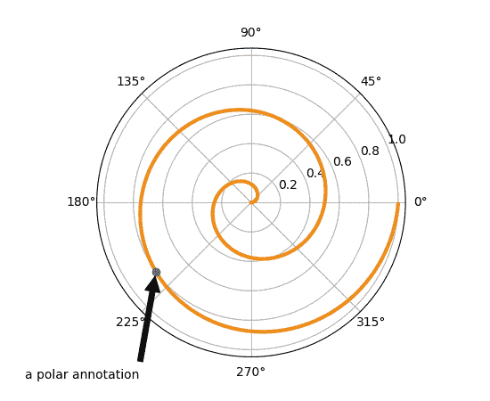

注释（包括花式箭头）的所有高上大的内容的更多信息，请参阅[高级标注](http://matplotlib.org/users/annotations.html#plotting-guide-annotation)和[`pylab_examples`示例代码：`annotation_demo.py`](http://matplotlib.org/examples/pylab_examples/annotation_demo.html#pylab-examples-annotation-demo)。

不要继续，除非你已经阅读了[基本标注](http://matplotlib.org/users/annotations.html#annotations-tutorial)，[`text()`](http://matplotlib.org/api/pyplot_api.html#matplotlib.pyplot.text)和[`annotate()`](http://matplotlib.org/api/pyplot_api.html#matplotlib.pyplot.annotate)。

## 高级标注

### 使用框和文本来标注

让我们以一个简单的例子来开始。

[源代码](http://matplotlib.org/users/plotting/examples/annotate_text_arrow.py)


在`pyplot`模块（或`Axes`类的`text`方法）中的`text()`函数接受`bbox`关键字参数，并且在提供时，在文本周围绘制一个框。

与文本相关联的补丁对象可以通过以下方式访问：

```
bb = t.get_bbox_patch()
```

返回值是`FancyBboxPatch`的一个实例，并且补丁属性（如`facecolor`，`edgewidth`等）可以像平常一样访问和修改。 为了更改框的形状，请使用`set_boxstyle`方法。

```
bb.set_boxstyle("rarrow", pad=0.6)
```

该参数是框样式的名称与其作为关键字参数的属性。 目前，实现了以下框样式。

| 类 | 名称 | 属性 |
| --- | --- | --- |
| Circle | `circle` | `pad=0.3` |
| DArrow | `darrow` | `pad=0.3` |
| LArrow | `larrow` | `pad=0.3` |
| RArrow | `rarrow` | `pad=0.3` |
| Round | `round` | `pad=0.3,rounding_size=None` |
| Round4 | `round4` | `pad=0.3,rounding_size=None` |
| Roundtooth | `roundtooth` | `pad=0.3,tooth_size=None` |
| Sawtooth | `sawtooth` | `pad=0.3,tooth_size=None` |
| Square | `square` | `pad=0.3` |

[源代码](http://matplotlib.org/mpl_examples/pylab_examples/fancybox_demo2.py)

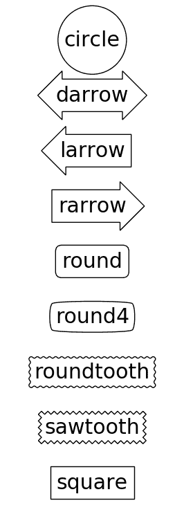

注意，属性参数可以在样式名称中用逗号分隔（在初始化文本实例时，此形式可以用作`bbox`参数的`boxstyle`的值）。

```
bb.set_boxstyle("rarrow,pad=0.6")
```

### 使用箭头来标注

`pyplot`模块（或`Axes`类的`annotate`方法）中的`annotate()`函数用于绘制连接图上两点的箭头。

```
ax.annotate("Annotation",
            xy=(x1, y1), xycoords='data',
            xytext=(x2, y2), textcoords='offset points',
            )
```

这会使用`textcoords`中提供的，`xytext`处的文本标注提供坐标（`xycoords`）中的`xy`处的点。 通常，数据坐标中规定了标注点，偏移点中规定了标注文本。 请参阅`annotate()`了解可用的坐标系。

连接两个点（`xy`和`xytext`）的箭头可以通过指定`arrowprops`参数可选地绘制。 为了仅绘制箭头，请使用空字符串作为第一个参数。

```
ax.annotate("",
            xy=(0.2, 0.2), xycoords='data',
            xytext=(0.8, 0.8), textcoords='data',
            arrowprops=dict(arrowstyle="->",
                            connectionstyle="arc3"),
            )
```

[源代码](http://matplotlib.org/users/plotting/examples/annotate_simple01.py)

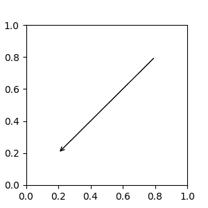

箭头的绘制需要几个步骤。

*   创建两个点之间的连接路径。 这由`connectionstyle`键值控制。
*   如果提供了补丁对象（`patchA`和`patchB`），则会剪切路径以避开该补丁。
*   路径进一步由提供的像素总量来缩小（`shirnkA`&`shrinkB`）
*   路径转换为箭头补丁，由`arrowstyle`键值控制。

[源代码](http://matplotlib.org/users/plotting/examples/annotate_explain.py)


两个点之间的连接路径的创建由`connectionstyle`键控制，并且可用以下样式。

| 名称 | 属性 |
| --- | --- |
| angle | `angleA=90,angleB=0,rad=0.0` |
| angle3 | `angleA=90,angleB=0` |
| arc | `angleA=0,angleB=0,armA=None,armB=None,rad=0.0` |
| arc3 | `rad=0.0` |
| bar | `armA=0.0,armB=0.0,fraction=0.3,angle=None` |

注意，`angle3`和`arc3`中的`3`意味着所得到的路径是二次样条段（三个控制点）。 如下面将讨论的，当连接路径是二次样条时，可以使用一些箭头样式选项。

每个连接样式的行为在下面的示例中（有限地）演示。 （警告：条形样式的行为当前未定义好，将来可能会更改）。

[源代码](http://matplotlib.org/users/plotting/examples/connectionstyle_demo.py)

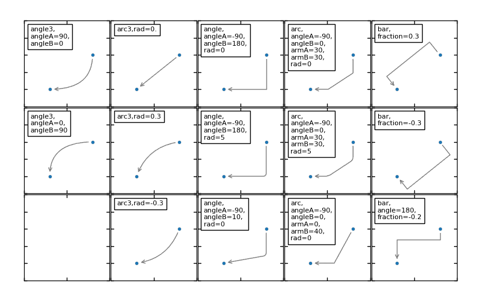

然后根据给定的箭头样式将连接路径（在剪切和收缩之后）变换为箭头补丁。

| 名称 | 属性 |
| --- | --- |
| - | `None` |
| -> | `head_length=0.4,head_width=0.2` |
| -[ | `widthB=1.0,lengthB=0.2,angleB=None` |
| &#124;-&#124; | `widthA=1.0,widthB=1.0` |
| -&#124;> | `head_length=0.4,head_width=0.2` |
| <- | `head_length=0.4,head_width=0.2` |
| <-> | `head_length=0.4,head_width=0.2` |
| <&#124;- | `head_length=0.4,head_width=0.2` |
| < | -&#124;> |
| fancy | `head_length=0.4,head_width=0.4,tail_width=0.4` |
| simple | `head_length=0.5,head_width=0.5,tail_width=0.2` |
| wedge | `tail_width=0.3,shrink_factor=0.5` |

[源代码](http://matplotlib.org/mpl_examples/pylab_examples/fancyarrow_demo.py)

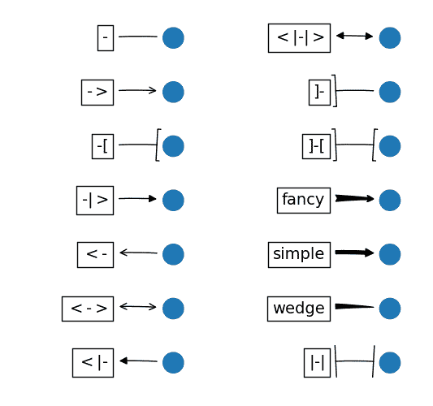

一些箭头仅适用于生成二次样条线段的连接样式。 他们是`fancy`，`simple`，`wedge`。 对于这些箭头样式，必须使用`angle3`或`arc3`连接样式。

如果提供了标注字符串，则`patchA`默认设置为文本的`bbox`补丁。

[源代码](http://matplotlib.org/users/plotting/examples/annotate_simple02.py)

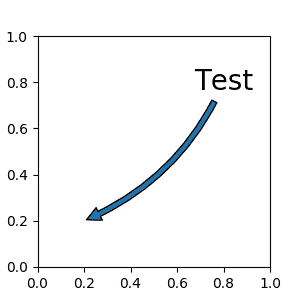

与`text`命令一样，可以使用`bbox`参数来绘制文本周围的框。

[源代码](http://matplotlib.org/users/plotting/examples/annotate_simple03.py)

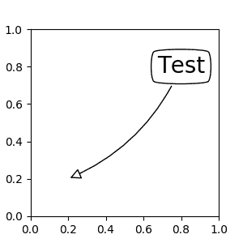

默认情况下，起点设置为文本范围的中心。 可以使用`relpos`键值进行调整。 这些值根据文本的范围进行归一化。 例如，`(0,0)`表示左下角，`(1,1)`表示右上角。

[源代码](http://matplotlib.org/users/plotting/examples/annotate_simple04.py)

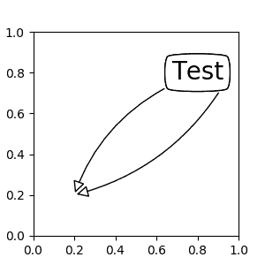

### 将艺术家放置在轴域的锚定位置

有一类艺术家可以放置在轴域的锚定位置。 一个常见的例子是图例。 这种类型的艺术家可以使用`OffsetBox`类创建。 `mpl_toolkits.axes_grid.anchored_artists`中有几个预定义类。

```
from mpl_toolkits.axes_grid.anchored_artists import AnchoredText
at = AnchoredText("Figure 1a",
                  prop=dict(size=8), frameon=True,
                  loc=2,
                  )
at.patch.set_boxstyle("round,pad=0.,rounding_size=0.2")
ax.add_artist(at)
```

[源代码](http://matplotlib.org/users/plotting/examples/anchored_box01.py)


`loc`关键字与`legend`命令中含义相同。

一个简单的应用是当艺术家（或艺术家的集合）的像素大小在创建时已知。 例如，如果要绘制一个固定大小为 20 像素 ×20 像素（半径为 10 像素）的圆，则可以使用`AnchoredDrawingArea`。 实例使用绘图区域的大小创建（以像素为单位）。 用户可以在绘图区任意添加艺术家。 注意，添加到绘图区域的艺术家的范围与绘制区域本身的位置无关，只和初始大小有关。

```
from mpl_toolkits.axes_grid.anchored_artists import AnchoredDrawingArea

ada = AnchoredDrawingArea(20, 20, 0, 0,
                          loc=1, pad=0., frameon=False)
p1 = Circle((10, 10), 10)
ada.drawing_area.add_artist(p1)
p2 = Circle((30, 10), 5, fc="r")
ada.drawing_area.add_artist(p2)
```

添加到绘图区域的艺术家不应该具有变换集（它们将被重写），并且那些艺术家的尺寸被解释为像素坐标，即，上述示例中的圆的半径分别是 10 像素和 5 像素。

[源代码](http://matplotlib.org/users/plotting/examples/anchored_box02.py)

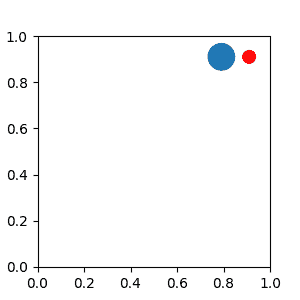

有时，你想让你的艺术家按数据坐标（或其他坐标，而不是画布像素）缩放。 你可以使用`AnchoredAuxTransformBox`类。 这类似于`AnchoredDrawingArea`，除了艺术家的范围在绘制时由指定的变换确定。

```
from mpl_toolkits.axes_grid.anchored_artists import AnchoredAuxTransformBox

box = AnchoredAuxTransformBox(ax.transData, loc=2)
el = Ellipse((0,0), width=0.1, height=0.4, angle=30) # in data coordinates!
box.drawing_area.add_artist(el)
```

上述示例中的椭圆具有在数据坐标中对应于 0.1 和 0.4 的宽度和高度，并且当轴域的视图限制改变时将自动缩放。

[源代码](http://matplotlib.org/users/plotting/examples/anchored_box03.py)

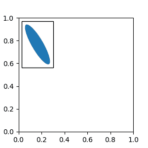

如图例所示，可以设置`bbox_to_anchor`参数。 使用`HPacker`和`VPacker`，你可以像图例中一样排列艺术家（事实上，这是图例的创建方式）。

[源代码](http://matplotlib.org/users/plotting/examples/anchored_box04.py)

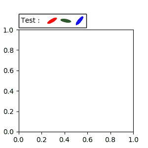

请注意，与图例不同，默认情况下，`bbox_transform`设置为`IdentityTransform`。

### 使用复杂坐标来标注

matplotlib 中的标注支持[标注文本](http://matplotlib.org/users/annotations_intro.html#annotations-tutorial)中描述的几种类型的坐标。 对于想要更多控制的高级用户，它支持几个其他选项。

1.  `Transform`实例，例如：

    ```
    ax.annotate("Test", xy=(0.5, 0.5), xycoords=ax.transAxes)
    ```

    相当于：

    ```
    ax.annotate("Test", xy=(0.5, 0.5), xycoords="axes fraction")
    ```

    使用它，你可以在其他轴域内标注一个点：

    ```
    ax1, ax2 = subplot(121), subplot(122)
    ax2.annotate("Test", xy=(0.5, 0.5), xycoords=ax1.transData,
                 xytext=(0.5, 0.5), textcoords=ax2.transData,
                 arrowprops=dict(arrowstyle="->"))
    ```

2.  `Artist`实例。`xy`值（或`xytext`）被解释为艺术家的`bbox`（`get_window_extent`的返回值）的小数坐标。

    ```
    an1 = ax.annotate("Test 1", xy=(0.5, 0.5), xycoords="data",
                      va="center", ha="center",
                      bbox=dict(boxstyle="round", fc="w"))
    an2 = ax.annotate("Test 2", xy=(1, 0.5), xycoords=an1, # (1,0.5) of the an1's bbox
                      xytext=(30,0), textcoords="offset points",
                      va="center", ha="left",
                      bbox=dict(boxstyle="round", fc="w"),
                      arrowprops=dict(arrowstyle="->"))
    ```

    [源代码](http://matplotlib.org/users/plotting/examples/annotate_simple_coord01.py)

    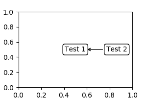

    请注意，你的责任是在绘制`an2`之前确定坐标艺术家（上例中的`an1`）的范围。 在大多数情况下，这意味着`an2`需要晚于`an1`。

3.  一个返回`BboxBase`或`Transform`的实例的可调用对象。 如果返回一个变换，它与 1 相同，如果返回`bbox`，它与 2 相同。可调用对象应该接受`renderer`实例的单个参数。 例如，以下两个命令产生相同的结果：

    ```
    an2 = ax.annotate("Test 2", xy=(1, 0.5), xycoords=an1,
                      xytext=(30,0), textcoords="offset points")
    an2 = ax.annotate("Test 2", xy=(1, 0.5), xycoords=an1.get_window_extent,
                      xytext=(30,0), textcoords="offset points")
    ```

4.  指定二元坐标的元组。 第一项用于`x`坐标，第二项用于`y`坐标。 例如，

    ```
    annotate("Test", xy=(0.5, 1), xycoords=("data", "axes fraction"))
    ```

    0.5 的单位是数据坐标，1 的单位是归一化轴域坐标。 你可以像使用元组一样使用艺术家或变换。 例如，

    ```
    import matplotlib.pyplot as plt

    plt.figure(figsize=(3,2))
    ax=plt.axes([0.1, 0.1, 0.8, 0.7])
    an1 = ax.annotate("Test 1", xy=(0.5, 0.5), xycoords="data",
                      va="center", ha="center",
                      bbox=dict(boxstyle="round", fc="w"))

    an2 = ax.annotate("Test 2", xy=(0.5, 1.), xycoords=an1,
                      xytext=(0.5,1.1), textcoords=(an1, "axes fraction"),
                      va="bottom", ha="center",
                      bbox=dict(boxstyle="round", fc="w"),
                      arrowprops=dict(arrowstyle="->"))
    plt.show()
    ```

    [源代码](http://matplotlib.org/users/plotting/examples/annotate_simple_coord02.py)

    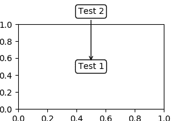

5.  有时，您希望您的注释带有一些“偏移点”，不是距离注释点，而是距离某些其他点。 `OffsetFrom`是这种情况下的辅助类。

    ```
    import matplotlib.pyplot as plt

    plt.figure(figsize=(3,2))
    ax=plt.axes([0.1, 0.1, 0.8, 0.7])
    an1 = ax.annotate("Test 1", xy=(0.5, 0.5), xycoords="data",
                      va="center", ha="center",
                      bbox=dict(boxstyle="round", fc="w"))

    from matplotlib.text import OffsetFrom
    offset_from = OffsetFrom(an1, (0.5, 0))
    an2 = ax.annotate("Test 2", xy=(0.1, 0.1), xycoords="data",
                      xytext=(0, -10), textcoords=offset_from,
                      # xytext is offset points from "xy=(0.5, 0), xycoords=an1"
                      va="top", ha="center",
                      bbox=dict(boxstyle="round", fc="w"),
                      arrowprops=dict(arrowstyle="->"))
    plt.show()
    ```

    

    你可以参考这个链接：[`pylab_examples example code: annotation_demo3.py.`](http://matplotlib.org/examples/pylab_examples/annotation_demo3.html#pylab-examples-annotation-demo3)。

### 使用`ConnectorPatch`

`ConnectorPatch`类似于没有文本的标注。 虽然在大多数情况下建议使用标注函数，但是当您想在不同的轴上连接点时，`ConnectorPatch`很有用。

```
from matplotlib.patches import ConnectionPatch
xy = (0.2, 0.2)
con = ConnectionPatch(xyA=xy, xyB=xy, coordsA="data", coordsB="data",
                      axesA=ax1, axesB=ax2)
ax2.add_artist(con)
```

上述代码连接了`ax1`中数据坐标的`xy`点，与`ax2`中数据坐标的`xy`点。这是个简单的例子。

[源代码](http://matplotlib.org/users/plotting/examples/connect_simple01.py)

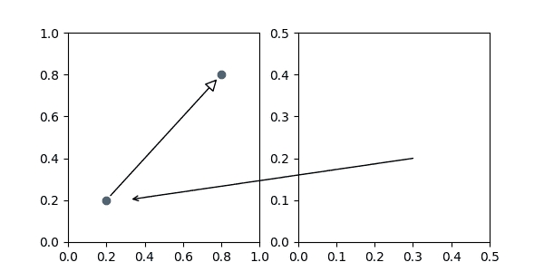

虽然`ConnectorPatch`实例可以添加到任何轴，但您可能需要将其添加到绘图顺序中最新的轴，以防止与其他轴重叠。

## 高级话题

### 轴域之间的缩放效果

`mpl_toolkits.axes_grid.inset_locator`定义了一些补丁类，用于互连两个轴域。 理解代码需要一些 mpl 转换如何工作的知识。 但是，利用它的方式很直接。

[源代码](http://matplotlib.org/mpl_examples/pylab_examples/axes_zoom_effect.py)


### 定义自定义盒样式

你可以使用自定义盒样式，`boxstyle`的值可以为如下形式的可调用对象：

```
def __call__(self, x0, y0, width, height, mutation_size,
             aspect_ratio=1.):
    """
    Given the location and size of the box, return the path of
    the box around it.

      - *x0*, *y0*, *width*, *height* : location and size of the box
      - *mutation_size* : a reference scale for the mutation.
      - *aspect_ratio* : aspect-ratio for the mutation.
    """
    path = ...
    return path
```

这里是个复杂的例子：

[源代码](http://matplotlib.org/users/plotting/examples/custom_boxstyle01.py)

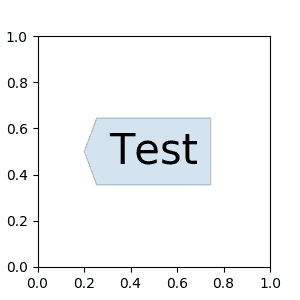

但是，推荐你从`matplotlib.patches.BoxStyle._Base`派生，像这样：

```
from matplotlib.path import Path
from matplotlib.patches import BoxStyle
import matplotlib.pyplot as plt

# we may derive from matplotlib.patches.BoxStyle._Base class.
# You need to override transmute method in this case.

class MyStyle(BoxStyle._Base):
    """
    A simple box.
    """

    def __init__(self, pad=0.3):
        """
        The arguments need to be floating numbers and need to have
        default values.

         *pad*
            amount of padding
        """

        self.pad = pad
        super(MyStyle, self).__init__()

    def transmute(self, x0, y0, width, height, mutation_size):
        """
        Given the location and size of the box, return the path of
        the box around it.

         - *x0*, *y0*, *width*, *height* : location and size of the box
         - *mutation_size* : a reference scale for the mutation.

        Often, the *mutation_size* is the font size of the text.
        You don't need to worry about the rotation as it is
        automatically taken care of.
        """

        # padding
        pad = mutation_size * self.pad

        # width and height with padding added.
        width, height = width + 2.*pad, \
                        height + 2.*pad,

        # boundary of the padded box
        x0, y0 = x0-pad, y0-pad,
        x1, y1 = x0+width, y0 + height

        cp = [(x0, y0),
              (x1, y0), (x1, y1), (x0, y1),
              (x0-pad, (y0+y1)/2.), (x0, y0),
              (x0, y0)]

        com = [Path.MOVETO,
               Path.LINETO, Path.LINETO, Path.LINETO,
               Path.LINETO, Path.LINETO,
               Path.CLOSEPOLY]

        path = Path(cp, com)

        return path

# register the custom style
BoxStyle._style_list["angled"] = MyStyle

plt.figure(1, figsize=(3,3))
ax = plt.subplot(111)
ax.text(0.5, 0.5, "Test", size=30, va="center", ha="center", rotation=30,
        bbox=dict(boxstyle="angled,pad=0.5", alpha=0.2))

del BoxStyle._style_list["angled"]

plt.show()
```

[源代码](http://matplotlib.org/users/plotting/examples/custom_boxstyle02.py)

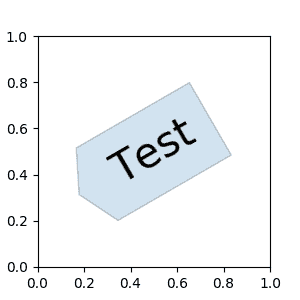

与之类似，您可以定义一个自定义的`ConnectionStyle`和一个自定义的`ArrowStyle`。 请参阅`lib/matplotlib/patches.py`的源代码，并查看每个样式类是如何定义的。