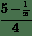

# 编写数学表达式

> 原文：[Writing mathematical expressions](http://matplotlib.org/users/mathtext.html)
> 
> 译者：[飞龙](https://github.com/)
> 
> 协议：[CC BY-NC-SA 4.0](http://creativecommons.org/licenses/by-nc-sa/4.0/)

你可以在任何 matplotlib 文本字符串中使用子 TeX 标记，将它放在一对美元符号（`$`）内。

注意，你不需要安装 TeX，因为 matplotlib 提供了自己的 TeX 表达式解析器，布局引擎和字体。 布局引擎是 Donald Knuth 的 TeX 中的布局算法的一种相当直接的适配版，所以质量是相当不错的（matplotlib 还为那些想要调用 TeX 生成文本的人提供一个`usetex`选项（参见[使用 LaTeX 渲染文本](http://matplotlib.org/users/usetex.html#usetex-tutorial) ）。

任何文本元素都可以使用数学文本。 你应该使用原始字符串（在引号前面加一个`'r'`），并用美元符号（`$`）包围数学文本，如 TeX。 常规文本和数学文本可以在同一个字符串内交错。 Mathtext 可以使用 Computer Modern 字体（来自 (La)TeX），STIX 字体（为与 Times 混合使用而设计）或你提供的 Unicode 字体。 可以使用自定义变量`mathtext.fontset`选择 mathtext 字体（请参阅[自定义 matplotlib](http://matplotlib.org/users/customizing.html#customizing-matplotlib)）

> 注意
> 
> 在Python的 『narrow』 构建中，如果使用 STIX 字体，你还应该将`ps.fonttype`和`pdf.fonttype`设置为 3（默认值），而不是 42。否则一些字符将不可见。

下面是个简单的例子：

```
# plain text
plt.title('alpha > beta')
```

生成`alpha > beta`。

但是这个：

```
# math text
plt.title(r'$\alpha > \beta$')
```

生成 。

> 注意
> 
> Mathtext 应该放在一对美元符号（`$`）之间。 为了易于显示货币值，例如`$ 100.00`，如果整个字符串中存在单个美元符号，则它将被逐字显示为美元符号。 这是常规 TeX 的一个小改变，其中非数学文本中的美元符号必须被转义（`'$'`）。
> 
> 注意
> 
> 虽然一对美元符号（`$`）内的语法是 TeX 风格的，但是外面的文本不是。 特别是，字符：
> 
> ```
>  # $ % & ~ _ ^ \ { } \( \) \[ \] 
> ```
> 
> 在 TeX 中的数学模式之外有特殊的意义。 因此，根据`rcParam text.usetex`标志这些字符的表现有所不同。 更多信息请参阅[`usetex`教程](http://matplotlib.org/users/usetex.html#usetex-tutorial)。

## 下标和上标

为了制作下标和上标，使用`_`或者`^`符号：

```
r'$\alpha_i > \beta_i$'
```


一些符号会自动将它们的下标或上标放在操作符的底部或顶部，例如，为了编写 0 到无穷的  的和，你可以：

```
r'$\sum_{i=0}^\infty x_i$'
```


## 分数、二项式和堆叠数

可以使用`\frac{}{}`，`\binomial{}{}`和`\stackrel{}{}`命令分别创建分数，二项式和堆叠数字：

```
r'$\frac{3}{4} \binom{3}{4} \stackrel{3}{4}$'
```

产生


分数可以任意嵌套：

```
r'$\frac{5 - \frac{1}{x}}{4}$'
```

产生



请注意，在分数周围放置圆括号和花括号需要特别注意。 这种明显的方式会产生太小的括号：

```
r'$(\frac{5 - \frac{1}{x}}{4})$'
```


解决方案是在括号前面加上`\left`和`\right`以通知解析器这些括号包含整个对象：

```
r'$\left(\frac{5 - \frac{1}{x}}{4}\right)$'
```


## 根式

根式可以有`\sqrt[]{}`产生，例如：

```
r'$\sqrt{2}$'
```


方括号内可以（可选地）设置任何底数。 请注意，底数必须是一个简单的表达式，并且不能包含布局命令，如分数或上下标：

```
r'$\sqrt[3]{x}$'
```


## 字体

用于数学符号的默认字体是斜体。

> 注意
> 
> 此默认值可以使用`mathtext.default` `rcParam`更改。 这是非常有用的，例如，通过将其设置为`regular`，使用与常规非数学文本相同的字体作为数学文本。

为了修改字体，例如，以罗马字体编写`sin`，使用字体命令来闭合文本：

```
r'$s(t) = \mathcal{A}\mathrm{sin}(2 \omega t)$'
```


这里`s`和`t`是斜体（默认）的变量，`sin`是罗马字体，振幅`A`是书法字体。 注意在上面的例子中，`A`和`sin`之间的间距被挤压。 你可以使用间距命令在它们之间添加一些空格：

```
s(t) = \mathcal{A}\/\sin(2 \omega t)
```


所有字体的可用选项为：

| 命令 | 结果 |
| --- | --- |
| `\mathrm{Roman}` |  |
| `\mathit{Italic}` |  |
| `\mathtt{Typewriter}` |  |
| `\mathcal{CALLIGRAPHY}` |  |

使用 STIX 字体时，你也可以选择：

| 命令 | 结果 |
| --- | --- |
| `\mathbb{blackboard}` |  |
| `\mathrm{\mathbb{blackboard}}` |  |
| `\mathfrak{Fraktur}` |  |
| `\mathsf{sansserif}` |  |
| `\mathrm{\mathsf{sansserif}}` |  |
| `\mathcircled{circled}` |  |

还有三个全局『字体集』可供选择，它们使用`matplotlibrc`中的`mathtext.fontset`参数进行选择。

`cm`: Computer Modern (TeX)


`stix`: STIX （为和 Times 混合使用而设计）


`stixsans`: STIX sans-serif


此外，你可以使用`\mathdefault{...}`或其别名`\mathregular{...}`来使用用于 mathtext 之外的常规文本的字体。 这种方法有一些限制，最明显的是，可以使用很少的符号，但可用于将数学表达式与图中的其他文本混合。

## 自定义字体

mathtext 还提供了一种对数学公式使用自定义字体的方法。 这种方法使用起来相当棘手，应该看做为有耐心的用户准备的试验特性。 通过将`rcParam mathtext.fontset`设置为`custom`，你可以设置以下参数，这些参数控制用于特定数学字符集的字体文件。

| 参数 | 相当于 |
| --- | --- |
| `mathtext.it` | `\mathit{}` 默认斜体 |
| `mathtext.rm` | `\mathrm{}` 罗马字体（upright） |
| `mathtext.tt` | `\mathtt{}` 打字机（monospace） |
| `mathtext.bf` | `\mathbf{}` 粗体 |
| `mathtext.cal` | `\mathcal{}` 书法 |
| `mathtext.sf` | `\mathsf{}` sans-serif |

每个参数应该设置为`fontconfig`字体描述符（在尚未编写的字体章节中定义）。

所使用的字体应该具有 Unicode 映射，以便找到任何非拉丁字符，例如希腊语。 如果要使用未包含在自定义字体中的数学符号，可以将`rcParam mathtext.fallback_to_cm`设置为`True`，这将导致自定义字体中找不到特定字符时，数学文本系统使用默认的 Computer Modern 字体中的字符。

请注意，Unicode 中规定的数学字形随时间而演进，许多字体的字形对于 mathtext 可能不在正确位置。

## 重音符号

重音命令可以位于任何符号之前，在其上添加重音。 他们中的一些些拥有较长和较短的形式。

| 命令 | 结果 |
| --- | --- |
| `\acute a` 或 `\'a` |  |
| `\bar a` |  |
| `\breve a` |  |
| `\ddot a` 或 `\"a` |  |
| `\dot a` 或 `\.a` |  |
| `\grave a` 或 `\`a` |  |
| `\hat a` 或 `\^a` |  |
| `\tilde a` 或 `\~a` |  |
| `\vec a` |  |
| `\overline{abc}` |  |

另外有两个特殊的重音符号，可以自动调整为符号的宽度：

| 命令 | 结果 |
| --- | --- |
| `\widehat{xyz}` |  |
| `\widetilde{xyz}` |  |

当把重音放在小写的`i`和`j`上时应该小心。 注意下面的`\imath`用来避免`i`上额外的点：

```
r"$\hat i\ \ \hat \imath$"
```


## 符号

你也可以使用更大量的 TeX 符号，比如`\infty`，`\leftarrow`，`\sum`，`\int`。

| 小写希腊字母 |  |  |
| --- | --- | --- |
|  `\alpha` |  `\beta` |  `\chi` |
|  `\epsilon` |  `\eta` |  `\gamma` |
|  `\lambda` |  `\mu` |  `\nu` |
|  `\pi` |  `\psi` |  `\rho` |
|  `\theta` |  `\upsilon` |  `\varepsilon` |
|  `\varpi` |  `\varrho` |  `\varsigma` |
|  `\zeta` |  |  |

| 大写希腊字母 |  |  |
| --- | --- | --- |
|  `\Delta` |  `\Gamma` |  `\Lambda` |
|  `\Psi` |  `\Sigma` |  `\Theta` |
|  `\nabla` |  |  |

| 希伯来文 |  |  |
| --- | --- | --- |
|  `\aleph` |  `\beth` |  `\daleth` |

| 分隔符 |  |  |
| --- | --- | --- |
|  `/` |  `[` |  `\Downarrow` |
|  `\downarrow` |  `\langle` |  `\lceil` |
|  `\rangle` |  `\rceil` |  `\rfloor` |
|  `\vert` |  `\{` |  `&#124;` |

| 大型符号 |  |  |
| --- | --- | --- |
|  `\bigcap` |  `\bigcup` |  `\bigodot` |
|  `\biguplus` |  `\bigvee` |  `\bigwedge` |
|  `\oint` |  `\prod` |  `\sum` |

| 标准函数名称 |  |  |
| --- | --- | --- |
|  `\Pr` |  `\arccos` |  `\arcsin` |
|  `\arg` |  `\cos` |  `\cosh` |
|  `\coth` |  `\csc` |  `\deg` |
|  `\dim` |  `\exp` |  `\gcd` |
|  `\inf` |  `\ker` |  `\lg` |
|  `\liminf` |  `\limsup` |  `\ln` |
|  `\max` |  `\min` |  `\sec` |
|  `\sinh` |  `\sup` |  `\tan` |

| 二元运算符和关系符号 |  |  |
| --- | --- | --- |
|  `\Bumpeq` |  `\Cap` |  `\Cup` |
|  `\Doteq` |  `\Join` |  `\Subset` |
|  `\Supset` |  `\Vdash` |  `\Vvdash` |
|  `\approx` |  `\approxeq` |  `\ast` |
|  `\asymp` |  `\backepsilon` |  `\backsim` |
|  `\backsimeq` |  `\barwedge` |  `\because` |
|  `\between` |  `\bigcirc` |  `\bigtriangledown` |
|  `\bigtriangleup` |  `\blacktriangleleft` |  `\blacktriangleright` |
|  `\bot` |  `\bowtie` |  `\boxdot` |
|  `\boxminus` |  `\boxplus` |  `\boxtimes` |
|  `\bullet` |  `\bumpeq` |  `\cap` |
|  `\cdot` |  `\circ` |  `\circeq` |
|  `\coloneq` |  `\cong` |  `\cup` |
|  `\curlyeqprec` |  `\curlyeqsucc` |  `\curlyvee` |
|  `\curlywedge` |  `\dag` |  `\dashv` |
|  `\ddag` |  `\diamond` |  `\div` |
|  `\divideontimes` |  `\doteq` |  `\doteqdot` |
|  `\dotplus` |  `\doublebarwedge` |  `\eqcirc` |
|  `\eqcolon` |  `\eqsim` |  `\eqslantgtr` |
|  `\eqslantless` |  `\equiv` |  `\fallingdotseq` |
|  `\frown` |  `\geq` |  `\geqq` |
|  `\geqslant` |  `\gg` |  `\ggg` |
|  `\gnapprox` |  `\gneqq` |  `\gnsim` |
|  `\gtrapprox` |  `\gtrdot` |  `\gtreqless` |
|  `\gtreqqless` |  `\gtrless` |  `\gtrsim` |
|  `\in` |  `\intercal` |  `\leftthreetimes` |
|  `\leq` |  `\leqq` |  `\leqslant` |
|  `\lessapprox` |  `\lessdot` |  `\lesseqgtr` |
|  `\lesseqqgtr` |  `\lessgtr` |  `\lesssim` |
|  `\ll` |  `\lll` |  `\lnapprox` |
|  `\lneqq` |  `\lnsim` |  `\ltimes` |
|  `\mid` |  `\models` |  `\mp` |
|  `\nVDash` |  `\nVdash` |  `\napprox` |
|  `\ncong` |  `\ne` |  `\neq` |
|  `\neq` |  `\nequiv` |  `\ngeq` |
|  `\ngtr` |  `\ni` |  `\nleq` |
|  `\nless` |  `\nmid` |  `\notin` |
|  `\nparallel` |  `\nprec` |  `\nsim` |
|  `\nsubset` |  `\nsubseteq` |  `\nsucc` |
|  `\nsupset` |  `\nsupseteq` |  `\ntriangleleft` |
|  `\ntrianglelefteq` |  `\ntriangleright` |  `\ntrianglerighteq` |
|  `\nvDash` |  `\nvdash` |  `\odot` |
|  `\ominus` |  `\oplus` |  `\oslash` |
|  `\otimes` |  `\parallel` |  `\perp` |
|  `\pitchfork` |  `\pm` |  `\prec` |
|  `\precapprox` |  `\preccurlyeq` |  `\preceq` |
|  `\precnapprox` |  `\precnsim` |  `\precsim` |
|  `\propto` |  `\rightthreetimes` |  `\risingdotseq` |
|  `\rtimes` |  `\sim` |  `\simeq` |
|  `\slash` |  `\smile` |  `\sqcap` |
|  `\sqcup` |  `\sqsubset` |  `\sqsubset` |
|  `\sqsubseteq` |  `\sqsupset` |  `\sqsupset` |
|  `\sqsupseteq` |  `\star` |  `\subset` |
|  `\subseteq` |  `\subseteqq` |  `\subsetneq` |
|  `\subsetneqq` |  `\succ` |  `\succapprox` |
|  `\succcurlyeq` |  `\succeq` |  `\succnapprox` |
|  `\succnsim` |  `\succsim` |  `\supset` |
|  `\supseteq` |  `\supseteqq` |  `\supsetneq` |
|  `\supsetneqq` |  `\therefore` |  `\times` |
|  `\top` |  `\triangleleft` |  `\trianglelefteq` |
|  `\triangleq` |  `\triangleright` |  `\trianglerighteq` |
|  `\uplus` |  `\vDash` |  `\varpropto` |
|  `\vartriangleleft` |  `\vartriangleright` |  `\vdash` |
|  `\vee` |  `\veebar` |  `\wedge` |
|  `\wr` |  |  |

| 箭头符号 |  |  |
| --- | --- | --- |
|  `\Downarrow` |  `\Leftarrow` |  |
|  `\Leftrightarrow` |  `\Lleftarrow` |  |
|  `\Longleftarrow` |  `\Longleftrightarrow` |  |
|  `\Longrightarrow` |  `\Lsh` |  |
|  `\Nearrow` |  `\Nwarrow` |  |
|  `\Rightarrow` |  `\Rrightarrow` |  |
|  `\Rsh` |  `\Searrow` |  |
|  `\Swarrow` |  `\Uparrow` |  |
|  `\Updownarrow` |  `\circlearrowleft` |  |
|  `\circlearrowright` |  `\curvearrowleft` |  |
|  `\curvearrowright` |  `\dashleftarrow` |  |
|  `\dashrightarrow` |  `\downarrow` |  |
|  `\downdownarrows` |  `\downharpoonleft` |  |
|  `\downharpoonright` |  `\hookleftarrow` |  |
|  `\hookrightarrow` |  `\leadsto` |  |
|  `\leftarrow` |  `\leftarrowtail` |  |
|  `\leftharpoondown` |  `\leftharpoonup` |  |
|  `\leftleftarrows` |  `\leftrightarrow` |  |
|  `\leftrightarrows` |  `\leftrightharpoons` |  |
|  `\leftrightsquigarrow` |  `\leftsquigarrow` |  |
|  `\longleftarrow` |  `\longleftrightarrow` |  |
|  `\longmapsto` |  `\longrightarrow` |  |
|  `\looparrowleft` |  `\looparrowright` |  |
|  `\mapsto` |  `\multimap` |  |
|  `\nLeftarrow` |  `\nLeftrightarrow` |  |
|  `\nRightarrow` |  `\nearrow` |  |
|  `\nleftarrow` |  `\nleftrightarrow` |  |
|  `\nrightarrow` |  `\nwarrow` |  |
|  `\rightarrow` |  `\rightarrowtail` |  |
|  `\rightharpoondown` |  `\rightharpoonup` |  |
|  `\rightleftarrows` |  `\rightleftarrows` |  |
|  `\rightleftharpoons` |  `\rightleftharpoons` |  |
|  `\rightrightarrows` |  `\rightrightarrows` |  |
|  `\rightsquigarrow` |  `\searrow` |  |
|  `\swarrow` |  `\to` |  |
|  `\twoheadleftarrow` |  `\twoheadrightarrow` |  |
|  `\uparrow` |  `\updownarrow` |  |
|  `\updownarrow` |  `\upharpoonleft` |  |
|  `\upharpoonright` |  `\upuparrows` |  |

| 杂项符号 |  |  |
| --- | --- | --- |
|  `\$` |  `\AA` |  `\Finv` |
|  `\Game` |  `\Im` |  `\P` |
|  `\Re` |  `\S` |  `\angle` |
|  `\backprime` |  `\bigstar` |  `\blacksquare` |
|  `\blacktriangle` |  `\blacktriangledown` |  `\cdots` |
|  `\checkmark` |  `\circledR` |  `\circledS` |
|  `\clubsuit` |  `\complement` |  `\copyright` |
|  `\ddots` |  `\diamondsuit` |  `\ell` |
|  `\emptyset` |  `\eth` |  `\exists` |
|  `\flat` |  `\forall` |  `\hbar` |
|  `\heartsuit` |  `\hslash` |  `\iiint` |
|  `\iint` |  `\iint` |  `\imath` |
|  `\infty` |  `\jmath` |  `\ldots` |
|  `\measuredangle` |  `\natural` |  `\neg` |
|  `\nexists` |  `\oiiint` |  `\partial` |
|  `\prime` |  `\sharp` |  `\spadesuit` |
|  `\sphericalangle` |  `\ss` |  `\triangledown` |
|  `\varnothing` |  `\vartriangle` |  `\vdots` |
|  `\wp` |  `\yen` |  |

如果特定符号没有名称（对于 STIX 字体中的许多较为模糊的符号也是如此），也可以使用 Unicode 字符：

```
ur'$\u23ce$'
```

## 示例

下面是个示例，在上下文中展示了许多这些特性。

```
import numpy as np
import matplotlib.pyplot as plt
t = np.arange(0.0, 2.0, 0.01)
s = np.sin(2*np.pi*t)

plt.plot(t,s)
plt.title(r'$\alpha_i > \beta_i$', fontsize=20)
plt.text(1, -0.6, r'$\sum_{i=0}^\infty x_i$', fontsize=20)
plt.text(0.6, 0.6, r'$\mathcal{A}\mathrm{sin}(2 \omega t)$',
         fontsize=20)
plt.xlabel('time (s)')
plt.ylabel('volts (mV)')
plt.show()
```

