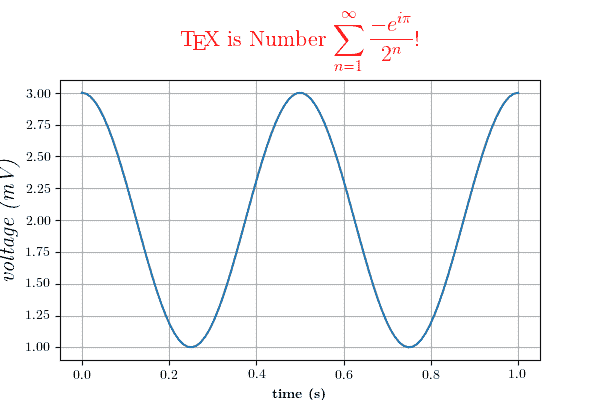
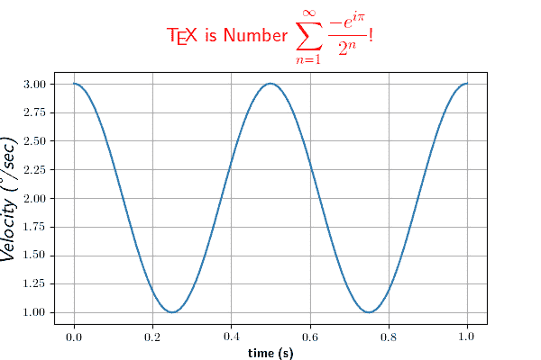

# 使用 LaTeX 渲染文本

> 原文：[Text rendering With LaTeX](http://matplotlib.org/users/usetex.html)
> 
> 译者：[飞龙](https://github.com/)
> 
> 协议：[CC BY-NC-SA 4.0](http://creativecommons.org/licenses/by-nc-sa/4.0/)

Matplotlib 可以选择使用 LaTeX 来管理所有文本布局。 此选项可用于以下后端：

*   Agg
*   PS
*   PDF

LaTeX 选项通过在`rc`设置中设置`text.usetex:True`来激活。 使用 matplotlib 的 LaTeX 支持的文本处理会慢于 matplotlib 的非常强大的 mathtext，但是更灵活，因为可以使用不同的 LaTeX 包（字体包，数学包等）。 结果会十分惊人，特别是当你在图形中使用和主文档相同的字体。

Matplotlib 的 LaTeX 支持需要可用的 LaTeX 安装版本，dvipng（可能包括在你的 LaTeX 安装中）和 Ghostscript（建议使用 GPL Ghostscript 8.60 或更高版本）。 这些外部依赖的可执行文件必须都位于你的`PATH`中。

有几个选项需要提及，可以使用`rc`设置更改它们。 这里是一个`matplotlibrc`示例文件：

```
font.family : serif
font.serif : Times, Palatino, New Century Schoolbook, Bookman, Computer Modern Roman
font.sans-serif : Helvetica, Avant Garde, Computer Modern Sans serif
font.cursive : Zapf Chancery
font.monospace : Courier, Computer Modern Typewriter

text.usetex : true
```

每个系列中的第一个有效字体是要加载的字体。 如果未指定字体，则默认使用 Computer Modern 字体。 所有其他字体是 Adobe 字体。 Times 和 Palatino 每个都有自己附带的数学字体，而其他 Adobe 衬线字体使用 Computer Modern 数学字体。 有关更多详细信息，请参阅 [PSNFSS](http://www.ctan.org/tex-archive/macros/latex/required/psnfss/psnfss2e.pdf) 文档。

要使用 LaTeX 并选择 Helvetica 作为默认字体，但不编辑`matplotlibrc`，使用：

```
from matplotlib import rc
rc('font',**{'family':'sans-serif','sans-serif':['Helvetica']})
## for Palatino and other serif fonts use:
#rc('font',**{'family':'serif','serif':['Palatino']})
rc('text', usetex=True)
```

这里是标准的示例，`tex_demo.py`：

```
"""
Demo of TeX rendering.

You can use TeX to render all of your matplotlib text if the rc
parameter text.usetex is set.  This works currently on the agg and ps
backends, and requires that you have tex and the other dependencies
described at http://matplotlib.org/users/usetex.html
properly installed on your system.  The first time you run a script
you will see a lot of output from tex and associated tools.  The next
time, the run may be silent, as a lot of the information is cached in
~/.tex.cache

"""
import numpy as np
import matplotlib.pyplot as plt

# Example data
t = np.arange(0.0, 1.0 + 0.01, 0.01)
s = np.cos(4 * np.pi * t) + 2

plt.rc('text', usetex=True)
plt.rc('font', family='serif')
plt.plot(t, s)

plt.xlabel(r'\textbf{time} (s)')
plt.ylabel(r'\textit{voltage} (mV)',fontsize=16)
plt.title(r"\TeX\ is Number "
          r"$\displaystyle\sum_{n=1}^\infty\frac{-e^{i\pi}}{2^n}$!",
          fontsize=16, color='gray')
# Make room for the ridiculously large title.
plt.subplots_adjust(top=0.8)

plt.savefig('tex_demo')
plt.show()
```



要注意数学显示模式（`$$ e=mc^2 $$`）是不支持的，但是添加命令`\displaystyle`之后会产生相同结果，就像`tex_demo.py`中那样。

> 注意
> 
> 一些字符在 TeX 中需要特别转义，例如：
> 
> ```
>  # $ % & ~ _ ^ \ { } \( \) \[ \] 
> ```
> 
> 所以，这些字符会根据`rcParam text.usetex`标志位而表现不同。

## 在 TeX 中使用 Unicode

也可以在 LaTeX 文本管理器中使用 unicode 字符串，这里是从`tex_unicode_demo.py`中获取的示例：

```
# -*- coding: utf-8 -*-
"""
This demo is tex_demo.py modified to have unicode. See that file for
more information.
"""

from __future__ import unicode_literals
import numpy as np
import matplotlib
matplotlib.rcParams['text.usetex'] = True
matplotlib.rcParams['text.latex.unicode'] = True
import matplotlib.pyplot as plt

plt.figure(1, figsize=(6, 4))
ax = plt.axes([0.1, 0.1, 0.8, 0.7])
t = np.arange(0.0, 1.0 + 0.01, 0.01)
s = np.cos(2*2*np.pi*t) + 2
plt.plot(t, s)

plt.xlabel(r'\textbf{time (s)}')
plt.ylabel('\\textit{Velocity (\u00B0/sec)}', fontsize=16)
plt.title(r'\TeX\ is Number $\displaystyle\sum_{n=1}^\infty'
          r'\frac{-e^{i\pi}}{2^n}$!', fontsize=16, color='r')
plt.grid(True)
plt.show()
```



## Postscript 选项

为了生成可以嵌入到新 LaTeX 文档中的 postscript 封装文件，matplotlib 的默认行为是提取输出，这会删除 LaTeX 使用的一些 postscript 操作符，这些操作符在 eps 文件中是非法的。 此步骤产生的结果对于一些用户可能是不可接受的，因为文本被粗略地光栅化并且被转换为位图，而不像标准 Postscript 那样是可缩放的，并且文本是不可搜索的。 一种解决方法是在你的`rc`设置中将`ps.distiller.res`设置为较高的值（可能为 6000），这将产生较大的文件，但可能看起来更好并能够合理缩放。 更好的解决方法需要 Poppler 或 Xpdf，可以通过将`ps.usedistiller rc`设置更改为`xpdf`来激活。 此替代方案产生 postscript 而不光栅化文本，因此它能够正确缩放，可以在 Adobe Illustrator 中编辑，并搜索`pdf`文档中的文本。

## 可能的问题

*   在 Windows 上，可能需要修改[`PATH`](http://matplotlib.org/faq/environment_variables_faq.html#envvar-PATH)环境变量来包含 latex，dvipng 和 ghostscript 可执行文件的目录。详细信息请参阅[环境变量](http://matplotlib.org/faq/environment_variables_faq.html#environment-variables)和[在 Windows 中设置环境变量](http://matplotlib.org/faq/environment_variables_faq.html#setting-windows-environment-variables)。
*   使用 MiKTeX 与 Computer Modern 字体，如果你得到奇怪的 *Agg 和 PNG 结果，访问`MiKTeX/Options`并更新你的格式文件。
*   字体在屏幕上看起来糟糕。你可能正在运行 Mac OS，在 mac 上的老版本 dvipng 运行着一些有趣的事情。在你的`matplotlibrc`文件中设置`text.dvipnghack:True`。
*   在 Ubuntu 和 Gentoo 上，texlive 基本安装不附带 type1cm 包。你可能需要安装一些额外的包，来获得所有与其它 LaTeX 分发版捆绑的特性。
*   matplotlib 已经取得了一些进展，所以可以直接使用`dvi`文件进行文本布局。这允许 LaTeX 用于具有`pdf`和`svg`后端的文本布局，以及 *Agg 和 PS 后端。在将来，LaTeX 安装可能是唯一的外部依赖。

## 故障排除

*   尝试删除`.matplotlib/tex.cache`目录。 如果你不知道`.matplotlib`在哪里，请参见 [matplotlib 配置和缓存目录位置](http://matplotlib.org/faq/troubleshooting_faq.html#locating-matplotlib-config-dir)。
*   确保 LaTeX，dvipng 和 ghostscript 都正常工作，并存在于你的[`PATH`](http://matplotlib.org/faq/environment_variables_faq.html#envvar-PATH)中。
*   确保你想要做的事情在 LaTeX 文档中可实现，你的 LaTeX 语法是有效的，并且你正在使用原始字符串，如果必要，以避免意外的转义序列。
*   邮件列表上报告的大多数问题已通过升级 [Ghostscript](https://ghostscript.com/) 来清除。 如果可能的话，请尝试升级到最新版本，然后向列表报告问题。
*   `text.latex.preamble rc`设置不受官方支持。 此选项提供了大量的灵活性和导致问题的许多方法。 请在向邮件列表报告问题之前禁用此选项。
*   如果仍需要帮助，请参阅[获取帮助](http://matplotlib.org/faq/troubleshooting_faq.html#reporting-problems)。