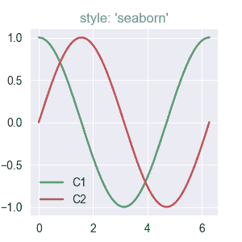

# 指定颜色

> 原文：[Specifying Colors](http://matplotlib.org/users/colors.html)
> 
> 译者：[飞龙](https://github.com/)
> 
> 协议：[CC BY-NC-SA 4.0](http://creativecommons.org/licenses/by-nc-sa/4.0/)

在 matplotlib 的几乎所有地方，用户都可以指定颜色，它可以以如下形式提供：

*   RGB 或者 RGBA 浮点值元组，`[0, 1]`之间，例如`(0.1, 0.2, 0.5)`或者`(0.1, 0.2, 0.5, 0.3)`。

*   RGB 或者 RGBA 十六进制字符串，例如`#0F0F0F`或者`#0F0F0F0F`。

*   `[0, 1]`之间的浮点值的字符串表示，用于表示灰度，例如`0.5`。

*   `{'b', 'g', 'r', 'c', 'm', 'y', 'k', 'w'}`之一。

*   X11/CSS4 颜色名称。

*   [XKCD 颜色](https://xkcd.com/color/rgb/)之一，以`'xkcd:'`为前缀，例如`'xkcd:sky blue'`。

*   `{'C0', 'C1', 'C2', 'C3', 'C4', 'C5', 'C6', 'C7', 'C8', 'C9'}`之一。

*   `{'tab:blue', 'tab:orange', 'tab:green', 'tab:red', 'tab:purple', 'tab:brown', 'tab:pink', 'tab:gray', 'tab:olive', 'tab:cyan'}`之一。这是 T10 调色板的 Tableau 颜色（默认的色相环）。

所有颜色字符串都是大小写敏感的。

## `CN`颜色选择

颜色可以通由匹配正则表达式`C[0-9]`的字符串来指定。 这可以在任何当前接受颜色的地方传递，并且可以在`matplotlib.Axes.plot`的`format-string`中用作“单个字符颜色”。

单个数字是默认属性环的索引（`matplotlib.rcParams['axes.prop_cycle']`）。 如果属性环不包括`'color'`，则返回黑色。 在创建艺术家时会对颜色求值。 例如：

```
import numpy as np
import matplotlib.pyplot as plt
import matplotlib as mpl
th = np.linspace(0, 2*np.pi, 128)

def demo(sty):
    mpl.style.use(sty)
    fig, ax = plt.subplots(figsize=(3, 3))

    ax.set_title('style: {!r}'.format(sty), color='C0')

    ax.plot(th, np.cos(th), 'C1', label='C1')
    ax.plot(th, np.sin(th), 'C2', label='C2')
    ax.legend()

demo('default')
```


