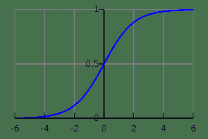

# 7.2.2 更多示例

> 译者：[Python 文档协作翻译小组](http://python.usyiyi.cn/translate/theano_09/index.html)，原文：[More Examples](http://deeplearning.net/software/theano_versions/dev/tutorial/examples.html)。
> 
> 本文以 [CC BY-NC-SA 4.0](http://creativecommons.org/licenses/by-nc-sa/4.0/cn/) 协议发布，转载请保留作者署名和文章出处。
> 
> [Python 文档协作翻译小组](http://python.usyiyi.cn/)人手紧缺，有兴趣的朋友可以加入我们，完全公益性质。交流群：467338606。

现在开始，通过浏览库的[Basic Tensor Functionality](../library/tensor/basic.html#libdoc-basic-tensor)这一部分，开始更加系统地熟悉Theano的基本对象和操作是非常明智的。

随着教程的展开，你还应该逐渐熟悉库的其他相关领域以及文档入口页面的相关主题。

## Logistic函数

这里是另一个简单的例子，虽然比将两个数字加在一起更复杂一点。让我们说，你想计算logistic曲线，它由下式给出：

```
  
```



logistic函数的图，其中x在x轴上，s(x)在y轴上。

如果你想对双精度矩阵上的[每个元素](../library/tensor/basic.html#libdoc-tensor-elementwise)计算这个函数，这表示你想将这个函数应用到矩阵的每个元素上。

嗯，你是这样做的：

```
>>> import theano
>>> import theano.tensor as T
>>> x = T.dmatrix('x')
>>> s = 1 / (1 + T.exp(-x))
>>> logistic = theano.function([x], s)
>>> logistic([[0, 1], [-1, -2]])
array([[ 0.5       ,  0.73105858],
 [ 0.26894142,  0.11920292]]) 
```

在每个元素上执行logistic的原因是因为它的所有运算 —— 除法、加法、幂和除法 —— 本身是单个元素的操作。

下面是这种情况：

```
  
```

我们可以验证这个另外一种形式是否产生相同的值：

```
>>> s2 = (1 + T.tanh(x / 2)) / 2
>>> logistic2 = theano.function([x], s2)
>>> logistic2([[0, 1], [-1, -2]])
array([[ 0.5       ,  0.73105858],
 [ 0.26894142,  0.11920292]]) 
```

## 同时计算多个值

Theano支持多输出功能。例如，我们可以同时计算两个矩阵*a*和*b*之间[每个元素](../library/tensor/basic.html#libdoc-tensor-elementwise)的差、差的绝对值和平方差：

```
>>> a, b = T.dmatrices('a', 'b')
>>> diff = a - b
>>> abs_diff = abs(diff)
>>> diff_squared = diff**2
>>> f = theano.function([a, b], [diff, abs_diff, diff_squared]) 
```

注意

`dmatrices`产生与你提供的名称一样多的输出。它是分配符号变量的一个快捷方式，我们将在教程中经常使用它。

当我们使用函数f，它返回三个变量（为了可读性，输出被重新格式化了）：

```
>>> f([[1, 1], [1, 1]], [[0, 1], [2, 3]])
[array([[ 1.,  0.],
 [-1., -2.]]), array([[ 1.,  0.],
 [ 1.,  2.]]), array([[ 1.,  0.],
 [ 1.,  4.]])] 
```

## 为参数设置默认值

假设你想定义一个函数将两个数字相加，但是你只提供一个数字，另一个输入假设为1。你可以这样做：

```
>>> from theano import In
>>> from theano import function
>>> x, y = T.dscalars('x', 'y')
>>> z = x + y
>>> f = function([x, In(y, value=1)], z)
>>> f(33)
array(34.0)
>>> f(33, 2)
array(35.0) 
```

这里使用[In](../library/compile/io.html#function-inputs)类，它允许你更详细地指定你的函数的参数的属性。这里，通过创建`value`字段设置为1的`In`实例，为*y*赋予默认值1。

具有默认值的输入必须遵循没有默认值的输入（类似Python的函数）。可以有多个具有默认值的输入。这些参数可以按位置或名称设置，和在标准Python中一样：

```
>>> x, y, w = T.dscalars('x', 'y', 'w')
>>> z = (x + y) * w
>>> f = function([x, In(y, value=1), In(w, value=2, name='w_by_name')], z)
>>> f(33)
array(68.0)
>>> f(33, 2)
array(70.0)
>>> f(33, 0, 1)
array(33.0)
>>> f(33, w_by_name=1)
array(34.0)
>>> f(33, w_by_name=1, y=0)
array(33.0) 
```

注意

`In`不知道作为参数传递的局部变量*y*和*w*的名称。符号变量对象具有名称属性（在上面的示例中由`dscalars`设置）和*它们*是我们构建的函数中的关键字参数的名称。这是`In（y， value = 1）`中工作的机制。在`In(w, value=2, name='w_by_name')`的情况下。我们用一个这个函数使用的名称来覆盖符号变量的name属性。

你可能想查看库中的[Function](../library/compile/function.html#usingfunction)以获取更多详细信息。

## 使用共享变量

还可以利用内部状态生成一个函数。例如，假设我们想要一个累加器：在开始，状态被初始化为零。然后，在每次函数调用时，状态通过函数的参数增加。

首先我们定义*累加器*函数。它将其参数添加到内部状态，并返回旧的状态值。

```
>>> from theano import shared
>>> state = shared(0)
>>> inc = T.iscalar('inc')
>>> accumulator = function([inc], state, updates=[(state, state+inc)]) 
```

这段代码引入了一些新的概念。`shared`函数构造所谓的[共享变量](../library/compile/shared.html#libdoc-compile-shared)。它们是符号变量和非符号变量的混合，其值可以在多个函数之间共享。共享变量就像`dmatrices(...)`返回的对象一样可以在符号表达式中使用，但它们还有一个内部值，定义在*所有*使用这个符号变量的函数中的值。它被称为*共享*变量??，因为它的值在许多函数之间共享。该值可以通过`.get_value()`和`.set_value()`方法访问和修改。我们会很快回来。

该代码中的另一个新东西是`function`的`updates`参数。`updates`必须提供形式为（共享变量，新表达式）对的一个列表。它也可以是一个字典，其键是共享变量，值是新的表达式。无论哪种方式，它意味着“每当这个函数运行时，它将用相应表达式的结果替换每个共享变量的`.value`”。上面，我们的累加器用状态和增量总和取代`state`的值。

让我们试试吧！

```
>>> print(state.get_value())
0
>>> accumulator(1)
array(0)
>>> print(state.get_value())
1
>>> accumulator(300)
array(1)
>>> print(state.get_value())
301 
```

可以重置状态。只需使用`.set_value()`方法：

```
>>> state.set_value(-1)
>>> accumulator(3)
array(-1)
>>> print(state.get_value())
2 
```

如上所述，你可以定义多个函数来使用相同的共享变量。这些函数都可以更新该值。

```
>>> decrementor = function([inc], state, updates=[(state, state-inc)])
>>> decrementor(2)
array(2)
>>> print(state.get_value())
0 
```

你可能想知道为什么存在更新机制。你总是可以通过返回新的表达式，并在NumPy中照常使用它们来实现类似的结果。更新机制可以是语法方便，但是它主要是为了效率。有时可以使用就地算法（例如低秩矩阵更新）更快地完成对共享变量的更新。此外，Theano对分配变量的位置和方式有更多的控制，这是在[GPU](using_gpu.html#using-gpu)上获得良好性能的重要因素之一。

可能会发生这种情况，你使用共享变量表达了某个公式，但你*不*想使用它的值。在这种情况下，你可以使用`function`的`givens`参数为一个特定函数替换图中的特定节点。

```
>>> fn_of_state = state * 2 + inc
>>> # The type of foo must match the shared variable we are replacing
>>> # with the ``givens``
>>> foo = T.scalar(dtype=state.dtype)
>>> skip_shared = function([inc, foo], fn_of_state, givens=[(state, foo)])
>>> skip_shared(1, 3)  # we're using 3 for the state, not state.value
array(7)
>>> print(state.get_value())  # old state still there, but we didn't use it
0 
```

`givens`参数可用于替换任何符号变量，而不仅仅是共享变量。一般情况下，你可以替换常量和表达式。但要小心，不要让`givens`替换引入的表达式是共同依赖的，替换的顺序没有定义，所以替换必须以任何顺序工作。

在实践中，考虑`givens`的一个好方法是允许你用一个不同的表达式替换你的公式的任何部分，这个表达式的计算结果是一个相同形状和dtype的张量。

注意

Theano共享变量broadcast模式对于每个维度默认为False。共享变量大小可以随时间改变，所以我们不能使用形状来找到broadcastable的模式。如果你想要一个不同的模式，只要将它作为参数传递`theano.shared(..., broadcastable=(True, False))`

## 复制函数

Theano函数可以被复制，这对于创建类似的函数，但是使用不同的共享变量或更新是有用的。这是使用`function`对象的[`copy()`](../library/compile/function.html#theano.compile.function_module.Function.copy "theano.compile.function_module.Function.copy")方法完成的。复制的是原始函数的优化图，因此编译只需要执行一次。

让我们从上面定义的累加器开始：

```
>>> import theano
>>> import theano.tensor as T
>>> state = theano.shared(0)
>>> inc = T.iscalar('inc')
>>> accumulator = theano.function([inc], state, updates=[(state, state+inc)]) 
```

我们可以使用它像往常一样增加状态：

```
>>> accumulator(10)
array(0)
>>> print(state.get_value())
10 
```

我们可以使用`copy()`创建一个类似的累加器，但使用自己的内部状态使用`swap`参数，它是一个要交换的共享变量的字典：

```
>>> new_state = theano.shared(0)
>>> new_accumulator = accumulator.copy(swap={state:new_state})
>>> new_accumulator(100)
[array(0)]
>>> print(new_state.get_value())
100 
```

第一个函数的状态保持不变：

```
>>> print(state.get_value())
10 
```

我们现在使用`delete_updates`参数创建一个删除更新的副本，默认情况下，该参数设置为`False`：

```
>>> null_accumulator = accumulator.copy(delete_updates=True) 
```

如预期，共享状态不再更新：

```
>>> null_accumulator(9000)
[array(10)]
>>> print(state.get_value())
10 
```

## 使用随机数

因为在Theano中你首先将一切用符号表示并在之后编译这个表达式以获得函数，所以使用伪随机数字不是像在NumPy中那么直接，虽然也不太复杂。

将随机性放到Theano的计算中的考虑方式是将随机变量放在你的图中。Theano将为每个这样的变量分配一个NumPy RandomStream对象（一个随机数生成器），并根据需要绘制它。我们将这种随机数序列称为*随机流*。*随机流*的核心是它们的共享变量，因此在这里也可以对共享变量进行观察。Theanos的随机对象在[RandomStreams](../library/tensor/shared_randomstreams.html#libdoc-tensor-shared-randomstreams)中定义和实现，底层在[RandomStreamsBase](../library/tensor/raw_random.html#libdoc-tensor-raw-random)中定义和实现。

### 简要示例

这里有一个简单的例子。起始代码是：

```
from theano.tensor.shared_randomstreams import RandomStreams
from theano import function
srng = RandomStreams(seed=234)
rv_u = srng.uniform((2,2))
rv_n = srng.normal((2,2))
f = function([], rv_u)
g = function([], rv_n, no_default_updates=True)    #Not updating rv_n.rng
nearly_zeros = function([], rv_u + rv_u - 2 * rv_u) 
```

这里，’rv_u’表示来自均匀分布的2×2矩阵的随机流。同样，’rv_n’表示来自正态分布的2×2矩阵的随机流。分布的实现在`RandomStreams`中定义，底层在[raw_random](../library/tensor/raw_random.html#libdoc-tensor-raw-random)中定义。它们只在CPU上工作。有关GPU版本，请参见[其他实现](#other-implementations)。

现在让我们使用这些对象。随机数发生器的内部状态是自动更新的，所以我们每次都得到不同的随机数。

```
>>> f_val0 = f()
>>> f_val1 = f()  #different numbers from f_val0 
```

当我们向`function`添加额外参数`no_default_updates=True`（如在*g*中）时，随机数生成器状态不受调用返回函数影响。因此，例如，多次调用*g*将返回相同的数字。

```
>>> g_val0 = g()  # different numbers from f_val0 and f_val1
>>> g_val1 = g()  # same numbers as g_val0! 
```

一个重要的提醒是，在函数的每次执行期间最多绘制一个随机变量。因此，即使*rv_u*随机变量在输出表达式中出现三次，*almost_zeros*函数保证返回大约为0（舍入误差除外）。

```
>>> nearly_zeros = function([], rv_u + rv_u - 2 * rv_u) 
```

### 种子流

随机变量可以使用单独的种子或使用共同的种子。

你可以使用`.rng.set_value()`，通过播种或分配`.rng`属性来播种一个随机变量。

```
>>> rng_val = rv_u.rng.get_value(borrow=True)   # Get the rng for rv_u
>>> rng_val.seed(89234)                         # seeds the generator
>>> rv_u.rng.set_value(rng_val, borrow=True)    # Assign back seeded rng 
```

你也可以通过`RandomStreams`对象的`seed`方法对该对象分配的*全部*随机变量设置种子。该种子将用于设置临时随机数发生器的种子，这个零时随机数发生器随后将为每个随机变量生成种子。

```
>>> srng.seed(902340)  # seeds rv_u and rv_n with different seeds each 
```

### 函数之间共享流

与通常的共享变量一样，用于随机变量的随机数发生器在函数之间是共同的。因此，我们的*almost_zeros*函数将更新函数*f*中使用的生成器的状态。

例如：

```
>>> state_after_v0 = rv_u.rng.get_value().get_state()
>>> nearly_zeros()       # this affects rv_u's generator
array([[ 0.,  0.],
 [ 0.,  0.]])
>>> v1 = f()
>>> rng = rv_u.rng.get_value(borrow=True)
>>> rng.set_state(state_after_v0)
>>> rv_u.rng.set_value(rng, borrow=True)
>>> v2 = f()             # v2 != v1
>>> v3 = f()             # v3 == v1 
```

### 在Theano图之间复制随机状态

在一些使用情况下，用户可能想要将与给定的theano图（例如，具有下面的编译函数f1的g1）相关联的所有随机数发生器的“状态”转移到第二个图形（例如具有函数f2的g2）。这中情况例如，如果你试图从之前的一个序列化的模型的参数初始化模型的状态。对于[`theano.tensor.shared_randomstreams.RandomStreams`](../library/tensor/shared_randomstreams.html#theano.tensor.shared_randomstreams.RandomStreams "theano.tensor.shared_randomstreams.RandomStreams")和[`theano.sandbox.rng_mrg.MRG_RandomStreams`](../library/sandbox/rng_mrg.html#theano.sandbox.rng_mrg.MRG_RandomStreams "theano.sandbox.rng_mrg.MRG_RandomStreams")，可以通过复制`state_updates`参数的元素来实现。

每当从RandomStreams对象中绘制随机变量时，就会将元组添加到`state_updates`列表中。第一个元素是一个共享变量，它表示与此*特定*变量??相关联的随机数生成器的状态，而第二个元素表示与随机数生成过程对应的theano图（即RandomFunction {uniform} .0）。

下面示出了如何将“随机状态”从一个theano函数传递到另一个函数的示例。

```
>>> from __future__ import print_function
>>> import theano
>>> import numpy
>>> import theano.tensor as T
>>> from theano.sandbox.rng_mrg import MRG_RandomStreams
>>> from theano.tensor.shared_randomstreams import RandomStreams 
```

```
>>> class Graph():
...     def __init__(self, seed=123):
...         self.rng = RandomStreams(seed)
...         self.y = self.rng.uniform(size=(1,)) 
```

```
>>> g1 = Graph(seed=123)
>>> f1 = theano.function([], g1.y) 
```

```
>>> g2 = Graph(seed=987)
>>> f2 = theano.function([], g2.y) 
```

```
>>> # By default, the two functions are out of sync.
>>> f1()
array([ 0.72803009])
>>> f2()
array([ 0.55056769]) 
```

```
>>> def copy_random_state(g1, g2):
...     if isinstance(g1.rng, MRG_RandomStreams):
...         g2.rng.rstate = g1.rng.rstate
...     for (su1, su2) in zip(g1.rng.state_updates, g2.rng.state_updates):
...         su2[0].set_value(su1[0].get_value()) 
```

```
>>> # We now copy the state of the theano random number generators.
>>> copy_random_state(g1, g2)
>>> f1()
array([ 0.59044123])
>>> f2()
array([ 0.59044123]) 
```

### 其他随机分布

[其他分布的实现](../library/tensor/raw_random.html#libdoc-tensor-raw-random)。

### 其他实现

还有2个基于[MRG31k3p](../library/sandbox/rng_mrg.html#libdoc-rng-mrg)和[`CURAND`](../library/sandbox/cuda/op.html#module-theano.sandbox.cuda.rng_curand "theano.sandbox.cuda.rng_curand")的实现。RandomStream只在CPU上工作，MRG31k3p在CPU和GPU上工作。CURAND只在GPU上工作。

注意

使用MRG版本很容易，你只需要更改import为：

> ```
> from theano.sandbox.rng_mrg import MRG_RandomStreams as RandomStreams 
> ```

### 简要示例

这里有一个简单的例子。起始代码是：

```
from theano.tensor.shared_randomstreams import RandomStreams
from theano import function
srng = RandomStreams(seed=234)
rv_u = srng.uniform((2,2))
rv_n = srng.normal((2,2))
f = function([], rv_u)
g = function([], rv_n, no_default_updates=True)    #Not updating rv_n.rng
nearly_zeros = function([], rv_u + rv_u - 2 * rv_u) 
```

这里，’rv_u’表示来自均匀分布的2×2矩阵的随机流。同样，’rv_n’表示来自正态分布的2×2矩阵的随机流。分布的实现在`RandomStreams`中定义，底层在[raw_random](../library/tensor/raw_random.html#libdoc-tensor-raw-random)中定义。它们只在CPU上工作。有关GPU版本，请参见[其他实现](#other-implementations)。

现在让我们使用这些对象。随机数发生器的内部状态是自动更新的，所以我们每次都得到不同的随机数。

```
>>> f_val0 = f()
>>> f_val1 = f()  #different numbers from f_val0 
```

当我们向`function`添加额外参数`no_default_updates=True`（如在*g*中）时，随机数生成器状态不受调用返回函数影响。因此，例如，多次调用*g*将返回相同的数字。

```
>>> g_val0 = g()  # different numbers from f_val0 and f_val1
>>> g_val1 = g()  # same numbers as g_val0! 
```

一个重要的提醒是，在函数的每次执行期间最多绘制一个随机变量。因此，即使*rv_u*随机变量在输出表达式中出现三次，*almost_zeros*函数保证返回大约为0（舍入误差除外）。

```
>>> nearly_zeros = function([], rv_u + rv_u - 2 * rv_u) 
```

### 种子流

随机变量可以使用单独的种子或使用共同的种子。

你可以使用`.rng.set_value()`，通过播种或分配`.rng`属性来播种一个随机变量。

```
>>> rng_val = rv_u.rng.get_value(borrow=True)   # Get the rng for rv_u
>>> rng_val.seed(89234)                         # seeds the generator
>>> rv_u.rng.set_value(rng_val, borrow=True)    # Assign back seeded rng 
```

你也可以通过`RandomStreams`对象的`seed`方法对该对象分配的*全部*随机变量设置种子。该种子将用于设置临时随机数发生器的种子，这个零时随机数发生器随后将为每个随机变量生成种子。

```
>>> srng.seed(902340)  # seeds rv_u and rv_n with different seeds each 
```

### 函数之间共享流

与通常的共享变量一样，用于随机变量的随机数发生器在函数之间是共同的。因此，我们的*almost_zeros*函数将更新函数*f*中使用的生成器的状态。

例如：

```
>>> state_after_v0 = rv_u.rng.get_value().get_state()
>>> nearly_zeros()       # this affects rv_u's generator
array([[ 0.,  0.],
 [ 0.,  0.]])
>>> v1 = f()
>>> rng = rv_u.rng.get_value(borrow=True)
>>> rng.set_state(state_after_v0)
>>> rv_u.rng.set_value(rng, borrow=True)
>>> v2 = f()             # v2 != v1
>>> v3 = f()             # v3 == v1 
```

### 在Theano图之间复制随机状态

在一些使用情况下，用户可能想要将与给定的theano图（例如，具有下面的编译函数f1的g1）相关联的所有随机数发生器的“状态”转移到第二个图形（例如具有函数f2的g2）。这中情况例如，如果你试图从之前的一个序列化的模型的参数初始化模型的状态。对于[`theano.tensor.shared_randomstreams.RandomStreams`](../library/tensor/shared_randomstreams.html#theano.tensor.shared_randomstreams.RandomStreams "theano.tensor.shared_randomstreams.RandomStreams")和[`theano.sandbox.rng_mrg.MRG_RandomStreams`](../library/sandbox/rng_mrg.html#theano.sandbox.rng_mrg.MRG_RandomStreams "theano.sandbox.rng_mrg.MRG_RandomStreams")，可以通过复制`state_updates`参数的元素来实现。

每当从RandomStreams对象中绘制随机变量时，就会将元组添加到`state_updates`列表中。第一个元素是一个共享变量，它表示与此*特定*变量??相关联的随机数生成器的状态，而第二个元素表示与随机数生成过程对应的theano图（即RandomFunction {uniform} .0）。

下面示出了如何将“随机状态”从一个theano函数传递到另一个函数的示例。

```
>>> from __future__ import print_function
>>> import theano
>>> import numpy
>>> import theano.tensor as T
>>> from theano.sandbox.rng_mrg import MRG_RandomStreams
>>> from theano.tensor.shared_randomstreams import RandomStreams 
```

```
>>> class Graph():
...     def __init__(self, seed=123):
...         self.rng = RandomStreams(seed)
...         self.y = self.rng.uniform(size=(1,)) 
```

```
>>> g1 = Graph(seed=123)
>>> f1 = theano.function([], g1.y) 
```

```
>>> g2 = Graph(seed=987)
>>> f2 = theano.function([], g2.y) 
```

```
>>> # By default, the two functions are out of sync.
>>> f1()
array([ 0.72803009])
>>> f2()
array([ 0.55056769]) 
```

```
>>> def copy_random_state(g1, g2):
...     if isinstance(g1.rng, MRG_RandomStreams):
...         g2.rng.rstate = g1.rng.rstate
...     for (su1, su2) in zip(g1.rng.state_updates, g2.rng.state_updates):
...         su2[0].set_value(su1[0].get_value()) 
```

```
>>> # We now copy the state of the theano random number generators.
>>> copy_random_state(g1, g2)
>>> f1()
array([ 0.59044123])
>>> f2()
array([ 0.59044123]) 
```

### 其他随机分布

[其他分布的实现](../library/tensor/raw_random.html#libdoc-tensor-raw-random)。

### 其他实现

还有2个基于[MRG31k3p](../library/sandbox/rng_mrg.html#libdoc-rng-mrg)和[`CURAND`](../library/sandbox/cuda/op.html#module-theano.sandbox.cuda.rng_curand "theano.sandbox.cuda.rng_curand")的实现。RandomStream只在CPU上工作，MRG31k3p在CPU和GPU上工作。CURAND只在GPU上工作。

注意

使用MRG版本很容易，你只需要更改import为：

> ```
> from theano.sandbox.rng_mrg import MRG_RandomStreams as RandomStreams 
> ```

## 真实示例：Logistic回归

前面的内容体现在下面这个更现实的例子中。它将被重复使用。

```
import numpy
import theano
import theano.tensor as T
rng = numpy.random

N = 400                                   # training sample size
feats = 784                               # number of input variables

# generate a dataset: D = (input_values, target_class)
D = (rng.randn(N, feats), rng.randint(size=N, low=0, high=2))
training_steps = 10000

# Declare Theano symbolic variables
x = T.dmatrix("x")
y = T.dvector("y")

# initialize the weight vector w randomly
#
# this and the following bias variable b
# are shared so they keep their values
# between training iterations (updates)
w = theano.shared(rng.randn(feats), name="w")

# initialize the bias term
b = theano.shared(0., name="b")

print("Initial model:")
print(w.get_value())
print(b.get_value())

# Construct Theano expression graph
p_1 = 1 / (1 + T.exp(-T.dot(x, w) - b))   # Probability that target = 1
prediction = p_1 > 0.5                    # The prediction thresholded
xent = -y * T.log(p_1) - (1-y) * T.log(1-p_1) # Cross-entropy loss function
cost = xent.mean() + 0.01 * (w ** 2).sum()# The cost to minimize
gw, gb = T.grad(cost, [w, b])             # Compute the gradient of the cost
                                          # w.r.t weight vector w and
                                          # bias term b
                                          # (we shall return to this in a
                                          # following section of this tutorial)

# Compile
train = theano.function(
          inputs=[x,y],
          outputs=[prediction, xent],
          updates=((w, w - 0.1 * gw), (b, b - 0.1 * gb)))
predict = theano.function(inputs=[x], outputs=prediction)

# Train
for i in range(training_steps):
    pred, err = train(D[0], D[1])

print("Final model:")
print(w.get_value())
print(b.get_value())
print("target values for D:")
print(D[1])
print("prediction on D:")
print(predict(D[0])) 
```