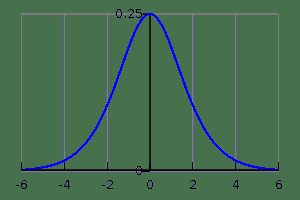

# 7.2.3 Theano中的导数

> 译者：[Python 文档协作翻译小组](http://python.usyiyi.cn/translate/theano_09/index.html)，原文：[Derivatives in Theano](http://deeplearning.net/software/theano_versions/dev/tutorial/gradients.html)。
> 
> 本文以 [CC BY-NC-SA 4.0](http://creativecommons.org/licenses/by-nc-sa/4.0/cn/) 协议发布，转载请保留作者署名和文章出处。
> 
> [Python 文档协作翻译小组](http://python.usyiyi.cn/)人手紧缺，有兴趣的朋友可以加入我们，完全公益性质。交流群：467338606。

## 计算梯度

现在让我们使用Theano来完成一个稍微复杂的任务：创建一个函数，该函数计算相对于其参数*x*的某个表达式*y*的导数。为此，我们将使用宏`T.grad`。例如，我们可以计算相对于的梯度。注意：。

这里是计算这个梯度的代码：

```
>>> import numpy
>>> import theano
>>> import theano.tensor as T
>>> from theano import pp
>>> x = T.dscalar('x')
>>> y = x ** 2
>>> gy = T.grad(y, x)
>>> pp(gy)  # print out the gradient prior to optimization
'((fill((x ** TensorConstant{2}), TensorConstant{1.0}) * TensorConstant{2}) * (x ** (TensorConstant{2} - TensorConstant{1})))'
>>> f = theano.function([x], gy)
>>> f(4)
array(8.0)
>>> numpy.allclose(f(94.2), 188.4)
True 
```

在这个例子中，我们可以从`pp(gy)`看到我们正在计算正确的符号梯度。`fill((x ** 2), 1.0)`表示生成一个与*x* ** *2*相同形状的矩阵并以*1.0*填充它。

注意

优化器简化了符号梯度表达式。你可以通过挖掘编译后的函数的内部属性来看到这一点。

```
pp(f.maker.fgraph.outputs[0])
'(2.0 * x)' 
```

优化后，图中只剩下一个Apply节点，这将使输入加倍。

我们还可以计算复杂表达式的梯度，例如上面定义的logistic函数。事实证明，logistic的导数是：。



logistic函数的梯度图，其中x轴为*x*，y轴为。

```
>>> x = T.dmatrix('x')
>>> s = T.sum(1 / (1 + T.exp(-x)))
>>> gs = T.grad(s, x)
>>> dlogistic = theano.function([x], gs)
>>> dlogistic([[0, 1], [-1, -2]])
array([[ 0.25      ,  0.19661193],
 [ 0.19661193,  0.10499359]]) 
```

一般来说，对于任何**标量**表达式*s*，`T.grad(s, w)`提供Theano表达式用于计算。这样，Theano可用于对符号进行**高效**的微分（由于`T.grad`返回的表达式将在编译期间优化），即使对于具有多个输入的函数也是如此。（有关符号微分的描述，请参见[自动微分](http://en.wikipedia.org/wiki/Automatic_differentiation)）。

注意

`T.grad`的第二个参数可以是一个列表，在这种情况下，输出也是一个列表。两个列表中的顺序很重要：输出列表的元素*i*是`T.grad`第一个参数相对于第二个参数列表中的第*i*元素的梯度。`T.grad`的第一个参数必须是标量（大小为1的张量）。有关`T.grad`参数的语义的更多信息以及实现的细节，请参见库的[这](../library/gradient.html#libdoc-gradient)部分。

有关微分内部工作原理的其他信息，也可以在更高级的教程[扩展Theano](../extending/index.html#extending)中找到。

## 计算Jacobian

在Theano的用语中，术语*Jacobian*表示函数相对于其输入的一阶偏导数的张量。（这是对数学中所谓的Jacobian矩阵的泛化。）Theano实现[`theano.gradient.jacobian()`](../library/gradient.html#theano.gradient.jacobian "theano.gradient.jacobian")宏，执行计算Jacobian所需的所有内容。以下内容说明如何手动执行。

为了手动计算某些函数*y*相对于某个参数*x*的雅可比矩阵，我们需要使用`scan`。我们所做的是循环*y*中的条目，并计算*y [i]*相对于*x*的梯度。

注意

`scan`是Theano中的通用操作，允许以符号方式写入各种循环方程。创建符号循环（并优化它们的性能）是一项艰巨的任务，人们正在努力提高`scan`的性能。我们将在本教程后面回到[scan](loop.html#tutloop)。

```
>>> import theano
>>> import theano.tensor as T
>>> x = T.dvector('x')
>>> y = x ** 2
>>> J, updates = theano.scan(lambda i, y, x : T.grad(y[i], x), sequences=T.arange(y.shape[0]), non_sequences=[y, x])
>>> f = theano.function([x], J, updates=updates)
>>> f([4, 4])
array([[ 8.,  0.],
 [ 0.,  8.]]) 
```

我们在这段代码中使用`T.arange`生成从*0*到`y.shape[0]`的*int*序列。然后，我们循环该序列，并且在每个步骤，我们计算元素*y[i]*相对于*x*的梯度。 `scan`自动连接所有这些行，生成对应于Jacobian的矩阵。

注意

关于`T.grad`，有一些缺陷需要注意。其中一个是你不能重写上面的Jacobian表达式为`theano.scan(lambda y_i,x: T.grad(y_i,x), sequences=y, non_sequences=x)`，即使从scan的文档看来是可能的。原因是*y_i*将不再是*x*的函数，而*y[i]*仍然是。

## 计算Hessian

在Theano中，术语*Hessian*具有通常的数学概念：它是由函数的二阶偏导数组成的矩阵，该函数的输出为标量和输入为向量。Theano实现[`theano.gradient.hessian()`](../library/gradient.html#theano.gradient.hessian "theano.gradient.hessian")宏，完成计算Hessian所需要的所有内容。以下内容说明如何手动执行。

你可以类似于类似于的方式手动计算Hessian。现在唯一的区别是，我们计算`T.grad(cost,x)`的Jacobian，而不是计算某个表达式*y*的Jacobian，其中*cost*是某个标量。

```
>>> x = T.dvector('x')
>>> y = x ** 2
>>> cost = y.sum()
>>> gy = T.grad(cost, x)
>>> H, updates = theano.scan(lambda i, gy,x : T.grad(gy[i], x), sequences=T.arange(gy.shape[0]), non_sequences=[gy, x])
>>> f = theano.function([x], H, updates=updates)
>>> f([4, 4])
array([[ 2.,  0.],
 [ 0.,  2.]]) 
```

## Jacobian乘以向量

有时我们可以用Jacobians乘以向量或向量乘以Jacobians来表达算法。与求值Jacobians然后进行相乘相比，有方法计算所需的结果同时避免对Jacobians进行真正的求值。这可以带来显着的性能提升。一个这样的算法的描述可以在这里找到：

*   Barak A. Pearlmutter，“Fast Exact Multiplication by the Hessian”，*Neural Computation，1994*

虽然原则上我们希望Theano为我们自动识别这些模式，但在实践中，以通用的方式实现这样的优化是非常困难的。因此，我们提供专门用于这些任务的特殊函数。

### R操作符

*R操作符*用于求值Jacobian和向量之间的乘积，即。该公式甚至可以推广为*x*是一个矩阵、或者一个普通的张量，在这种情况下Jacobian变为张量并且乘积变为某种张量的积。因为在实践中，我们最终需要根据权重矩阵来计算这样的表达式，所以Theano支持这种更通用的操作形式。为了求值表达式*y*相对于*x*的*R操作*，将Jacobian与*v*相乘，你需要做类似这样的事情：

```
>>> W = T.dmatrix('W')
>>> V = T.dmatrix('V')
>>> x = T.dvector('x')
>>> y = T.dot(x, W)
>>> JV = T.Rop(y, W, V)
>>> f = theano.function([W, V, x], JV)
>>> f([[1, 1], [1, 1]], [[2, 2], [2, 2]], [0,1])
array([ 2.,  2.]) 
```

实现Rop的操作的[列表](../library/gradient.html#r-op-list)。

### L操作符

类似于*R操作符*，*L操作符*将计算*行*向量乘以Jacobian。数学公式是。*L操作符*也支持普通的张量（不仅仅是向量）。类似地，它可以实现如下：

```
>>> W = T.dmatrix('W')
>>> v = T.dvector('v')
>>> x = T.dvector('x')
>>> y = T.dot(x, W)
>>> VJ = T.Lop(y, W, v)
>>> f = theano.function([v,x], VJ)
>>> f([2, 2], [0, 1])
array([[ 0.,  0.],
 [ 2.,  2.]]) 
```

注意

> `v`是*求值的关键点*，其在*L操作*和*R操作*中不同。对于*L操作符*，这个求值的关键点需要具有与输出相同的形状，而对于*R操作符*，该点应具有与输入相同的形状参数。此外，这两个操作的结果不同。*L操作符*的结果与输入参数具有相同的形状，而*R操作符*的结果具有与输出相似的形状。

[支持R操作的操作的列表](../library/gradient.html#r-op-list)。

### R操作符

*R操作符*用于求值Jacobian和向量之间的乘积，即。该公式甚至可以推广为*x*是一个矩阵、或者一个普通的张量，在这种情况下Jacobian变为张量并且乘积变为某种张量的积。因为在实践中，我们最终需要根据权重矩阵来计算这样的表达式，所以Theano支持这种更通用的操作形式。为了求值表达式*y*相对于*x*的*R操作*，将Jacobian与*v*相乘，你需要做类似这样的事情：

```
>>> W = T.dmatrix('W')
>>> V = T.dmatrix('V')
>>> x = T.dvector('x')
>>> y = T.dot(x, W)
>>> JV = T.Rop(y, W, V)
>>> f = theano.function([W, V, x], JV)
>>> f([[1, 1], [1, 1]], [[2, 2], [2, 2]], [0,1])
array([ 2.,  2.]) 
```

实现Rop的操作的[列表](../library/gradient.html#r-op-list)。

### L操作符

类似于*R操作符*，*L操作符*将计算*行*向量乘以Jacobian。数学公式是。*L操作符*也支持普通的张量（不仅仅是向量）。类似地，它可以实现如下：

```
>>> W = T.dmatrix('W')
>>> v = T.dvector('v')
>>> x = T.dvector('x')
>>> y = T.dot(x, W)
>>> VJ = T.Lop(y, W, v)
>>> f = theano.function([v,x], VJ)
>>> f([2, 2], [0, 1])
array([[ 0.,  0.],
 [ 2.,  2.]]) 
```

注意

> `v`是*求值的关键点*，其在*L操作*和*R操作*中不同。对于*L操作符*，这个求值的关键点需要具有与输出相同的形状，而对于*R操作符*，该点应具有与输入相同的形状参数。此外，这两个操作的结果不同。*L操作符*的结果与输入参数具有相同的形状，而*R操作符*的结果具有与输出相似的形状。

[支持R操作的操作的列表](../library/gradient.html#r-op-list)。

## Hessian乘以向量

如果你需要计算*Hessian乘一个向量*，你可以利用上面定义的操作符，它比实际计算精确的Hessian然后执行乘积更有效率。由于Hessian矩阵的对称性，你有两个选择将给你相同的结果，虽然这些选择可能表现出不同的性能。因此，我们建议在使用以下两种方法之前分析它们：

```
>>> x = T.dvector('x')
>>> v = T.dvector('v')
>>> y = T.sum(x ** 2)
>>> gy = T.grad(y, x)
>>> vH = T.grad(T.sum(gy * v), x)
>>> f = theano.function([x, v], vH)
>>> f([4, 4], [2, 2])
array([ 4.,  4.]) 
```

或使用*R操作符*：

```
>>> x = T.dvector('x')
>>> v = T.dvector('v')
>>> y = T.sum(x ** 2)
>>> gy = T.grad(y, x)
>>> Hv = T.Rop(gy, x, v)
>>> f = theano.function([x, v], Hv)
>>> f([4, 4], [2, 2])
array([ 4.,  4.]) 
```

## 最后的要点

*   `grad`函数以符号的方式工作：它接收并返回Theano变量。
*   `grad`可以与宏进行比较，因为它可以重复应用。
*   标量costs只能由`grad`直接处理。数组通过重复应用来处理。
*   内置函数使得高效地计算*向量乘以Jacobian*和*向量乘以Hessian*。
*   优化工作还在进行中，包括有效计算完全Jacobian和Hessian矩阵以及*Jacobian乘以向量*。