# 米斯特白帽培训讲义 漏洞篇 弱口令、爆破、遍历

> 讲师：[gh0stkey](https://www.zhihu.com/people/gh0stkey/answers)
> 
> 整理：[飞龙](https://github.com/)
> 
> 协议：[CC BY-NC-SA 4.0](http://creativecommons.org/licenses/by-nc-sa/4.0/)

## 成因

弱口令没有严格和准确的定义，通常认为容易被别人（它们有可能对你很了解）猜测或被破解工具破解的口令均为弱口令。弱口令指的是仅包含简单数字和字母的口令，例如”123”、”abc”等，因为这样的口令很容易被别人破解。

通过爆破工具就可以很容易破解用户的弱口令。

## 危害

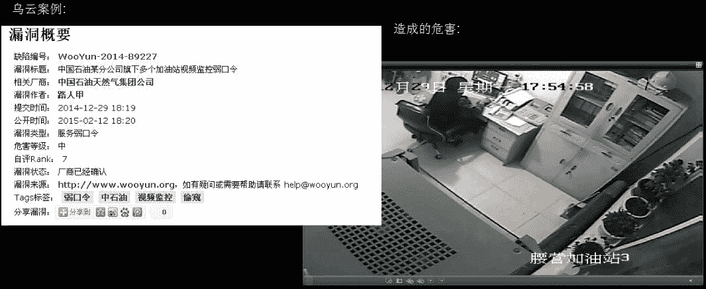

中石油的多个加油站的视频监控被入侵，我们可以通过它们看一些隐私。也可以通过它把监控器关掉，来进行一些非法活动。

## 分类

### 普通型

普通型弱口令就是常见的密码，比如，目前网络上也有人特地整理了常用的弱口令（Top 100）：

```
123456 a123456 123456a 5201314 111111 woaini1314 qq123456 123123 000000 1qaz2wsx 1q2w3e4r 
qwe123 7758521 123qwe a123123 123456aa woaini520 woaini 100200 1314520 woaini123 123321 
q123456 123456789 123456789a 5211314 asd123 a123456789 z123456 asd123456 a5201314 aa123456 
zhang123 aptx4869 123123a 1q2w3e4r5t 1qazxsw2 5201314a 1q2w3e aini1314 31415926 q1w2e3r4 
123456qq woaini521 1234qwer a111111 520520 iloveyou abc123 110110 111111a 123456abc w123456 
7758258 123qweasd 159753 qwer1234 a000000 qq123123 zxc123 123654 abc123456 123456q qq5201314 
12345678 000000a 456852 as123456 1314521 112233 521521 qazwsx123 zxc123456 abcd1234 asdasd 
666666 love1314 QAZ123 aaa123 q1w2e3 aaaaaa a123321 123000 11111111 12qwaszx 5845201314 
s123456 nihao123 caonima123 zxcvbnm123 wang123 159357 1A2B3C4D asdasd123 584520 753951 147258 
1123581321 110120 qq1314520
```

对于网站后台而言，一般为：

*   admin
*   manager
*   admin123
*   admin888
*   admin666
*   …

具体来说，不同的后台类型拥有不同的弱密码：

*   数据库（phpmyadmin）

    *   账号：root
    *   密码：root、root123、123456
*   tomcat

    *   账号：admin、tomcat、manager
    *   密码：admin、tomcat、admin123、123456、manager
*   jboss

    *   账号：admin、jboss、manager
    *   密码：admin、jboss、manager、123456
*   weblogic

    *   账号：weblogic、admin、manager
    *   密码：weblogic、admin、manager、123456

### 条件型

条件型弱口令就是和用户信息相关的密码，比如生日+手机号、姓名首字母+生日、爱人姓名首字母+生日+常用字母（520、1314 等）。

我们可以使用这个[猜密码的网站](http://www.caimima.net)来生成条件弱口令字典。

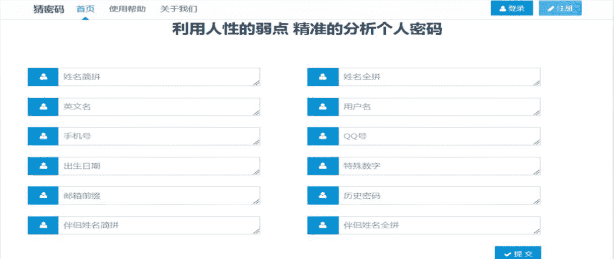

比如我们知道一个人，他的信息如下：

*   姓名：王小二
*   邮箱：412391882@qq.com
*   英文名：twowang
*   手机号：110

那我们就可以在这个网站上输入这些信息，然后点击下方的“提交”。

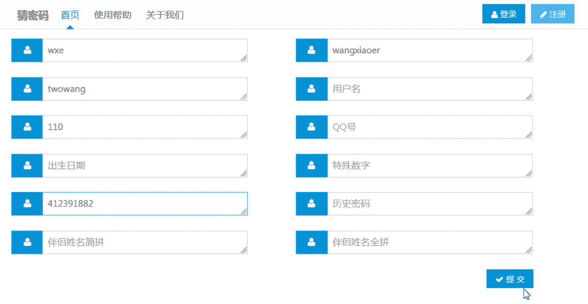

然后我们就得到了这个最有可能的密码。

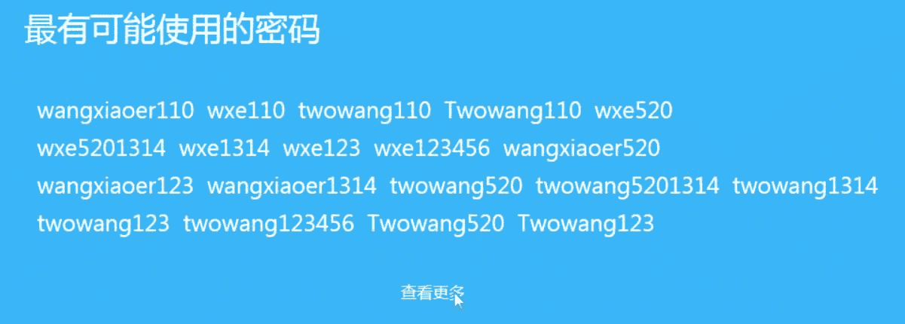

点击“查看更多”之后还可以获取更多弱口令。

## 实战

比如说，我们使用这样一段代码来演示弱口令漏洞，它模拟了某个系统的后台。

```
<?php
function showForm() { ?>
<form method="POST" action="./lesspass.php">
    <input type="text" name="un" />
    <input type="password" name="pw" />
    <input type="submit" value="登录" />
</form> <?php 
}

$un = @$_POST['un'];
$pw = @$_POST['pw'];
if($un == '' && $pw == '') 
    showForm();
else if($un == 'admin' && $pw == 'admin888') 
    echo '登录成功';
else {
    showForm();
    echo '登录失败';
}
```

第一行到第七行组成了一个 HTTP 表单。我们可以看到，这个表单使用 POST 方法向这个页面自己提交信息，`un`表单域对应 PHP 的`un`变量，`pw`表单域对应 PHP 的`pw`变量。

第九行和第十行从 HTTP 请求的主体中取出`un`参数和`pw`参数。

第十一到第十八行对用户名和密码参数做判断，如果都为空，那么我们认为它仅仅是显示页面的请求，直接返回。如果`un`为`admin`，且`pw`为`admin888`，因为这是我们预设的正确用户名和密码，所以显示登陆成功，否则显示登录失败。

真实代码的用户名和密码是从数据库里面取的，但是它仍然是确定的东西，而且如果存在弱口令，还是能破解出来，原理一致。

把它保存为`lesspass.php`，将其部署后访问`http://localhost/lesspass.php`。

接下来我们假装不知道真实密码，开始尝试。对于管理员账户，用户名一般是`admin`，密码可能为`admin`、`admin123`、`admin888`、`123456`、`123abcadmin`等等。

首先输入`admin`和`admin`，尝试失败：


之后是`admin`和`admin123`，还是失败。最后尝试`admin`和`admin888`，成功。

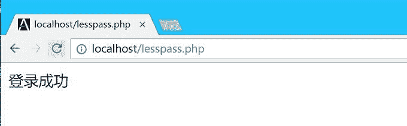

可见，爆破破解的原理就是一个一个尝试，破解效果完全取决于你所使用的字典。如果密码碰巧在你的字典中，就一定能成功。

## Burp Suite 爆破

首先我们需要把浏览器和 Burp 的代理配置好，打开 Burp 的拦截模式。之后我们在`lesspass.php`页面中随便输入什么东西并提交，在 Burp 中就可以看到拦截的封包：

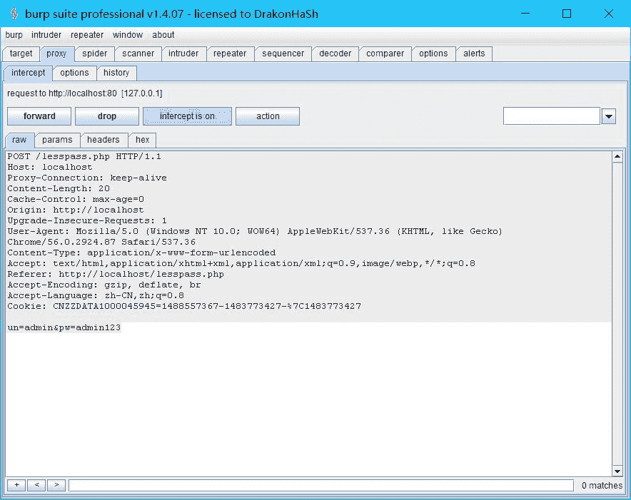

为了爆破密码，我们需要使用它的 Intruder 功能，右键弹出菜单并选择”Send to Intruder”：

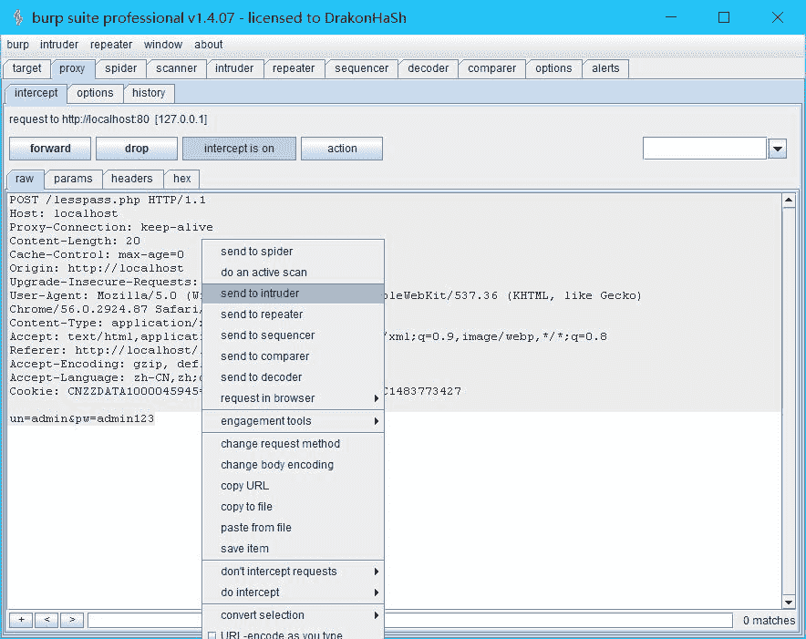

之后访问 Intruder 标签页，在 Position 子标签页中我们可以看到封包。


我们需要点击右边的`Clear`按钮把所有标记清除掉，由于我们需要破解密码，我们选中密码参数值点击`Add`。

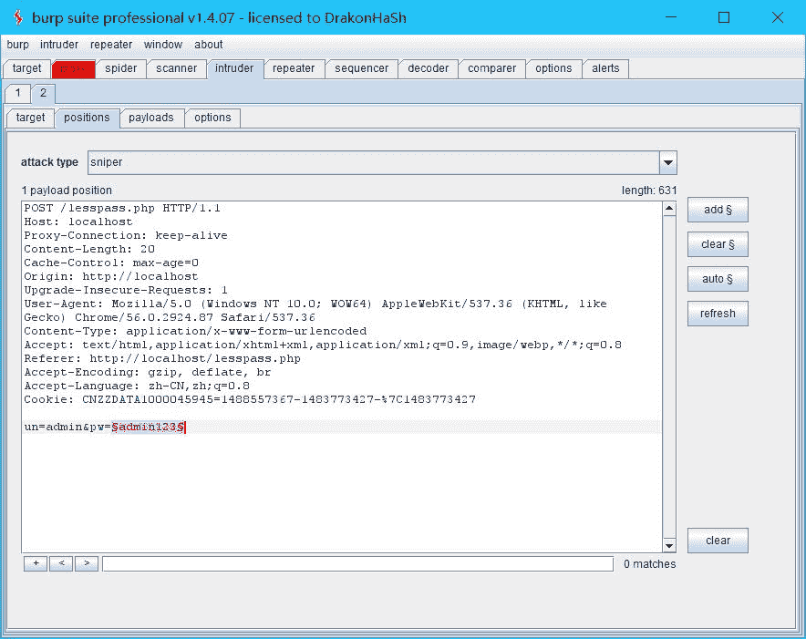

之后我们切换到旁边的 Payloads 标签页，点击中间的`load`按钮，加载字典。我们选择之前的`top100.txt`。

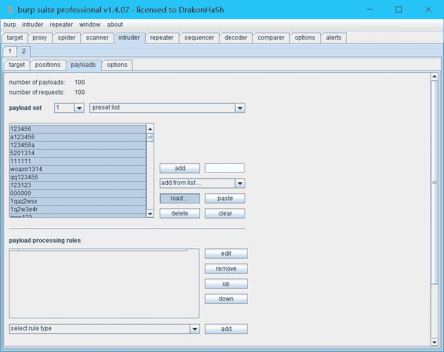

不要忘了要将`admin888`插入进去。在下面的输入框中输入`admin888`，并点击旁边的`Add`。

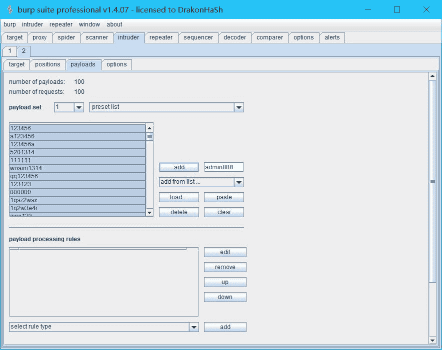

点击右上角的`Start Attack`来开始爆破（老版本是`Intruder -> Start Attack`菜单栏），我们会看到结果列表。

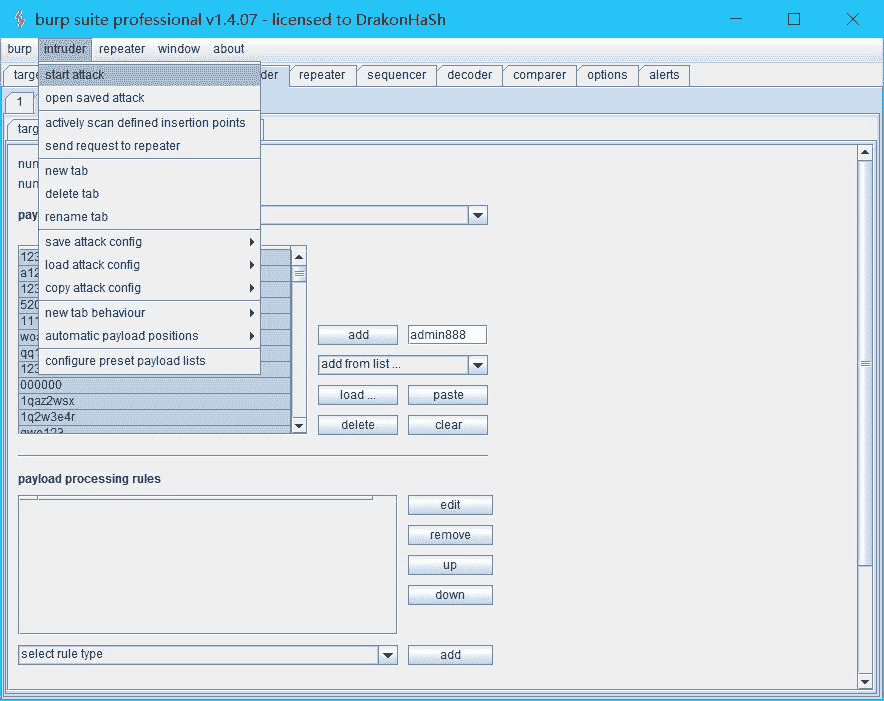

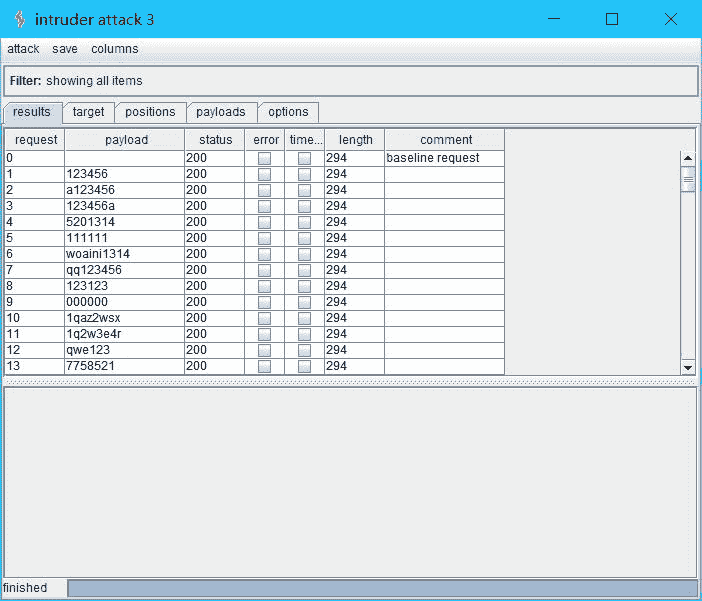

我们点击`Length`表头，让它按照长度来排序。可以发现有一个项目的长度与其它明显不同，那么它就是正确的结果。

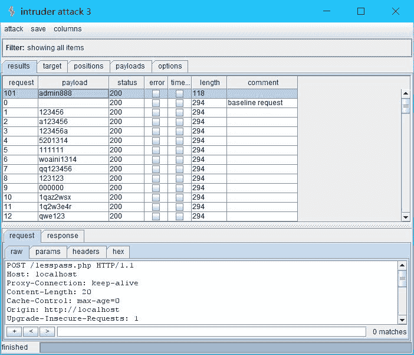

## PKAV Fuzzer

我们可以在[这里](http://www.pkav.net/tool/fuzzer/)下载工具。

我下载的版本的 1.5.6，我就可以双击`Pkav HTTP Fuzzer 1.5.6.exe`来打开它。另外目录下还有一份使用手册，`Pkav HTTP Fuzzer使用手册 Ver 1.0.pdf`，大家可以参考这个手册。这个教程只会讲用到的功能。

它的主界面是这样的：

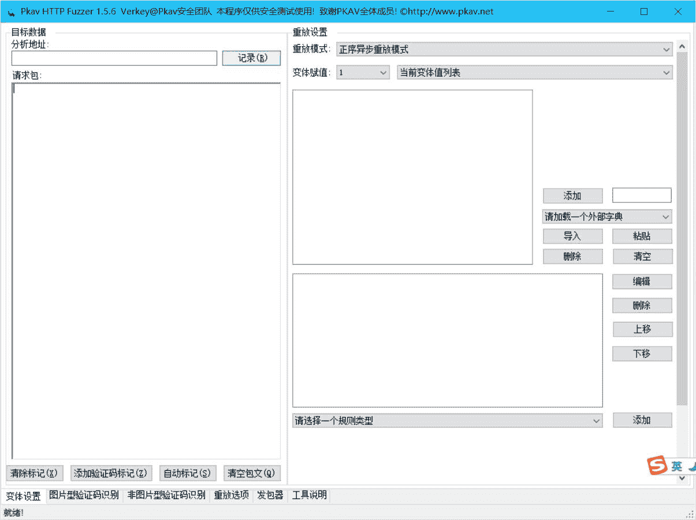

左边是“请求包”输入框，我们需要填写整个 HTTP 封包（就是 Burp 中的`Proxy -> Intercept`选项卡中的内容），我们将其复制过来。然后我们选中`pw`位置的`admin`，点击下面的“添加标记”：

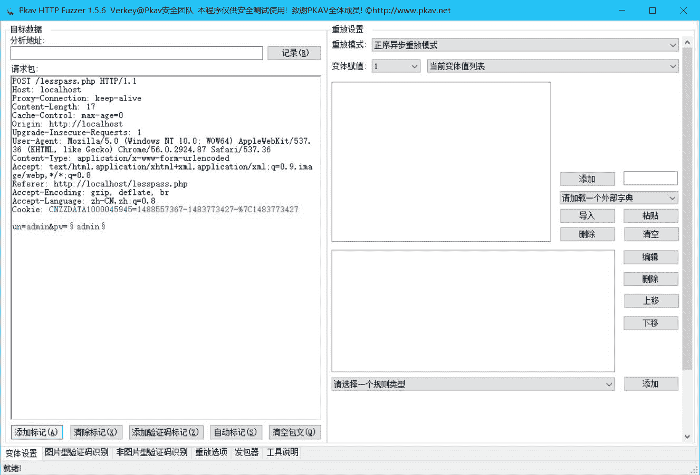

我们再来看看右边的“重放设置”，“重放模式”和“变体赋值”都不用改动，我们点击下方的“导入”按钮，选择之前的`top100.txt`。

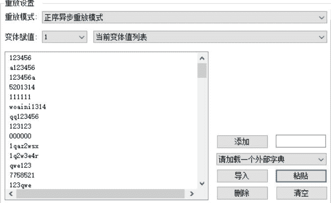

之后再“添加”按钮右边的输入框中输入`admin888`，然后点击“添加”。


然后我们点击下方的“发包器”选项卡，在新的界面中直接点“启动”：

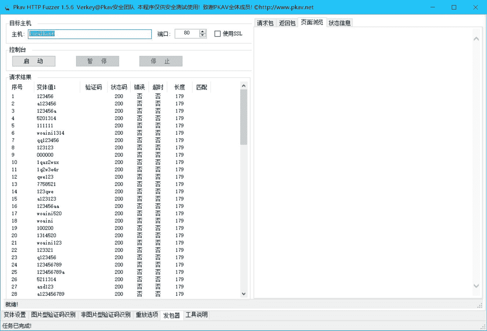

然后我们点击“长度”表头，让它按照长度排序。

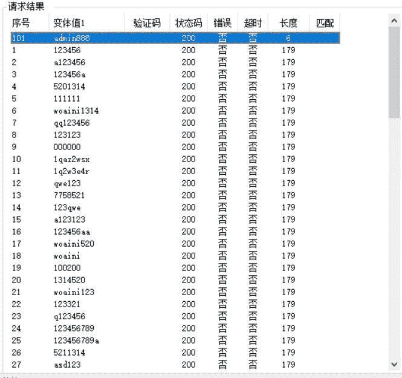

我们可以看到，仅当密码为`admin888`时长度为 6，其它都是其它数值，那么它就是正确密码。

## Burp Suite 遍历

比如这段代码，我们将其保存为`info.php`：

```
<?php
$id = @$_GET['id'];
$arr = array('1', '2', '3', '4', '5');
if(in_array($id, $arr, true)) 
    echo "用户名：$id 密码：123456";
else
    echo "信息出错";
```

这段代码模拟了用户信息的查询页面，一共有五条记录。我们可以访问这个页面，并使用 Burp 来拦截。像之前一样，发送到`Intruder`，然后清除掉所有标记，只保留 ID 的标记：

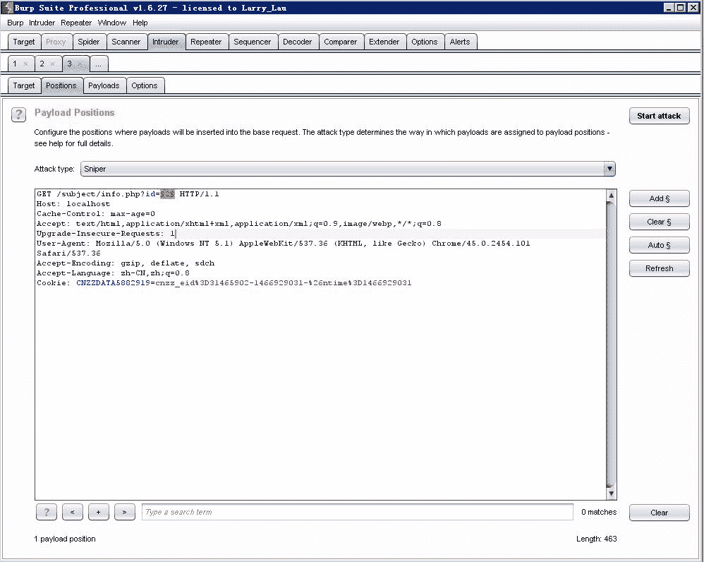

由于是纯数字，我们把上面的`Payload Type`调成`Numbers`。下面，我们把`From`设为`1`，`To`设为`10`，`Step`设为`1`。


之后点击`Start Attack`。我们可以看到结果，其中ID 1 ~ 5 的长度都是 224，6 ~ 10 都是 211。我们之前的测试中，2 是有效的，所以 224 应该是有效内容的长度。

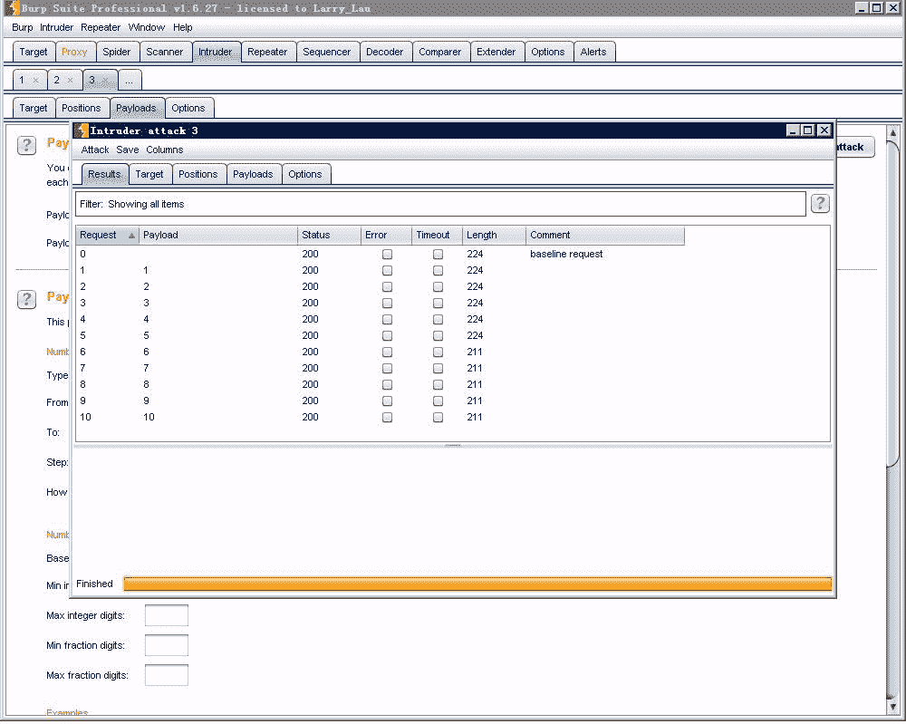

## 字典

更多字典请见 Kali 系统的`/usr/share/wordlists`目录。

## 附录

*   [新手指南：DVWA-1.9全级别教程之Brute Force](http://www.freebuf.com/articles/web/116437.html)

*   [新手指南：DVWA-1.9全级别教程之Insecure CAPTCHA](http://www.freebuf.com/articles/web/119692.html)

*   [Kali Linux 网络扫描秘籍 第七章 Web 应用扫描（一）](http://www.jianshu.com/p/4d515dd9915f)

*   [Kali Linux 网络扫描秘籍 第七章 Web 应用扫描（二）](http://www.jianshu.com/p/dfa3136b99b8)

*   [Kali Linux 网络扫描秘籍 第七章 Web 应用扫描（三）](http://www.jianshu.com/p/8ff6180bec9b)

*   [Burpsuite神器常用功能使用方法总结](https://zhuanlan.zhihu.com/p/22288110)