# 米斯特白帽培训讲义 漏洞篇 XSS

> 讲师：[gh0stkey](https://www.zhihu.com/people/gh0stkey/answers)
> 
> 整理：[飞龙](https://github.com/)
> 
> 协议：[CC BY-NC-SA 4.0](http://creativecommons.org/licenses/by-nc-sa/4.0/)

跨站脚本攻击（Cross Site Scripting），为不和层叠样式表（Cascading Style Sheets，CSS）的缩写混淆，故将跨站脚本攻击缩写为 XSS 。恶意攻击者往 Web 页面里插入恶意 JavaScript 代码，当用户浏览器该页之时，嵌入 Web 页面里的代码会被执行，从而达到恶意攻击用户的目的。

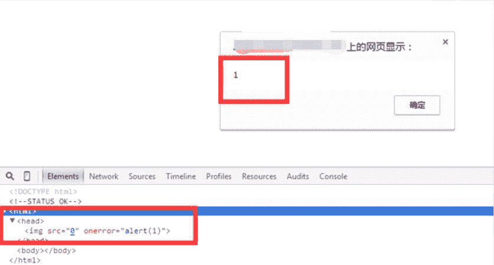

## Payload

Payload 的中文含义是有效载荷，在 XSS 中指代攻击代码或攻击语句。

常见的 Payload 有：

*   正常弹窗

    *   `<script>alert(1)</script>`
    *   ``
*   弹出网站 Cookie

    *   `<script>alert(document.cookie)</script>`
    *   ``

## 分类

总共有三种

*   反射型：Payload 经过后端，不经过数据库

*   存储型：Payload 经过后端，经过数据库

*   DOM：Payload 不经过后端

## 原理：反射型

非持久化，需要欺骗用户点击链接才能触发 XSS 代码（数据库中没有这样的页面和内容）。Payload 一般存在于 URL 或者 HTTP 正文中，需要构造页面，或者构造 URL。

将这段代码保存为`xss.php`。

```
<?php
header('X-XSS-Protection: 0');
?>
<p>反射型 XSS 演示</p>
<form action="" method="get">
    <input type="text" name="xss"/>
    <input type="submit" value="test"/>
</form>
<?php
$xss = @$_GET['xss'];
if($xss!==null){
    echo $xss;
}
```

我们看到，这段代码中首先包含一个表单，用于向页面自己发送 GET 请求，带一个名为`xss`的参数。 然后 PHP 会读取该参数，如果不为空，则直接打印出来，我们看到这里不存在任何过滤。也就是说，如果`xss`中存在 HTML 结构性的内容，打印之后会直接解释为 HTML 元素。

我们部署好这个文件，访问`http://localhost/xss.php`，如图：

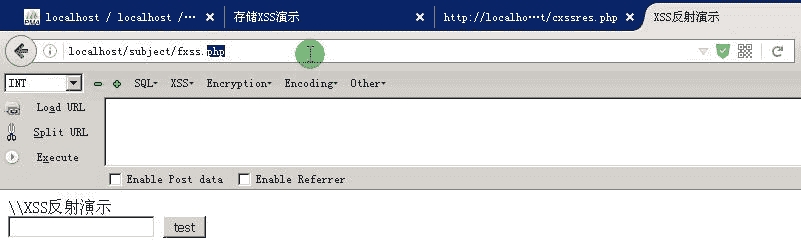

我们直接输入一个 HTML 代码，比如`<script>alert(1)</script>`，之后点击`test`：

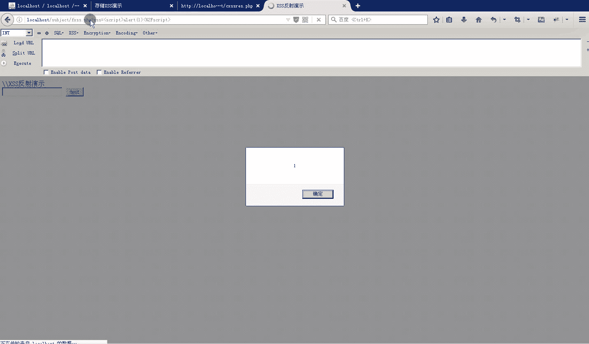

我们可以看到弹窗，也就是我们输入的 HTML 代码被执行了。

之后我们查看元素，这表明，我们输出的内容直接插入到了页面中，解释为`<script>`标签。

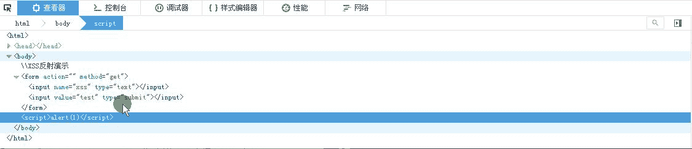

我们可以自定义弹窗中的内容来利用 XSS，比如改成`alert(document.cookie)`。

这个例子中 URL 为`http://localhost/xss.php?xss=%3Cscript%3Ealert%281%29%3C%2Fscript%3E`，这个 URL 容易引起怀疑，可以使用短网址工具缩短后发送给受害者。

从上面的例子中，我们可以看出，反射型 XSS 的数据流向是：浏览器 -> 后端 -> 浏览器。

## 原理：存储型

持久化，代码储存在数据库中。如在个人信息或发表文章等地方，假如代码，如果没有过滤或过滤不严，那么这些代码将储存到数据库中，用户访问该页面的时候出发代码执行。这种 XSS 比较危险，容易造成蠕虫，盗窃 Cookie 等。

这里我们把`xss.php`内容改为（同时数据库中需要配置相应的表）：

```
<?php
header('X-XSS-Protection: 0');
?>
<p>存储型 XSS 演示</p>
<form action="" method="post">
    <input type="text" name="xss"/>
    <input type="submit" value="test"/>
</form>
<?php
$xss=@$_POST['xss'];
mysql_connect("localhost","root","root");
mysql_select_db("xss");
if($xss!==null){
    $sql="insert into test(id,payload) values('1',$xss)";
    $result=mysql_query($sql);
    echo $result;
}
```

可以看到，用户输入的内容还是没有过滤，但是不直接显示在页面中，而是插入到了数据库。

我们新建`res.php`，内容为：

```
mysql_connect("localhost","root","root");
mysql_select_db("xss");
$sql="select payload from test where id=1";
$result=mysql_query($sql);
while($row=mysql_fetch_array($result)){
    echo $row['payload'];
}
```

该代码从数据库读取了之前插入的内容，并将其显示出来。

我们部署之后首先查看`test`数据库，确认它是空的：

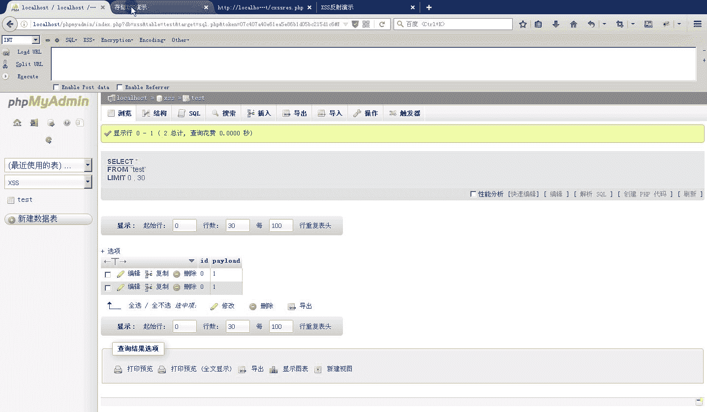

然后访问`xss.php`，像之前一样输入 HTML 代码并点击`test`，如下：

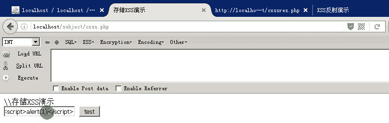

点击之后却发现没有任何动静，但事实上，我们的数据已经插入到了数据库中。

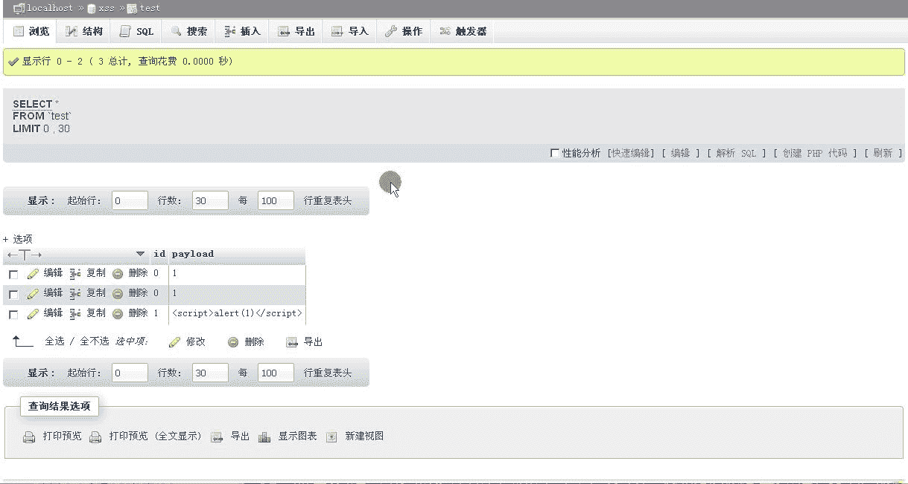

那么，当我们访问`res.php`查询这个值的时候，代码就会被执行。

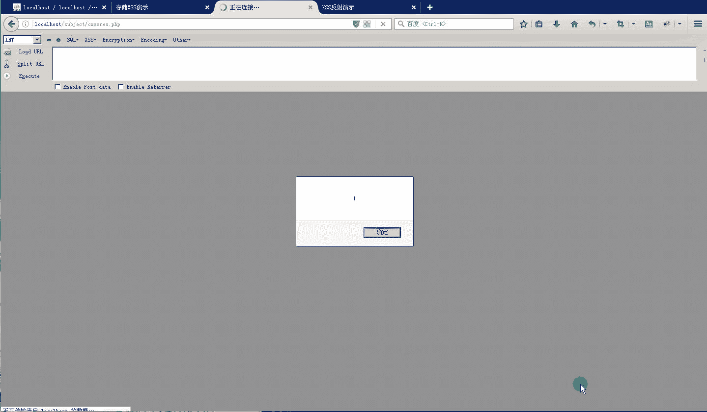

所以说，存储型 XSS 的执行位置通常不同于输入位置。我们可以看出，存储行 XSS 的数据流向是：浏览器 -> 后端 -> 数据库 -> 后端 -> 浏览器。

## 利用

我们可能需要通过 XSS 来获得用户 Cookie 或其他有用信息，利用平台负责接收并保存这些信息。另外，利用平台能够托管利用脚本，于是我们可以向页面只注入一个脚本链接，使长度极大缩短。

这里的 XSS 利用平台使用 xsser.me，大家可以自行下载和搭建。

*   下载：[http://download.csdn.net/detail/gzliu_hit/5606811](http://download.csdn.net/detail/gzliu_hit/5606811)
*   搭建：[http://blog.csdn.net/god_7z1/article/details/47234989](http://blog.csdn.net/god_7z1/article/details/47234989)

首先访问主页，你会看到一个登录页面，输入用户名和密码之后点击“登录”：

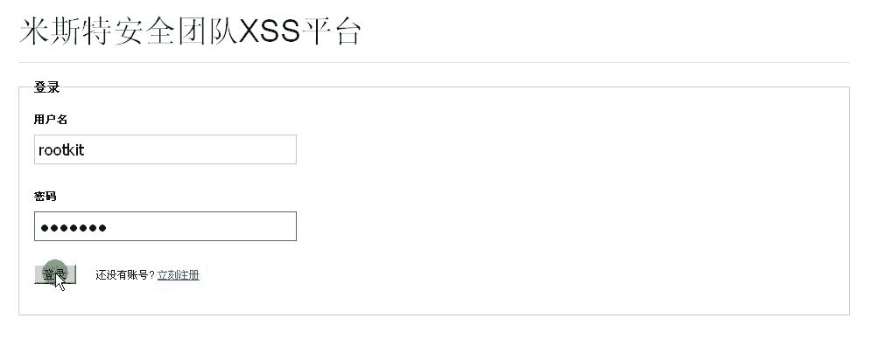

成功之后会显示主界面，左边是模块列表，右边是项目列表：

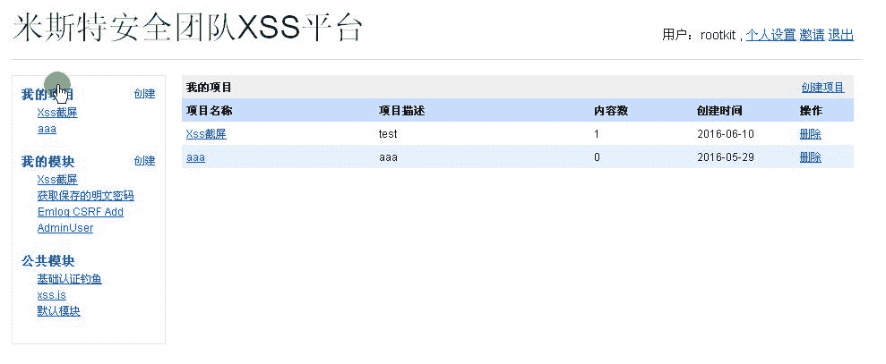

我们点击左边“我的项目”旁边的“创建”按钮：

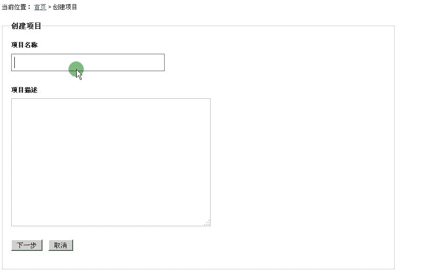

名称和描述可以随便取，不影响使用。输入时候点击“下一步”按钮。之后会出现“配置代码”界面：

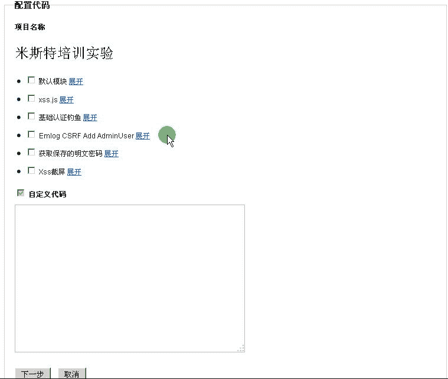

我们只选择默认模块，把它展开之后，我们可以看到它的作用是向平台发送一个请求，来收集用户的各种信息。之后点击“下一步”。

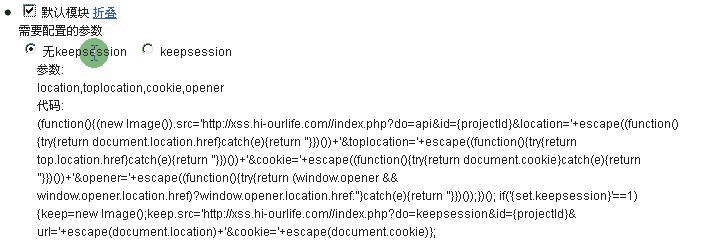

然后我们会在首页看到我们的新项目，点击这个项目：

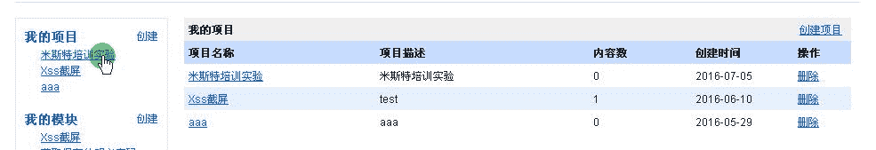

之后点击右上方的查看代码，就可以看到使用方法：

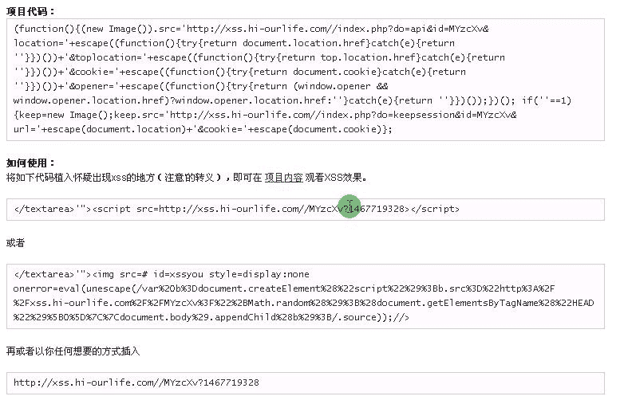

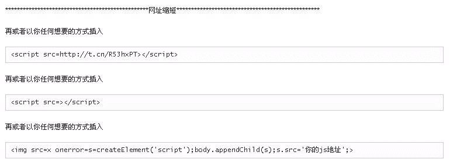

简单来说，`MyzcXv?1467719328`就是平台所生成的脚本地址，你可以把它放在`script`或者`img`标签的`src`属性中，在把标签插入存在 XSS 漏洞的地方，然后浏览器就会执行。

下面我们点击之前创建的`aaa`项目。

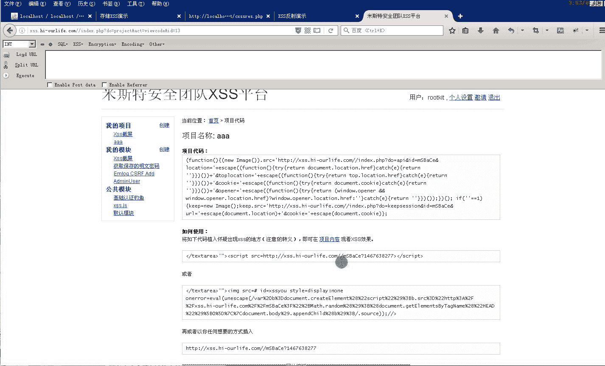

我们把`<script src="..."></script>`注入到反射型 XSS 的演示页面中。

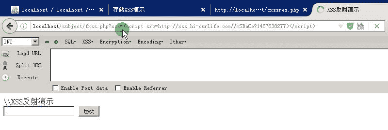

提交之后页面没什么动静，但是我们查看利用平台，可以发现新增了一条数据：

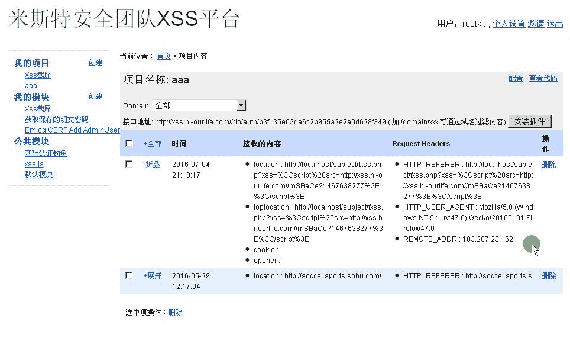

## 附录：

*   [XSS 过滤绕过备忘单](http://cheatsheets.hackdig.com/?4.htm)

*   [HTML5 安全备忘单](https://html5sec.org/)

*   [新手指南：DVWA-1.9全级别教程之XSS](http://www.freebuf.com/articles/web/123779.html)

*   [那些年我们一起学XSS](https://www.gitbook.com/book/wizardforcel/xss-naxienian/details)