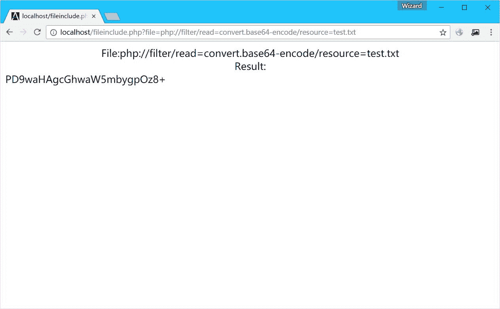
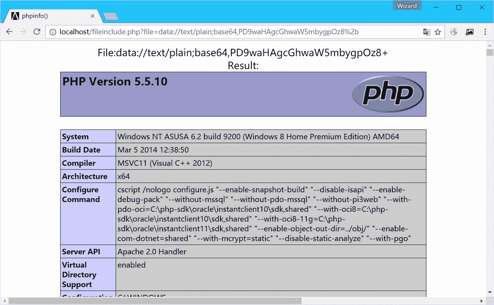

# 米斯特白帽培训讲义 漏洞篇 文件包含

> 讲师：[gh0stkey](https://www.zhihu.com/people/gh0stkey/answers)
> 
> 整理：[飞龙](https://github.com/)
> 
> 协议：[CC BY-NC-SA 4.0](http://creativecommons.org/licenses/by-nc-sa/4.0/)

## 原理

文件包含就是将一个文件包含到自己的文件中执行。它可分为本地包含和远程包含，本地包含即包含本地磁盘上的文件，文件名称是相对路径或绝对路径，远程包含即包含互联网上的文件，文件名称是 URL。

## 本地包含

比如我们有一个`test.txt`文件，仅仅调用`phpinfo`来测试：

```
<?php phpinfo();?>
```

然后我们在相同目录下放置一个`fileinclude.php`，如下：

```
<?php
$file=@$_GET['file'];
if($file){
    echo "<center>File:".$file."<br/>Result:</center>";
    include $file;
}
```

第一行代码获取 URL 参数`file`的内容。2 ~ 4 行首先判断`$file`是否为空，若不为空，输出其内容，并将其作为文件名称包含。

我们将其部署在`localhost`下，之后访问`http://localhost/fileinclude.php?file=test.txt`，会看到`phpinfo`的输出。


我这里之所以用`txt`文件，就是想说明这个漏洞是无视扩展名的。跟文件上传漏洞不一样，文件上传漏洞中如果我们上传的文件不是`.php`就执行不了（当然也有一些绕过手段），但是文件包含漏洞中的扩展名是任意的，这里我们上传了`.txt`，证实有效，那么这个`.jpg`也是有效的。

要注意，如果被包含的文件里面没有 PHP 标签，那么就当成 HTML 内容如实显示出来。就比如我们放入之前的`top100.txt`：


## 远程包含

为了演示远程包含，我们需要将 PHP 配置文件中的`allow_url_include`设置为`on`，之后重启 PHP。PHP 配置文件的位置可以在`phpinfo`的输出中寻找，我们搜索`ini`即可：


我这里是`C:\php-5.5.10\php.ini`，你那里可能有些差别。我们打开它，搜索`allow_url_include`，会看到下面这些行，如果是`Off`把它改成`On`。

```
; Whether to allow include/require to open URLs (like http:// or ftp://) as files.
; http://php.net/allow-url-include
allow_url_include = On
```

我们需要将`file`参数改为`http://localhost/text.txt`，可以看到相同结果。

## 技巧

### 00 截断

有些程序会给被包含内容加一些后缀，比如如果`fileinclude.php`是这样。

```
<?php
$file=@$_GET['file'];
if($file){
    $file .= '.php';
    echo "<center>File:".$file."<br/>Result:</center>";
    include $file;
}
```

它后面加了个`.php`，也就是说，如果我们传入`file=test`则是正常的，传入`file=test.txt`，或变成`test.txt.php`，从而包含失败。那么我们应该怎么办呢？

如果 PHP 版本小于 5.3，并且`magic_quotes_gpc`已取消，我们就可以使用`%00`来截断。我们传入`file=test.txt%00`，就可以实现包含。

### 路径遍历

*   `./`（或省略）：当前目录
*   `../`：上级目录
*   `/`：根目录（Windows 中为当前盘内的根目录）
*   `~/`：用户的主目录

例如，在 Linux 下，我们就可以使用`file=/etc/passwd`来读取系统密码。

这里是一些常见的日志文件位置：

*   apache+Linux日志默认路径

    *   `/etc/httpd/logs/access.log`
    *   `/var/log/httpd/access.log`
*   apache+win2003日志默认路径

    *   `D:\xampp\apache\logs\access.log`
    *   `D:\xampp\apache\logs\error.log`
*   IIS6.0+win2003默认日志文件

    *   `C:\WINDOWS\system32\Lognames`
*   IIS7.0+win2003 默认日志文件

    *   `%SystemDrive%\inetpub\logs\Lognames`
*   nginx 日志文件

    *   `<安装目录>/logs`
    *   如果安装目录为`/usr/local/nginx`，则为`/usr/local/nginx/logs`
*   apache+linux 默认配置文件

    *   `/etc/httpd/conf/httpd.conf`
    *   `/etc/init.d/httpd`
*   IIS6.0+win2003 配置文件

    *   `C:/Windows/system32/inetsrv/metabase.xml`
*   IIS7.0+WIN 配置文件

    *   `C:\Windows\System32\inetsrv\config\applicationHost.config`

### PHP 伪协议

允许远程包含的情况下，我们可以使用`php://`伪协议，比如`php://filter/resource=test.txt`可以读取相同文件。

我们还可以加一个过滤器让它显示为 BASE64 编码格式，`php://filter/read=convert.base64-encode/resource=test.txt`。如果我们要获取的文件里面有不可打印的字符，或者我们想要获取代码的内容，可以用这种方式来获取，之后解码即可。



`php://input`可以读取原始的 HTTP 正文内容。如果我们将`file`设置为`php://input`，并且在 HTTP 正文中传入 PHP 代码，例如`<?php phpinfo();?>`，即可执行代码。


### Data URI

Data URI 的格式是`data://text/plain;base64,<base64>`，同样需要远程包含。我们首先把一句话用 base64 编码，得到`PD9waHAgcGhwaW5mbygpOz8+`，然后将`file`设置为`data://text/plain;base64,PD9waHAgcGhwaW5mbygpOz8%2b`（注意URL编码），即可执行代码。



## 如何挖掘

首先对 URL 进行分析，看看是否和文件相关，比如`www.test.com/xxx.php?file=yyy`。带有文件相关的敏感名称都可以进行挖掘。

## 利用

当我们发现了本地包含漏洞时，首先寻找上传点，比如用户头像上传功能。然后我们可以构造一个纯文本文件，内容为`<?php phpinfo();?>`，并将其命名为`xxx.jpg`。

之后我们就可以把`xxx.jpg`上传上去，并通过应用得到它的位置，假设是`/upload/xxx.jpg`，然后我们就可以把`file`参数的值改为它。以前面的代码为例，URL 是`http://localhost/fileinclude.php?file=/upload/xxx.jpg`。

如果我们把`xxx.jpg`的内容改为菜刀的一句话，那就可以用菜刀连接。


再说一下远程包含，远程包含的条件比较苛刻，目标网站需要把`allow_url_open`给打开。所以有本地包含不一定有远程包含，有远程包含一定就有本地包含。但是，远程包含的利用相对简单，只要将代码上传到自己博客，或者任何能通过 URL 访问到的地方就可以了。后续步骤是一样的。

## 附录

*   [新手指南：DVWA-1.9全级别教程之File Inclusion](http://www.freebuf.com/articles/web/119150.html)

*   [PHP 伪协议](http://php.net/manual/zh/wrappers.php.php)