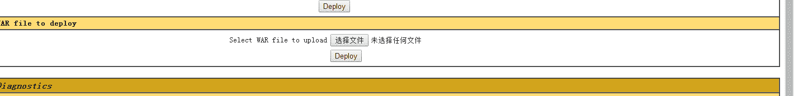
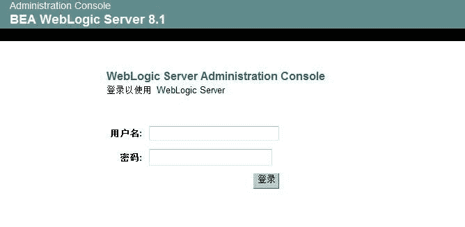
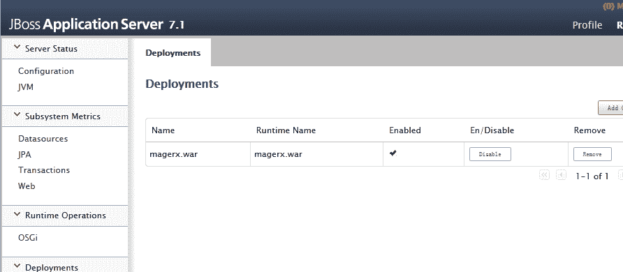
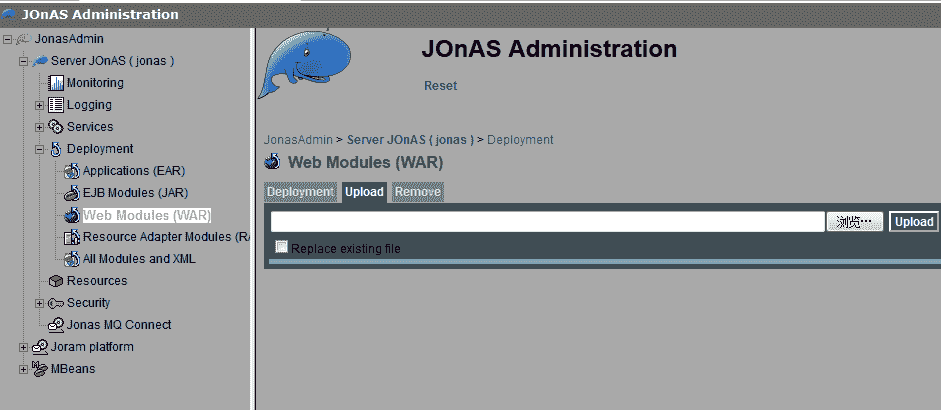
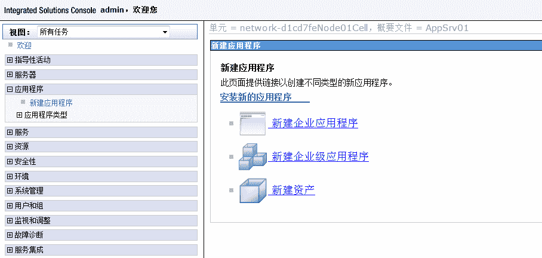

# 米斯特白帽培训讲义 漏洞篇 Web 中间件

> 讲师：[gh0stkey](https://www.zhihu.com/people/gh0stkey/answers)
> 
> 整理：[飞龙](https://github.com/)
> 
> 协议：[CC BY-NC-SA 4.0](http://creativecommons.org/licenses/by-nc-sa/4.0)

## 简介

中间件是一种独立的系统软件或服务程序，分布式应用软件借助这种软件在不同的技术之间共享资源。中间件位于客户机/ 服务器的操作系统之上，管理计算机资源和网络通讯。是连接两个独立应用程序或独立系统的软件。相连接的系统，即使它们具有不同的接口，但通过中间件相互之间仍能交换信息。执行中间件的一个关键途径是信息传递。通过中间件，应用程序可以工作于多平台或OS环境。（百度百科）

## 常见的中间件

这些中间件是 Java Web 的容器。都可以上传 war 包。打包命令：

```
jar -cvf <war> <jsp或目录>
```

比如：

```
jar -cvf test.war test.jsp
jar -cvf test.war D:\Project\Test
```

上传之后访问：

```
/<包名>/<jsp文件名或路由名>
```

比如包名是`test`，文件名是`test.jsp`，那么访问`/test/test.jsp`。如果存在一个 Servlet 映射到了`/test`，那么访问`/test/test`。

### Tomcat



### Weblogic



### JBoss



### JOnAS



### WebSphere



## 常见漏洞

*   弱口令
*   java反序列
*   未授权
*   代码执行

## 常见弱口令

### Tomcat

*   `tomcat:tomcat`
*   …

### Weblogic

*   `weblogic:weblogic`
*   `system:system`
*   `portaladmin:portaladmin`
*   `guest:guest`
*   `weblogic:admin123`
*   `weblogic:weblogic123`
*   …

### JBoss

*   `jboss:jboss`
*   `admin:admin`
*   …

### JOnAS

*   `jadmin:jonas`
*   `tomcat:tomcat`
*   `jonas:jonas`
*   …

## 搜索

### 默认端口

*   Tomcat：8080（Web、Console）、…
*   WebLogic：7001、7002（Web、Console）、…
*   JBoss：8080（Web）、9990（Console）、…
*   WebSphere：9080、9443（Web）、9060、9043（Console）、…
*   JOnAS：9000、…

使用 oshadan 或者`nmap -p`扫描。

### 默认路径

*   Tomcat：`http://<host>:8080/manager/html`
*   WebLogic：`http://<host>:7001/console/`
*   JOnAS：`http://<host>:9000/jonasAdmin/`
*   JBoss：`http://<host>:9990`
*   WebSphere：`http://<host>:7043/ibm/console/logon.jsp`

使用`inurl:`来寻找。

## 附录

*   [常见 web 中间件拿 shell](http://www.2cto.com/article/201306/221832.html)