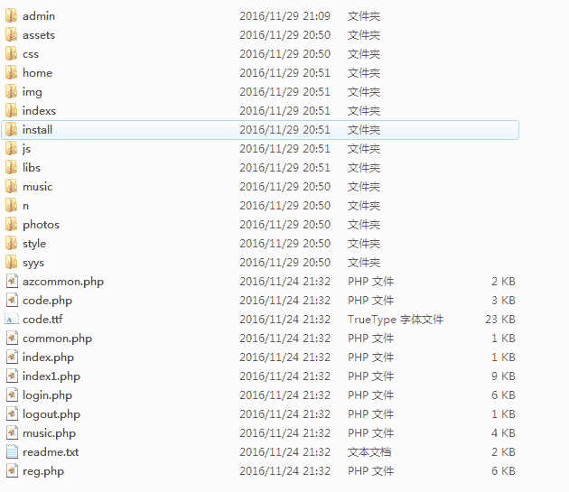
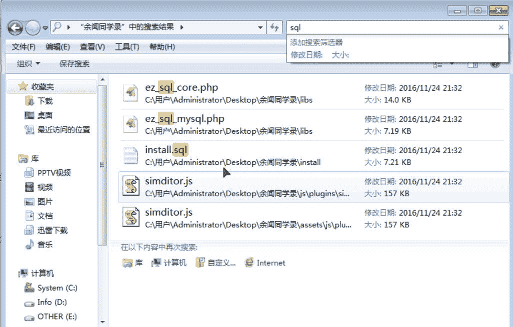
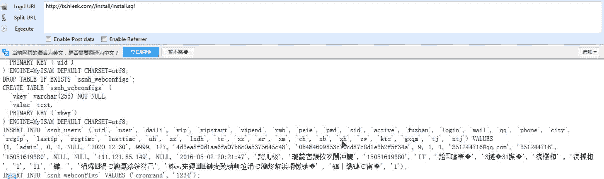
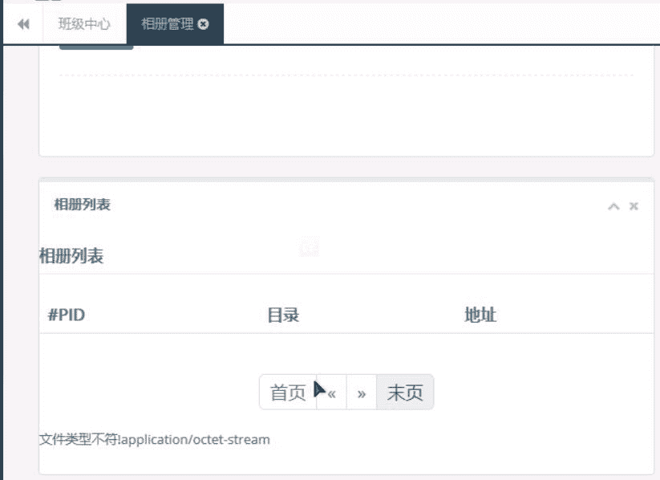
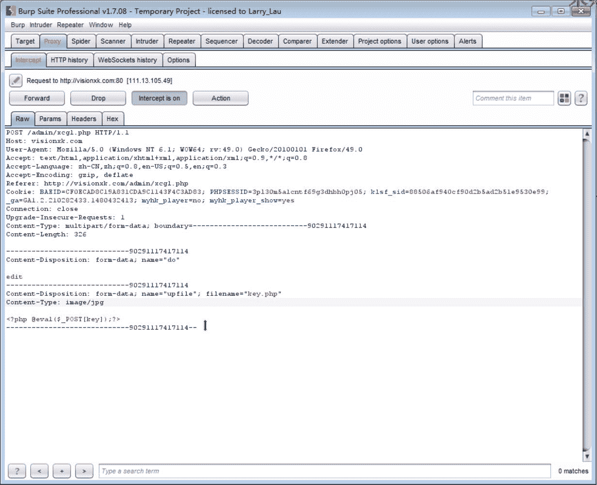
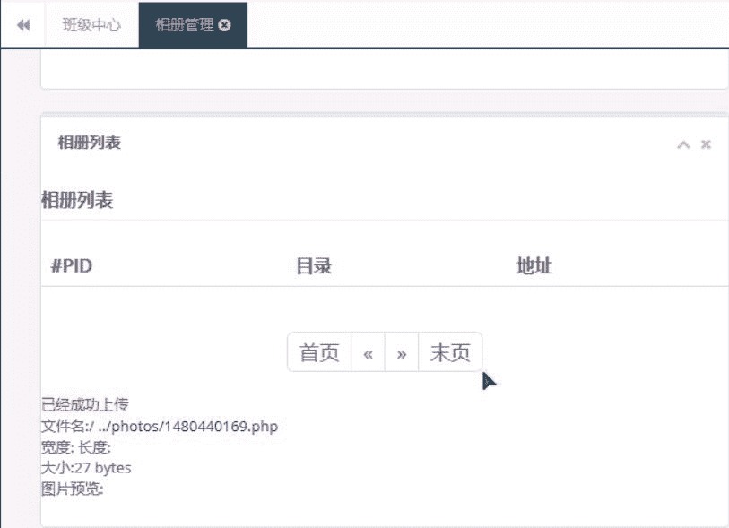
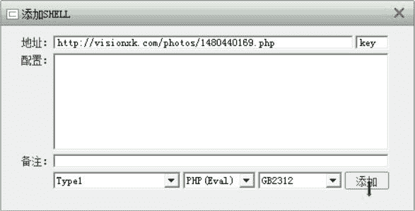
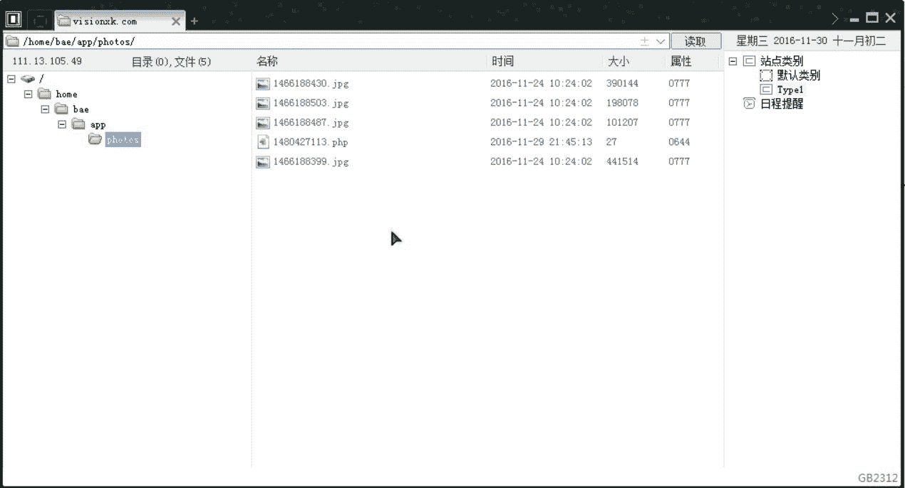

# 米斯特白帽培训讲义 实战篇 余闻同学录

> 讲师：[gh0stkey](https://www.zhihu.com/people/gh0stkey/answers)
> 
> 整理：[飞龙](https://github.com/)
> 
> 协议：[CC BY-NC-SA 4.0](http://creativecommons.org/licenses/by-nc-sa/4.0/)

## 站点搜索

百度关键词搜索：


## 源码下载

[http://download.csdn.net/download/u012513463/9701150](http://download.csdn.net/download/u012513463/9701150)

目录结构是这样的：



## 弱密码

安装之后会弹出以下界面：


得知弱密码为`admin:123456`。

## 信息泄露

我们在目录中搜索 SQL：



看到了`/install/install/sql`文件。我们随便找个站点试验一下：



是可以访问的。

## 文件上传

进入后台，有两个上传点：界面管理和相册管理：


我们挑选相册管理来演示。首先随便上传一个 PHP 文件：



显示“文件类型不符”，然后显示了文件的类型。我们的猜测程序根据类型来判断，而前面说过类型是可以随便修改的（见“文件上传”一章）。我们用 Burp 抓取这个请求，把类型改为`image/jpg`，然后放行。



我们可以看到上传成功：



然后我们用菜刀连接一下，注意文件名称前面有两个点，表示上级目录，所以真实路径是`/photos/1480440169.php`：





我们下面来看看源码，`/home/xcgl.php`第 47 行：

```
//上传文件类型列表
$uptypes=array(  
    'image/jpg',  
    'image/jpeg',  
    'image/png',  
    'image/pjpeg',  
    'image/gif',  
    'image/bmp',  
    'image/x-png'  
); 
```

发现这是类型列表，再往下看，221 行：

```
if(!in_array($file["type"], $uptypes))
//检查文件类型
{
    echo "文件类型不符!".file["type"];
    exit;
}
```

它对文件类型进行了校验，但除此之外没有别的校验了，所以这里存在文件上传漏洞。