> 作者：AppLeU0@乌云知识库
> 
> 来源：[http://drops.wooyun.org/tips/4862](http://drops.wooyun.org/tips/4862)

**0x00 前言**

之前还没有见到drops上有关于隐写术的总结，我之前对于隐写术比较有兴趣，感觉隐写术比较的好玩。所以就打算总结总结一些隐写术方面的东西。写的时候，可能会有错误的地方，请不吝赐教，谢谢。

本篇章中用到的隐写术的图片，都打包在了[http://pan.baidu.com/s/1mg1Khw0](http://pan.baidu.com/s/1mg1Khw0)，想去自己尝试一遍的话可以去下载。

最开始接触到隐写术，是看到一种叫做图种的东西，当时不懂，只说要另存为zip，然后解压出来就可以了，当时觉得特别神奇，就像发现了新大陆，然后就尝试了一下，发现可以用另存为zip的方式，用7z或者是winzip等工具打开，然后就可以看到福利了。


图1.png

后来才懂得了，先制作一个1.zip，把想要隐藏的东西放进去，再需要一张jpg图片2.jpg，然后就可以执行一个命令 copy /b 2.jpg+1.zip output.jpg。就可以得到一张图种，这是利用了copy命令，将两个文件已二进制方式连接起来，生成output.jpg的新文件。而在jpg 中，是有结束符的，16进制是FF D9，利用winhex可以看到正常的jpg结尾都是FF D9的，图片查看器会忽视jpg结束符之后的内容，所以我们附加的zip，自然也就不会影响到图像的正常显示。


图2.png

这种类型的隐写也是比较容易被发现的，如果发现是jpg图片的话，观察文件结束符之后的内容，查看是否附加的内容，正常图片都会是FF D9结尾的。还有一种方式来发现就是利用binwalk这个工具，在kali下自带的一个命令行工具。


图片3.png

利用binwalk可以自动化的分析图片中附加的其他的文件，其原理就是检索匹配文件头，常用的一些文件头都可以被发现，然后利用偏移可以配合winhex或者是dd分割出隐藏的部分。

**0x01 修改数据**

上面说到的隐藏方式，是利用了增加数据的方式，把数据直接增加在了jpg后面。还有另一类隐藏的方法，就是利用了修改数据的方式来隐藏自己传递的信息。

一种常见的方式是利用LSB来进行隐写，LSB也就是最低有效位 (Least Significant Bit)。原理就是图片中的像数一般是由三种颜色组成，即三原色，由这三种原色可以组成其他各种颜色，例如在PNG图片的储存中，每个颜色会有 8bit，LSB隐写就是修改了像数中的最低的1bit，在人眼看来是看不出来区别的，也把信息隐藏起来了。譬如我们想把’A’隐藏进来的话，如下图，就 可以把A转成16进制的0x61再转成二进制的01100001，再修改为红色通道的最低位为这些二进制串。

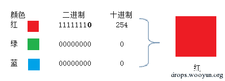

图4.png

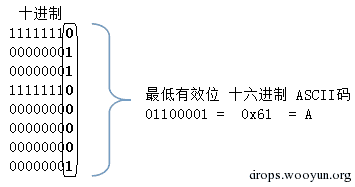

图4.png

如果是要寻找这种LSB隐藏痕迹的话，有一个工具是个神器，可以来辅助我们进行分析。Stegsolve这个软件的下载地址是

[http://www.caesum.com/handbook/Stegsolve.jar](http://www.caesum.com/handbook/Stegsolve.jar)

打开之后，使用Stegsolve——Analyse——Frame Browser这个可以浏览三个颜色通道中的每一位，可以在红色通道的最低位，发现一个二维码，然后可以扫描得到结果。

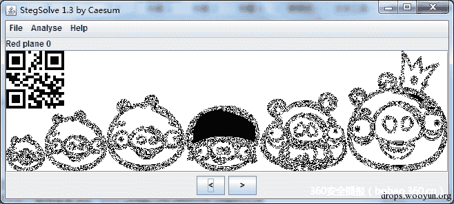

图6.png

再解一下qrcode，用在线的就可以[http://tool.chinaz.com/qrcode/](http://tool.chinaz.com/qrcode/)，得到了flag{AppLeU0}，如果是 隐写的使用了ascii的话，可以使用Stegsolve——Analyse——Data Extract来查看ascii码。

在这个过程中，我们要注意到，隐写的载体是PNG的格式，如果是像之前的jpg图片的话就是不行的，原因是jpg图片对像数进行了有损的压缩，你修 改的信息可能会被压缩的过程破坏。而PNG图片虽然也有压缩，但却是无损的压缩，这样子可以保持你修改的信息得到正确的表达，不至于丢失。BMP的图片也 是一样的，是没有经过压缩的，可以发现BMP图片是特别的大的，因为BMP把所有的像数都按原样储存，没有压缩的过程。

**0x02 隐写与加密**

我们先要区分一个概念，隐写术和加解密的区别。其实说起来很简单，加解密的话，就是会出现一些神秘的，可疑的字符串或者是数据之类的。而隐写术的 话，就是信息明明就在你的面前，你却对他视而不见。隐写术在CTF中出现时，常常会和加解密结合起来一起出现，或者是一些编码方式一起出现，以提高题目的 难度。

用一个ctf的题目作为例子吧，iscc2014中有一个题目，给了一个名为 此为gif图片.gif的文件，打开发现了报错。有的时候，会需要我们去修复图片，这对我们对于图片的文件结构要有了解。找到gif的文件格式，然后对照 这个破损的文件。Gif的图片格式文档可以查看这个链接，[http://dev.gameres.com/Program/Visual/Other/GIFDoc.htm](http://dev.gameres.com/Program/Visual/Other/GIFDoc.htm)


图片8.png

用winhex打开，我们会发现他和普通的GIF图片不一样，头部缺少了东西，在对比一些文档，会发现是少了GIF8。


图片9.png

我们手动修复一下，增加GIF8。


图片10.png

然后浏览图片后会发现，有个PASSWORD一闪而过，gif和别的图片最大的区别就是gif是动态图，它是可以由多帧组成的可以顺序播放的，有的题就是把播放的时间弄得特别慢，几乎就不会动的，所以我们可以用工具一帧一帧的观察图片。Stegsolve就带有这种功能。

Stegsolve——Analyse——Frame Brower就可以看到是有8帧的图片，有点重叠不太好观察，也可以用Namo_GIF_gr这个工具。得到了PASSWORD is Y2F0Y2hfdGhlX2R5bmFtaWNfZmxhZ19pc19xdW10ZV9zaW1wbGU=。很明显，这个时候PASSWORD是经过 的编码的，我们可以看到字符范围是0-9a-Z结尾还有=，所以判断是base64编码，解码得到了 catch_the_dynamic_flag_is_qumte_simple。这个就是和编码方式结合，传递一些可疑的数据，隐写术常常会与加解密或 编码结合在一起，对一些常见的编码和加密方法也要了解，得到密文的字符范围和长度能发现这是什么加密或者是编码。

**0x03 载体**

数据在隐藏的时候，我们常常是需要先分析是数据隐藏在哪里，也就是他在利用是什么做载体，之后才可以进一步的分析是加密或编码的。这也就是说我们要 对一个图片的格式要有了解，才能知道哪些地方是可疑的，哪些是可以隐藏起信息的，会有冗余的成分在。举个例子吧，比如给了一个jpg的图片。除了我们之前 说到的隐藏在结束符之后的信息，jpg图片还可以把信息隐藏的exif的部分。exif的信息是jpg的头部插入了数码照片的信息，比如是用什么相机拍摄 的。这些信息我们也是可以控制的，用查看属性的方式可以修改一部分的信息，还可以用exif编辑器来进行编辑。Power_exif这个可以用来编辑。

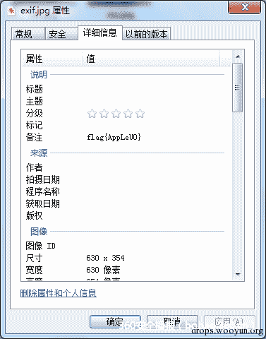

图片11.png

可以看到flag{AppLeU0}，就是需要了解隐藏信息的地方，隐写术有的时候难，就是难在了一张图片有太多的地方可以隐藏信息了，有的时候根本连隐藏的载体都找不到，在你的眼里他就是一张正常的图片。

**0x04 编程辅助**

有一些情况下，我们也是没有现成的工具来完成的，可以自己写一些简单的程序来辅助我们进行分析，或者是加解密。比如sctf的misc400的题目，就需要用到一些简单的编程。题目给出了一个png图片，需要我们找到有SCTF{}标志的flag。

这个题需要我们对于png图片的格式有一些了解，先用stegsolve查看一下，其他的LSB之类的并没有发现什么问题，然后看了一下结构发现，有一些异常的IDAT块。IDAT是png图片中储存图像像数数据的块。Png图片格式的扩展阅读可以看看这篇

[http://www.cnblogs.com/fengyv/archive/2006/04/30/2423964.html](http://www.cnblogs.com/fengyv/archive/2006/04/30/2423964.html)

有详细的介绍。

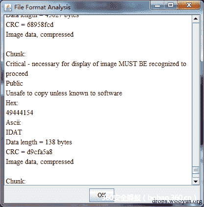

图片12.png

可以用pngcheck来辅助我们观察，可以看得更加清晰。pngcheck.exe -v sctf.png


图片13.png

可以看到，正常的块的length是在65524的时候就满了，而倒数第二个IDAT块长度是45027，最后一个长度是138，很明显最后一个IDAT块是有问题的，因为他本来应该并入到倒数第二个未满的块里。

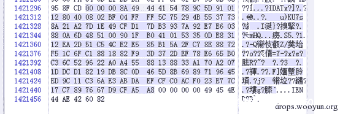

图片14.png

我们用winhex把这一部分异常的IDAT块给扣出来。然后就是要研究研究这个块是什么情况，发现了载体之后就是要想办法找出他的规律。观察那一 部分的数据，可以看到是16进制的78 9C开头的，百度一下分析是zlib压缩的标志。在png的百度百科里也可以查到PNG的IDAT是使用从LZ77派生的无损数据压缩算法，可以用 zlib解压。那么就尝试用zlib来解一下这段数据。Zlib的扩展阅读[http://zlib.net/](http://zlib.net/)

我们使用python来编程，先把那段数据处理一下，保存成16进制的。

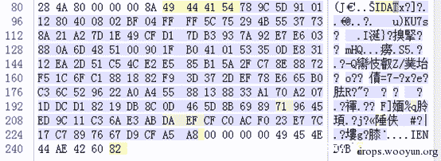

图片15.png

得到16进制的以方便python处理，前面的4字节是长度 然后是标志位IDAT 然后开始是数据，直到 D9 CF A5 A8是crc32校验位。 所以实际的数据是：


然后用python来写zlib解压

```
#! /usr/bin/env python
import zlib
import binascii
IDAT = "789C5D91011280400802BF04FFFF5C75294B5537738A21A27D1E49CFD17DB3937A92E7E603880A6D485100901FB0410153350DE83112EA2D51C54CE2E585B15A2FC78E8872F51C6FC1881882F93D372DEF78E665B0C36C529622A0A45588138833A170A2071DDCD18219DB8C0D465D8B6989719645ED9C11C36AE3ABDAEFCFC0ACF023E77C17C7897667".decode('hex')
#print IDAT
result = binascii.hexlify(zlib.decompress(IDAT))
print result
#print result.decode('hex')
```

发现解出来了一些3031的字符串，30和31是hex的 0和1的编码，再解一次hex得到一串625长度的01字符串。

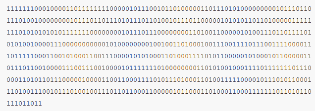

得到的01 串的长度是625，除以8 除以7 都无法整除，也就是说没法直接转换成ascii码。


图片16.png

然后发现625 = 25*25，刚好是个正方形的形状，那么尝试一下 把这些01 组成一个正方形 看看是什么，可以用python的PIL编程可以很方便的画图，在kali自带就可以有，win的环境需要安装PIL的第三方库。

```
#!/usr/bin/env python
import Image
MAX = 25
pic = Image.new("RGB",(MAX, MAX))
str = "1111111000100001101111111100000101110010110100000110111010100000000010111011011101001000000001011101101110101110110100101110110000010101011011010000011111111010101010101111111000000001011101110000000011010011000001010011101101111010101001000011100000000000101000000001001001101000100111001111011100111100001110111110001100101000110011100001010100011010001111010110000010100010110000011011101100100001110011100100001011111110100000000110101001000111101111111011100001101011011100000100001100110001111010111010001101001111100001011101011000111010011100101110100100111011011000110000010110001101000110001111111011010110111011011"
i=0
for y in range (0,MAX):
    for x in range (0,MAX):
        if(str[i] == '1'):
            pic.putpixel([x,y],(0, 0, 0))
        else:
            pic.putpixel([x,y],(255,255,255))
        i = i+1
pic.show()
pic.save("flag.png")
```

发现是一个二维码 可以编码来画出 0代表了是白色 而1代表了黑色，然后可能会需要旋转来调整一下，才能扫描出来。处理一下得到了一个二维码。然后扫描得到了flag。

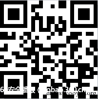

图片17.png


图片18.png

SCTF{(121.518549,25.040854)}，成功得到了flag。

在有的情况下，是没法用现成的工具来处理的，所以就要我们用编程来设法解决。Python的PIL是个好东西。批量处理图片的时候可能会需要它。

**0x05 双图**

还有一种情况是比较特殊的，有的时候会给出两张图片，或者是需要你去寻找原来的图片来进行对比寻找隐藏的信息。这个一般是因为一张图片给出来的隐藏 信息太过于隐蔽，无法找不到具体的位置，具体的信息。这个时候就要用到一些对比的技巧来查找了。比如ISG2014的misc200就是用到的这种给出了 两张图的。有的情况下，第二张图是需要你自己去找到的。

我们来看isg2014-misc200的题，题目给了一张png图片，png的图片，就怕里面插个什么rar之类的，所以先用linux下的binwalk命令跑一跑。


图片19.png

跑一跑，发现了有两个PNG图片，binwalk会给出偏移，确定了偏移是0x1D55DC之后，用winhex把图片扣出来，保存成2.png。 原来的图final.png删除后面那的一部分，保存成1.png。肉眼查看了一下，发现两张图片没有太大的区别，我们用软件来帮助我们区分他。


图片20.png

用linux下的命令可以进行对比，生成一个有差异的图片diff.png。compare 1.png 2.png diff.png 观察一下发现了左下角有异常，png图片像数保存是从左到右，从下往上排列的。


图片21.png

发现了左下的第二条像素有异常，对比一下1.png 2.png发现了2.png有问题 那么我们可以用神器stegsolve来辅助，stegsolve——Analyse——Image Combiner对比两个文件。查看Sub或Xor，可以发现左下角，第二条像数条是有异常的，有红色的出现。

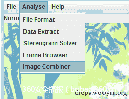

图片22.png

把1.png和2.png进行一下sub方法 把结果保存成solved.bmp。

然后把2.png保存成2.bmp 24位位图的格式，这个是因为png图片经过了压缩，不好直接对比每个字节，而bmp图片是没有压缩的，直接保存各个像数点的数据。

这个题还有一个坑点就是偏移的问题 png图片的扫描是从左向右，从下往上来的。而坑的是这个图的信息隐藏并没有在一开头的像数，而是是第二行像数，所以就需要利用bmp的优势，储存无压 缩，方便寻找到偏移，从而找到信息隐藏的地方。利用winhex打开，黑色的像数的在bmp中的hex的00保存的，那么我们就寻找不是00的地方。在偏 移0x1110的地方可以发现


图片23.png

有不是00的字节，一开始还以为这些就是flag的信息了，后来才发现是因为两个图片sub影响到了效果，真正的信息是隐藏在2.png中的，所以 打开由2.png转换的2.bmp来对，通过之前diff得到的偏移，寻找到0x1110的地方，直到0x1330结束，这是隐藏的信息。


图片24.png

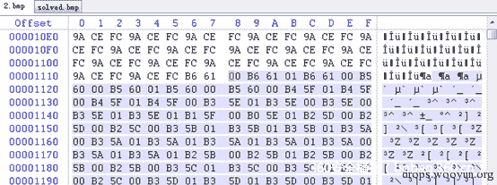

图片25.png

只保留00 01，这个是因为RGB的关系，只隐藏在R通道里面了，其他通道都是图片的正常像数信息，过滤掉就可以了。


观察一下可以发现，而奇数位都是0，是多余的，把这些去除掉。直接把00 替换成0，01替换成1就可以了。


得到了这个之后，可以发现他的长度是184，是8的倍数，把他转换成ascii码就可以了。可以使用JPK工具来进行转换，工具的下载的链接是[http://www.wechall.net/applet/JPK_406.jar](http://www.wechall.net/applet/JPK_406.jar)。

对比2.bmp可以发现隐藏了一些00 01这些信息，把这一部分扣出来。


图片26.png

JPK——binary——binary to ascii


图片27.png

就得到了flag，ISG{E4sY_StEg4n0gR4pHy}

这种就是利用的两张图片对比来寻找差异，从而找到信息隐藏的地方，这样子出题往往是因为一张图片能提供的信息太少。

**0x06 后记**

这个总结其实还是缺很多的，因为隐写术能写的东西太多了，比如jpg的冗余信息的压缩也可以隐藏进信息，还有其他的多媒体文件也可以进行隐写，例如音频文 件，视频文件等等，有很多东西可以研究。一开始是觉得隐写术特别的有趣才接触到的，就像是在藏宝寻宝一样，特别好玩，希望你们也可以感受到这种快乐。欢迎 大家和我交流，我的博客地址是[http://appleu0.sinaapp.com/](http://appleu0.sinaapp.com/)。